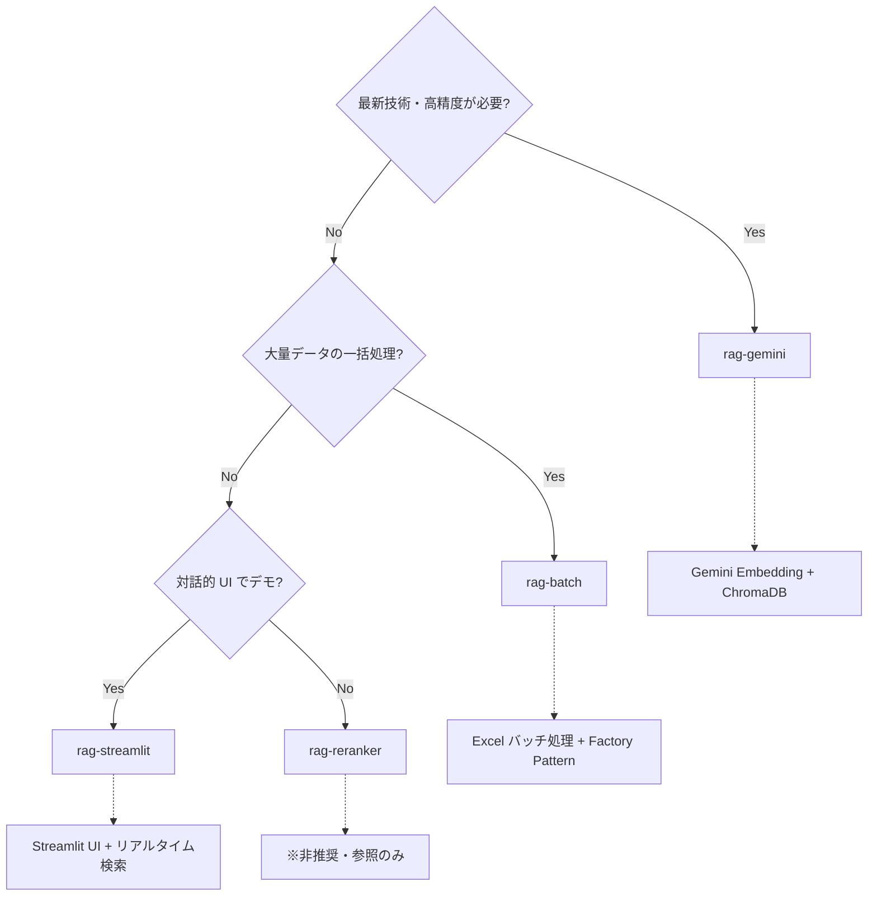
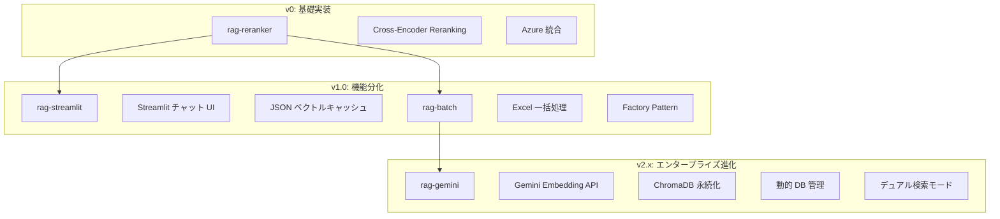
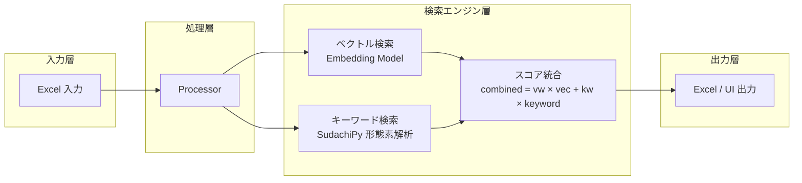
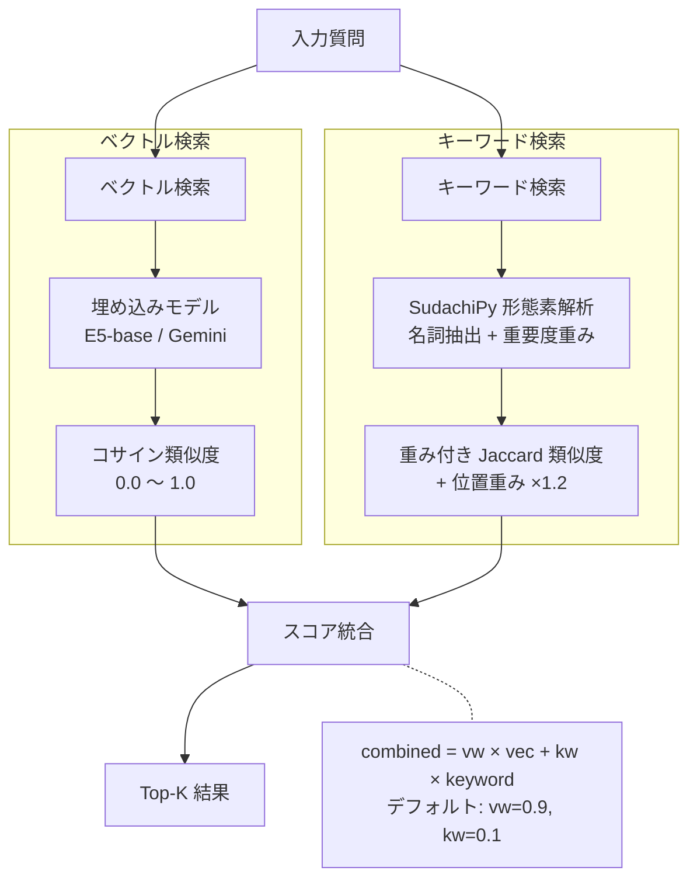

# RAG Q&A システムコレクション

**銀行預金業務向け RAG（Retrieval-Augmented Generation）質問応答システム**

[](https://www.python.org/)
[](https://python.langchain.com/)
[](https://opensource.org/licenses/MIT)

---

## 目次

- [概要](#概要)
- [プロジェクト一覧](#プロジェクト一覧)
- [どのプロジェクトを使うべきか？](#どのプロジェクトを使うべきか)
- [進化の系譜](#進化の系譜)
- [アーキテクチャ比較](#アーキテクチャ比較)
- [機能比較表](#機能比較表)
- [クイックスタート](#クイックスタート)
- [ディレクトリ構成](#ディレクトリ構成)
- [技術スタック](#技術スタック)
- [検索アルゴリズム](#検索アルゴリズム)
- [設定パラメータ](#設定パラメータ)
- [入出力フォーマット](#入出力フォーマット)
- [Docker デプロイ](#docker-デプロイ)
- [セキュリティ](#セキュリティ)
- [トラブルシューティング](#トラブルシューティング)
- [マイグレーション状況](#マイグレーション状況)
- [コントリビューション](#コントリビューション)
- [ライセンス](#ライセンス)
- [連絡先](#連絡先)
- [関連ドキュメント](#関連ドキュメント)

---

## 概要

このリポジトリは、銀行預金業務における問い合わせ対応を支援する RAG システムのコレクションです。段階的に進化した4つのプロジェクトが含まれており、用途に応じて最適なものを選択できます。

### 主な機能

- **ハイブリッド検索**: ベクトル類似度 + キーワード検索の重み付け統合
- **複数 LLM 対応**: Anthropic Claude、OpenAI GPT、Google Gemini
- **日本語最適化**: SudachiPy による形態素解析、日本語埋め込みモデル
- **Excel 入出力**: 業務で使いやすい形式でのデータ処理
- **Web UI**: Streamlit ベースの対話的インターフェース

---

## プロジェクト一覧

| プロジェクト | 用途 | 主な技術 | 状態 |
|-------------|------|----------|------|
| [rag-gemini](./rag-gemini/) | 最新技術・高精度 | Gemini Embedding, ChromaDB | **Active (推奨)** |
| [rag-batch](./rag-batch/) | バッチ処理 | ハイブリッド検索, Factory Pattern | Active |
| [rag-streamlit](./rag-streamlit/) | 対話的 UI | Streamlit, JSON キャッシュ | Active |
| [rag-reranker](./rag-reranker/) | レガシー | Cross-Encoder Reranking | **Deprecated** |

---

## どのプロジェクトを使うべきか？



### ユースケース別推奨

| ユースケース | 推奨プロジェクト | 理由 |
|-------------|-----------------|------|
| **本番運用** | rag-gemini | ChromaDB 永続化、動的 DB 管理、高精度検索 |
| **業務担当者向けデモ** | rag-streamlit | Streamlit UI でわかりやすい |
| **月次レポート作成** | rag-batch | Excel 一括処理、詳細なログ出力 |
| **PoC / 技術検証** | rag-gemini | 最新技術、LLM 拡張検索モード |
| **学習・参考実装** | rag-reranker | Cross-Encoder Reranking の実装例 |

---

## 進化の系譜



---

## アーキテクチャ比較

### 共通アーキテクチャ



### プロジェクト別の違い

| コンポーネント | rag-reranker | rag-streamlit | rag-batch | rag-gemini |
|---------------|--------------|---------------|-----------|------------|
| **埋め込みモデル** | multilingual-e5-base | multilingual-e5-base | multilingual-e5-base | **Gemini Embedding** |
| **ベクトル DB** | Pickle ファイル | JSON キャッシュ | JSON キャッシュ | **ChromaDB** |
| **Reranking** | Cross-Encoder | なし | なし | なし |
| **検索モード** | 原文のみ | 原文のみ | LLM 要約 | **原文 / LLM 拡張** |
| **DB 管理** | 手動 | 自動キャッシュ | 自動キャッシュ | **動的管理** |
| **UI** | CLI | Streamlit | CLI + Streamlit | CLI + Streamlit |
| **入力形式** | PDF / Excel | Excel | Excel | Excel (階層対応) |

---

## 機能比較表

| 機能 | rag-reranker | rag-streamlit | rag-batch | rag-gemini |
|------|:------------:|:-------------:|:---------:|:----------:|
| **ハイブリッド検索** | ○ | ○ | ○ | ○ |
| **Cross-Encoder Reranking** | ○ | - | - | - |
| **Streamlit UI** | - | ○ | ○ | ○ |
| **バッチ処理** | ○ | ○ | ○ | ○ |
| **ベクトルキャッシュ** | ○ | ○ | ○ | ○ |
| **ChromaDB 永続化** | - | - | - | ○ |
| **LLM 拡張検索** | - | - | ○ | ○ |
| **動的 DB 管理** | - | - | - | ○ |
| **階層 Excel 対応** | - | - | - | ○ |
| **Docker 対応** | - | ○ | ○ | ○ |
| **Factory Pattern** | - | - | ○ | ○ |
| **複数 LLM 対応** | ○ | ○ | ○ | ○ |
| **Azure 統合** | ○ | - | - | ○ (Key Vault) |

---

## クイックスタート

### 前提条件

- Python 3.7 以上
- pip または poetry
- API キー（Anthropic / OpenAI / Google のいずれか）

### 推奨プロジェクト（rag-gemini）でのセットアップ

```bash
# 1. リポジトリのクローン
git clone https://github.com/Jsakuta/RAG_yokin.git
cd RAG_yokin/rag-gemini

# 2. 仮想環境の作成・有効化
python -m venv venv
source venv/bin/activate  # Windows: venv\Scripts\activate

# 3. 依存パッケージのインストール
pip install -r requirements.txt

# 4. 環境変数の設定
cp .env.example .env
# .env ファイルを編集して API キーを設定

# 5. 参照データの配置
mkdir -p reference/scenario reference/faq_data
cp your_scenario.xlsx reference/scenario/
cp your_faq.xlsx reference/faq_data/

# 6. 入力データの配置
cp your_input.xlsx input/

# 7. 実行（バッチモード）
python main.py

# 8. 実行（インタラクティブモード）
python main.py interactive
```

### 他のプロジェクトでのセットアップ

各プロジェクトの詳細なセットアップ手順は、それぞれの README を参照してください。

| プロジェクト | README |
|-------------|--------|
| rag-gemini | [rag-gemini/README.md](./rag-gemini/README.md) |
| rag-batch | [rag-batch/README.md](./rag-batch/README.md) |
| rag-streamlit | [rag-streamlit/README.md](./rag-streamlit/README.md) |
| rag-reranker | [rag-reranker/README.md](./rag-reranker/README.md) |

---

## ディレクトリ構成

```text
RAG_yokin/
├── README.md                    # このファイル
├── DEPRECATED.md                # 旧ディレクトリ名のマッピング
│
├── rag-gemini/                  # 推奨: Gemini 統合版
│   ├── main.py
│   ├── config.py
│   ├── requirements.txt
│   ├── src/
│   │   ├── core/               # processor.py, searcher.py
│   │   ├── handlers/           # input_handler.py, output_handler.py
│   │   └── utils/              # auth.py, gemini_embedding.py, vector_db.py
│   ├── ui/                     # chat.py (Streamlit)
│   ├── prompt/                 # プロンプトテンプレート
│   ├── input/                  # 入力 Excel
│   ├── reference/              # 参照データ + vector_db/
│   └── output/                 # 出力 Excel
│
├── rag-batch/                   # バッチ処理版
│   ├── main.py
│   ├── config.py
│   ├── src/
│   │   ├── core/
│   │   ├── handlers/
│   │   └── utils/
│   └── ...
│
├── rag-streamlit/               # UI 版
│   ├── main.py
│   ├── config.py
│   ├── src/
│   ├── ui/
│   └── ...
│
└── rag-reranker/                # レガシー版（非推奨）
    ├── main.py
    ├── config.py
    ├── src/
    └── ...
```

---

## 技術スタック

### 共通

| カテゴリ | 技術 |
|---------|------|
| **言語** | Python 3.7+ |
| **LLM フレームワーク** | LangChain |
| **日本語 NLP** | SudachiPy, sudachidict-core |
| **データ処理** | pandas, numpy, openpyxl, xlsxwriter |
| **Web UI** | Streamlit |

### プロジェクト固有

| プロジェクト | 固有技術 |
|-------------|---------|
| rag-gemini | google-cloud-aiplatform, chromadb, google-generativeai |
| rag-batch | sentence-transformers, scikit-learn |
| rag-streamlit | sentence-transformers |
| rag-reranker | sentence-transformers, cross-encoder, pymupdf |

---

## 検索アルゴリズム

### ハイブリッド検索の仕組み

全プロジェクトで共通の検索アルゴリズムを採用しています：



### 検索モードの違い

| モード | 説明 | 対応プロジェクト |
|--------|------|-----------------|
| **原文検索** | 質問文をそのままベクトル化 | 全プロジェクト |
| **LLM 要約検索** | LLM でキーワード抽出してからベクトル化 | rag-batch, rag-gemini |
| **LLM 拡張検索** | LLM が質問の意図を理解してクエリ生成 | rag-gemini のみ |

---

## 設定パラメータ

### 共通パラメータ

| パラメータ | 型 | デフォルト | 説明 |
|-----------|-----|-----------|------|
| `top_k` | int | 4 | 返却する類似文書数 |
| `vector_weight` | float | 0.9 | ベクトル検索の重み (0.0〜1.0) |
| `keyword_weight` | float | 0.1 | キーワード検索の重み (自動計算) |
| `llm_provider` | str | "anthropic" | LLM プロバイダー |
| `llm_model` | str | "claude-3-5-sonnet-20241022" | LLM モデル名 |

### プロジェクト固有パラメータ

詳細は各プロジェクトの README を参照してください。

---

## 入出力フォーマット

### 入力ファイル

**場所:** `input/` ディレクトリ

**形式:** Excel (.xlsx)

| 列 | 必須 | 説明 |
|----|------|------|
| 1列目 | はい | 番号/ID |
| 2列目 | はい | 質問内容 |
| 3列目 | いいえ | オリジナル回答（比較用） |

### 参照データ

**場所:** `reference/` ディレクトリ

**形式:** Excel (.xlsx)

| 列名 | 必須 | 説明 |
|------|------|------|
| 問合せ内容 | はい | 参照質問文 |
| 回答 | はい | 参照回答文 |

**注意:** 列名は完全一致が必要です

### 出力ファイル

**場所:** `output/` ディレクトリ

**形式:** Excel (.xlsx)

| 列名 | 説明 |
|------|------|
| # | 入力番号 |
| ユーザーの質問 | 元の質問文 |
| 検索クエリ | 使用した検索クエリ |
| 類似質問 | 検索結果の質問 |
| 類似回答 | 検索結果の回答 |
| 類似度 | 統合スコア (0.0〜1.0) |

---

## Docker デプロイ

各プロジェクトは Docker に対応しています（rag-reranker を除く）。

### 基本コマンド

```bash
# ビルド
cd rag-gemini
docker build -t rag-gemini:latest .

# バッチモード実行
docker run --rm \
  -v $(pwd)/input:/app/input \
  -v $(pwd)/reference:/app/reference \
  -v $(pwd)/output:/app/output \
  --env-file .env \
  rag-gemini:latest main.py

# インタラクティブモード実行
docker run -p 8501:8501 \
  -v $(pwd)/reference:/app/reference \
  --env-file .env \
  rag-gemini:latest bash -c "streamlit run ui/chat.py"
```

---

## セキュリティ

### 重要な注意事項

- `.env` ファイルは絶対に Git にコミットしない
- `gemini_credentials.json` は絶対に Git にコミットしない
- API キーは定期的にローテーション
- 機密データを含む Excel ファイルの適切な管理

### .gitignore 設定

```text
# 機密ファイル
.env
*.env
gemini_credentials.json

# データディレクトリ
input/
output/
reference/

# ログ
logs/
*.log

# Python
__pycache__/
.venv/
venv/
```

---

## トラブルシューティング

### よくある問題

| 問題 | 原因 | 解決策 |
|------|------|--------|
| API キーエラー | `.env` 未設定 | `.env` ファイルを確認 |
| 列名エラー | 参照ファイルの列名不一致 | 「問合せ内容」「回答」列を確認 |
| メモリエラー | 大量データ処理 | データ分割またはメモリ増設 |
| モデルダウンロード遅延 | 初回実行時 | 初回のみ。5-10分待機 |
| ChromaDB エラー | vector_db/ 破損 | `rm -rf reference/vector_db/` |

### ログの確認

```bash
# リアルタイムログ
tail -f logs/app.log

# エラーのみ表示
grep ERROR logs/app.log
```

---

## マイグレーション状況

### 完了したフェーズ

| フェーズ | 状態 | 内容 |
|---------|------|------|
| Phase 1 | ✅ 完了 | ドキュメント整備 |
| Phase 2 | ✅ 完了 | フォルダ構造統一（src/ ディレクトリ化） |
| Phase 3 | ✅ 完了 | プロジェクトリネーム |

### 旧ディレクトリ名のマッピング

| 旧名 | 新名 | 状態 |
|------|------|------|
| old | rag-reranker | Deprecated |
| RAG_yokin | rag-streamlit | Active |
| rag_v1.0 | rag-batch | Active |
| rag_v2.1 | rag-gemini | Active |

詳細は [DEPRECATED.md](./DEPRECATED.md) を参照してください。

---

## コントリビューション

プロジェクトへの貢献を歓迎します。

1. Fork してください
2. Feature ブランチを作成 (`git checkout -b feature/amazing-feature`)
3. 変更をコミット (`git commit -m 'Add amazing feature'`)
4. ブランチをプッシュ (`git push origin feature/amazing-feature`)
5. Pull Request を作成

---

## ライセンス

MIT License

---

## 連絡先

- **GitHub**: [@Jsakuta](https://github.com/Jsakuta)
- **Repository**: [RAG_yokin](https://github.com/Jsakuta/RAG_yokin)

---

## 関連ドキュメント

### プロジェクト別 README

| ドキュメント | 説明 |
|-------------|------|
| [rag-gemini/README.md](./rag-gemini/README.md) | Gemini 統合版（推奨） |
| [rag-batch/README.md](./rag-batch/README.md) | バッチ処理版 |
| [rag-streamlit/README.md](./rag-streamlit/README.md) | UI 版 |
| [rag-reranker/README.md](./rag-reranker/README.md) | レガシー版（非推奨） |
| [DEPRECATED.md](./DEPRECATED.md) | 旧ディレクトリ名マッピング |

### 共通ドキュメント

| ドキュメント | 説明 |
|-------------|------|
| [docs/TROUBLESHOOTING.md](./docs/TROUBLESHOOTING.md) | 共通トラブルシューティング |
| [docs/SECURITY.md](./docs/SECURITY.md) | セキュリティガイドライン |
| [docs/DOCKER.md](./docs/DOCKER.md) | Docker デプロイガイド |
