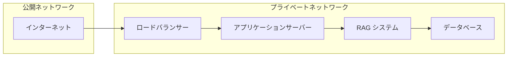

# セキュリティガイドライン

RAG システム共通のセキュリティに関する注意事項です。

---

## 重要な注意事項

### 機密ファイルの管理

以下のファイルは **絶対に Git にコミットしないでください**：

| ファイル | 内容 | リスク |
|---------|------|--------|
| `.env` | API キー、認証情報 | API の不正利用、課金被害 |
| `gemini_credentials.json` | GCP サービスアカウント | クラウドリソースの不正利用 |
| `*.pem`, `*.key` | 秘密鍵 | システムへの不正アクセス |

### リスクの具体例

**API キーが漏洩した場合：**
- 第三者による API の不正利用
- 高額な課金請求（数万〜数百万円の被害事例あり）
- アカウントの停止
- サービス利用規約違反

**GCP 認証情報が漏洩した場合：**
- クラウドリソースの不正利用（仮想マシン、ストレージ等）
- 機密データへのアクセス
- マイニング等の悪用による高額請求

---

## 推奨 .gitignore 設定

プロジェクトルートに以下の `.gitignore` を配置してください：

```gitignore
# =============================================
# 機密ファイル（最重要）
# =============================================
.env
.env.*
*.env
!.env.example

# Google Cloud 認証
gemini_credentials.json
*_credentials.json
service_account.json

# 秘密鍵
*.pem
*.key
*.p12
*.pfx

# =============================================
# データディレクトリ
# =============================================
# 入出力データ（機密情報を含む可能性）
input/
output/
reference/

# ログ（機密情報が含まれる可能性）
logs/
*.log

# =============================================
# Python 関連
# =============================================
__pycache__/
*.py[cod]
*$py.class
.venv/
venv/
.python-version

# =============================================
# IDE・エディタ
# =============================================
.vscode/
.idea/
*.swp
*.swo
*~

# =============================================
# OS 生成ファイル
# =============================================
.DS_Store
Thumbs.db
desktop.ini

# =============================================
# キャッシュ・一時ファイル
# =============================================
*.cache
.cache/
vector_cache/
vector_db/
```

---

## API キー管理

### 環境変数での管理（推奨）

**手順：**

1. テンプレートをコピー
```bash
cp .env.example .env
```

2. `.env` ファイルを編集
```bash
# Anthropic Claude
ANTHROPIC_API_KEY=sk-ant-api03-your_key_here

# OpenAI
OPENAI_API_KEY=sk-your_key_here

# Google Gemini（API キー方式）
GOOGLE_API_KEY=your_google_api_key

# Google Gemini（サービスアカウント方式）
GEMINI_CREDENTIALS_PATH=gemini_credentials.json
GEMINI_PROJECT_ID=your-project-id
```

3. 権限を制限（Linux/Mac）
```bash
chmod 600 .env
```

### API キーの安全な取得方法

**Anthropic:**
1. https://console.anthropic.com/ にアクセス
2. API Keys → Create Key
3. 用途を識別できる名前を付ける（例：`rag-system-dev`）

**OpenAI:**
1. https://platform.openai.com/api-keys にアクセス
2. Create new secret key
3. プロジェクト名を付けて管理

**Google Cloud:**
1. https://console.cloud.google.com/ にアクセス
2. API とサービス → 認証情報
3. API キーを作成 → 適切な制限を設定

### API キーのローテーション

**推奨頻度:** 90日ごと

**手順：**
1. 新しいキーを生成
2. `.env` ファイルを更新
3. アプリケーションの動作確認
4. 古いキーを無効化

```bash
# キーの更新履歴を記録（実際のキーは記録しない）
echo "$(date): ANTHROPIC_API_KEY rotated" >> ~/.key_rotation_log
```

---

## Google Cloud 認証（rag-gemini）

### サービスアカウント設定

**手順：**

1. **Google Cloud Console でプロジェクトを選択**

2. **サービスアカウントを作成**
   - IAM と管理 → サービスアカウント
   - 「サービスアカウントを作成」をクリック
   - 名前: `rag-gemini-service`
   - 説明: `RAG システム用サービスアカウント`

3. **役割を付与**

   | 役割 | 用途 |
   |------|------|
   | `Vertex AI User` | Vertex AI API の呼び出し |
   | `AI Platform Admin` | モデルの管理 |
   | `Storage Object Viewer` | （オプション）GCS からのデータ読み込み |

4. **キーを作成**
   - サービスアカウント詳細ページ → キー → 鍵を追加
   - JSON を選択
   - ダウンロードされたファイルを保存

5. **プロジェクトに配置**
```bash
# ファイル名を変更して配置
mv ~/Downloads/project-123456-abc123.json ./gemini_credentials.json

# .gitignore に追加（念のため確認）
echo "gemini_credentials.json" >> .gitignore

# 権限を制限
chmod 600 gemini_credentials.json
```

### 環境変数の設定

```bash
# .env に追加
GEMINI_CREDENTIALS_PATH=gemini_credentials.json
GEMINI_PROJECT_ID=your-project-id
GEMINI_LOCATION=us-central1
```

### 認証の確認

```python
from google.oauth2 import service_account
from google.cloud import aiplatform

# 認証情報を読み込み
credentials = service_account.Credentials.from_service_account_file(
    'gemini_credentials.json',
    scopes=['https://www.googleapis.com/auth/cloud-platform']
)

# Vertex AI を初期化
aiplatform.init(
    project='your-project-id',
    location='us-central1',
    credentials=credentials
)

print("認証成功")
```

---

## Azure Key Vault 連携（上級者向け）

本番環境では、Azure Key Vault を使用して認証情報を安全に管理できます。

### 設定

```bash
# .env
AZURE_KEY_VAULT_URL=https://your-vault.vault.azure.net/
AZURE_KEY_VAULT_SCOPES=https://www.googleapis.com/auth/cloud-platform
```

### 使用方法

```python
from azure.identity import DefaultAzureCredential
from azure.keyvault.secrets import SecretClient

# Key Vault クライアントを作成
credential = DefaultAzureCredential()
client = SecretClient(
    vault_url="https://your-vault.vault.azure.net/",
    credential=credential
)

# シークレットを取得
api_key = client.get_secret("anthropic-api-key").value
```

---

## 本番環境での推奨事項

### 1. 最小権限の原則

サービスアカウントには必要最小限の権限のみ付与してください。

**悪い例：**
```
roles/owner  # 全権限 - 危険
```

**良い例：**
```
roles/aiplatform.user      # Vertex AI のみ
roles/storage.objectViewer # 読み取りのみ
```

### 2. ネットワーク分離



**推奨設定：**
- RAG システムは内部ネットワークに配置
- API エンドポイントは VPN または Private Link 経由
- ファイアウォールで不要なポートをブロック

### 3. 監査ログ

API 呼び出しのログを記録し、異常を検知してください。

```python
import logging
from datetime import datetime

# 監査ログの設定
audit_logger = logging.getLogger('audit')
audit_handler = logging.FileHandler('logs/audit.log')
audit_handler.setFormatter(logging.Formatter(
    '%(asctime)s - %(levelname)s - %(message)s'
))
audit_logger.addHandler(audit_handler)

# API 呼び出し時にログ記録
def call_api(endpoint, params):
    audit_logger.info(f"API call: {endpoint}, params: {params}")
    # ... API 呼び出し処理
```

### 4. 暗号化

**保存データ（Data at Rest）：**
- データベースの暗号化を有効化
- ファイルシステムレベルの暗号化（BitLocker, LUKS）

**通信データ（Data in Transit）：**
- HTTPS のみを使用
- TLS 1.2 以上を強制

```python
# HTTPS の強制例
import requests

response = requests.get(
    'https://api.example.com/data',
    verify=True  # SSL 証明書を検証
)
```

### 5. 定期的なセキュリティレビュー

**チェックリスト：**

| 項目 | 頻度 | 担当 |
|------|------|------|
| 依存パッケージの脆弱性確認 | 週次 | 開発者 |
| API キーのローテーション | 90日 | 管理者 |
| アクセスログの確認 | 日次 | セキュリティチーム |
| 権限設定の見直し | 月次 | 管理者 |
| ペネトレーションテスト | 年次 | 外部ベンダー |

**依存パッケージの脆弱性確認：**

```bash
# pip-audit を使用
pip install pip-audit
pip-audit

# safety を使用
pip install safety
safety check

# Dependabot（GitHub）を有効化
# .github/dependabot.yml を作成
```

---

## インシデント対応

### API キーが漏洩した場合

**即座に実行：**

1. **漏洩したキーを無効化**
   - 各プロバイダーのコンソールで即座に削除

2. **新しいキーを生成**
   ```bash
   # 新しいキーを取得し、.env を更新
   ```

3. **影響調査**
   - 不正利用の形跡を確認（課金ダッシュボード等）
   - 監査ログを確認

4. **報告**
   - セキュリティチームに報告
   - 必要に応じて関係者に通知

### 不正アクセスを検知した場合

1. **アクセスを遮断**
   - ファイアウォールでブロック
   - サービスの一時停止

2. **証拠保全**
   - ログのバックアップ
   - スクリーンショット

3. **調査**
   - 侵入経路の特定
   - 影響範囲の確認

4. **復旧と再発防止**
   - 脆弱性の修正
   - セキュリティ強化

---

## セキュリティチェックリスト

デプロイ前に以下を確認してください：

- [ ] `.env` ファイルが `.gitignore` に含まれている
- [ ] `gemini_credentials.json` が `.gitignore` に含まれている
- [ ] API キーがハードコードされていない
- [ ] 本番用と開発用の API キーが分離されている
- [ ] サービスアカウントに最小権限が設定されている
- [ ] HTTPS が使用されている
- [ ] 監査ログが有効化されている
- [ ] 依存パッケージの脆弱性がチェックされている
