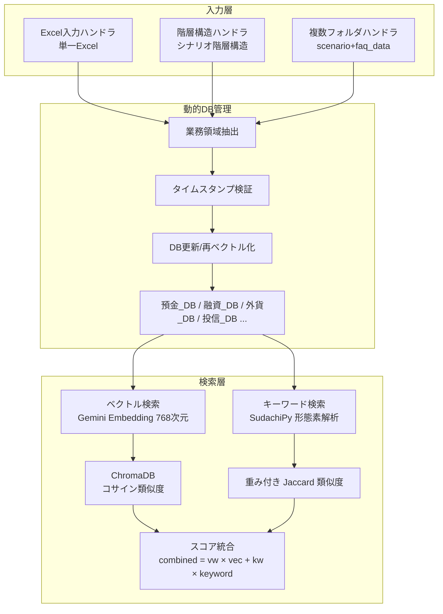
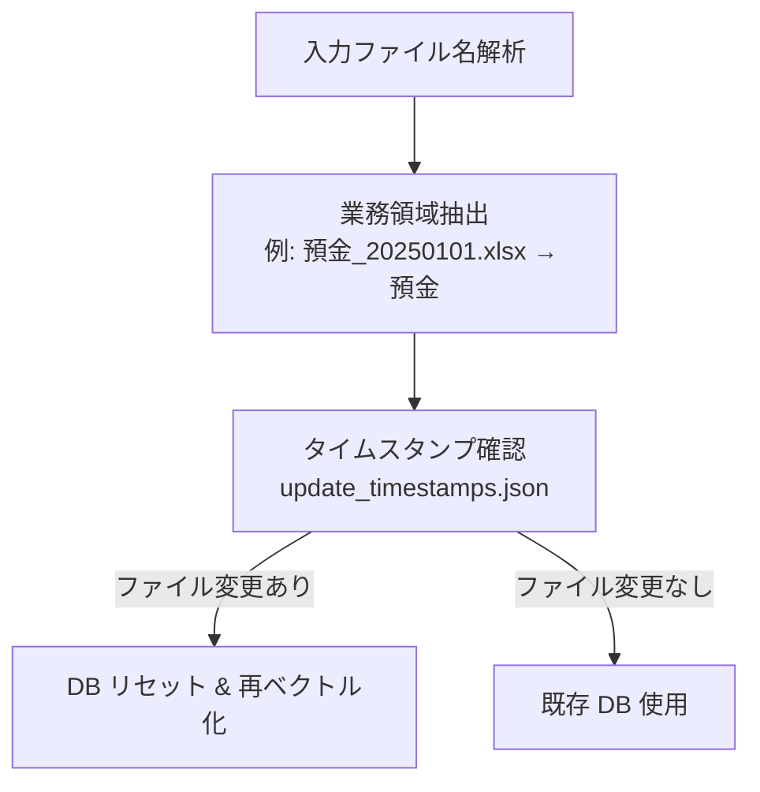

# RAG-Gemini

**Vertex AI Gemini と ChromaDB を活用した次世代 RAG システム**

[](https://www.python.org/)
[](https://cloud.google.com/vertex-ai)
[](https://www.trychroma.com/)
[](https://python.langchain.com/)
[](https://opensource.org/licenses/MIT)

---

## 目次

- [他プロジェクトとの違い](#他プロジェクトとの違い)
- [概要](#概要)
- [アーキテクチャ](#アーキテクチャ)
- [クイックスタート](#クイックスタート)
- [詳細セットアップガイド](#詳細セットアップガイド)
- [検索エンジン仕様](#検索エンジン仕様)
- [データベース管理](#データベース管理)
- [入出力フォーマット](#入出力フォーマット)
- [使用方法](#使用方法)
- [トラブルシューティング](#トラブルシューティング)
- [パフォーマンス最適化](#パフォーマンス最適化)
- [変更履歴](#変更履歴)
- [依存パッケージ・セキュリティ](#依存パッケージセキュリティ)

---

## 他プロジェクトとの違い

| 特徴 | rag-gemini | rag-batch | rag-streamlit |
|------|------------|-----------|---------------|
| **主な用途** | 最新技術・高精度 | バッチ処理 | 対話的検索 |
| **ベクトルDB** | ChromaDB（永続化） | JSON キャッシュ | JSON キャッシュ |
| **埋め込みモデル** | Gemini Embedding | multilingual-e5 | multilingual-e5 |
| **検索モード** | 原文 / LLM拡張 | LLM要約 | LLM要約 |
| **動的DB管理** | あり | なし | なし |

**関連プロジェクト:**

- シンプルなバッチ処理の場合: [rag-batch](../rag-batch/)
- 対話的 UI が必要な場合: [rag-streamlit](../rag-streamlit/)

---

## 概要

RAG-Gemini は、Google Vertex AI の Gemini Embedding API と ChromaDB を活用した高精度ハイブリッド検索システムです。銀行預金業務における問い合わせ対応に最適化されています。

### 主な機能

| 機能 | 説明 |
|------|------|
| **デュアル検索モード** | 原文検索 ↔ LLM 拡張検索の切り替え |
| **Gemini Embedding** | 768次元高精度ベクトル化 |
| **ChromaDB 永続化** | メタデータ対応ベクトルデータベース |
| **動的 DB 管理** | 業務領域別の自動 DB 管理 |
| **複数フォルダ対応** | シナリオ + FAQ 履歴の統合処理 |
| **マルチ LLM 対応** | Gemini / Claude / ChatGPT |

---

## アーキテクチャ



### 処理フロー説明

1. **入力層**: Excel ファイルを読み込み、形式に応じたハンドラを選択
2. **動的DB管理**: 業務領域を抽出し、タイムスタンプを検証して必要に応じて再ベクトル化
3. **検索層**: ベクトル検索とキーワード検索を並列実行し、重み付けでスコアを統合

---

## クイックスタート

**5分で開始できる簡潔版です。詳細は[詳細セットアップガイド](#詳細セットアップガイド)を参照してください。**

### 1. 環境構築

```bash
git clone <repository-url>
cd rag-gemini
python -m venv venv && source venv/bin/activate  # Windows: venv\Scripts\activate
pip install -r requirements.txt
```

### 2. 認証設定

```bash
cp your_credentials.json gemini_credentials.json
cp .env.example .env
# .env を編集して GEMINI_PROJECT_ID を設定
```

### 3. データ配置と実行

```bash
mkdir -p reference/scenario reference/faq_data input
cp scenario_data.xlsx reference/scenario/
cp faq_history.xlsx reference/faq_data/
cp input_data.xlsx input/

# バッチモード
python main.py

# インタラクティブモード
python main.py interactive
```

---

## 詳細セットアップガイド

### 環境構築

```bash
# リポジトリのクローン
git clone <repository-url>
cd rag-gemini

# 仮想環境の作成・有効化
python -m venv venv
source venv/bin/activate  # Windows: venv\Scripts\activate

# 依存パッケージのインストール
pip install -r requirements.txt
```

### Google Cloud 認証設定

#### 1. サービスアカウント作成

1. [Google Cloud Console](https://console.cloud.google.com/) にアクセス
2. IAM & Admin → Service Accounts → 「サービスアカウントを作成」
3. 役割を付与:
   - `Vertex AI User`
   - `AI Platform Admin`
4. キーを作成（JSON 形式）

#### 2. 認証ファイル配置

```bash
# プロジェクトルートに配置
cp downloaded_key.json gemini_credentials.json

# .gitignore に追加（重要）
echo "gemini_credentials.json" >> .gitignore
```

#### 3. 環境変数設定

`.env` ファイルを編集:

```env
# Gemini 認証（必須）
GEMINI_CREDENTIALS_PATH=gemini_credentials.json
GEMINI_PROJECT_ID=your-project-id
GEMINI_LOCATION=us-central1

# LLM API キー（オプション）
ANTHROPIC_API_KEY=sk-ant-your_key
OPENAI_API_KEY=sk-your_key
```

#### 4. Azure Key Vault 連携（オプション）

本番環境での認証情報管理:

```env
AZURE_KEY_VAULT_URL=https://your-vault.vault.azure.net/
AZURE_KEY_VAULT_SCOPES=https://www.googleapis.com/auth/cloud-platform
```

### データ配置

```bash
# 参照データを配置
mkdir -p reference/scenario reference/faq_data
cp scenario_data.xlsx reference/scenario/
cp faq_history.xlsx reference/faq_data/

# 入力データを配置
mkdir -p input
cp input_data.xlsx input/
```

### Docker デプロイ

#### ビルド

```bash
docker build -t rag-gemini:latest .
```

#### バッチモード実行

```bash
docker run --rm \
  -v $(pwd)/input:/app/input \
  -v $(pwd)/reference:/app/reference \
  -v $(pwd)/output:/app/output \
  -v $(pwd)/gemini_credentials.json:/app/gemini_credentials.json:ro \
  -e GEMINI_CREDENTIALS_PATH=/app/gemini_credentials.json \
  -e GEMINI_PROJECT_ID=your-project-id \
  rag-gemini:latest main.py
```

#### インタラクティブモード実行

```bash
docker run -p 8501:8501 \
  -v $(pwd)/reference:/app/reference \
  -v $(pwd)/gemini_credentials.json:/app/gemini_credentials.json:ro \
  -e GEMINI_CREDENTIALS_PATH=/app/gemini_credentials.json \
  -e GEMINI_PROJECT_ID=your-project-id \
  rag-gemini:latest bash -c "streamlit run ui/chat.py --server.address 0.0.0.0"
```

---

## 検索エンジン仕様

### 検索モード

#### 原文検索モード（デフォルト）

```python
# config.py
DEFAULT_SEARCH_MODE = "original"
DEFAULT_ENABLE_QUERY_ENHANCEMENT = False
```

**特徴:**
- 質問文をそのままベクトル化
- LLM API 呼び出しなし（高速）
- 直接的な類似性検索

**処理フロー:**
```
質問文 → Gemini Embedding → ChromaDB 検索 → 結果
```

#### LLM 拡張検索モード

```python
# config.py
DEFAULT_SEARCH_MODE = "llm_enhanced"
DEFAULT_ENABLE_QUERY_ENHANCEMENT = True
```

**特徴:**
- LLM が質問の意図を理解して検索クエリを生成
- 高精度検索（質問の背後にある意図を抽出）
- プロンプトエンジニアリング対応

**処理フロー:**
```
質問文 → LLM (クエリ生成) → Gemini Embedding → ChromaDB 検索 → 結果
```

**生成クエリ例:**
```
入力: "口座開設の手続きについて教えてください"
出力: "検索クエリ: 銀行口座 新規開設 必要書類 手続き 流れ"
```

### Gemini Embedding API

```python
# src/utils/gemini_embedding.py
class GeminiEmbeddingModel:
    def __init__(self):
        self.model = TextEmbeddingModel.from_pretrained("gemini-embedding-001")

    def encode(self, texts, normalize_embeddings=True):
        # バッチサイズ 5 で API 制限対応
        embeddings = []
        for batch in chunks(texts, 5):
            result = self.model.get_embeddings(batch)
            embeddings.extend([e.values for e in result])
        return np.array(embeddings)
```

**技術仕様:**

| 項目 | 値 |
|------|-----|
| モデル | gemini-embedding-001 |
| 次元数 | 768 |
| 正規化 | L2 正規化 |
| バッチサイズ | 5（API レート制限対応） |
| 認証 | Vertex AI サービスアカウント |

### LLM プロバイダー

| プロバイダー | モデル | 用途 |
|-------------|--------|------|
| Gemini | gemini-2.0-flash-001 | クエリ生成（UI デフォルト） |
| Anthropic | claude-3-5-sonnet-20241022 | クエリ生成（config デフォルト） |
| OpenAI | gpt-4o | クエリ生成（代替） |

### 設定パラメータ

| パラメータ | 型 | デフォルト | 説明 |
|-----------|-----|-----------|------|
| `top_k` | int | 4 | 返却する類似文書数 |
| `vector_weight` | float | 0.9 (batch) / 0.7 (UI) | ベクトル検索の重み |
| `llm_provider` | str | anthropic | LLM プロバイダー |
| `llm_model` | str | claude-3-5-sonnet-20241022 | LLM モデル |
| `embedding_provider` | str | vertex_ai | 埋め込みプロバイダー |
| `embedding_model` | str | gemini-embedding-001 | 埋め込みモデル |
| `search_mode` | str | original | 検索モード |
| `enable_query_enhancement` | bool | False | LLM クエリ拡張 |
| `reference_type` | str | multi_folder | 参照データ形式 |

**参照データ形式:**

| 値 | 説明 |
|----|------|
| `excel` | 単一 Excel ファイル |
| `hierarchical_excel` | 階層構造シナリオのみ |
| `multi_folder` | scenario/ + faq_data/ 統合（推奨） |

---

## データベース管理

### ChromaDB 構造

**永続化場所:** `reference/vector_db/`

```text
reference/vector_db/
├── chroma.sqlite3              # メインデータベース
├── {collection_id}/            # コレクションデータ
│   ├── data_level0.bin
│   ├── header.bin
│   └── length.bin
└── update_timestamps.json      # 更新タイムスタンプ
```

### コレクション命名

業務領域から ASCII コレクション名に変換:

| 日本語 | コレクション名 |
|--------|----------------|
| 預金 | deposit_DB |
| 融資 | loan_DB |
| 外貨 | foreign_currency_DB |
| 投信 | investment_trust_DB |
| 住宅ローン | housing_loan_DB |
| カード | card_DB |
| 保険 | insurance_DB |
| 年金 | pension_DB |

### メタデータ構造

```python
metadata = {
    'source': 'scenario',           # or 'faq_data'
    'hierarchy': 'Lv0 > Lv1 > Lv2', # 階層構造
    'tags': 'tag1 | tag2 | tag3',   # タグ（パイプ区切り）
    'date': '2025-12-30',           # 日付
    'sheet_name': 'Sheet1',         # シート名
    'row_index': 42                 # 行番号
}
```

### 動的 DB 管理システム

業務領域ごとに独立したベクトルコレクションを管理し、参照データの更新を自動検知します。



**タイムスタンプ管理ファイル:** `reference/vector_db/update_timestamps.json`

```json
{
  "faq": {
    "deposit": 1735567200.0,
    "loan": 1735567200.0
  },
  "scenario": {
    "deposit": 1735567200.0,
    "loan": 1735567200.0
  }
}
```

---

## 入出力フォーマット

### 入力ファイル

**場所:** `input/` ディレクトリ

**形式:** Excel (.xlsx)

| 列 | 必須 | 説明 |
|----|------|------|
| 1列目 | はい | 番号/ID |
| 2列目 | はい | 質問内容 |
| 3列目 | いいえ | オリジナル回答 |

### 参照データ

**シナリオデータ:** `reference/scenario/`

| 列 | 説明 |
|----|------|
| 日付 | 作成日 |
| Lv1, Lv2, Lv3... | 階層構造 |
| 質問内容 | 質問文（自動検出） |
| 回答 | 回答文（自動検出） |

**FAQ 履歴:** `reference/faq_data/`

| 列名 | 必須 | 説明 |
|------|------|------|
| 問合せ内容 | はい | 質問文 |
| 回答 | はい | 回答文 |
| タグ | いいえ | 分類タグ |

### 出力ファイル

**ファイル名規則:**
```
output_batch_v{vw}_k{kw}_{hierarchy}_{mode}_{timestamp}.xlsx
例: output_batch_v0.9_k0.1_nh_orig_20250101_120000.xlsx
  - v0.9_k0.1: vector_weight / keyword_weight
  - nh: include_hierarchy なし（h: あり）
  - orig: 原文検索（llm: LLM拡張）
```

| 列名 | 説明 |
|------|------|
| # | 入力番号 |
| ユーザーの質問 | 元の質問文 |
| 検索クエリ | LLM 生成または原文 |
| 類似質問 | 検索結果の質問 |
| 類似回答 | 検索結果の回答 |
| 類似度 | 統合スコア（0.0-1.0） |
| ベクトルの重み | vector_weight |
| 候補数 | top_k |

---

## 使用方法

### バッチモード

```bash
python main.py
```

**ログ出力例:**

```text
2025-01-01 12:00:00 - INFO - main - Starting batch processing...
2025-01-01 12:00:01 - INFO - dynamic_db_manager - Analyzing reference files...
2025-01-01 12:00:02 - INFO - dynamic_db_manager - deposit: update needed (file changed)
2025-01-01 12:00:03 - INFO - gemini_embedding - Vectorizing 943 documents...
2025-01-01 12:00:30 - INFO - vector_db - Added 943 documents to deposit_DB
2025-01-01 12:00:31 - INFO - processor - Processing row 1/100...

Row (No.1):
  Search mode: original
  Original query: 口座開設の手続きについて教えてください
  Extracted keywords: ['口座', '開設', '手続き']
  Vector search returned 8 results
  Search results by source: {'scenario': 5, 'faq_data': 3}
  Final results: 4 items (limited to top_k=4)
```

### インタラクティブモード

```bash
python main.py interactive
```

ブラウザで http://localhost:8501 にアクセス

**UI 機能:**

| コンポーネント | 説明 |
|---------------|------|
| **パラメータ設定** | vector_weight、top_k スライダー |
| **チャット入力** | 質問入力フォーム |
| **結果表示** | 類似度スコア付きカード表示 |
| **履歴保存** | Excel エクスポート |

---

## トラブルシューティング

共通の問題については [docs/TROUBLESHOOTING.md](../docs/TROUBLESHOOTING.md) を参照してください。

### よくある問題

| 問題 | 原因 | 解決策 |
|------|------|--------|
| Gemini 認証エラー | 認証ファイル未設定 | `gemini_credentials.json` 確認 |
| ChromaDB エラー | vector_db/ 破損 | `rm -rf reference/vector_db/` |
| メモリエラー | 大量データ処理 | バッチサイズ縮小 |
| API レート制限 | Gemini API 制限 | 待機時間追加 |
| コレクション名エラー | 日本語文字 | 自動変換で対応済み |

### ログの確認

```bash
# リアルタイムログ
tail -f logs/app.log

# デバッグレベル有効化
export LOG_LEVEL=DEBUG
python main.py
```

### DB 内容確認

```bash
python scripts/check_db_content.py
```

出力例:

```text
=== ChromaDB Content Analysis ===
Collection: deposit_DB
Total documents: 943
Unique documents: 943
Duplicate documents: 0

Source distribution:
  scenario: 816
  faq_data: 127
```

---

## パフォーマンス最適化

### ベクトル化

| 項目 | 値 |
|------|-----|
| バッチサイズ | 5（Gemini API 制限対応） |
| 初回ベクトル化 | 5-10分（943件） |
| 以降 | タイムスタンプ検証のみ（秒単位） |

### 検索

| 項目 | 値 |
|------|-----|
| ChromaDB 検索 | ミリ秒単位 |
| キーワード類似度 | 並列計算 |
| Top-K 倍率 | 2（リランキング用に多めに取得） |

### メモリ

| 項目 | 推奨値 |
|------|--------|
| 最小 | 8GB |
| 大規模データ | 16GB |
| ストレージ | ChromaDB 永続化でディスク使用 |

---

## 変更履歴

### V2.3 (最新)

- LLM 拡張検索モード実装
- デュアル検索モード切り替え
- 詳細ログ出力
- エラーハンドリング強化

### V2.2

- タグレス対応
- LLM タグ生成削除
- 処理速度 30-40% 向上

### V2.1

- Gemini API 統合
- gemini-embedding-001 採用
- ChromaDB 永続化

### V2.0

- マージ版シナリオ対応
- 複数フォルダ統合処理
- カバレッジ 18 倍向上（52→943件）

---

## 依存パッケージ・セキュリティ

### 主要パッケージ

```text
# Google Cloud
google-cloud-aiplatform>=1.35.0
google-auth>=2.17.0
google-generativeai>=0.3.0

# ベクトルDB
chromadb>=1.0.15

# LangChain
langchain>=0.1.0
langchain-anthropic>=0.0.1
langchain-openai>=0.0.1
langchain-google-genai>=0.0.1

# 埋め込み
sentence-transformers>=2.2.0
torch>=2.0.0

# 日本語 NLP
sudachipy>=0.6.8
sudachidict-core>=20230927

# データ処理
pandas>=2.0.0
numpy>=1.24.0
openpyxl>=3.1.2
xlsxwriter>=3.1.0

# Web UI
streamlit>=1.30.0

# ユーティリティ
python-dotenv>=1.0.0
tqdm
```

### セキュリティ

詳細は [docs/SECURITY.md](../docs/SECURITY.md) を参照してください。

**重要な注意事項:**

- `gemini_credentials.json` は絶対に Git にコミットしない
- `.env` ファイルも Git に含めない
- サービスアカウントキーは定期的にローテーション
- 最小権限の原則を適用

**.gitignore 設定:**

```text
.env
*.env
gemini_credentials.json
input/
output/
reference/
logs/
__pycache__/
.venv/
```

---

## プロジェクト構成

```text
rag-gemini/
├── main.py                       # エントリーポイント
├── config.py                     # 設定管理（SearchConfig dataclass）
├── requirements.txt              # Python 依存パッケージ
├── .env.example                  # 環境変数テンプレート
├── Dockerfile                    # Docker コンテナ設定
├── gemini_credentials.json       # Google Cloud 認証（.gitignore）
│
├── src/
│   ├── core/
│   │   ├── processor.py          # データ処理エンジン
│   │   └── searcher.py           # ハイブリッド検索エンジン
│   │
│   ├── handlers/
│   │   ├── input_handler.py      # 入力処理
│   │   └── output_handler.py     # 出力処理
│   │
│   └── utils/
│       ├── auth.py               # Google Cloud 認証
│       ├── gemini_embedding.py   # Gemini 埋め込みモデル
│       ├── vector_db.py          # ChromaDB ラッパー
│       ├── dynamic_db_manager.py # 動的 DB 管理
│       ├── logger.py             # ログ設定
│       └── utils.py              # Azure Key Vault 連携
│
├── ui/
│   └── chat.py                   # Streamlit チャット UI
│
├── prompt/                       # プロンプトテンプレート
├── scripts/                      # ユーティリティスクリプト
├── input/                        # 入力ファイル
├── reference/                    # 参照データ + vector_db/
├── output/                       # 出力ファイル
└── logs/                         # アプリケーションログ
```

---

## ライセンス

MIT License

---

## 関連プロジェクト

| プロジェクト | 説明 | 状態 |
|-------------|------|------|
| [rag-reranker](../rag-reranker/) | Cross-Encoder Reranking 版 | Deprecated |
| [rag-batch](../rag-batch/) | バッチ処理特化版 | Active |
| [rag-streamlit](../rag-streamlit/) | 対話的 UI 版 | Active |
