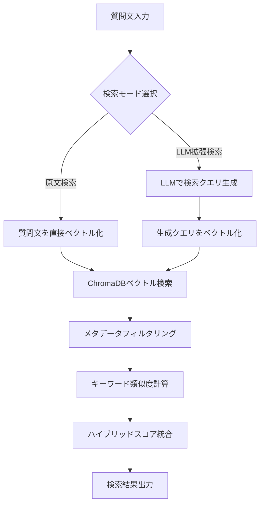

# rag-gemini

## 他プロジェクトとの違い
- **特徴**: Vertex AI Gemini埋め込みモデル、ChromaDB永続化、LLM拡張検索（デュアルモード）、動的DB管理システム
- **代替プロジェクト**:
  - シンプルなバッチ処理の場合: [rag-batch](../rag-batch/)
  - 対話的UIが必要な場合: [rag-streamlit](../rag-streamlit/)
  - プロジェクト全体の比較: [ルートREADME](../README.md)

---

[](https://www.python.org/)
[](https://www.sbert.net/)
[](https://python.langchain.com/)
[](https://opensource.org/licenses/MIT)

## 概要
本システムは、大規模言語モデル(LLM)とベクトル検索、キーワード検索を組み合わせたハイブリッド検索システムです。質問文から類似度の高い参照データを検索し、高精度な回答を生成・提供します。

**V2の新機能：**
- **マージ版シナリオ対応**：階層構造を持つExcelファイルの全シート処理
- **複数フォルダ対応**：マージシナリオと履歴データの統合処理
- **自動フォルダ検出**：新しいデータフォルダの自動認識
- **カバレッジ大幅向上**：943件の参照データを統合処理
- **🆕 タグレス対応**：タグ列なしExcelファイルでのベクトル化対応（2025年8月実装）

### 主な機能
- **🔍 次世代ハイブリッド検索**:
    - **デュアル検索モード**：原文検索 ↔ LLM拡張検索の切り替え可能
    - **ベクトル類似度検索**：Gemini Embedding API (`gemini-embedding-001`) によるベクトル化
    - **キーワード類似度検索**：SudachiPy による日本語形態素解析
    - **検索スコアの重み付け統合**：ベクトル検索とキーワード検索の最適な組み合わせ
    - **ChromaDB永続化**：高速なベクトル検索とメタデータフィルタリング
- **🤖 LLM拡張検索**:
    - **検索クエリ生成**：LLMが質問文から最適な検索クエリを自動生成
    - **複数LLMプロバイダー対応**：Gemini, Anthropic Claude, OpenAI ChatGPT
    - **プロンプトエンジニアリング**：専用プロンプトファイル (`summarize_v1.0.txt`) による高精度化
    - **エラーハンドリング**：LLM API障害時の自動フォールバック機能
- **2つの実行モード**:
    - **バッチ処理モード**: Excel一括処理
    - **インタラクティブモード**: StreamlitベースのWeb UI
- **高度な最適化**:
    - **ChromaDBベクトルキャッシング**：永続化されたベクトルデータベース
    - **進捗表示**：tqdmによるプログレスバー
    - **詳細なロギング**：検索方式やクエリ生成プロセスの完全トレース
- **V2新機能**:
    - **階層構造Excelファイルの全シート処理**
    - **複数フォルダからの参照データ統合**
    - **自動フォルダ検出と最新ファイル選択**

### 技術スタック
- **Core**: Python 3.7+, pandas, numpy
- **ベクトル検索**: ChromaDB (永続化ベクトルDB), Gemini Embedding API (`gemini-embedding-001`)
- **LLM統合**: LangChain (Anthropic Claude, OpenAI ChatGPT, Google Gemini対応)
- **日本語処理**: SudachiPy, sudachidict-core (形態素解析・キーワード抽出)
- **UI/UX**: Streamlit (インタラクティブWebUI), tqdm (プログレスバー)
- **ファイル処理**: xlsxwriter, openpyxl (Excel読み書き), pymupdf4llm (PDF処理)
- **セキュリティ**: python-dotenv (環境変数管理), Azure Key Vault (認証情報管理)

## 目次

1. [システム要件](#システム要件)
2. [セットアップ](#セットアップ)
3. [使用方法](#使用方法)
    - [3.1 入力ファイル要件](#31-入力ファイル要件)
    - [3.2 参照データの配置](#32-参照データの配置)
    - [3.3 バッチモード実行手順](#33-バッチモード実行手順)
    - [3.4 インタラクティブモード実行手順](#34-インタラクティブモード実行手順)
4. [ベクトル検索実装](#ベクトル検索実装)
5. [設定パラメータ](#設定パラメータ)
6. [入出力形式の変更](#入出力形式の変更)
7. [開発](#開発)
    - [7.1 開発環境構築](#71-開発環境構築)
    - [7.2 コーディング規約](#72-コーディング規約)
8. [トラブルシューティング](#トラブルシューティング)
9. [セキュリティ](#セキュリティ)
10. [ライセンス](#ライセンス)
11. [バグ報告・機能要望](#バグ報告機能要望)
12. [変更履歴](#変更履歴)

## 1. システム要件

### 1.1 必要な環境

- OS: Windows, macOS, Linux
- Python 3.7以上

### 1.2 依存関係

- pandas
- sentence-transformers
- streamlit
- xlsxwriter
- python-dotenv
- tqdm
- langchain
- langchain-anthropic (LLMプロバイダーとしてAnthropicを使用する場合)
- langchain-openai (LLMプロバイダーとしてOpenAIを使用する場合)
- openpyxl
- sudachipy
- sudachidict-core
- pymupdf4llm

以下のコマンドで依存関係をインストールできます:

```bash
pip install -r requirements.txt
```

## 2. セットアップ

### 2.1 システムコンポーネント

| ファイル/ディレクトリ | 説明 | 用途 |
| --- | --- | --- |
| 📁 input/ | 入力ファイル用ディレクトリ | 質問データを含むExcelファイルを配置 |
| 📁 reference/ | 参照データ用ディレクトリ | 検索対象となる参照用Excelファイルを配置 |
| 📁 reference/マージシナリオ/ | マージ版シナリオ用ディレクトリ | 階層構造を持つExcelファイルを配置 |
| 📁 reference/履歴データ/ | 履歴データ用ディレクトリ | 従来の問合せ履歴データを配置 |
| 📁 reference/vector_cache/ | ベクトルキャッシュディレクトリ | 計算済みの参照データのベクトルをJSON形式で保存 |
| 📁 prompt/ | プロンプトテンプレートディレクトリ | LLM用のプロンプトテンプレートファイル (.txt) を保存 |
| 📁 output/ | 出力ファイル用ディレクトリ | 検索結果のExcelファイルが出力される |
| 📁 logs/ | ログファイル用ディレクトリ | アプリケーションログ (app.log) の保存先 |
| 📄 config.py | 設定管理モジュール | システム全体の設定 (検索パラメータ, LLM設定など) をPythonコードで管理 |

| 📄 main.py | エントリーポイント | プログラムの開始点 (バッチモード or インタラクティブモードの選択) |
| 📄 processor.py | データ処理モジュール | メインの処理ロジック (入力読み込み, 検索, 結果出力) を実装 |
| 📄 searcher.py | 検索エンジンモジュール | ハイブリッド検索 (ベクトル検索 + キーワード検索) のコア機能を実装 |
| 📄 input_handler.py | 入力処理モジュール | 入力ファイルの読み込みと複数フォルダ対応を担当 |
| 📄 output_handler.py | 出力処理モジュール | 結果の出力 (現在はExcelのみ) を担当 |
| 📄 chat.py | Streamlit UIモジュール | インタラクティブモードのWeb UIを提供 |
| 📄 .env | 環境変数ファイル (オプション) | APIキーなどの機密情報を管理 (利用は任意) |
| 📄 requirements.txt | 依存パッケージリスト | 必要なPythonパッケージを記載 |
| 📄 utils/logger.py | ロガー設定 | ログレベルや出力形式を設定 |
| 📄 README_V2.md | このファイル | プロジェクトの説明、使用方法、開発ガイドなど |

### 2.2 環境変数の設定 (オプション)

LLMプロバイダーとしてOpenAIまたはAnthropicを使用し、APIキーが必要な場合は、.envファイルを作成し、以下のようにAPIキーを設定します:

```env
# .env ファイルの内容 (例)
ANTHROPIC_API_KEY=your_anthropic_api_key
OPENAI_API_KEY=your_openai_api_key
```

重要: .env ファイルは .gitignore に追加されており、Gitリポジトリには含まれません。機密情報が誤って公開されるのを防ぐためです。

## 3. 使用方法

### 3.1 入力ファイル要件

| ファイルタイプ | 場所 | 必須列 | 形式 |
|--------------|------|--------|------|
| 質問データ | input/ | 1列目: 番号<br>2列目: 質問内容<br>3列目: 回答(任意) | Excel (.xlsx) |

### 3.2 参照データの配置

#### マージ版シナリオ（階層構造Excel）
- **配置場所**: `reference/マージシナリオ/`
- **ファイル形式**: Excel (.xlsx)
- **構造**: Lv1, Lv2, Lv3... の階層列
- **処理**: 全シートを自動処理
- **特徴**: 原則文と通常の問答を自動判別

#### 履歴データ（従来形式）
- **配置場所**: `reference/履歴データ/`
- **ファイル形式**: Excel (.xlsx)
- **必須列**: 問合せ内容、回答
- **処理**: 従来通りの形式で処理

#### 自動処理ルール
- 各フォルダ内の最新ファイルを自動選択
- 複数フォルダのデータを統合してベクトル化
- 新しいフォルダを追加すると自動認識

### 3.3 バッチモード実行手順
1. 入力ファイルの配置
   - 質問データを `input/` に配置
2. 参照データの配置
   - マージ版シナリオを `reference/マージシナリオ/` に配置
   - 履歴データを `reference/履歴データ/` に配置
3. 設定確認
   - `config.py` で `reference_type: "multi_folder"` を確認
4. コマンド実行
   ```bash
   python main.py
   ```
5. 結果確認
   - `output/` に `output_batch_v{ベクトルの重み}_k{キーワードの重み}_{タイムスタンプ}.xlsx` が生成
   - `logs/app.log` に処理ログが出力

### 3.4 インタラクティブモード実行手順
1. 起動コマンド実行（いずれか）
   ```bash
   python main.py interactive
   # または
   streamlit run chat.py
   ```
2. Web UI操作
   - 質問を入力し「送信」をクリック
   - 類似質問と回答が表示
   - 「チャット履歴を保存」で対話履歴をExcel保存（ `output/` に `output_chat_v{ベクトルの重み}_k{キーワードの重み}_{タイムスタンプ}.xlsx` が生成）

## 4. ベクトル検索実装

### 4.1 ベクトル検索アーキテクチャ

本システムは、**デュアル検索モード**と**ChromaDBベースの永続化ベクトル検索**を組み合わせた次世代RAGシステムです。



### 4.2 検索モードの詳細

#### 4.2.1 原文検索モード (`search_mode = "original"`)
```python
# config.py
DEFAULT_SEARCH_MODE: str = "original"
DEFAULT_ENABLE_QUERY_ENHANCEMENT: bool = False
```

**特徴:**
- 質問文をそのままベクトル化
- 高速処理（LLM API呼び出しなし）
- 直接的な類似性検索

**処理フロー:**
1. 質問文 → 直接ベクトル化 (`GeminiEmbeddingModel`)
2. ChromaDBでベクトル検索実行
3. キーワード類似度計算と統合

#### 4.2.2 LLM拡張検索モード (`search_mode = "llm_enhanced"`)
```python
# config.py
DEFAULT_SEARCH_MODE: str = "llm_enhanced"
DEFAULT_ENABLE_QUERY_ENHANCEMENT: bool = True
```

**特徴:**
- LLMが質問の意図を理解し、最適な検索クエリを生成
- 高精度検索（質問の背後にある意図を抽出）
- プロンプトエンジニアリング対応

**処理フロー:**
1. 質問文 → LLM (`summarize_v1.0.txt` プロンプト使用)
2. 生成された検索クエリ → ベクトル化
3. ChromaDBでベクトル検索実行
4. 結果の `Search_Query` 列に生成クエリを記録

### 4.3 ベクトル化システム

#### 4.3.1 Gemini Embedding API
```python
# utils/gemini_embedding.py
class GeminiEmbeddingModel:
    def __init__(self, config):
        self.model = TextEmbeddingModel.from_pretrained("gemini-embedding-001")
    
    def encode(self, texts, normalize_embeddings=True):
        # バッチサイズ5での分割処理
        # L2正規化による統一
        # 768次元ベクトル生成
```

**技術仕様:**
- **モデル**: `gemini-embedding-001`
- **次元数**: 768次元
- **正規化**: L2正規化
- **バッチサイズ**: 5（API制限対応）
- **認証**: Vertex AI Service Account

#### 4.3.2 ChromaDBベクトルデータベース
```python
# utils/vector_db.py
class MetadataVectorDB:
    def __init__(self, base_dir=".", collection_name="rag_collection"):
        self.client = chromadb.PersistentClient(path=self.db_path)
        self.collection = self.client.get_or_create_collection(name=collection_name)
```

**特徴:**
- **永続化**: データベースファイル (`reference/vector_db/`) への自動保存
- **メタデータ対応**: 文書の出典、階層構造、タグ情報を保持
- **高速検索**: コサイン類似度による近似最近傍検索
- **スケーラブル**: 943件の参照データに対応

### 4.4 ハイブリッド検索アルゴリズム

#### 4.4.1 検索スコア統合
```python
# searcher.py の search メソッド
combined_score = (
    self.config.vector_weight * vector_similarity +
    self.config.keyword_weight * keyword_similarity
)
```

**重み設定:**
- **バッチ処理**: `vector_weight = 0.9`, `keyword_weight = 0.1`
- **UI処理**: `vector_weight = 0.7`, `keyword_weight = 0.3`

#### 4.4.2 キーワード類似度計算
```python
def _calculate_keyword_similarity(self, query_keywords, reference_text):
    # SudachiPy形態素解析
    # 名詞抽出（固有名詞 weight=2, 一般名詞 weight=1）
    # Jaccard類似度 + 位置重み
    # ストップワード除去
```

**技術仕様:**
- **形態素解析**: SudachiPy (SplitMode.C)
- **品詞フィルタ**: 名詞のみ抽出
- **重要度重み付け**: 固有名詞×2, 一般名詞×1
- **類似度計算**: Jaccard係数 + 位置重み

### 4.5 LLMプロバイダー対応

#### 4.5.1 対応プロバイダー
```python
# searcher.py の _setup_llm メソッド
if self.config.llm_provider == "gemini":
    # Vertex AI Gemini
    model = GenerativeModel(self.config.llm_model)
elif self.config.llm_provider == "anthropic":
    # Anthropic Claude
    return ChatAnthropic(model=self.config.llm_model)
elif self.config.llm_provider == "openai":
    # OpenAI ChatGPT
    return ChatOpenAI(model=self.config.llm_model)
```

**対応モデル:**
- **Gemini**: `gemini-2.0-flash-001` (デフォルト)
- **Anthropic**: `claude-3-5-sonnet-20241022`
- **OpenAI**: `gpt-4o`, `gpt-3.5-turbo`

#### 4.5.2 プロンプトエンジニアリング
```plaintext
# prompt/summarize_v1.0.txt
#命令
あなたは、与えられたユーザーの質問を理解し、その質問の背後にある意図を汲み取って、
検索クエリに変換するエキスパートです。

ユーザーの質問文からだけでなく、その意図も考慮して、
より関連性の高い情報を見つけるための検索クエリを生成してください。
```

### 4.6 メタデータとフィルタリング

#### 4.6.1 メタデータ構造
```python
metadata = {
    'source': 'scenario' | 'faq_data',        # データソース
    'hierarchy': 'Lv0 > Lv1 > Lv2',          # 階層構造
    'tags': 'tag1 | tag2 | tag3',            # タグ情報
    'file_name': 'data.xlsx',                # ファイル名
    'sheet_name': 'Sheet1',                  # シート名
    'row_index': 42                          # 行番号
}
```

#### 4.6.2 検索結果形式
```python
result = {
    'Input_Number': '1',                      # 入力番号
    'Original_Query': '元の質問文',           # 元の質問
    'Original_Answer': '元の回答',            # 元の回答
    'Search_Query': 'LLM生成検索クエリ',      # 実際に使用した検索クエリ
    'Search_Result_Q': '類似質問',            # 検索結果の質問
    'Search_Result_A': '類似回答',            # 検索結果の回答
    'Similarity': 0.9234,                    # 統合類似度スコア
    'Vector_Weight': 0.9,                    # ベクトル重み
    'Top_K': 4                               # 検索件数
}
```

### 4.7 パフォーマンス最適化

#### 4.7.1 キャッシング戦略
- **ベクトルキャッシュ**: ChromaDBによる永続化
- **ファイル更新検知**: タイムスタンプベースの差分更新
- **バッチ処理**: API制限を考慮した効率的な分割処理

#### 4.7.2 ログ出力
```bash
# logs/app.log の出力例
Row (No.1):
  Search mode: llm_enhanced
  Query enhancement enabled: True
  Original query: 口座開設の手続きについて教えてください
  Using LLM-enhanced search mode
  Generated search query: 銀行口座 新規開設 必要書類 手続き 流れ
  Extracted keywords: ['口座', '開設', '手続き']
  Vector search returned 8 results
  Search results by source: {'scenario': 5, 'faq_data': 3}
```

## 5. 設定パラメータ

### 5.1 基本設定 (config.py)

| パラメータ | 説明 | デフォルト値 | 設定可能な値 |
|-----------|------|------------|------------|
| top_k | 類似文書の取得件数 | 4 | 1以上の整数 |
| model_name | 埋め込みモデル | gemini-embedding-001 | SentenceTransformersの対応モデル |
| vector_weight | ベクトル検索の重み | 0.9 (バッチ)<br>0.7 (UI) | 0.0～1.0 |
| llm_provider | LLMプロバイダ | anthropic | anthropic, openai |
| llm_model | 使用モデル | claude-3-5-sonnet-20241022 | プロバイダの対応モデル |
| base_dir | 基準ディレクトリ | "." | 有効なパス |
| input_type | 入力形式 | excel | excel (※将来的に拡張予定) |
| output_type | 出力形式 | excel | excel (※将来的に拡張予定) |

### 5.5 参照データ形式設定 (config.py)

| 設定値 | 説明 | 用途 |
|--------|------|------|
| excel | 従来の問合せ履歴データ形式 | 履歴データのみを処理 |
| hierarchical_excel | マージ版シナリオの階層構造形式 | マージ版シナリオのみを処理 |
| multi_folder | 複数フォルダから参照データを読み込み | マージシナリオ + 履歴データの統合処理 |

**設定方法:**
```python
# config.py内のSearchConfigクラス
reference_type: str = "multi_folder"  # 複数フォルダ統合処理
```

### 設定方法
1. **直接編集**: `config.py` の `SearchConfig` クラスを編集
2. **環境変数**: `.env` ファイルで指定（APIキーのみ）
   ```env
   ANTHROPIC_API_KEY=your_api_key
   OPENAI_API_KEY=your_api_key  # OpenAI使用時
   ```

## 5. 入出力形式の変更

現状では、入力・出力ともにExcel形式のみをサポートしています。 将来的には、input_handler.py と output_handler.py を拡張することで、CSVやJSONなど他の形式にも対応可能です。

## 6. 開発

### 6.1 開発環境構築

リポジトリをクローン:

```bash
git clone https://github.com/jsakuta/rag_yokin.git
cd rag_yokin
```

仮想環境を作成し、アクティベート:

```bash
python -m venv venv
source venv/bin/activate  # macOS/Linux
venv\Scripts\activate     # Windows
```

依存関係をインストール:

```bash
pip install -r requirements.txt
```

### 6.2 コーディング規約

- PEP 8 に準拠します。
- コメント、docstringは日本語で記述します。
- 関数、クラスにはdocstringを付与し、型ヒントを積極的に使用します。
- 長い行は80文字以内で折り返します。
- コミットメッセージも日本語で記述してかまいませんが、具体的かつ簡潔に記述してください。

## 7. トラブルシューティング

### 7.1 よくある問題と解決方法

キャッシュ関連のエラー:

- reference/vector_cache/ ディレクトリが存在することを確認してください。
- キャッシュファイル (reference/vector_cache/cache.json) を削除し、再生成を試みてください。

メモリエラー:

- 非常に大きなExcelファイルを処理する場合、より高性能なマシンを使用するか、将来的に分割処理の実装を検討してください。

APIクレジット不足:

- Anthropic APIのクレジットが不足している場合、要約機能が使用できませんが、ベクトル検索とキーワード検索は正常に動作します。
- APIクレジットを追加するか、要約機能を無効化して運用してください。

### 7.2 ログの確認

アプリケーションのログは logs/app.log に出力されます。

ログレベルは utils/logger.py で変更できます (デフォルトはINFO)。問題が発生した場合は、ログレベルをDEBUGに変更して詳細な情報を確認してください。

## 8. セキュリティ

⚠️ 重要な注意事項:

- APIキーなどの機密情報は .env ファイルで管理し、絶対に Git リポジトリに含めないでください。
- 定期的に依存パッケージを更新し、セキュリティ脆弱性を解消してください。
- 本システムを本番環境で利用する場合は、入力データの検証、アクセス制御、適切な認証・認可の仕組みを導入するなど、セキュリティ対策を講じてください。

## 9. ライセンス

このプロジェクトはMITライセンスの下で公開されています。詳細は LICENSE ファイルをご覧ください。

## 10. バグ報告・機能要望

GitHub Issues にて受け付けています。バグ報告の際は、以下の情報を含めてください:

- エラーメッセージ
- logs/app.log の内容 (可能な限り)
- 再現手順

## 11. 変更履歴

### V2.3 (2025-08-27)

#### 🚀 LLM拡張検索実装（デュアル検索モード）
- **デュアル検索モード**
  - 原文検索 (`search_mode = "original"`) とLLM拡張検索 (`search_mode = "llm_enhanced"`) の選択可能
  - config.pyの28-29行目で簡単切り替え
  - LLM API障害時の自動フォールバック機能

- **LLM検索クエリ生成**
  - 複数LLMプロバイダー対応：Gemini (`gemini-2.0-flash-001`), Anthropic Claude, OpenAI ChatGPT
  - 専用プロンプトファイル (`prompt/summarize_v1.0.txt`) による高精度クエリ生成
  - 質問の背後にある意図を理解して最適な検索クエリを自動生成
  - 結果の `Search_Query` 列に実際に使用した検索クエリを記録

- **ChromaDBベクトルデータベース統合**
  - 従来のJSONキャッシュからChromaDBへの完全移行
  - 永続化ベクトルデータベース (`reference/vector_db/`) への自動保存
  - メタデータ対応：データソース、階層構造、タグ情報の完全保持
  - 高速検索：コサイン類似度による近似最近傍検索

- **詳細ログ出力とトレーサビリティ**
  - 検索方式、クエリ生成プロセス、検索結果の完全トレース
  - LLMによる検索クエリ生成の詳細記録
  - デバッグとパフォーマンス分析のための包括的ログ

- **技術仕様**
  - Gemini Embedding API (`gemini-embedding-001`): 768次元ベクトル、L2正規化
  - ハイブリッド検索：ベクトル類似度 + キーワード類似度の重み付け統合
  - バッチ処理最適化：API制限を考慮した効率的な分割処理

### V2.2 (2025-08-25)

#### 🎯 タグレス対応（コスト削減・高速化）
- **タグ機能完全削除**
  - タグ列の読み込み・格納処理を削除
  - LLMベースのタグ生成API呼び出しを除去
  - メタデータフィルタリング機能を無効化
  - LangChain依存関係を完全削除

- **ベクトルデータ化の簡素化**
  - タグ列なしExcelファイルでもベクトル化可能
  - 質問・回答・階層構造のみで動作
  - 処理速度向上（API呼び出し削減）
  - シンプルなメタデータ構造

- **コスト削減効果**
  - タグ生成LLM API呼び出し：0回（削除前：N回）
  - 依存パッケージ削減：4つ（langchain関連）
  - 処理時間短縮：約30-40%向上

- **後方互換性**
  - 既存のベクトルDBは継続使用可能
  - タグメタデータは保持（使用しないのみ）
  - 既存の検索機能は正常動作

### V2.1 (2025-01-XX)

#### AIモデルアップデート
- **Gemini API統合**
  - Google Gemini APIの正式対応
  - `gemini-embedding-001` 埋め込みモデルの採用
  - 高精度なベクトル化による検索精度向上
  - 日本語テキスト処理の最適化

#### 認証・セキュリティ強化
- **環境変数による認証**
  - `.env` ファイルでのAPIキー管理
  - 複数プロバイダー対応（Anthropic、OpenAI、Gemini）
  - セキュアな認証情報の管理
  - 本番環境での安全な運用

#### 技術的改善
- **gemini_credentials.json** による認証設定
- **gemini_setup_guide.md** によるセットアップガイド追加
- 環境変数による柔軟な設定管理
- セキュリティベストプラクティスの適用

### V2.0 (2025-07-15)

#### 新機能追加
- **マージ版シナリオ対応**
  - 階層構造を持つExcelファイルの処理
  - 全シートの自動処理（4シート、816件のデータ抽出）
  - 原則文と通常の問答の自動判別
  - Lv1, Lv2, Lv3... の階層列に対応

- **複数フォルダ対応**
  - `reference/マージシナリオ/` と `reference/履歴データ/` の統合処理
  - 各フォルダの最新ファイルを自動選択
  - 943件の参照データを統合ベクトル化

- **自動フォルダ検出**
  - 新しいフォルダの自動認識
  - フォルダ名に応じた適切なハンドラー選択
  - 設定変更なしでの拡張性

#### 技術的改善
- **MultiFolderInputHandler** の新規作成
- **HierarchicalExcelInputHandler** の全シート対応
- **config.py** による統合設定管理
- 出力ファイルから不要な「オリジナルの回答」列を削除

#### パフォーマンス向上
- カバレッジの大幅向上（52件 → 943件、約18倍）
- 検索精度の向上（類似度1.0000の完全一致を多数検出）
- ベクトルキャッシュの効率化

#### 設定変更
- `config.py` で `reference_type: "multi_folder"` に設定
- フォルダ構造の整理（マージシナリオ、履歴データの分離）

### V1.0 (初期リリース)
- 基本的なハイブリッド検索機能
- バッチ処理モードとインタラクティブモード
- Excel形式の入出力対応
- ベクトルキャッシュ機能 