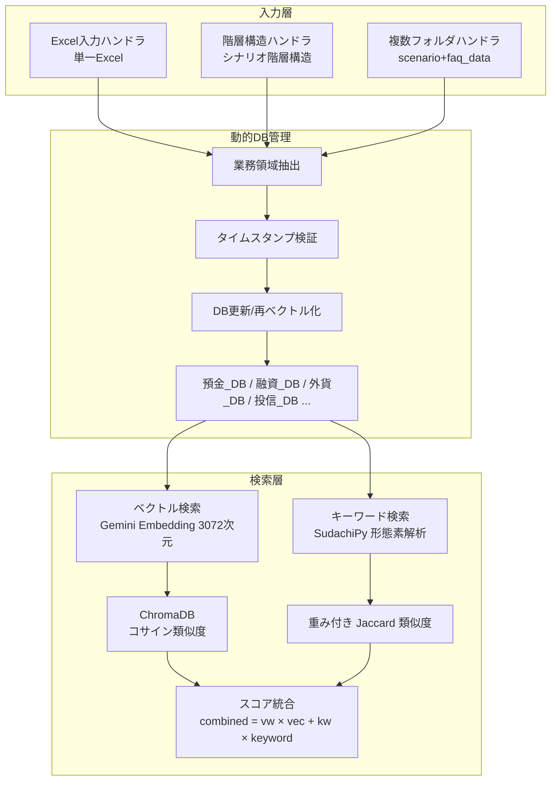
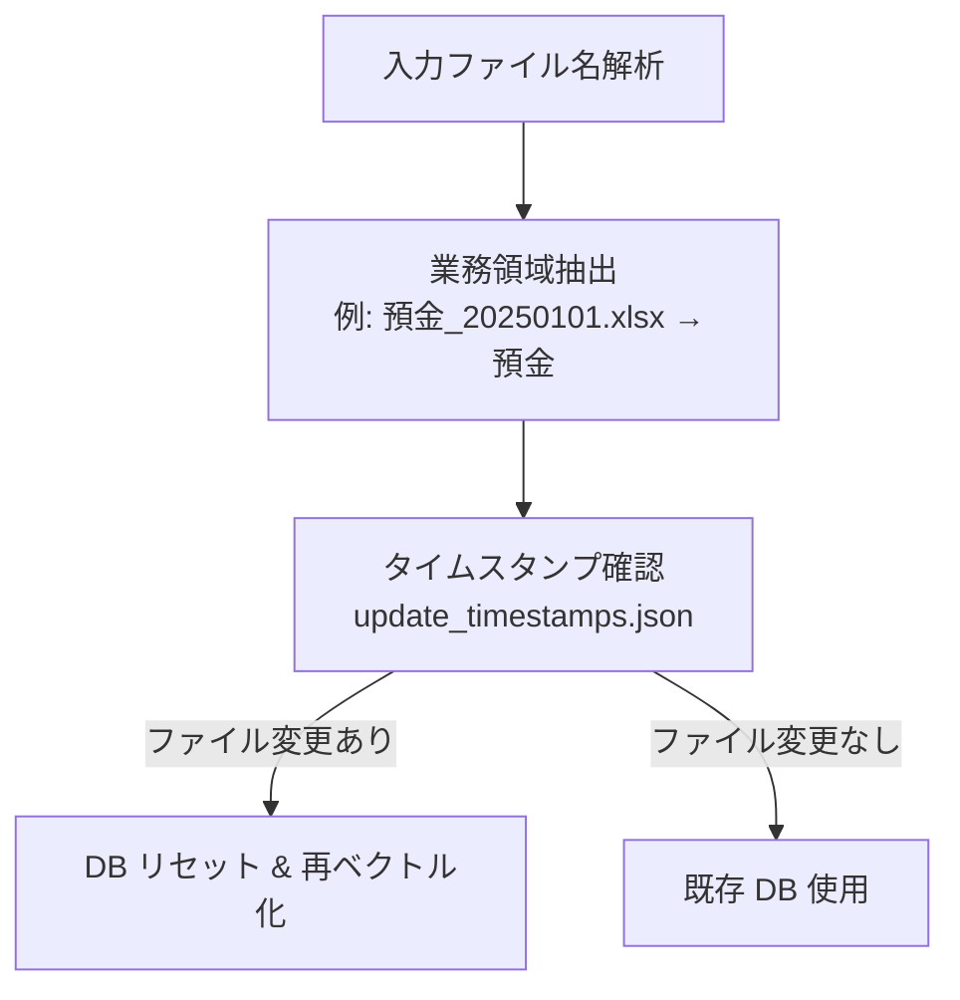

# RAG-Gemini

**Vertex AI Gemini と ChromaDB を活用した次世代 RAG システム**

[](https://www.python.org/)
[](https://cloud.google.com/vertex-ai)
[](https://www.trychroma.com/)
[](https://python.langchain.com/)
[](https://opensource.org/licenses/MIT)

---

## 目次

- [他プロジェクトとの違い](#他プロジェクトとの違い)
- [概要](#概要)
- [アーキテクチャ](#アーキテクチャ)
- [クイックスタート](#クイックスタート)
- [詳細セットアップガイド](#詳細セットアップガイド)
- [検索エンジン仕様](#検索エンジン仕様)
- [データベース管理](#データベース管理)
- [多段階検索（事務改定評価）](#多段階検索事務改定評価)
- [入出力フォーマット](#入出力フォーマット)
- [使用方法](#使用方法)
- [トラブルシューティング](#トラブルシューティング)
- [パフォーマンス最適化](#パフォーマンス最適化)
- [変更履歴](#変更履歴)
- [依存パッケージ・セキュリティ](#依存パッケージセキュリティ)

---

## AI使用箇所マップ

本システムでは以下の箇所でAI（LLM/埋め込みモデル）を使用しています。

```
入力
  │
  ├─ ベクトル化 ─────────────────────────────────── [Embedding Model]
  │   └─ azure_openai: text-embedding-3-large
  │   └─ vertex_ai: gemini-embedding-001
  │   └─ 呼び出し元: src/utils/azure_embedding.py, src/utils/gemini_embedding.py
  │
  ├─ クエリ拡張 ─────────────────────────────────── [LLM]
  │   └─ プロンプト: prompt/summarize_v1.0.txt
  │   └─ 呼び出し元: src/core/searcher.py, src/core/search/query_enhancer.py
  │
  ├─ 検索 ───────────────────────────────────────── [ベクトルDB]
  │   └─ ChromaDB（AI不使用）
  │
  └─ 関連性判定 ─────────────────────────────────── [LLM]
      └─ プロンプト: prompt/judgment_support.txt
      └─ 呼び出し元: src/core/judgment_support.py
```

| 処理 | AIモデル | 設定環境変数 |
|-----|---------|-------------|
| ベクトル化 | text-embedding-3-large / gemini-embedding-001 | `DEFAULT_EMBEDDING_PROVIDER`, `DEFAULT_EMBEDDING_MODEL` |
| クエリ拡張 | gemini-2.5-flash-lite | `DEFAULT_LLM_PROVIDER`, `DEFAULT_LLM_MODEL` |
| 関連性判定 | gemini-2.5-flash-lite | `DEFAULT_LLM_PROVIDER`, `DEFAULT_LLM_MODEL` |

詳細は [docs/CONFIGURATION.md](./docs/CONFIGURATION.md) を参照してください。

---

## 他プロジェクトとの違い

| 特徴 | rag-gemini | rag-batch | rag-streamlit |
|------|------------|-----------|---------------|
| **主な用途** | 最新技術・高精度 | バッチ処理 | 対話的検索 |
| **ベクトルDB** | ChromaDB（永続化） | JSON キャッシュ | JSON キャッシュ |
| **埋め込みモデル** | Gemini / Azure OpenAI | multilingual-e5 | multilingual-e5 |
| **検索モード** | 原文 / LLM拡張 | LLM要約 | LLM要約 |
| **動的DB管理** | あり | なし | なし |

**関連プロジェクト:**

- シンプルなバッチ処理の場合: [rag-batch](../rag-batch/)
- 対話的 UI が必要な場合: [rag-streamlit](../rag-streamlit/)

---

## 概要

RAG-Gemini は、Google Vertex AI の Gemini Embedding API と ChromaDB を活用した高精度ハイブリッド検索システムです。銀行預金業務における問い合わせ対応に最適化されています。

### 主な機能

| 機能 | 説明 |
|------|------|
| **デュアル検索モード** | 原文検索 ↔ LLM 拡張検索の切り替え |
| **マルチ埋め込みモデル** | Gemini / Azure OpenAI 切り替え対応（3072次元） |
| **ChromaDB 永続化** | メタデータ対応ベクトルデータベース |
| **動的 DB 管理** | 業務領域別の自動 DB 管理 |
| **複数フォルダ対応** | シナリオ + FAQ 履歴の統合処理 |
| **マルチ LLM 対応** | Gemini / Claude / ChatGPT |
| **多段階検索評価** | 事務改定の検索精度評価（Azure/VertexAI比較） |

---

## アーキテクチャ


```mermaid
graph TB
    subgraph 入力層
        A1[Excel入力ハンドラ<br/>単一Excel]
        A2[階層構造ハンドラ<br/>シナリオ階層構造]
        A3[複数フォルダハンドラ<br/>scenario+faq_data]
    end

    subgraph 動的DB管理
        B1[業務領域抽出]
        B2[タイムスタンプ検証]
        B3[DB更新/再ベクトル化]
        B4[預金_DB / 融資_DB / 外貨_DB / 投信_DB ...]
    end

    subgraph 検索層
        C1[ベクトル検索<br/>Gemini Embedding 3072次元]
        C2[ChromaDB<br/>コサイン類似度]
        D1[キーワード検索<br/>SudachiPy 形態素解析]
        D2[重み付き Jaccard 類似度]
        E[スコア統合<br/>combined = vw × vec + kw × keyword]
    end

    A1 --> B1
    A2 --> B1
    A3 --> B1
    B1 --> B2 --> B3 --> B4
    B4 --> C1
    B4 --> D1
    C1 --> C2 --> E
    D1 --> D2 --> E
```

### 処理フロー説明

1. **入力層**: Excel ファイルを読み込み、形式に応じたハンドラを選択
2. **動的DB管理**: 業務領域を抽出し、タイムスタンプを検証して必要に応じて再ベクトル化
3. **検索層**: ベクトル検索とキーワード検索を並列実行し、重み付けでスコアを統合

---

## クイックスタート

**5分で開始できる簡潔版です。詳細は[詳細セットアップガイド](#詳細セットアップガイド)を参照してください。**

### 1. 環境構築

```bash
git clone <repository-url>
cd rag-gemini
python -m venv venv && source venv/bin/activate  # Windows: venv\Scripts\activate
pip install -r requirements.txt
```

### 2. 認証設定

```bash
cp your_credentials.json gemini_credentials.json
cp .env.example .env
# .env を編集して GEMINI_PROJECT_ID を設定
```

### 3. データ配置と実行

```bash
mkdir -p reference/scenario reference/faq_data input
cp scenario_data.xlsx reference/scenario/
cp faq_history.xlsx reference/faq_data/
cp input_data.xlsx input/

# バッチモード
python main.py

# インタラクティブモード
python main.py interactive
```

---

## 詳細セットアップガイド

### 環境構築

```bash
# リポジトリのクローン
git clone <repository-url>
cd rag-gemini

# 仮想環境の作成・有効化
python -m venv venv
source venv/bin/activate  # Windows: venv\Scripts\activate

# 依存パッケージのインストール
pip install -r requirements.txt
```

### Google Cloud 認証設定

認証設定の詳細は [docs/GOOGLE_CLOUD_AUTH.md](./docs/GOOGLE_CLOUD_AUTH.md) を参照してください。

#### クイック設定

1. **サービスアカウントキーを取得**
   - Google Cloud Console でサービスアカウントを作成
   - 役割: `Vertex AI User`, `AI Platform Admin`
   - JSON キーをダウンロード

2. **認証ファイルを配置**
```bash
cp downloaded_key.json gemini_credentials.json
```

3. **環境変数を設定**（`.env`）
```env
# LLM設定（必須）
DEFAULT_LLM_PROVIDER=gemini
DEFAULT_LLM_MODEL=gemini-2.5-flash-lite

# 埋め込みモデル設定（必須）
DEFAULT_EMBEDDING_PROVIDER=azure_openai
DEFAULT_EMBEDDING_MODEL=text-embedding-3-large

# Vertex AI設定（geminiを使う場合必須）
GEMINI_CREDENTIALS_PATH=gemini_credentials.json
GEMINI_PROJECT_ID=your-project-id
GEMINI_LOCATION=us-central1

# Azure OpenAI設定（azure_openaiを使う場合必須）
AZURE_OPENAI_API_KEY=your-api-key
AZURE_OPENAI_ENDPOINT=https://your-resource.openai.azure.com/
AZURE_OPENAI_EMBEDDING_DEPLOYMENT=text-embedding-3-large
AZURE_OPENAI_API_VERSION=2024-12-01-preview
```

詳細な設定オプションは [docs/CONFIGURATION.md](./docs/CONFIGURATION.md) を参照してください。

### データ配置

```bash
# 参照データを配置
mkdir -p reference/scenario reference/faq_data
cp scenario_data.xlsx reference/scenario/
cp faq_history.xlsx reference/faq_data/

# 入力データを配置
mkdir -p input
cp input_data.xlsx input/
```

### Docker デプロイ

#### ビルド

```bash
docker build -t rag-gemini:latest .
```

#### バッチモード実行

```bash
docker run --rm \
  -v $(pwd)/input:/app/input \
  -v $(pwd)/reference:/app/reference \
  -v $(pwd)/output:/app/output \
  -v $(pwd)/gemini_credentials.json:/app/gemini_credentials.json:ro \
  -e GEMINI_CREDENTIALS_PATH=/app/gemini_credentials.json \
  -e GEMINI_PROJECT_ID=your-project-id \
  rag-gemini:latest main.py
```

#### インタラクティブモード実行

```bash
docker run -p 8501:8501 \
  -v $(pwd)/reference:/app/reference \
  -v $(pwd)/gemini_credentials.json:/app/gemini_credentials.json:ro \
  -e GEMINI_CREDENTIALS_PATH=/app/gemini_credentials.json \
  -e GEMINI_PROJECT_ID=your-project-id \
  rag-gemini:latest bash -c "streamlit run ui/chat.py --server.address 0.0.0.0"
```

---

## 検索エンジン仕様

### 検索モード

#### 原文検索モード（デフォルト）

```python
# config.py
DEFAULT_SEARCH_MODE = "original"
DEFAULT_ENABLE_QUERY_ENHANCEMENT = False
```

**特徴:**
- 質問文をそのままベクトル化
- LLM API 呼び出しなし（高速）
- 直接的な類似性検索

**処理フロー:**
```
質問文 → Gemini Embedding → ChromaDB 検索 → 結果
```

#### LLM 拡張検索モード

```python
# config.py
DEFAULT_SEARCH_MODE = "llm_enhanced"
DEFAULT_ENABLE_QUERY_ENHANCEMENT = True
```

**特徴:**
- LLM が質問の意図を理解して検索クエリを生成
- 高精度検索（質問の背後にある意図を抽出）
- プロンプトエンジニアリング対応

**処理フロー:**
```
質問文 → LLM (クエリ生成) → Gemini Embedding → ChromaDB 検索 → 結果
```

**生成クエリ例:**
```
入力: "口座開設の手続きについて教えてください"
出力: "検索クエリ: 銀行口座 新規開設 必要書類 手続き 流れ"
```

### 埋め込みモデル

2つのプロバイダーから選択可能:

| プロバイダー | モデル | 次元数 | 特徴 |
|-------------|--------|--------|------|
| Vertex AI | gemini-embedding-001 | 3072 | Google Cloud 統合、MRL対応 |
| Azure OpenAI | text-embedding-3-large | 3072 | Azure 統合、高精度 |

#### プロバイダー切り替え

**方法1: SearchConfig で指定**
```python
from config import SearchConfig

# Gemini (デフォルト)
config = SearchConfig(embedding_provider="vertex_ai")

# Azure OpenAI
config = SearchConfig(embedding_provider="azure_openai")
```

**方法2: 環境変数で設定**
```env
# .env
EMBEDDING_PROVIDER=azure_openai
AZURE_OPENAI_EMBEDDING_ENDPOINT=https://your-resource.openai.azure.com/
AZURE_OPENAI_EMBEDDING_API_KEY=your_api_key
AZURE_OPENAI_EMBEDDING_DEPLOYMENT=text-embedding-3-large
```

#### Vertex AI (Gemini)

| 項目 | 値 |
|------|-----|
| モデル | gemini-embedding-001 |
| 次元数 | 3072（デフォルト、768/1536選択可） |
| 正規化 | L2 正規化 |
| バッチサイズ | 250（API上限） |
| 認証 | Vertex AI サービスアカウント |

**次元数の選択（Matryoshka Representation Learning）:**

gemini-embedding-001はMRLを採用しており、用途に応じて出力次元数を選択可能:

| 次元数 | 用途 | 特徴 |
|--------|------|------|
| 3072 | 最高精度 | デフォルト、重要なアプリケーション向け |
| 1536 | バランス | 精度とパフォーマンスの両立 |
| 768 | コスト最適化 | ストレージ効率重視 |

#### Azure OpenAI

| 項目 | 値 |
|------|-----|
| モデル | text-embedding-3-large |
| 次元数 | 3072 |
| 正規化 | L2 正規化 |
| バッチサイズ | 16（API上限 2048） |
| 認証 | API キー |

**エラーハンドリング:**
- リトライ対象: 429 (Rate Limit)、5xx (Server Error)
- 即座に失敗: 400 (Bad Request)、401 (Unauthorized)、403 (Forbidden)

### LLM プロバイダー

| プロバイダー | モデル | 用途 |
|-------------|--------|------|
| Gemini | gemini-2.5-flash-lite | クエリ生成（推奨） |
| Anthropic | claude-3-5-sonnet-20241022 | クエリ生成（高精度） |
| OpenAI | gpt-4o | クエリ生成（代替） |

### 設定パラメータ

| パラメータ | 型 | デフォルト | 説明 |
|-----------|-----|-----------|------|
| `top_k` | int | 4 | 返却する類似文書数 |
| `vector_weight` | float | 0.9 (batch) / 0.7 (UI) | ベクトル検索の重み |
| `llm_provider` | str | **必須** | LLM プロバイダー（環境変数 `DEFAULT_LLM_PROVIDER`） |
| `llm_model` | str | **必須** | LLM モデル（環境変数 `DEFAULT_LLM_MODEL`） |
| `embedding_provider` | str | **必須** | 埋め込みプロバイダー（環境変数 `DEFAULT_EMBEDDING_PROVIDER`） |
| `embedding_model` | str | **必須** | 埋め込みモデル（環境変数 `DEFAULT_EMBEDDING_MODEL`） |
| `azure_openai_embedding_endpoint` | str | **必須**※ | Azure OpenAI エンドポイント |
| `azure_openai_embedding_api_key` | str | **必須**※ | Azure OpenAI API キー |
| `azure_openai_embedding_deployment` | str | (環境変数) | デプロイメント名 |
| `azure_openai_embedding_api_version` | str | (環境変数) | API バージョン |
| `search_mode` | str | original | 検索モード（original/llm_enhanced/multi_stage） |
| `reference_type` | str | multi_folder | 参照データ形式 |

※ `embedding_provider=azure_openai` の場合に必須

**参照データ形式:**

| 値 | 説明 |
|----|------|
| `excel` | 単一 Excel ファイル |
| `hierarchical_excel` | 階層構造シナリオのみ |
| `multi_folder` | scenario/ + faq_data/ 統合（推奨） |

---

## データベース管理

### ChromaDB 構造

**永続化場所:** `reference/vector_db/`

```text
reference/vector_db/
├── chroma.sqlite3              # メインデータベース
├── {collection_id}/            # コレクションデータ
│   ├── data_level0.bin
│   ├── header.bin
│   └── length.bin
└── update_timestamps.json      # 更新タイムスタンプ
```

### コレクション命名

業務領域から ASCII コレクション名に変換:

| 日本語 | コレクション名 |
|--------|----------------|
| 預金 | deposit_DB |
| 融資 | loan_DB |
| 外貨 | foreign_currency_DB |
| 投信 | investment_trust_DB |
| 住宅ローン | housing_loan_DB |
| カード | card_DB |
| 保険 | insurance_DB |
| 年金 | pension_DB |

### メタデータ構造

```python
metadata = {
    'source': 'scenario',           # or 'faq_data'
    'hierarchy': 'Lv0 > Lv1 > Lv2', # 階層構造
    'tags': 'tag1 | tag2 | tag3',   # タグ（パイプ区切り）
    'date': '2025-12-30',           # 日付
    'sheet_name': 'Sheet1',         # シート名
    'row_index': 42                 # 行番号
}
```

### 動的 DB 管理システム

業務領域ごとに独立したベクトルコレクションを管理し、参照データの更新を自動検知します。


```mermaid
flowchart TD
    A[入力ファイル名解析] --> B[業務領域抽出<br/>例: 預金_20250101.xlsx → 預金]
    B --> C[タイムスタンプ確認<br/>update_timestamps.json]
    C -->|ファイル変更あり| D[DB リセット & 再ベクトル化]
    C -->|ファイル変更なし| E[既存 DB 使用]
```

**タイムスタンプ管理ファイル:** `reference/vector_db/update_timestamps.json`

```json
{
  "faq": {
    "deposit": 1735567200.0,
    "loan": 1735567200.0
  },
  "scenario": {
    "deposit": 1735567200.0,
    "loan": 1735567200.0
  }
}
```

---

## 多段階検索（事務改定評価）

### 目的

事務改定によるシナリオ変更の影響範囲を特定するため、**改定内容の説明文から変更対象のシナリオ行を正しく検索できるか**を評価するシステム。

**ユースケース:**
- 事務改定（手続き変更、用語変更等）が発生した際、影響を受けるシナリオ行を自動特定
- 検索精度を Azure OpenAI と VertexAI で比較し、最適なプロバイダーを選定
- 改定ごとの検索難易度を把握し、検索クエリの改善に活用

### 処理フロー

```
1. 変更前シナリオをベクトル化（rev*DB構築）
   └── Azure OpenAI / VertexAI 両方で構築

2. 改定内容をクエリとして検索
   └── 各rev*DBに対して検索実行

3. 正解ID（変更対象行）との照合
   └── Top-1/3/5/10 の正解率を算出

4. Excel出力（改定ごとのシート + サマリー）
```

### DB構造（事務改定評価用）

```
reference/vector_db/
├── general/              # 通常検索用（総則）
├── deposit/              # 通常検索用（預金）
│
├── rev01smile/           # 事務改定①用（smile-bot）
│   ├── azure_openai/     # Azure OpenAI 埋め込み
│   │   └── chroma.sqlite3
│   └── vertex_ai/        # VertexAI 埋め込み
│       └── chroma.sqlite3
├── rev02souzoku/         # 事務改定②用
├── rev03naibujimu/       # 事務改定③用（naibujimu-bot）
├── rev03smile/           # 事務改定③用（smile-bot）
├── rev03souzoku/         # 事務改定③用（souzoku-bot）
├── rev03torikaku/        # 事務改定③用（torikaku-bot）
├── rev04naibujimu/       # 事務改定④用
├── rev05smile/           # 事務改定⑤用
└── rev06smile/           # 事務改定⑥用
```

**プロバイダー別DBの理由:**
- 埋め込みベクトルの次元・特性がプロバイダーにより異なる
- 同一コレクションに異なるモデルのベクトルは混在不可
- 検索時はクエリと同じモデルでベクトル化されたDBを使用

### 改定番号とDBの対応

| 改定番号 | 台帳No. | 内容 | 対応DB |
|---------|--------|------|--------|
| ① | 20 | スマイル機能変更 | rev01smile |
| ② | 21 | 相続少額払い | rev02souzoku |
| ③ | 25-30, 35-36 | 保険証→資格確認証 | rev03naibujimu, rev03smile, rev03souzoku, rev03torikaku |
| ④ | 37 | 0円新規開設可能 | rev04naibujimu |
| ⑤ | 41-42 | AML→GPLEX | rev05smile |
| ⑥ | 43-45 | DC→MDC | rev06smile |

### 使用方法

**Step 1: DB再構築**
```bash
# Streamlit UIを停止してから実行
python scripts/rebuild_before_scenario_db.py
```

**Step 2: 評価実行**
```bash
python scripts/evaluate_revisions.py
```

**出力:**
```
output/revision_evaluation_YYYYMMDD_HHMMSS.xlsx
├── サマリーシート（改定×プロバイダーの正解率一覧）
├── 改定①シート（検索結果詳細）
├── 改定②シート
└── ...
```

### 正解IDフォーマット

```
{ボット名}_{Excel行番号}
例: smile-bot_129, naibujimu-bot_641
```

| ボット名 | 対象システム |
|---------|-------------|
| smile-bot | スマイルタブレット |
| naibujimu-bot | 内部事務 |
| souzoku-bot | 相続 |
| torikaku-bot | 取引時確認 |

### 環境変数

```env
# Azure OpenAI 埋め込み
AZURE_OPENAI_EMBEDDING_DEPLOYMENT=text-embedding-3-large

# VertexAI 埋め込み
VERTEX_AI_EMBEDDING_MODEL=gemini-embedding-001
```

### 関連スクリプト

| ファイル | 説明 |
|---------|------|
| `scripts/rebuild_before_scenario_db.py` | rev*DB再構築（両プロバイダー対応） |
| `scripts/evaluate_revisions.py` | 評価実行・Excel出力 |
| `scripts/generate_correct_ids.py` | 正解ID対応表生成 |

詳細は [docs/REVISION_EVALUATION.md](./docs/REVISION_EVALUATION.md) を参照してください。

---

## 入出力フォーマット

### 入力ファイル

**場所:** `input/` ディレクトリ

**形式:** Excel (.xlsx)

| 列 | 必須 | 説明 |
|----|------|------|
| 1列目 | はい | 番号/ID |
| 2列目 | はい | 質問内容 |
| 3列目 | いいえ | オリジナル回答 |

### 参照データ

**シナリオデータ:** `reference/scenario/`

| 列 | 説明 |
|----|------|
| 日付 | 作成日 |
| Lv1, Lv2, Lv3... | 階層構造 |
| 質問内容 | 質問文（自動検出） |
| 回答 | 回答文（自動検出） |

**FAQ 履歴:** `reference/faq_data/`

| 列名 | 必須 | 説明 |
|------|------|------|
| 問合せ内容 | はい | 質問文 |
| 回答 | はい | 回答文 |
| タグ | いいえ | 分類タグ |

### 出力ファイル

**ファイル名規則:**
```
output_batch_v{vw}_k{kw}_{hierarchy}_{mode}_{timestamp}.xlsx
例: output_batch_v0.9_k0.1_nh_orig_20250101_120000.xlsx
  - v0.9_k0.1: vector_weight / keyword_weight
  - nh: include_hierarchy なし（h: あり）
  - orig: 原文検索（llm: LLM拡張）
```

| 列名 | 説明 |
|------|------|
| # | 入力番号 |
| ユーザーの質問 | 元の質問文 |
| 検索クエリ | LLM 生成または原文 |
| 類似質問 | 検索結果の質問 |
| 類似回答 | 検索結果の回答 |
| 類似度 | 統合スコア（0.0-1.0） |
| ベクトルの重み | vector_weight |
| 候補数 | top_k |

---

## 使用方法

### バッチモード

```bash
python main.py
```

**ログ出力例:**

```text
2025-01-01 12:00:00 - INFO - main - Starting batch processing...
2025-01-01 12:00:01 - INFO - dynamic_db_manager - Analyzing reference files...
2025-01-01 12:00:02 - INFO - dynamic_db_manager - deposit: update needed (file changed)
2025-01-01 12:00:03 - INFO - gemini_embedding - Vectorizing 943 documents...
2025-01-01 12:00:30 - INFO - vector_db - Added 943 documents to deposit_DB
2025-01-01 12:00:31 - INFO - processor - Processing row 1/100...

Row (No.1):
  Search mode: original
  Original query: 口座開設の手続きについて教えてください
  Extracted keywords: ['口座', '開設', '手続き']
  Vector search returned 8 results
  Search results by source: {'scenario': 5, 'faq_data': 3}
  Final results: 4 items (limited to top_k=4)
```

### インタラクティブモード

```bash
python main.py interactive
```

ブラウザで http://localhost:8501 にアクセス

**UI 機能:**

| コンポーネント | 説明 |
|---------------|------|
| **パラメータ設定** | vector_weight、top_k スライダー |
| **チャット入力** | 質問入力フォーム |
| **結果表示** | 類似度スコア付きカード表示 |
| **履歴保存** | Excel エクスポート |

---

## トラブルシューティング

共通の問題については [docs/TROUBLESHOOTING.md](./docs/TROUBLESHOOTING.md) を参照してください。

### よくある問題

| 問題 | 原因 | 解決策 |
|------|------|--------|
| Gemini 認証エラー | 認証ファイル未設定 | `gemini_credentials.json` 確認 |
| ChromaDB エラー | vector_db/ 破損 | `rm -rf reference/vector_db/` |
| メモリエラー | 大量データ処理 | バッチサイズ縮小 |
| API レート制限 | Gemini API 制限 | 待機時間追加 |
| コレクション名エラー | 日本語文字 | 自動変換で対応済み |

### ログの確認

```bash
# リアルタイムログ
tail -f logs/app.log

# デバッグレベル有効化
export LOG_LEVEL=DEBUG
python main.py
```

### DB 内容確認

```bash
python scripts/check_db_content.py
```

出力例:

```text
=== ChromaDB Content Analysis ===
Collection: deposit_DB
Total documents: 943
Unique documents: 943
Duplicate documents: 0

Source distribution:
  scenario: 816
  faq_data: 127
```

---

## パフォーマンス最適化

### ベクトル化

| 項目 | 値 |
|------|-----|
| バッチサイズ | 5（Gemini API 制限対応） |
| 初回ベクトル化 | 5-10分（943件） |
| 以降 | タイムスタンプ検証のみ（秒単位） |

### 検索

| 項目 | 値 |
|------|-----|
| ChromaDB 検索 | ミリ秒単位 |
| キーワード類似度 | 並列計算 |
| Top-K 倍率 | 2（リランキング用に多めに取得） |

### メモリ

| 項目 | 推奨値 |
|------|--------|
| 最小 | 8GB |
| 大規模データ | 16GB |
| ストレージ | ChromaDB 永続化でディスク使用 |

---

## 変更履歴

### V2.5 (最新)

- **多段階検索（事務改定評価）機能追加**
  - 改定内容から変更対象シナリオを検索する精度評価システム
  - Azure OpenAI / VertexAI 両プロバイダーでの比較評価
  - 改定ごとのシート分割Excel出力
- rev*ベクトルDB構造（改定別×プロバイダー別）
- `VERTEX_AI_EMBEDDING_MODEL` 環境変数対応
- `gemini_embedding.py` の埋め込みモデル名を環境変数化

### V2.4

- Azure OpenAI text-embedding-3-large 対応
- 埋め込みモデルのプロバイダー切り替え機能
- スレッドセーフなシングルトン実装
- API エラー分類によるリトライ最適化

### V2.3

- LLM 拡張検索モード実装
- デュアル検索モード切り替え
- 詳細ログ出力
- エラーハンドリング強化

### V2.2

- タグレス対応
- LLM タグ生成削除
- 処理速度 30-40% 向上

### V2.1

- Gemini API 統合
- gemini-embedding-001 採用
- ChromaDB 永続化

### V2.0

- マージ版シナリオ対応
- 複数フォルダ統合処理
- カバレッジ 18 倍向上（52→943件）

---

## 依存パッケージ・セキュリティ

### 主要パッケージ

```text
# Google Cloud
google-cloud-aiplatform>=1.35.0
google-auth>=2.17.0
google-generativeai>=0.3.0

# ベクトルDB
chromadb>=1.0.15

# LangChain
langchain>=0.1.0
langchain-anthropic>=0.0.1
langchain-openai>=0.0.1
langchain-google-genai>=0.0.1

# Azure OpenAI
openai>=1.0.0

# 埋め込み
sentence-transformers>=2.2.0
torch>=2.0.0

# 日本語 NLP
sudachipy>=0.6.8
sudachidict-core>=20230927

# データ処理
pandas>=2.0.0
numpy>=1.24.0
openpyxl>=3.1.2
xlsxwriter>=3.1.0

# Web UI
streamlit>=1.30.0

# ユーティリティ
python-dotenv>=1.0.0
tqdm
```

### セキュリティ

詳細は [docs/SECURITY.md](./docs/SECURITY.md) を参照してください。

**重要な注意事項:**

- `gemini_credentials.json` は絶対に Git にコミットしない
- `.env` ファイルも Git に含めない
- サービスアカウントキーは定期的にローテーション（90日推奨）
- 最小権限の原則を適用

---

## プロジェクト構成

```text
rag-gemini/
├── main.py                       # エントリーポイント
├── config.py                     # 設定管理
├── requirements.txt              # Python 依存パッケージ
├── .env.example                  # 環境変数テンプレート
├── Dockerfile                    # Docker コンテナ設定
├── gemini_credentials.json       # Google Cloud 認証（.gitignore）
│
├── docs/                         # ドキュメント
│   ├── GOOGLE_CLOUD_AUTH.md      # Google Cloud 認証設定
│   ├── CONFIGURATION.md          # 設定詳細
│   ├── ARCHITECTURE.md           # システムアーキテクチャ
│   ├── API_REFERENCE.md          # API仕様
│   ├── SECURITY.md               # セキュリティガイド
│   ├── TROUBLESHOOTING.md        # トラブルシューティング
│   ├── REVISION_EVALUATION.md    # 事務改定評価システム
│   └── PROMPTS.md                # プロンプト詳細
│
├── src/                          # ソースコード
│   ├── core/                     # コアロジック
│   │   ├── processor.py          # データ処理エンジン
│   │   ├── judgment_support.py   # LLM判断支援
│   │   └── search/               # 検索エンジン
│   │       ├── multi_stage_orchestrator.py
│   │       ├── query_enhancer.py
│   │       ├── vector_search_engine.py
│   │       └── keyword_search_engine.py
│   │
│   ├── handlers/                 # 入出力処理
│   │   ├── input_handler.py
│   │   └── output_handler.py
│   │
│   └── utils/                    # ユーティリティ
│       ├── dynamic_db_manager.py # DB管理
│       ├── vector_db.py          # ChromaDB ラッパー
│       ├── base_embedding.py     # 埋め込みモデル基底
│       ├── gemini_embedding.py   # Gemini埋め込み
│       ├── azure_embedding.py    # Azure埋め込み
│       └── auth.py               # Google Cloud認証
│
├── ui/                           # Web UI
│   └── chat.py                   # Streamlit チャット UI
│
├── prompt/                       # プロンプトテンプレート
├── scripts/                      # ユーティリティスクリプト
├── input/                        # 入力ファイル
├── output/                       # 出力ファイル
├── reference/                    # 参照データ
│   ├── scenario/                 # シナリオデータ
│   ├── faq_data/                 # FAQデータ
│   └── vector_db/                # ベクトルDB（永続化）
└── logs/                         # ログファイル
```

詳細なアーキテクチャは [docs/ARCHITECTURE.md](./docs/ARCHITECTURE.md) を参照してください。

---

## ライセンス

MIT License

---

## 関連プロジェクト

| プロジェクト | 説明 | 状態 |
|-------------|------|------|
| [rag-reranker](../rag-reranker/) | Cross-Encoder Reranking 版 | Deprecated |
| [rag-batch](../rag-batch/) | バッチ処理特化版 | Active |
| [rag-streamlit](../rag-streamlit/) | 対話的 UI 版 | Active |
