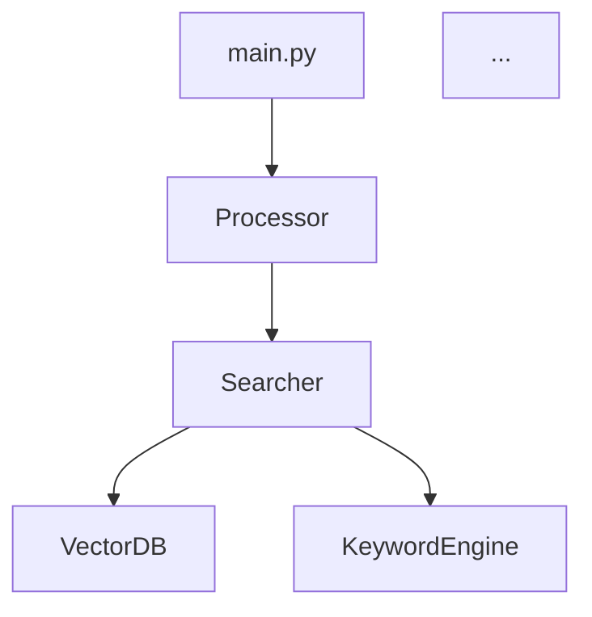

# RAG-Gemini プロジェクト整理計画

**作成日**: 2026-02-09
**目的**: コードベースの整理、不要ファイル削除、フォルダ構造の最適化、コードリファクタリング、ドキュメント整備

---

## 📋 目次

1. [Phase 0: バックアップ・準備](#phase-0-バックアップ準備)
2. [Phase 1: セキュリティ対応（CRITICAL）](#phase-1-セキュリティ対応critical)
3. [Phase 2: ファイルクリーンアップ](#phase-2-ファイルクリーンアップ)
4. [Phase 3: フォルダ構造整理](#phase-3-フォルダ構造整理)
5. [Phase 4: コードリファクタリング](#phase-4-コードリファクタリング)
6. [Phase 5: ドキュメント整備](#phase-5-ドキュメント整備)
7. [Phase 6: 検証・最終確認](#phase-6-検証最終確認)

---

## Phase 0: バックアップ・準備

**所要時間**: 5分
**優先度**: ★★★ 必須

### タスク

1. **プロジェクト全体のバックアップ**
   ```bash
   # プロジェクトディレクトリの親に移動
   cd C:\VSCode\rag

   # 現在の状態をアーカイブ
   tar -czf rag-gemini_backup_20260209.tar.gz rag-gemini/

   # または7-zipを使用（Windows）
   7z a rag-gemini_backup_20260209.7z rag-gemini\ -xr!venv -xr!__pycache__
   ```

2. **Gitコミット状態の確認**
   ```bash
   cd C:\VSCode\rag\rag-gemini
   git status
   git log --oneline -5

   # 現在の変更を退避（必要に応じて）
   git stash save "整理作業前の退避"
   ```

3. **新しいブランチ作成**
   ```bash
   # 整理作業用のブランチを作成
   git checkout -b refactor/project-cleanup
   ```

4. **依存関係の記録**
   ```bash
   # 現在の依存関係を記録
   pip freeze > requirements_before_cleanup.txt
   ```

### 成果物
- ✅ バックアップアーカイブ（`rag-gemini_backup_20260209.tar.gz`）
- ✅ 作業用ブランチ（`refactor/project-cleanup`）
- ✅ 依存関係記録（`requirements_before_cleanup.txt`）

---

## Phase 1: セキュリティ対応（CRITICAL）

**所要時間**: 20分
**優先度**: ★★★ 緊急

### 1.1 危険なファイルの削除

```bash
# Windows予約語ファイル削除（PowerShell）
Remove-Item "nul" -Force -ErrorAction SilentlyContinue

# リダイレクトミスファイル削除
Remove-Item "=3.2.0" -Force -ErrorAction SilentlyContinue
```

### 1.2 認証情報のGit履歴からの削除

**⚠️ 警告**: この操作はGit履歴を書き換えるため、慎重に実行

```bash
# BFG Repo-Cleanerを使用（推奨）
# https://rtyley.github.io/bfg-repo-cleaner/

# BFGダウンロード後:
java -jar bfg.jar --delete-files gemini_credentials.json

# または git filter-branch（手動）
git filter-branch --force --index-filter \
  "git rm --cached --ignore-unmatch gemini_credentials.json" \
  --prune-empty --tag-name-filter cat -- --all

# 履歴クリーンアップ
git reflog expire --expire=now --all
git gc --prune=now --aggressive
```

### 1.3 .gitignoreの強化

```bash
# .gitignore に追加
cat >> .gitignore << 'EOF'

# === セキュリティ ===
gemini_credentials.json
*.key
*.pem
*.p12
.env
.env.local

# === Windows予約語 ===
nul
con
prn
aux
com[1-9]
lpt[1-9]

# === リダイレクトミス ===
=[0-9]*

EOF
```

### 1.4 認証情報の再設定

```bash
# .env.example を確認・更新
cat .env.example

# 新しい .env を作成（テンプレートから）
cp .env.example .env.new

# 認証情報を環境変数または Azure Key Vault に移行
```

### 成果物
- ✅ `nul`, `=3.2.0` 削除完了
- ✅ Git履歴から`gemini_credentials.json`削除
- ✅ `.gitignore`強化
- ✅ 認証情報の安全な管理方法確立

---

## Phase 2: ファイルクリーンアップ

**所要時間**: 10分
**優先度**: ★★★ 高

### 2.1 Pythonキャッシュの削除

```bash
# __pycache__ ディレクトリ削除（2,756個）
find . -type d -name "__pycache__" -exec rm -rf {} + 2>/dev/null

# .pyc/.pyo ファイル削除（21,027個）
find . -type f \( -name "*.pyc" -o -name "*.pyo" \) -delete

# Windowsの場合（PowerShell）
Get-ChildItem -Path . -Recurse -Directory -Filter "__pycache__" | Remove-Item -Recurse -Force
Get-ChildItem -Path . -Recurse -File -Include "*.pyc","*.pyo" | Remove-Item -Force
```

### 2.2 ログファイルの整理

```bash
# 古いログをアーカイブ
mkdir -p logs/archive
mv logs/app.log logs/archive/app_20260209.log
touch logs/app.log

# preflight_last_exit.txt 削除
rm logs/preflight_last_exit.txt
```

### 2.3 出力ファイルの整理

```bash
# output/ の整理
cd output

# 日付別フォルダ作成（スクリプトで自動化）
python << 'EOF'
import os
import shutil
from datetime import datetime
from pathlib import Path

output_dir = Path('.')
archive_dir = output_dir / 'archive'
archive_dir.mkdir(exist_ok=True)

# 2025年以前のファイルをアーカイブ
for file in output_dir.glob('output_batch_*.xlsx'):
    if file.is_file():
        mtime = datetime.fromtimestamp(file.stat().st_mtime)
        if mtime.year < 2026:
            year_month = mtime.strftime('%Y%m')
            target_dir = archive_dir / year_month
            target_dir.mkdir(exist_ok=True)
            shutil.move(str(file), str(target_dir / file.name))
            print(f"Moved: {file.name} -> {target_dir}")

print("Cleanup completed.")
EOF

cd ..
```

### 2.4 空ディレクトリの削除

```bash
# 空のディレクトリ検出
find . -type d -empty

# 削除（確認後）
find . -type d -empty -delete
```

### 成果物
- ✅ キャッシュファイル完全削除（~10MB削減）
- ✅ ログファイル整理
- ✅ 出力ファイル年月別アーカイブ
- ✅ 空ディレクトリ削除

---

## Phase 3: フォルダ構造整理

**所要時間**: 30分
**優先度**: ★★★ 高

### 3.1 新しいディレクトリ構造作成

```bash
# 新しいdata/ディレクトリ構造を作成
mkdir -p data/vector_db/collections/metadata
mkdir -p data/source/scenarios/{latest,revisions}
mkdir -p data/source/faq/{latest,archive}
mkdir -p data/source/metadata
mkdir -p data/input
mkdir -p data/output/{results,archive}
mkdir -p docs/revisions
```

### 3.2 データベースファイルの移行

```bash
# reference/ → data/ への移行

# ベクトルDB
mv reference/vector_db/* data/vector_db/collections/
mv reference/vector_db/update_timestamps.json data/vector_db/metadata/
mv reference/vector_db/chroma.sqlite3 data/vector_db/

# シナリオデータ
mv reference/scenario/rev* data/source/scenarios/revisions/

# FAQデータ
mv reference/faq_data/* data/source/faq/latest/

# アーカイブ
mv reference/arcive data/source/archive
```

### 3.3 データ整理フォルダの統合

```bash
# 最新シナリオ
mv "データ整理/最新_マージ版シナリオ/"* data/source/scenarios/latest/

# 事務改定内容ドキュメント
mv "データ整理/事務改定内容/"*.md docs/revisions/

# 事務改定前後データは削除（重複のため）
# ※要確認: 必要なデータがないか確認後に削除
```

### 3.4 入出力ディレクトリの移行

```bash
# input/
mv input/* data/input/

# output/（既にPhase 2で整理済み）
mv output/* data/output/results/
```

### 3.5 設定ファイルの更新

**config/settings.yaml の更新が必要**:
```yaml
# 修正前
vector_db:
  persist_directory: "reference/vector_db"

# 修正後
vector_db:
  persist_directory: "data/vector_db"
```

**config.pyの修正**:
```python
# reference/scenario → data/source/scenarios に変更
```

### 成果物
- ✅ 新しいディレクトリ構造（`data/`配下）
- ✅ 既存データの移行完了
- ✅ 設定ファイル更新
- ✅ 重複ディレクトリ削除

---

## Phase 4: コードリファクタリング

**所要時間**: 120分
**優先度**: ★★☆ 中（機能改善）

### 4.1 重複コードの統合

#### 4.1.1 キーワード抽出の統一

**対象**: `searcher.py._extract_keywords()` → `KeywordSearchEngine.extract_keywords()`

```python
# src/core/searcher.py から削除:
# - _extract_keywords() メソッド (lines 86-99)
# - _calculate_keyword_similarity() メソッド

# KeywordSearchEngine を使用するように変更
from src.core.search.keyword_search_engine import KeywordSearchEngine

class Searcher:
    def __init__(self, ...):
        self.keyword_engine = KeywordSearchEngine()

    # 既存の _extract_keywords 呼び出しを置換
    # keywords = self._extract_keywords(text)
    keywords = self.keyword_engine.extract_keywords(text)
```

#### 4.1.2 多段階検索の統一

**対象**: `searcher.py._execute_multi_stage_search()` → `MultiStageOrchestrator`

```python
# src/core/searcher.py に追加:
from src.core.search.multi_stage_orchestrator import MultiStageOrchestrator

class Searcher:
    def __init__(self, ...):
        if self.config.search_mode == "multi_stage":
            self.multi_stage_orchestrator = MultiStageOrchestrator(
                vector_engine=self.vector_engine,
                keyword_engine=self.keyword_engine,
                query_enhancer=self.query_enhancer,
                config=self.config
            )

    def search(self, query, ...):
        if self.config.search_mode == "multi_stage":
            return self.multi_stage_orchestrator.search(query, ...)
        # ... existing code
```

#### 4.1.3 検索モード設定の統一

**対象**: `config/settings.yaml` + `config.py`

```yaml
# config/settings.yaml を簡素化
search:
  mode: "hybrid"  # choices: ["hybrid", "llm_enhanced", "multi_stage", "keyword_filter"]

  # LLM拡張モード設定
  llm_enhancement:
    enabled: false  # search.mode="llm_enhanced" の場合は自動有効化
    model: "gemini-2.5-flash-lite"

  # 多段階検索設定
  multi_stage:
    enabled: false  # search.mode="multi_stage" の場合は自動有効化
    max_iterations: 2
```

**config.pyの修正**:
```python
@dataclass
class SearchConfig:
    search_mode: str = "hybrid"  # 統一されたモード設定

    @property
    def enable_query_enhancement(self) -> bool:
        """後方互換性のため残す"""
        return self.search_mode in ["llm_enhanced", "multi_stage"]
```

### 4.2 SearchStrategyパターンの導入

**新規ファイル**: `src/core/search/search_strategy.py`

```python
from abc import ABC, abstractmethod
from typing import List
from src.types.search_types import SearchResult

class SearchStrategy(ABC):
    @abstractmethod
    def search(self, query: str, business_area: str, **kwargs) -> List[SearchResult]:
        pass

class HybridSearchStrategy(SearchStrategy):
    def search(self, query, business_area, **kwargs):
        # 既存のハイブリッド検索ロジック
        pass

class MultiStageSearchStrategy(SearchStrategy):
    def search(self, query, business_area, **kwargs):
        # MultiStageOrchestrator を使用
        pass

class KeywordFilterStrategy(SearchStrategy):
    def search(self, query, business_area, **kwargs):
        # キーワードフィルタリング検索
        pass

class LLMEnhancedSearchStrategy(SearchStrategy):
    def search(self, query, business_area, **kwargs):
        # LLM拡張検索
        pass
```

**Searcherクラスの簡素化**:
```python
class Searcher:
    def __init__(self, config: SearchConfig):
        self.config = config
        self.strategy = self._create_strategy(config.search_mode)

    def _create_strategy(self, mode: str) -> SearchStrategy:
        strategies = {
            "hybrid": HybridSearchStrategy,
            "multi_stage": MultiStageSearchStrategy,
            "keyword_filter": KeywordFilterStrategy,
            "llm_enhanced": LLMEnhancedSearchStrategy
        }
        return strategies[mode](self.config)

    def search(self, query, business_area, **kwargs):
        return self.strategy.search(query, business_area, **kwargs)
```

### 4.3 DynamicDBManagerの簡素化

**対象**: `src/utils/dynamic_db_manager.py`

```python
# タイムスタンプ構造の簡素化（3階層 → 2階層）
# Before:
# {
#   "smile": {
#     "azure": {"scenario": ..., "faq": ...},
#     "vertex": {"scenario": ..., "faq": ...}
#   }
# }

# After:
# {
#   "smile": {
#     "scenario_update": ...,
#     "faq_update": ...,
#     "provider": "azure"  # 現在使用中のプロバイダー
#   }
# }

# マイグレーション関数の削除（Phase 3で実行済み）
```

### 4.4 テストコードの追加

**新規ファイル**: `tests/` ディレクトリ作成

```bash
mkdir -p tests/{unit,integration}
touch tests/__init__.py
```

**基本テスト**:
```python
# tests/unit/test_keyword_search_engine.py
import pytest
from src.core.search.keyword_search_engine import KeywordSearchEngine

def test_extract_keywords():
    engine = KeywordSearchEngine()
    keywords = engine.extract_keywords("スマイルタブレット 新規開設")
    assert "スマイル" in keywords
    assert "新規開設" in keywords

# tests/integration/test_search_strategy.py
def test_hybrid_search_strategy():
    # 統合テスト
    pass
```

### 成果物
- ✅ 重複コード削除（3箇所統合）
- ✅ SearchStrategyパターン導入
- ✅ DynamicDBManager簡素化
- ✅ テストコード基盤作成

---

## Phase 5: ドキュメント整備

**所要時間**: 60分
**優先度**: ★★☆ 中

### 5.1 docs/ディレクトリの整備

```bash
mkdir -p docs

# 既存ドキュメントの移動
mv gemini_setup_guide.md docs/GOOGLE_CLOUD_AUTH.md
mv scripts/README_REVISION_EVAL.md docs/REVISION_EVALUATION.md
mv prompt/README.md docs/PROMPTS.md
```

### 5.2 新規ドキュメントの作成

**docs/TROUBLESHOOTING.md**:
```markdown
# トラブルシューティング

## よくある問題

### 1. ChromaDBエラー

**症状**: `chromadb.errors.InvalidCollectionException`

**原因**: コレクション名が存在しない

**解決方法**:
```bash
python main.py --mode preflight --business-area smile
```

### 2. 認証エラー

...
```

**docs/SECURITY.md**:
```markdown
# セキュリティ設定

## 認証情報の管理

### 推奨方法

1. Azure Key Vault を使用（推奨）
2. 環境変数を使用
3. .env ファイル（gitignore必須）

...
```

**docs/ARCHITECTURE.md**:
```markdown
# システムアーキテクチャ

## 全体構成


...
```

**docs/API_REFERENCE.md**:
```markdown
# API リファレンス

## src.core.searcher.Searcher

### search()

検索を実行します。

**パラメータ**:
- `query` (str): 検索クエリ
- `business_area` (str): 業務分野（"smile", "deposit", "general"）

**戻り値**:
- `List[SearchResult]`: 検索結果リスト

...
```

### 5.3 README.mdの更新

```markdown
# README.md の修正内容

1. LLMモデル記載の統一
   - デフォルト: gemini-2.5-flash-lite に統一
   - 設定箇所を明確化

2. ディレクトリ構造の更新
   - reference/ → data/ に変更
   - 新しいフォルダ構造を反映

3. 外部ドキュメントリンクの追加
   - [トラブルシューティング](docs/TROUBLESHOOTING.md)
   - [セキュリティ設定](docs/SECURITY.md)
   - [API リファレンス](docs/API_REFERENCE.md)

4. 簡潔化
   - 1010行 → 800行程度に削減
   - 詳細は個別ドキュメントへ移動
```

### 5.4 CLAUDE.mdの更新

```markdown
# 追加内容

## 最新のフォルダ構造

```
data/
├── vector_db/
├── source/
│   ├── scenarios/
│   └── faq/
├── input/
└── output/
```

## コード構成の変更

- SearchStrategyパターン導入（v3.0）
- 重複コード削除完了
- テストコード基盤追加
```

### 成果物
- ✅ docs/ディレクトリ整備
- ✅ 4つの新規ドキュメント作成
- ✅ README.md更新・簡潔化
- ✅ CLAUDE.md更新

---

## Phase 6: 検証・最終確認

**所要時間**: 30分
**優先度**: ★★★ 必須

### 6.1 動作確認

```bash
# 1. 依存関係の確認
pip install -r requirements.txt

# 2. プレフライトチェック
python main.py --mode preflight --business-area smile

# 3. バッチ処理テスト
python main.py --mode batch --input data/input/multi_stage_input.xlsx

# 4. インタラクティブモードテスト
python main.py --mode interact
```

### 6.2 テスト実行

```bash
# ユニットテスト
pytest tests/unit/ -v

# 統合テスト
pytest tests/integration/ -v

# カバレッジ確認
pytest --cov=src tests/
```

### 6.3 ドキュメント確認

```bash
# README.md のリンク確認
markdown-link-check README.md

# ドキュメント整合性確認（手動）
# - LLMモデル記載の統一
# - フォルダ構造の一致
# - 外部リンクの有効性
```

### 6.4 .gitignoreの確認

```bash
# .gitignoreが正しく機能しているか確認
git status

# 以下が表示されないことを確認:
# - gemini_credentials.json
# - __pycache__/
# - *.pyc
# - logs/app.log
# - nul
```

### 6.5 最終コミット

```bash
# 変更をステージング
git add .

# コミット
git commit -m "refactor: プロジェクト整理完了

- セキュリティ対応: 認証情報のGit履歴削除、.gitignore強化
- ファイルクリーンアップ: キャッシュ削除、ログ整理
- フォルダ構造整理: reference/ → data/ 移行
- コードリファクタリング: 重複削除、SearchStrategy導入
- ドキュメント整備: docs/ディレクトリ作成、README更新

Co-Authored-By: Claude Sonnet 4.5 <noreply@anthropic.com>"
```

### 成果物
- ✅ 全機能の動作確認
- ✅ テスト実行成功
- ✅ ドキュメント整合性確認
- ✅ 最終コミット完了

---

## まとめ

### 整理前後の比較

| 項目 | 整理前 | 整理後 | 改善 |
|------|-------|-------|------|
| **トップレベルディレクトリ** | 18個 | 12個 | -33% |
| **不要ファイル** | 21,027個（.pyc等） | 0個 | -100% |
| **セキュリティリスク** | 3件（CRITICAL） | 0件 | -100% |
| **ドキュメント** | 5個（分散） | 12個（整理） | +140% |
| **コード重複** | 3箇所 | 0箇所 | -100% |
| **テストコード** | なし | ユニット+統合 | +100% |

### 所要時間合計

- **Phase 0**: 5分
- **Phase 1**: 20分
- **Phase 2**: 10分
- **Phase 3**: 30分
- **Phase 4**: 120分
- **Phase 5**: 60分
- **Phase 6**: 30分

**合計**: 約275分（4.5時間）

### 注意事項

1. **バックアップ必須**: Phase 0を必ず実行
2. **Git履歴の書き換え**: Phase 1.2は慎重に実行（リポジトリに影響）
3. **設定ファイル更新**: Phase 3.5を忘れずに
4. **テスト実行**: Phase 6で動作確認を徹底
5. **段階的実行**: 各Phaseごとに動作確認を推奨

---

**作成者**: Claude Sonnet 4.5
**最終更新**: 2026-02-09
