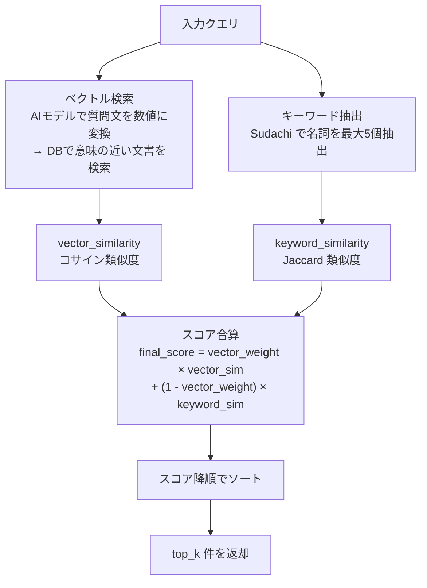

# 回答支援AI（類似回答検索）

問い合わせ履歴データ（FAQ）およびチャットボットのシナリオデータから、類似する質問・回答を検索するシステム。

## 概要

### 背景

問い合わせ対応チームが受ける質問に対し、過去の問い合わせ履歴やシナリオボットのデータから類似回答を提示し、回答作成を支援するために開発されたシステム。

### 目的

- ユーザーの質問に対して、既存の問い合わせ履歴（FAQ）やチャットボットのシナリオから、意味やキーワードが近い質問・回答を検索
- 業務分野ごとに独立した検索用データベース（ChromaDB）を使用し、意味検索とキーワード検索を組み合わせた方式（ハイブリッド検索）で精度を確保

### 実行モード

| モード | 用途 | エントリーポイント |
|--------|------|-------------------|
| バッチ | Excel入力 → 一括検索 → Excel出力 | `apps/answer-support/main.py` |
| Streamlit UI | 対話形式でリアルタイム検索 | `apps/answer-support/ui/chat.py` |
| プレフライト | DB更新可否の事前検証（本番更新なし） | `apps/answer-support/main.py preflight` |

---

## 処理フロー

### ハイブリッド検索（意味検索 + キーワード検索の組み合わせ）

文章の意味の近さで検索する方式（ベクトル検索）と、共通する単語の一致で検索する方式（キーワード検索）の結果を、重み付けして合算する方式です。



### 検索モード

| モード | 説明 |
|--------|------|
| `original` | 原文をそのままクエリとしてハイブリッド検索（デフォルト） |
| `llm_enhanced` | LLM（大規模言語モデル）でクエリを拡張・要約してからハイブリッド検索 |

> **Note:** `original` がデフォルトの理由: LLM拡張（`llm_enhanced`）は要約により固有名詞が落ちるケースがあり、原文検索の方が精度が高い場合が多いため。

> **Note:** `DEFAULT_LLM_PROVIDER` / `DEFAULT_LLM_MODEL` は全モードで起動時に必須です（`SearchConfig` のバリデーション）。ただし、LLM API の呼び出しが発生するのは `llm_enhanced` モードのみです。`GEMINI_PROJECT_ID` + GCP認証も `llm_enhanced` 使用時に必須となります。

### スコア計算式

```
final_score = vector_weight x vector_similarity + (1 - vector_weight) x keyword_similarity
```

- `vector_weight`: デフォルト 0.9（`settings.yaml` で変更可能、UI ではスライダーで動的調整）
- `vector_similarity`: AIモデルが算出する意味的な近さの指標（コサイン類似度、0.0 - 1.0）
- `keyword_similarity`: 共通キーワードの割合で算出する一致度（Jaccard 類似度、Sudachi で名詞を抽出）
- `keyword_weight`: 1.0 - `vector_weight` で自動計算（手動設定不可）。デフォルト 0.1
- 最終スコアは 0.0 - 1.0 にクリップ

---

## DB構造

### 業務分野

| 業務分野 | DB名 | 内容 |
|---------|------|------|
| 内部事務 | `naibujimu` | 預金+総則の問い合わせ履歴（FAQ）+ naibujimu-bot シナリオ |
| スマイル | `smile` | スマイルの問い合わせ履歴（FAQ）+ smile-bot シナリオ |

> **Note:** Q&A結合ベクトル化の理由 — 問い合わせ履歴の質問文は営業店担当者が書いており、同じ趣旨でも表現にばらつきが大きい（例: 「旧姓の印鑑を登録してもいいか」と「印鑑諸届情報登録100設定は必要か」）。質問文だけをベクトル化すると、表現が異なるケースで検索にかからない。一方、回答文には質問の意図を的確に言い換えた表現が含まれるため（例: 「旧姓であれば問題ない」）、回答文も含めてベクトル化することで意味的な一致率が向上する。

### 埋め込みプロバイダー

2つのプロバイダー（Azure OpenAI / VertexAI）に対応。モデル・次元数の詳細は [CONFIGURATION.md](./CONFIGURATION.md#環境変数一覧) を参照。

`build_db.py` は両プロバイダーの DB を構築する。実行時は `DEFAULT_EMBEDDING_PROVIDER` 環境変数に一致するプロバイダーの DB が使用される。

### ディレクトリ構成

- **DB**: `data/vector_db/{業務分野名}/{プロバイダー}/chroma.sqlite3`
- **FAQ**: `data/source/faq/latest/{日本語業務名}_履歴データ_YYYYMMDD.xlsx`
- **シナリオ**: `data/source/scenarios/latest/{日本語業務名}_シナリオデータ_YYYYMMDD.xlsx`
- **入力**: `data/input/`、**出力**: `data/output/latest/answer/`

全体のディレクトリ構造は [README.md](../README.md#ディレクトリ構造) を参照。

---

## 使用方法

### バッチ処理

入力 Excel を一括処理して結果を Excel に出力する。

```bash
cd rag-local
python apps/answer-support/main.py                              # 全業務分野
python apps/answer-support/main.py --business naibujimu          # 特定業務分野のみ
python apps/answer-support/main.py --business naibujimu --limit 10  # 件数制限
```

#### コマンドライン引数

| 引数 | 説明 | デフォルト |
|------|------|-----------|
| `--business` | 対象の業務分野（`naibujimu`, `smile`） | 全業務分野 |
| `--limit` | 処理する入力データの件数上限 | 無制限 |

> **Note:** バッチ処理の検索対象は CLI 引数では変更できません。`config/settings.yaml` の `common.search_source`（`scenario` / `history_data`、デフォルト: `history_data`）を編集してください。UI ではサイドバーで動的に切替可能です。

> **Note:** バッチ処理実行時、DB は自動更新されます。実行フロー:
> 1. `run_db_update()` で参照ファイル（`data/source/` 配下の FAQ Excel / シナリオ Excel）の**ファイル更新日時**を `data/vector_db/update_timestamps.json` の記録と比較
> 2. ファイル未更新 + DB既存 → スキップ（埋め込みAPI呼び出しなし = コスト発生なし）
> 3. ファイル更新あり or DB未存在 → 埋め込みAPIを呼び出してDB構築/更新
> 4. DB 更新完了後、バッチ処理を開始
>
> UI（インタラクティブ）モードでは DB更新を実行しません。

#### 入力ファイル仕様

**配置先**: `data/input/`

**ファイル命名規則**: `{業務分野名}_{YYYYMMDD}.xlsx`
- `{業務分野名}`: `config/business_areas.yaml` に登録されている名前。日本語名（例: `スマイル`）でも英語名（例: `smile`）でも可。日本語名は英語DB名に自動変換される
- `{YYYYMMDD}`: データ日付。同一業務分野に複数ファイルがある場合、最新日付のファイルが使用される
- 正規表現: `^([^_]+)_(\d{8})\.xlsx$`

**列構成**（位置ベース検出 — 列名は任意）:

| 位置 | 用途 | 必須 |
|------|------|------|
| 1列目 | 番号（入力番号） | 必須 |
| 2列目 | 質問文（検索クエリとして使用） | 必須 |
| 3列目 | 回答文（出力に転記、検索には不使用） | 任意 |

> **Note:** 列名は位置で判断されるため、ヘッダー行の文字列は任意です。

#### 出力ファイル

- **出力先**: `data/output/latest/answer/answer_batch_YYYYMMDD_HHMMSS.xlsx`

### Streamlit UI

対話形式で検索を実行する。

```bash
streamlit run apps/answer-support/ui/chat.py          # 直接起動
python apps/answer-support/main.py interactive         # main.py 経由
```

#### UI機能

| 機能 | 説明 |
|------|------|
| 業務分野選択 | DB に存在する業務分野をプルダウンで選択 |
| ベクトル重み調整 | スライダーで vector_weight を 0.0 - 1.0 の範囲で動的変更 |
| 検索モード切替 | 原文検索（original） / LLMクエリ検索（llm_enhanced） |
| 検索対象切替 | シナリオのみ（scenario） / 問い合わせ履歴データのみ（history_data） |
| 候補数設定 | 表示する類似候補数（1 - 10） |
| チャット履歴保存 | チャット履歴を Excel ファイルとして保存 |

> **Note:** UI 内で変更したパラメータ（ベクトル重み、検索モード等）は、セッション内のメモリのみに保持されます。
> `config/settings.yaml` には保存されないため、UI を閉じると変更は失われます。永続化が必要な場合は、YAML を直接編集してください。

> **Note:** チャット履歴とバッチ出力で列構成が異なります:
> - チャット履歴: 8列（`Original_Answer`, `Scenario_ID`, `Sheet_Name`, `Row_Index` を省略）
> - バッチ出力: 12列（全列を含む詳細分析用）

### プレフライト検証

DB更新の事前検証を実行する（本番のDB更新は行わない）。

```bash
cd rag-local
python apps/answer-support/main.py preflight                          # 全業務分野
python apps/answer-support/main.py preflight --business naibujimu     # 特定業務分野
python apps/answer-support/main.py preflight --sample-size 10         # サンプル件数変更
```

#### プレフライト引数

| 引数 | 説明 | デフォルト |
|------|------|-----------|
| `--business` | 対象の業務分野（`naibujimu`, `smile`） | 全業務分野 |
| `--sample-size` | 検証に使うサンプル件数 | 5 |

---

## DB構築

統合スクリプト `scripts/build_db.py` で回答支援AI用 DB を構築する。セットアップ手順・全コマンドは [README.md の Step 5](../README.md#step-5-db構築) を参照。

回答支援AI固有のオプション:

```bash
# 回答支援AI用DBのみ構築（改定別を除外、未構築 or 更新時のみ）
python scripts/build_db.py --no-revisions

# 強制再構築（既存DBを削除して全再構築）
python scripts/build_db.py --no-revisions --force
```

> **注意**: DB構築中は Streamlit UI を停止してください（ChromaDB のファイルロック競合を防止）。

---

## 業務分野の追加

新しい業務分野（例: 「為替」）を追加する手順。コード変更は不要で、設定ファイルとデータファイルの配置だけで完結する。

### Step 1: マッピング登録

`config/business_areas.yaml` の `mappings` に日本語名→英語名の対応を追加する。

```yaml
mappings:
  為替: kawase
```

ChromaDB コレクション名の制約: 英数字・`.`・`_`・`-` のみ、3-512文字。

### Step 2: 参照データの配置

`data/source/faq/latest/` や `data/source/scenarios/latest/` にファイルを配置する。命名規則: `{日本語業務名}_{データ種別}_{YYYYMMDD}.xlsx`（例: `為替_履歴データ_20260601.xlsx`）。FAQ・シナリオの片方だけでも可。

### Step 3: DB構築

```bash
# Streamlit UI を停止してから実行（ChromaDB ファイルロック競合防止）
python scripts/build_db.py --business kawase
python scripts/check_db_content.py  # ドキュメント数が 0 でないことを確認
```

### Step 4: 入力ファイルの作成

バッチ処理用の入力ファイル: `data/input/kawase_20260601.xlsx`（列: 番号, 質問内容, 既存回答）。入力ファイル名は英語DB名（`kawase`）を使用する。参照データは日本語名（`為替`）、入力ファイルは英語名という非対称に注意。

### Step 5: 動作確認

```bash
python apps/answer-support/main.py --business kawase --limit 3
```

### コード変更が不要な理由

- `analyze_reference_files()` が `data/source/` を走査してファイル名から業務分野を自動検出する
- `BusinessAreaTranslator` が YAML マッピングで日本語→英語を変換する
- `extract_business_area_from_input()` が入力ファイル名から業務分野を抽出する
- DB パスは `data/vector_db/{英語名}/{provider}/` に自動生成される

---

## 出力ファイル

### 出力先

- バッチ: `data/output/latest/answer/answer_batch_YYYYMMDD_HHMMSS.xlsx`
- チャット履歴: `data/output/latest/answer/answer_chat_YYYYMMDD_HHMMSS.xlsx`

### バッチ出力 Excel 列構成

| 列名（内部キー） | 表示名 | 説明 |
|-----------------|--------|------|
| `Input_Number` | # | 入力番号 |
| `Original_Query` | ユーザーの質問 | 入力された質問文 |
| `Original_Answer` | ユーザーの回答 | 入力された回答文（存在する場合） |
| `Search_Query` | 検索クエリ | 実際に検索に使用したクエリ（LLM拡張時は拡張後） |
| `Search_Result_Q` | 類似質問 | 検索結果の質問文（シナリオの場合は階層パス付き） |
| `Search_Result_A` | 類似回答 | 検索結果の回答文 |
| `Similarity` | 類似度 | ハイブリッドスコア（0.0 - 1.0） |
| `Scenario_ID` | Scenario_ID | シナリオID（`{シート名}_{行番号}` 形式） |
| `Sheet_Name` | Sheet_Name | 元シナリオのシート名 |
| `Row_Index` | Row_Index | 元シナリオの行番号 |
| `Vector_Weight` | ベクトルの重み | 使用した vector_weight 値 |
| `Top_K` | 候補数 | 返却件数上限 |

Metadata シートに検索パラメータ（vector_weight, keyword_weight, search_mode, search_type, top_k, embedding_provider, embedding_model, timestamp）を記録する。

---

## 設定パラメータ

`config/settings.yaml` で検索パラメータ（vector_weight, search_mode, search_source, top_k 等）を設定する。詳細は [CONFIGURATION.md](./CONFIGURATION.md) を参照。

---

## トラブルシューティング

`docs/TROUBLESHOOTING.md` を参照。
