# 運用保守効率化AI 導入手順書

**版数**: 1.0

**作成日**: 2026/3/3

**作成者**: B&DX 作田

**関連文書**: 検索設計書

---

## 1. 概要

### 1.1 本手順書の位置づけ

本手順書は、運用保守効率化AI（事務改定影響調査システム）をAzure環境に
導入するための構築手順を記載する。新規環境にゼロから構築する場合を想定しており、
全14ステップを順番に実行することで、Teams Bot による事務改定影響調査システムが稼働する。

> **実行方針:** 本手順書は **Azure CLI での実行を基本**とする。各ステップでは CLI コマンドを主手順として記載し、Azure ポータルの操作手順はあくまで**参考情報**として併記している。CLI で実行できない操作（VS Code 拡張機能の GUI 操作、Teams 管理センターでの承認等）のみポータル手順を主手順とする。
> `scripts/` 配下の JSON 定義ファイルは PoC 環境（`*-poc`）の値を含むサンプルである。他環境に導入する場合は Step 11 の置換項目を変更してから実行すること。

| 項目 | 内容 |
| ------ | ------ |
| 対象読者 | デジタル戦略部 AIソリューション推進室、エッジテクノロジー |
| 前提知識 | Azure Portal の基本操作、Azure CLI の利用経験 |
| 所要時間 | Step 1〜11（環境構築）: 約3〜4時間（Indexer ベクトル化待ち時間含む）、Step 12〜14（Bot実装・デプロイ・テスト）: 約1〜2時間 |
| 関連文書 | 検索設計書 |

### 1.2 目的

本手順書は、Azure環境のリソース作成・設定・Bot実装・動作確認までの一連の手順を記載する。

### 1.3 構築対象リソース

| # | リソース | SKU/プラン | 用途 |
|---|---------|-----------|------|
| 1 | リソースグループ | — | 全リソースの論理グループ |
| 2 | Azure OpenAI | Standard S0 | text-embedding-3-large（3,072次元） |
| 3 | Azure AI Search | Basic | ハイブリッド検索、Semantic Ranker、Indexer |
| 4 | Cosmos DB | Serverless（NoSQL API） | シナリオ・FAQ・影響判定マスタデータ |
| 5 | Application Insights | — | 監視・ログ |
| 6 | App Service（Web App） | Basic B1 | Botバックエンド |
| 7 | Azure Bot Service | F0（Free） | Teamsチャネル登録（Single-Tenant）— CLIで手動作成（Step 8） |

### 1.4 全体構築フロー

| Step | 内容 |
|------|------|
| 1 | リソースグループ作成 |
| 2 | Azure OpenAI 作成 + Embeddingモデルデプロイ |
| 3 | Azure AI Search 作成 + Semantic Ranker有効化 |
| 4 | Cosmos DB 作成 + コンテナ作成 |
| 5 | Application Insights 作成 |
| 6 | App Service (Web App) 作成 + Managed Identity有効化 |
| 7 | M365 Agents Toolkit セットアップ + Provision（Entra IDアプリ登録 + Developer Portal登録のみ） |
| 8 | Azure Bot リソース作成 + Teamsチャネル追加 |
| 9 | サービスプリンシパル作成 |
| 10 | Managed Identityロール付与 + Graph API権限付与（SPO連携用） |
| 11 | AI Search インデックス・データソース・Skillset・Indexer設定 |
| 12 | Botアプリケーション実装 + App Settings設定 + Toolkit Deploy |
| 13 | マニフェスト修正 + Teamsアプリ登録（Publish）+ 管理センター承認 |
| 14 | 動作確認（F5ローカルデバッグ + 本番テスト） |

---

## 2. 前提条件

### 2.1 Azureサブスクリプション

| 項目 | 要件 |
|------|------|
| サブスクリプション | 有効なAzureサブスクリプション |
| 権限 | サブスクリプションの「所有者」または「共同作成者」ロール |
| リージョン | Japan East（東日本）を推奨。Semantic RankerとAzure OpenAIが利用可能であること |
| Azure OpenAI利用申請 | 事前にAzure OpenAIの利用申請が承認済みであること（※Enterprise Agreement契約の場合は申請不要） |

> **補足:** Step 14 のテストデータ変換では rag-local プロジェクトの Excel データファイルを参照する。事前にセットアップ済みであること。

### 2.2 Microsoft 365 / Teams

| 項目 | 要件 |
|------|------|
| Microsoft 365ライセンス | Teams利用可能なライセンス |
| Teams管理者権限 | カスタムアプリのサイドロードが許可されていること |
| Teams管理センター権限 | カスタムアプリの承認・公開権限（Teams管理者ロール） |
| Entra ID | アプリ登録の権限（アプリケーション管理者以上） |

### 2.3 開発環境

| ツール | バージョン | 用途 |
|--------|----------|------|
| Azure CLI | 2.64以上 | リソース作成・ロール付与（Cosmos DB データプレーンロール付与に必要） |
| Node.js | 20 LTS以上 | Botアプリケーション開発 |
| Visual Studio Code | 1.90以降 | 開発エディタ（M365 Agents Toolkit v6 対応版） |
| M365 Agents Toolkit拡張機能 | 最新版 | VS Code拡張（旧Teams Toolkit） |
| Python | 3.10以上 | データ変換スクリプト（Step 14 で使用。本環境では 3.13.5 で実行） |

### 2.4 命名規則

本手順書では以下の命名規則を使用する。`<env>`は環境を示す識別子（例: `poc`）に置き換えること。

| リソース | 命名例 |
|---------|--------|
| リソースグループ | `rg-maintenance-<env>` |
| Azure OpenAI | `aoai-maintenance-<env>` |
| Azure AI Search | `srch-maintenance-<env>` |
| Cosmos DB | `cosmos-maintenance-<env>` |
| Application Insights | `appi-maintenance-<env>` |
| App Service Plan | `asp-maintenance-<env>` |
| Web App | `app-maintenance-bot-<env>` |
| Azure Bot Service | `bot-maintenance-<env>` |

---

## Step 1: リソースグループ作成

```bash
az group create \
  --name rg-maintenance-poc \
  --location japaneast
```

**（参考）Azureポータルでの操作:**

1. Azure Portal（[https://portal.azure.com](https://portal.azure.com)）にサインイン
2. 「リソースグループ」→「作成」を選択
3. 以下を入力:

| 項目 | 値 |
|------|-----|
| サブスクリプション | 対象サブスクリプション |
| リソースグループ名 | `rg-maintenance-poc` |
| リージョン | Japan East |

4. 「確認および作成」→「作成」を選択

---

## Step 2: Azure OpenAI リソース作成

### リソース作成

```bash
az cognitiveservices account create \
  --name aoai-maintenance-poc \
  --resource-group rg-maintenance-poc \
  --kind OpenAI \
  --sku S0 \
  --location japaneast
```

**（参考）Azureポータルでの操作:**

1. Azure Portal →「リソースの作成」→「Azure OpenAI」を検索
2. 以下を入力:

| 項目 | 値 |
|------|-----|
| サブスクリプション | 対象サブスクリプション |
| リソースグループ | `rg-maintenance-poc` |
| リージョン | Japan East |
| 名前 | `aoai-maintenance-poc` |
| 価格レベル | Standard S0 |

3. ネットワーク: 「すべてのネットワーク」（検証環境のため。本番ではプライベートエンドポイント推奨）
4. 「確認して作成」→「作成」

### Embeddingモデルのデプロイ

```bash
az cognitiveservices account deployment create \
  --name aoai-maintenance-poc \
  --resource-group rg-maintenance-poc \
  --deployment-name text-embedding-3-large \
  --model-name text-embedding-3-large \
  --model-version "1" \
  --model-format OpenAI \
  --sku-capacity 120 \
  --sku-name Standard
```

| パラメータ | 値 | 備考 |
| --------- | --- | ---- |
| `--deployment-name` | `text-embedding-3-large` | AI SearchのSkillset/Vectorizer設定で使用 [15] |
| `--model-version` | `"1"` | リージョンで利用可能な最新バージョンを指定 |
| `--sku-capacity` | `120` | TPMレート制限（120K）。Indexer実行中のスロットリング回避のため高めに設定 |
| `--sku-name` | `Standard` | Standard デプロイ |

**注意:** デプロイ名はAI SearchのSkillset/Vectorizer設定で使用するため、正確に記録すること [15]。

**（参考）Azureポータルでの操作:**

1. 作成したAzure OpenAIリソースに移動
2. 「モデルデプロイ」→「デプロイの管理」→ Azure AI Foundry（旧Azure OpenAI Studio）が開く
3. 「デプロイ」→「モデルのデプロイ」→「基本モデルをデプロイする」を選択
4. モデル: `text-embedding-3-large`、デプロイ名: `text-embedding-3-large`、種類: Standard、TPM: 120K
5. 「デプロイ」を選択

### 確認事項

- [ ] リソースが正常に作成された
- [ ] エンドポイントURLを記録した（例: `https://aoai-maintenance-poc.openai.azure.com/`）
- [ ] Embeddingモデルがデプロイ済み
- [ ] デプロイ名を記録した

---

## Step 3: Azure AI Search 作成

### リソース作成

```bash
az search service create \
  --name srch-maintenance-poc \
  --resource-group rg-maintenance-poc \
  --sku basic \
  --location japaneast
```

**（参考）Azureポータルでの操作:**

1. Azure Portal →「リソースの作成」→「Azure AI Search」を検索
2. 以下を入力:

| 項目 | 値 |
|------|-----|
| サブスクリプション | 対象サブスクリプション |
| リソースグループ | `rg-maintenance-poc` |
| サービス名 | `srch-maintenance-poc` |
| 場所 | Japan East |
| 価格レベル | **Basic** |

3. 「確認して作成」→「作成」

**価格レベルにBasic以上を選択する理由:**
Semantic RankerはAI Search **Basic SKU以上**で利用可能 [17]。AI SearchのFree SKUではSemantic Rankerを使用できない。

### APIアクセス制御の設定（RBAC有効化）

BotアプリがManaged IdentityでAI Searchにアクセスするため、ロールベースのアクセス制御（RBAC）を有効化する。デフォルトはAPIキーのみ許可のため、この設定を行わないとRBAC認証で403エラーになる。

```bash
az search service update \
  --name srch-maintenance-poc \
  --resource-group rg-maintenance-poc \
  --auth-options aadOrApiKey \
  --aad-auth-failure-mode http401WithBearerChallenge
```

**（参考）Azureポータルでの操作:**

1. AI Searchリソース →「設定」→「キー」を選択
2. 「APIアクセス制御」セクションで「**両方**」を選択（APIキーとロールベースの両方を許可）
3. 「はい」を押下して確認

**注記:** `aadOrApiKey` はRBAC認証（Azure AD/Entra ID）とAPIキー認証の両方を許可する設定 [7]。

> **⚠️ 注意:** 本番環境で API キーを完全に無効化する場合は `--disable-local-auth true` を使用する（`--auth-options` とは排他）。
> ただし、Step 11 の AI Search REST API 操作（インデックス作成等）では管理キーによる認証を使用するため、
> **環境構築が完了するまでは API キー認証を無効化しないこと。**

### Semantic Rankerの有効化

> **補足:** ここでの「Freeプラン」はSemantic Ranker機能の課金プラン（月1,000クエリまで無料）であり、AI SearchのSKU（Basic）とは別の設定である。

```bash
az search service update \
  --name srch-maintenance-poc \
  --resource-group rg-maintenance-poc \
  --semantic-search free
```

**（参考）Azureポータルでの操作:**

1. 作成したAI Searchリソースに移動
2. 左メニュー →「Settings」→「Premium features」を選択
3. **Free**プランを選択（検証段階では月1,000クエリ以内のため十分）
4. 「プランの選択」を押下

**注記:** Semantic RankerのFreeプランは月1,000クエリまで [17]。超過した場合はStandardプラン（従量課金）に切り替え可能。検証規模ではFreeプランで十分。

### Managed Identity（システム割り当て）の有効化

AI SearchのIndexerがCosmos DBに接続する際にManaged Identityを使用するため、有効化する。

```bash
az search service update \
  --name srch-maintenance-poc \
  --resource-group rg-maintenance-poc \
  --identity-type SystemAssigned
```

**（参考）Azureポータルでの操作:**

1. AI Searchリソース →「設定」→「ID」を選択
2. 「システム割り当て」タブ →「状態」を**オン**に切り替え
3. 「保存」を選択

### 確認事項

- [ ] AI Searchリソースが正常に作成された（Basic SKU）
- [ ] APIアクセス制御が「両方」に設定された（RBAC + APIキー）
- [ ] Semantic Rankerが有効化された（Freeプラン）
- [ ] システム割り当てManaged Identityが有効
- [ ] サービスURLを記録した（例: `https://srch-maintenance-poc.search.windows.net`）
- [ ] 管理キーを記録した（Step 11 の REST API 操作で使用）

---

## Step 4: Cosmos DB 作成

### リソース作成

```bash
az cosmosdb create \
  --name cosmos-maintenance-poc \
  --resource-group rg-maintenance-poc \
  --locations regionName=japaneast \
  --capabilities EnableServerless
```

**（参考）Azureポータルでの操作:**

1. Azure Portal →「リソースの作成」→「Azure Cosmos DB」を検索
2. 「Azure Cosmos DB for NoSQL」を選択 →「作成」
3. 以下を入力:

| 項目 | 値 |
|------|-----|
| サブスクリプション | 対象サブスクリプション |
| リソースグループ | `rg-maintenance-poc` |
| アカウント名 | `cosmos-maintenance-poc` |
| 場所 | Japan East |
| 容量モード | **サーバーレス** |

4. 「確認して作成」→「作成」

### データベースとコンテナの作成

Cosmos DBリソース作成後、データベースとコンテナを作成する。

| コンテナ名 | パーティションキー | 用途 |
|-----------|-----------------|------|
| `scenarios` | `/categoryId` | シナリオマスタデータ |
| `faqs` | `/categoryId` | FAQマスタデータ |
| `impactAssessments` | `/searchId` | 要修正フラグの判定記録 |

```bash
# データベース作成
az cosmosdb sql database create \
  --account-name cosmos-maintenance-poc \
  --resource-group rg-maintenance-poc \
  --name maintenance-db

# scenariosコンテナ
az cosmosdb sql container create \
  --account-name cosmos-maintenance-poc \
  --resource-group rg-maintenance-poc \
  --database-name maintenance-db \
  --name scenarios \
  --partition-key-path /categoryId

# faqsコンテナ
az cosmosdb sql container create \
  --account-name cosmos-maintenance-poc \
  --resource-group rg-maintenance-poc \
  --database-name maintenance-db \
  --name faqs \
  --partition-key-path /categoryId

# impactAssessmentsコンテナ
az cosmosdb sql container create \
  --account-name cosmos-maintenance-poc \
  --resource-group rg-maintenance-poc \
  --database-name maintenance-db \
  --name impactAssessments \
  --partition-key-path /searchId
```

**（参考）Azureポータルでの操作:**

1. 「データ エクスプローラー」→「New Database」→ Database id: `maintenance-db`
2. `maintenance-db`を右クリック →「New Container」
3. Container id と Partition key を上表の通り入力 →「OK」を選択
4. 3つのコンテナすべてについて繰り返す

### Soft Delete検知用プロパティの確認

`scenarios`と`faqs`コンテナのドキュメントには`isDeleted`フィールドを含める。AI Search Indexerはこのフィールドを参照してSoft Delete検知を行う。データ投入時にデフォルト値`false`を設定すること。

### 確認事項

- [ ] Cosmos DBアカウントが正常に作成された（Serverless）
- [ ] `maintenance-db`データベースが作成された
- [ ] 3つのコンテナが作成された（`scenarios`, `faqs`, `impactAssessments`）
- [ ] エンドポイントURLを記録した（例: `https://cosmos-maintenance-poc.documents.azure.com:443/`）

---

## Step 5: Application Insights 作成

```bash
az monitor app-insights component create \
  --app appi-maintenance-poc \
  --location japaneast \
  --resource-group rg-maintenance-poc \
  --application-type web
```

作成後、「接続文字列」を記録（Botアプリケーション設定で使用）:

```bash
az monitor app-insights component show \
  --app appi-maintenance-poc \
  --resource-group rg-maintenance-poc \
  --query connectionString -o tsv
```

**（参考）Azureポータルでの操作:**

1. Azure Portal →「リソースの作成」→「Application Insights」を検索
2. 以下を入力:

| 項目 | 値 |
|------|-----|
| サブスクリプション | 対象サブスクリプション |
| リソースグループ | `rg-maintenance-poc` |
| 名前 | `appi-maintenance-poc` |
| リージョン | Japan East |
| ワークスペース | 既存のLog Analyticsワークスペース、またはデフォルト |

3. 「確認して作成」→「作成」
4. 作成後、「概要」画面で「接続文字列」を記録

---

## Step 6: App Service (Web App) 作成

### App Serviceプランの作成

```bash
# App Serviceプラン作成
az appservice plan create \
  --name asp-maintenance-poc \
  --resource-group rg-maintenance-poc \
  --sku B1 \
  --is-linux

# Web App作成
az webapp create \
  --name app-maintenance-bot-poc \
  --resource-group rg-maintenance-poc \
  --plan asp-maintenance-poc \
  --runtime "NODE:20-lts"
```

**（参考）Azureポータルでの操作:**

1. Azure Portal →「リソースの作成」→「App Service」を検索
2. 以下を入力:

| 項目 | 値 |
|------|-----|
| サブスクリプション | 対象サブスクリプション |
| リソースグループ | `rg-maintenance-poc` |
| 名前 | `app-maintenance-bot-poc` |
| 公開 | コード |
| ランタイムスタック | Node 20 LTS |
| オペレーティングシステム | Linux |
| 地域 | Japan East |
| App Serviceプラン | 新規作成: `asp-maintenance-poc`、SKU: **Basic B1** |

3. 「確認して作成」→「作成」

### システム割り当てManaged Identityの有効化

```bash
az webapp identity assign \
  --name app-maintenance-bot-poc \
  --resource-group rg-maintenance-poc
```

出力の`principalId`がオブジェクトID（Step 10のロール付与で使用）。

**（参考）Azureポータルでの操作:**

1. 作成したWeb Appに移動
2. 左メニュー →「設定」→「ID」
3. 「システム割り当て」タブ → 状態を**オン**
4. 「保存」→ 確認ダイアログで「はい」
5. 表示される**オブジェクトID（プリンシパルID）** を記録（ロール付与で使用）

### アプリケーション設定

> **注記:** アプリケーション設定（環境変数）は **Step 12** で Bot 実装・Deploy と合わせて設定する。この時点では BOT_ID が未確定のため、設定は不要。

### 確認事項

- [ ] Web Appが正常に作成された（Node 20 LTS, Linux, B1）
- [ ] Managed Identityが有効化され、オブジェクトIDを記録した
- [ ] メッセージングエンドポイントURL: `https://app-maintenance-bot-poc.azurewebsites.net/api/messages`

---

## Step 7: M365 Agents Toolkit セットアップ + Provision

本ステップでは、VS CodeのM365 Agents Toolkit拡張機能 [1] を使用して、以下を自動化する:

- Entra IDアプリ登録（Single-Tenant）+ クライアントシークレット生成
- Bot Framework Developer Portal への登録
- Teamsアプリ登録・パッケージ化

> **重要:** Toolkit の Provision は **Azure Bot リソース（`Microsoft.BotService/botServices`）を作成しない**。Developer Portal への登録のみ行う。Azure Bot リソースの作成は **Step 8** で別途行う。

**注記:** Multi-Tenant構成は2025年7月31日以降、新規作成が非推奨となった。本手順ではSingle-Tenant + クライアントシークレット構成を使用する。本番環境では User-Assigned Managed Identity への移行を推奨する。

### VS Code拡張機能のインストール

1. VS Codeの拡張機能マーケットプレイス（Ctrl+Shift+X）を開く
2. 「Microsoft 365 Agents Toolkit」を検索
3. インストール後、VS Codeを再読み込み
4. 左サイドバーに**M365 Agents Toolkit アイコン**が表示されることを確認

**参考:** [M365 Agents Toolkit - Visual Studio Marketplace](https://marketplace.visualstudio.com/items?itemName=TeamsDevApp.ms-teams-vscode-extension) [1]

### Azureアカウントのサインイン

1. 左サイドバーの **M365 Agents Toolkit アイコン**をクリック
2. 「ACCOUNTS」セクションで **Azure にサインイン**（`<管理者アカウント>`、サブスクリプションの所有者/共同作成者権限）
3. サインイン完了後、サブスクリプション名「**対象サブスクリプション名**」が表示されることを確認

**参考:** ACCOUNTSセクションの画面イメージは [公式ドキュメント（Explore Agents Toolkit）](https://learn.microsoft.com/en-us/microsoftteams/platform/toolkit/explore-agents-toolkit) を参照。

> **注意:** Microsoft 365 へのサインインはこの時点では不要。Provision実行時（後続の「Provision実行」セクション）に求められるため、そのタイミングで行う。

### プロジェクト作成

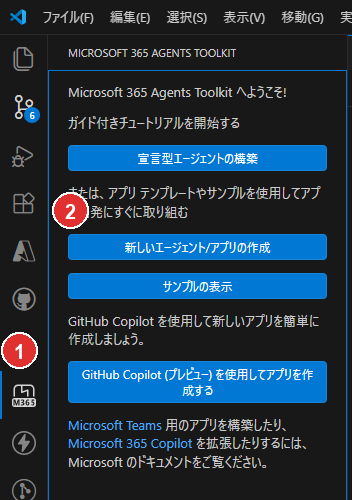

> **図の説明:** (1) M365 Agents Toolkit アイコン (2)「新しいエージェント/アプリの作成」ボタン

プロジェクトタイプ → テンプレート → 言語 → フォルダ → アプリ名の順に選択する。

1. M365 Agents Toolkit サイドバーで「**新しいエージェント/アプリの作成**」（Create a New Agent/App）をクリック
2. プロジェクトタイプ選択: **Custom Engine Agent**（AI Agentグループ内）
3. テンプレート選択: **Basic Custom Engine Agent**（M365 Agents SDKテンプレート）
4. LLMサービス選択: **Azure OpenAI** を選択し、以下を入力（※後で`m365agents.yml`カスタマイズ時に変更するため仮値で可）:
   - Azure OpenAI Key: 任意の文字列で可（例: `dummy`）
   - Azure OpenAI Endpoint: `https://aoai-maintenance-poc.openai.azure.com/`（正式値を入力）
   - Model Name: `text-embedding-3-large`
5. プログラミング言語: **TypeScript**
6. Default folder: `<任意のフォルダ>`
7. Application Name: `maintenance-bot`

> **補足:** テンプレート選択時の全体構造は以下の通り。本システムではBotアプリからAzure OpenAIを直接呼び出さない方針（EmbeddingはすべてAI Search経由で実行）だが、M365 Agents SDKベースのプロジェクト構造を得るためCustom Engine Agentを選択する。LLM接続部分はStep 7「m365agents.yml のカスタマイズ」で削除・変更する。
>
> - **AI Agent** → Declarative Agent（No plugin / With API Plugin）
> - **AI Agent** → **Custom Engine Agent**（**Basic Custom Engine Agent** / Weather Agent）← 本手順で選択
> - **AI Agent** → Copilot Connector（Graph Connector）
> - **Apps for Microsoft 365** → Teams Agents and Apps（General Teams Agent / Simple Bot 等）
> - **Apps for Microsoft 365** → Office Add-in（Excel / Word / Outlook）

**生成されるプロジェクト構造（Toolkit v6系）:**

```
maintenance-bot/
├── .vscode/
│   ├── extensions.json
│   ├── launch.json            # デバッグプロファイル
│   ├── settings.json
│   └── tasks.json             # ビルド/デバッグタスク
├── appPackage/
│   ├── manifest.json          # Teamsアプリマニフェスト（${{変数名}}プレースホルダー）
│   ├── color.png              # カラーアイコン（192x192）
│   └── outline.png            # アウトラインアイコン（32x32）
├── infra/
│   ├── azure.bicep            # Azureリソース定義
│   ├── azure.parameters.json  # パラメータファイル
│   └── botRegistration/
│       └── azurebot.bicep     # Bot Service定義
├── env/
│   ├── .env.local             # ローカル環境変数
│   ├── .env.local.user        # ローカル機密情報（gitignore済み）
│   ├── .env.dev               # リモート環境変数
│   ├── .env.dev.user          # リモート機密情報（gitignore済み）
│   ├── .env.playground        # Playground環境
│   ├── .env.playground.user
│   ├── .env.sandbox           # Sandbox環境
│   └── .env.sandbox.user
├── src/
│   ├── index.ts               # エントリポイント（Express server）
│   ├── agent.ts               # エージェントロジック（LLM呼出し）
│   └── config.ts              # 設定読み込み
├── m365agents.yml             # メインライフサイクル定義（provision/deploy/publish）
├── m365agents.local.yml       # ローカルデバッグ用オーバーライド
├── m365agents.playground.yml  # Playground用
├── m365agents.sandbox.yml     # Sandbox用
├── .webappignore              # デプロイ除外設定
├── web.config                 # IIS設定（Azure App Service用）
├── package.json
└── tsconfig.json
```

> **注意:** Toolkit v6系（M365 Agents Toolkit）ではライフサイクル定義ファイルが旧`teamsapp.yml`から**`m365agents.yml`**に改名されている。

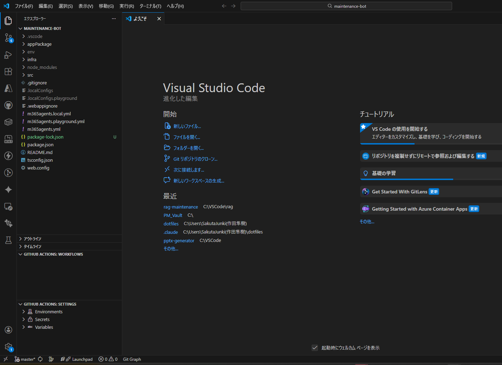

### 依存パッケージのインストール

プロジェクト作成直後に依存パッケージをインストールする:

```bash
cd maintenance-bot
npm install
```

正常に完了すると約226パッケージがインストールされる。`found 0 vulnerabilities` と表示されればOK。

### m365agents.yml のカスタマイズ（既存リソース参照）

生成されたデフォルトの`m365agents.yml`を編集し、Step 1〜6で作成済みのリソースを使用するようカスタマイズする [14]。

> **注意:** Toolkit v6系では旧`teamsapp.yml`が`m365agents.yml`に改名されている [1]。

**m365agents.yml の provision セクション:**

```yaml
provision:
  # 1. Entra IDアプリ登録（Single-Tenant）+ クライアントシークレット自動生成
  - uses: botAadApp/create
    with:
      name: app-maintenance-bot-poc
    writeToEnvironmentFile:
      botId: BOT_ID
      botPassword: SECRET_BOT_PASSWORD

  # 2. Bot Framework登録 + Teamsチャネル有効化
  - uses: botFramework/create
    with:
      botId: ${{BOT_ID}}
      name: bot-maintenance-poc
      messagingEndpoint: https://app-maintenance-bot-poc.azurewebsites.net/api/messages
      description: "事務改定 影響候補検出Bot"
      channels:
        - name: msteams

  # 3. Teamsアプリ登録
  - uses: teamsApp/create
    with:
      name: maintenance-bot${{APP_NAME_SUFFIX}}
    writeToEnvironmentFile:
      teamsAppId: TEAMS_APP_ID

  # NOTE: arm/deploy は削除。Web App・App Service Plan等はStep 1〜6で作成済み。

  # 4. マニフェストバリデーション + パッケージ化
  - uses: teamsApp/validateManifest
    with:
      manifestPath: ./appPackage/manifest.json
  - uses: teamsApp/zipAppPackage
    with:
      manifestPath: ./appPackage/manifest.json
      outputZipPath: ./appPackage/build/appPackage.${{TEAMSFX_ENV}}.zip
      outputFolder: ./appPackage/build
  - uses: teamsApp/validateAppPackage
    with:
      appPackagePath: ./appPackage/build/appPackage.${{TEAMSFX_ENV}}.zip
  - uses: teamsApp/update
    with:
      appPackagePath: ./appPackage/build/appPackage.${{TEAMSFX_ENV}}.zip
```

**デフォルトからの変更点:**

- `arm/deploy`アクション（Bicepによるリソース作成）を**削除**。Web App・App Service Plan等はStep 1〜6で作成済みのため
- `teamsApp/extendToM365`アクションを**削除**。M365 Copilot統合は対象範囲外
- `botAadApp/create`を**追加**。Entra IDアプリ登録 + クライアントシークレット自動生成を実行する
- `botFramework/create`を**追加**。Azure Bot Service登録 + Teamsチャネル有効化を実行する

> **Tips:** `botAadApp/create` に `generateClientSecret` プロパティを明示する必要はない。Toolkit が自動でクライアントシークレットを生成する。
- 生成された`BOT_ID`と`SECRET_BOT_PASSWORD`は`env/.env.dev`と`env/.env.dev.user`に自動書き込みされる
- LLM接続用の環境変数（`AZURE_OPENAI_API_KEY`等）が`src/config.ts`で参照されている場合、BotからAzure OpenAIを直接呼び出さない方針のため不要。削除するか空値にする

### 環境変数ファイルの設定

**env/.env.dev:**（手動記入が必要な項目に `←手動` と記載）

```env
# Built-in environment variables
TEAMSFX_ENV=dev
APP_NAME_SUFFIX=dev

# 既存リソース情報 ←手動記入
AZURE_SUBSCRIPTION_ID=<サブスクリプションID>  # ⚠️ 必ず実際の値に置換
AZURE_RESOURCE_GROUP_NAME=rg-maintenance-poc

# Provision実行後に自動書き込みされる
# BOT_ID=<自動生成>
# TEAMS_APP_ID=<自動生成>

# 既存リソースのエンドポイント ←手動記入（Bot実装時に使用）
AI_SEARCH_ENDPOINT=https://srch-maintenance-poc.search.windows.net
AI_SEARCH_INDEX_NAME=maintenance-search-index
COSMOS_DB_ENDPOINT=https://cosmos-maintenance-poc.documents.azure.com:443/
COSMOS_DB_DATABASE=maintenance-db
```

> **⚠️ 必須:** `AZURE_SUBSCRIPTION_ID` は必ず実際のサブスクリプション ID に置換すること。未設定のままデプロイすると失敗する。

**env/.env.dev.user:**（Provision後に自動書き込み、手動編集不要）

```env
# Provision実行後に自動書き込みされる
# SECRET_BOT_PASSWORD=<自動生成>
```

> **注意:** `m365agents.yml` の deploy セクションで Web App のリソースIDを直接指定しているため、`APP_SERVICE_NAME` 環境変数は不要。

### Provision実行

> **前提:** VS Codeで `maintenance-bot` フォルダを開いていること（`m365agents.yml` がワークスペースルートにある必要がある）。親フォルダ（`rag-maintenance`）で開いている場合、Provisionコマンドが表示されない場合がある。

**方法A: サイドバーから実行（推奨）**

1. 左サイドバーの **M365 Agents Toolkit アイコン**をクリック
2. **LIFECYCLE** セクションの「**Provision**」をクリック
3. 環境: `dev` を選択
4. **Microsoft 365 へのサインイン**が求められる → `<管理者アカウント>`（Teams管理者権限）でサインイン
5. サブスクリプション: `対象サブスクリプション名` を選択

**方法B: コマンドパレットから実行**

1. Ctrl+Shift+P →「**Microsoft 365 Agents: Provision**」を検索・選択
2. 以降は方法Aの手順3〜5と同じ

> **注意:** コマンドパレットのカテゴリは「Microsoft 365 Agents」（「M365 Agents Toolkit」ではない）。`m365agents.yml`が存在するプロジェクトを開いていないとコマンドが表示されない。

**Toolkitが以下を自動実行:**

- Entra IDアプリ登録（Single-Tenant）+ クライアントシークレット生成
- Bot Framework Developer Portal への登録（**Azure Botリソースは作成されない**）
- Teamsアプリ登録・パッケージ化

**完了後:** `env/.env.dev`に`BOT_ID`が、`env/.env.dev.user`に`SECRET_BOT_PASSWORD`が書き込まれる

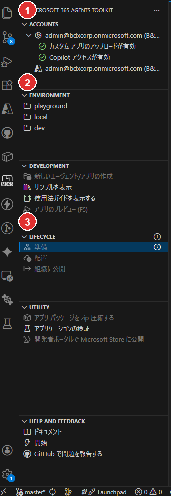

> **図の説明:** (1) ACCOUNTS セクション（Azure サインイン済み） (2) ENVIRONMENT（dev 環境） (3) LIFECYCLE「準備」（Provision 完了）

### 確認事項

- [ ] M365 Agents Toolkit拡張機能がインストール済み
- [ ] Azure / M365 アカウントにサインイン済み
- [ ] プロジェクトが作成された（`maintenance-bot/`）
- [ ] `m365agents.yml`がカスタマイズ済み（既存リソース参照）
- [ ] Provisionが正常に完了した
- [ ] `BOT_ID`（MicrosoftAppId）が `env/.env.dev` に記録された
- [ ] `SECRET_BOT_PASSWORD`（MicrosoftAppPassword）が `env/.env.dev.user` に記録された

> **注記:** Web Appのアプリケーション設定（環境変数）は **Step 12** で Bot 実装・Deploy と合わせて設定する。

---

## Step 8: Azure Bot リソース作成 + Teams チャネル追加

Toolkit の Provision（Step 7）は Developer Portal への登録のみ行い、Azure Bot リソース（`Microsoft.BotService/botServices`）は作成しない。本ステップで Azure Bot リソースを CLI で作成し、Teams チャネルを追加する。

### Azure Bot リソース作成

```bash
az bot create \
  --resource-group rg-maintenance-poc \
  --name bot-maintenance-poc \
  --app-type SingleTenant \
  --appid <BOT_ID> \
  --tenant-id <テナントID> \
  --endpoint https://app-maintenance-bot-poc.azurewebsites.net/api/messages \
  --sku F0
```

| パラメータ | 値 | 備考 |
|-----------|-----|------|
| `--name` | `bot-maintenance-poc` | 命名規則に従う |
| `--app-type` | `SingleTenant` | Multi-Tenant は非推奨 |
| `--appid` | Step 7 Provision で取得した `BOT_ID` | `env/.env.dev` に記録済み |
| `--tenant-id` | Entra ID テナントID | `env/.env.dev` の `TEAMS_APP_TENANT_ID` |
| `--endpoint` | `https://app-maintenance-bot-poc.azurewebsites.net/api/messages` | Web App の URL + `/api/messages` |
| `--sku` | `F0` | Free プラン |

**参考:** [Azure Bot リソースの作成](https://learn.microsoft.com/en-us/azure/bot-service/abs-quickstart?view=azure-bot-service-4.0) [4]

### Teams チャネル追加

```bash
az bot msteams create \
  --resource-group rg-maintenance-poc \
  --name bot-maintenance-poc
```

**参考:** [Teams チャネルへの接続](https://learn.microsoft.com/en-us/azure/bot-service/channel-connect-teams?view=azure-bot-service-4.0) [5]

### 確認事項

- [ ] Azure Portal → Bot Services で `bot-maintenance-poc` が表示される
- [ ] チャネル一覧に「Microsoft Teams」が「実行中」で表示される
- [ ] メッセージングエンドポイントが正しい URL を指している

---

## Step 9: サービスプリンシパル作成

Step 7 の Provision で作成された Entra ID アプリ登録に対して、サービスプリンシパル（SP）を作成する。SP が存在しないと Bot が **401 Unauthorized** エラーを返す。

### サービスプリンシパルの存在確認

```bash
az ad sp show --id <BOT_ID> --query "{appId:appId, displayName:displayName}" -o table
```

- 結果が返る → SP は既に存在する（次の「サービスプリンシパルの作成」はスキップ）
- `Resource ... does not exist` → SP が未作成（次の「サービスプリンシパルの作成」へ進む）

### サービスプリンシパルの作成

```bash
az ad sp create --id <BOT_ID>
```

### 確認事項

- [ ] `az ad sp show --id <BOT_ID>` で SP の情報が返る
- [ ] `appId` が Step 7 で取得した `BOT_ID` と一致する

**参考:** [サービスプリンシパルの作成](https://learn.microsoft.com/en-us/entra/identity-platform/howto-create-service-principal-portal) [6]

---

## Step 10: Managed Identity ロール付与 + Graph API 権限付与（SPO連携用）

各リソースのManaged Identityに対して、必要なアクセス権限を付与する。

### ロール付与一覧

**AI SearchのManaged Identity向け:**

| 対象リソース | ロール名 | 付与先 | 用途 |
|-------------|---------|--------|------|
| Azure OpenAI | `Cognitive Services OpenAI User` | **AI Search**のManaged Identity | Skillset（インデクシング時）・Vectorizer（クエリ時）からのEmbedding呼び出し |
| Cosmos DB | `Cosmos DB Account Reader` | **AI Search**のManaged Identity | Indexerのデータソース接続メタデータ読み取り（管理プレーン） |
| Cosmos DB | `Cosmos DB Built-in Data Reader` | **AI Search**のManaged Identity | IndexerによるCosmos DBドキュメント読み取り（データプレーン） |

**Web AppのManaged Identity向け:**

| 対象リソース | ロール名 | 付与先 | 用途 |
|-------------|---------|--------|------|
| Azure AI Search | `Search Index Data Reader` | Web AppのManaged Identity | 検索クエリ実行 |
| Cosmos DB | `Cosmos DB Built-in Data Contributor` | Web AppのManaged Identity | FAQ削除・判定記録の書き込み（データプレーン） |

**Microsoft Graph（アプリケーション権限）:**

| 権限名 | 付与先 | 用途 |
|--------|--------|------|
| `Files.ReadWrite.All` | Web AppのManaged Identity | FR-009 Excel出力ファイルのSharePointアップロード |

**注記:** BotアプリケーションからAzure OpenAIを直接呼び出すことはない。Embeddingの呼び出しはすべてAI Search経由（ビルトインSkill/Vectorizer [15]）で行うため、`Cognitive Services OpenAI User`はAI SearchのMIに付与する。

### Azure OpenAI ロール付与

AI SearchのSkillset（インデクシング時のEmbedding生成）とVectorizer（クエリ時のベクトル変換）がAzure OpenAIを呼び出す。このため、**AI SearchのManaged Identity**に`Cognitive Services OpenAI User`を付与する。BotアプリからAzure OpenAIを直接呼び出すことはない。

```bash
# AI SearchのManaged IdentityプリンシパルIDを取得する。
# このIDは後続のCosmos DBロール付与でも使用するため、変数に保持しておく。
SEARCH_PRINCIPAL_ID=$(az search service show \
  --name srch-maintenance-poc \
  --resource-group rg-maintenance-poc \
  --query identity.principalId -o tsv)

# Azure OpenAIのリソースIDを取得する（ロール付与のスコープ指定に必要）。
AOAI_RESOURCE_ID=$(az cognitiveservices account show \
  --name aoai-maintenance-poc \
  --resource-group rg-maintenance-poc \
  --query id -o tsv)

# AI SearchのMIにCognitive Services OpenAI Userロールを付与する。
# このロールにより、AI SearchがEmbeddingモデルを呼び出せるようになる。
az role assignment create \
  --assignee-object-id $SEARCH_PRINCIPAL_ID \
  --assignee-principal-type ServicePrincipal \
  --role "Cognitive Services OpenAI User" \
  --scope $AOAI_RESOURCE_ID
```

**（参考）Azureポータルでの操作:**

1. Azure OpenAIリソースに移動
2. 「アクセス制御（IAM）」→「ロールの割り当ての追加」
3. ロール: `Cognitive Services OpenAI User`
4. メンバー: 「マネージドID」→ 対象のAI Search（`srch-maintenance-poc`）を選択
5. 「確認と割り当て」

### Azure AI Search ロール付与 [7]

BotアプリケーションがAI Searchに検索クエリを発行するため、**Web AppのManaged Identity**に`Search Index Data Reader`を付与する。

```bash
# Web AppのManaged IdentityプリンシパルIDを取得する。
# このIDは後続のCosmos DBロール付与・Graph API権限付与でも使用する。
WEB_APP_PRINCIPAL_ID=$(az webapp identity show \
  --name app-maintenance-bot-poc \
  --resource-group rg-maintenance-poc \
  --query principalId -o tsv)

# AI SearchのリソースIDを取得する（ロール付与のスコープ指定に必要）。
SEARCH_RESOURCE_ID=$(az search service show \
  --name srch-maintenance-poc \
  --resource-group rg-maintenance-poc \
  --query id -o tsv)

# Web AppのMIにSearch Index Data Readerロールを付与する。
# このロールにより、BotアプリがAI Searchのインデックスに対して検索クエリを実行できる。
az role assignment create \
  --assignee-object-id $WEB_APP_PRINCIPAL_ID \
  --assignee-principal-type ServicePrincipal \
  --role "Search Index Data Reader" \
  --scope $SEARCH_RESOURCE_ID
```

**（参考）Azureポータルでの操作:**

1. AI Searchリソースに移動
2. 「アクセス制御（IAM）」→「ロールの割り当ての追加」
3. ロール: `Search Index Data Reader`
4. メンバー: Web AppのManaged Identityを選択
5. 「確認と割り当て」

### Cosmos DB ロール付与（Azure CLI必須） [8]

Cosmos DBには**管理プレーン**と**データプレーン**の2種類のロール体系がある。

| 種別 | 概要 | 付与方法 | ポータルIAMでの表示 |
| ------ | ------ | --------- | ------------------- |
| 管理プレーン | Azureリソースとしてのメタデータ操作（アカウント情報読み取り等） | ポータルIAM または Azure CLI | 表示される |
| データプレーン | Cosmos DB内のドキュメント読み書き | **Azure CLIのみ**（`az cosmosdb sql role assignment create`） | **表示されない** |

**組み込みロール定義ID:**

| ロール名 | ロール定義ID |
| --------- | ------------ |
| Built-in Data Reader | `00000000-0000-0000-0000-000000000001` |
| Built-in Data Contributor | `00000000-0000-0000-0000-000000000002` |

#### AI Search → Cosmos DB（管理プレーン: Account Reader）

AI SearchのIndexerがCosmos DBアカウントのメタデータ（接続文字列やデータベース一覧等）を読み取るために必要。この管理プレーンロールがないと、IndexerがCosmos DBデータソースに接続できない。

```bash
# Cosmos DBのリソースIDを取得する（管理プレーンロール付与のスコープ指定に必要）。
# このIDは後続の確認コマンドでも使用する。
COSMOS_RESOURCE_ID=$(az cosmosdb show \
  --name cosmos-maintenance-poc \
  --resource-group rg-maintenance-poc \
  --query id -o tsv)

# AI SearchのMIにCosmos DB Account Reader Roleを付与する。
# Indexerがデータソース接続を確立する際にアカウントメタデータの読み取りが必要。
az role assignment create \
  --assignee-object-id $SEARCH_PRINCIPAL_ID \
  --assignee-principal-type ServicePrincipal \
  --role "Cosmos DB Account Reader Role" \
  --scope $COSMOS_RESOURCE_ID
```

**（参考）Azureポータルでの操作:**

1. Cosmos DBリソースに移動
2. 「アクセス制御（IAM）」→「ロールの割り当ての追加」
3. ロール: `Cosmos DB Account Reader Role`
4. メンバー: AI SearchのManaged Identity（`srch-maintenance-poc`）を選択
5. 「確認と割り当て」

#### AI Search → Cosmos DB（データプレーン: Data Reader）

AI SearchのIndexerがCosmos DBのドキュメントを読み取り、インデックスに取り込むために必要。データプレーンロールはAzureポータルのIAMからは付与できないため、CLIで実行する。

```bash
# AI SearchのMIにCosmos DB Built-in Data Readerロールを付与する。
# --scope "/" はアカウント全体を対象とする（特定DBに限定する場合は "/dbs/<db名>" を指定）。
az cosmosdb sql role assignment create \
  --account-name cosmos-maintenance-poc \
  --resource-group rg-maintenance-poc \
  --scope "/" \
  --principal-id $SEARCH_PRINCIPAL_ID \
  --role-definition-id 00000000-0000-0000-0000-000000000001
```

#### Web App → Cosmos DB（データプレーン: Data Contributor）

BotアプリケーションがFAQ削除や影響判定結果の書き込みを行うために必要。Data Reader（読み取り専用）ではなくData Contributor（読み書き）を付与する。

```bash
# Web AppのMIにCosmos DB Built-in Data Contributorロールを付与する。
# Botアプリによるドキュメントの読み取り・作成・更新・削除が可能になる。
az cosmosdb sql role assignment create \
  --account-name cosmos-maintenance-poc \
  --resource-group rg-maintenance-poc \
  --scope "/" \
  --principal-id $WEB_APP_PRINCIPAL_ID \
  --role-definition-id 00000000-0000-0000-0000-000000000002
```

#### ロール付与の確認

ロール付与が反映されるまで数分かかる場合がある。以下のコマンドで付与状況を確認する。

```bash
# データプレーンロールの確認（ポータルIAMには表示されないため、CLIで確認する）
az cosmosdb sql role assignment list \
  --account-name cosmos-maintenance-poc \
  --resource-group rg-maintenance-poc

# 管理プレーンロールの確認
az role assignment list --scope $COSMOS_RESOURCE_ID
```

### Microsoft Graph API 権限付与（FR-009 SPO連携用）

FR-009のExcel出力機能では、生成したExcelファイルをSharePoint Online（SPO）にアップロードする。Web AppのManaged IdentityにMicrosoft Graph APIのアプリケーション権限`Files.ReadWrite.All`を付与する。

> **注意:** この権限はAzureポータルのIAM（RBACロール）ではなく、Microsoft Graph APIのアプリケーション権限として付与する。AzureポータルのIAM画面からは付与できない。

#### SPOドライブIDの取得（サイトIDは取得時のみ使用）

実行時に必須なのはドライブID（ドキュメントライブラリID）である。サイトIDはドライブ一覧取得の中間値として使用し、必要に応じて記録する。

```bash
# SPOサイトのサイトIDを取得する。
# Graph API でサイト情報にアクセスするため、{hostname}と{site-path}は環境に合わせて変更する。
az rest --method GET \
  --url "https://graph.microsoft.com/v1.0/sites/{hostname}:/sites/{site-path}" \
  --query "id" -o tsv

# 例: <テナント名>.sharepoint.com の <サイトパス> サイトの場合
az rest --method GET \
  --url "https://graph.microsoft.com/v1.0/sites/<テナント名>.sharepoint.com:/sites/<サイトパス>" \
  --query "id" -o tsv
```

取得したサイトIDを使ってドライブ（ドキュメントライブラリ）一覧を取得する:

```bash
# サイト内のドライブ一覧を取得する（{siteId}は上記で取得した値に置換）。
# Excelファイルのアップロード先となるドキュメントライブラリのIDを特定する。
az rest --method GET \
  --url "https://graph.microsoft.com/v1.0/sites/{siteId}/drives" \
  --query "value[].{id:id, name:name}" -o table
```

通常は`Documents`（Shared Documents）ライブラリのIDを使用する。

#### Graph API アプリケーション権限の付与

```bash
# Web AppのMIプリンシパルIDを取得する（前のセクションで取得済みの場合はスキップ可）。
WEB_APP_PRINCIPAL_ID=$(az webapp identity show \
  --name app-maintenance-bot-poc \
  --resource-group rg-maintenance-poc \
  --query principalId -o tsv)

# Microsoft Graphのサービスプリンシパル（テナント内の実体）のIDを取得する。
# appId '00000003-...' はMicrosoft Graphの固定アプリケーションIDである。
GRAPH_SP_ID=$(az ad sp list \
  --filter "appId eq '00000003-0000-0000-c000-000000000000'" \
  --query "[0].id" -o tsv)

# Files.ReadWrite.All アプリケーションロールのIDを取得する。
# このロールにより、アプリがSharePoint上のファイルを読み書きできる。
FILES_RW_ROLE_ID=$(az ad sp list \
  --filter "appId eq '00000003-0000-0000-c000-000000000000'" \
  --query "[0].appRoles[?value=='Files.ReadWrite.All'].id | [0]" -o tsv)

# Web AppのMIにFiles.ReadWrite.Allアプリケーションロールを付与する。
# これにより、BotアプリがExcelファイルをSharePointにアップロードできるようになる。
az rest --method POST \
  --url "https://graph.microsoft.com/v1.0/servicePrincipals/$WEB_APP_PRINCIPAL_ID/appRoleAssignments" \
  --headers "Content-Type=application/json" \
  --body "{
    \"principalId\": \"$WEB_APP_PRINCIPAL_ID\",
    \"resourceId\": \"$GRAPH_SP_ID\",
    \"appRoleId\": \"$FILES_RW_ROLE_ID\"
  }"
```

**付与の確認:**

```bash
# Web AppのMIに付与されたGraph APIロールを一覧表示する。
az rest --method GET \
  --url "https://graph.microsoft.com/v1.0/servicePrincipals/$WEB_APP_PRINCIPAL_ID/appRoleAssignments" \
  --query "value[?appRoleId=='$FILES_RW_ROLE_ID'].{principalDisplayName:principalDisplayName, resourceDisplayName:resourceDisplayName}" -o table
```

`app-maintenance-bot-poc` → `Microsoft Graph` の割り当てが表示されればOK。

#### SPO環境変数の設定

取得したドライブIDを Bot プロジェクトのローカル環境変数ファイル（`maintenance-bot/.localConfigs`、Step 14 で詳述）と Web App の環境変数に追加する。`SPO_SITE_ID`は現行コードでは参照していないため、運用メモとして保持する場合のみ設定する:

```ini
SPO_DRIVE_ID=<取得したドライブID>
SPO_UPLOAD_FOLDER=影響候補シナリオ
# 任意: サイトIDを記録しておく場合のみ
# SPO_SITE_ID=<取得したサイトID>
```

Web Appへの反映:

```bash
# SPO関連の環境変数をWeb Appに設定する。
# その他のアプリケーション設定はStep 12で一括設定するが、SPOのみここで先行設定する。
az webapp config appsettings set \
  --name app-maintenance-bot-poc \
  --resource-group rg-maintenance-poc \
  --settings \
    SPO_DRIVE_ID="<取得したドライブID>" \
    SPO_UPLOAD_FOLDER="影響候補シナリオ"
```

> **補足:** SPO 関連の環境変数のみ、このステップで Web App に先行して設定する。
> その他のアプリケーション設定は Step 12 で一括設定する。

> **⚠️ 重要:** `.localConfigs`への設定だけではAzure上のBotには反映されない。Step 12「Web App アプリケーション設定」の `az webapp config appsettings set` コマンドにも `SPO_DRIVE_ID` と `SPO_UPLOAD_FOLDER` を含めること。未設定の場合、ローカルデバッグでは正常動作するがAzure上でSharePointアップロードが失敗する。

### 確認事項

- [ ] Azure OpenAI: **AI Search**に`Cognitive Services OpenAI User`を付与した
- [ ] AI Search: Web Appに`Search Index Data Reader`を付与した
- [ ] Cosmos DB（管理プレーン）: AI Searchに`Cosmos DB Account Reader Role`を付与した
- [ ] Cosmos DB（データプレーン）: AI Searchに`Built-in Data Reader`を付与した（CLI）
- [ ] Cosmos DB（データプレーン）: Web Appに`Built-in Data Contributor`を付与した（CLI）
- [ ] Microsoft Graph: Web Appに`Files.ReadWrite.All`を付与した（Graph API）
- [ ] SPOドライブIDを取得し、`.localConfigs`に設定した
- [ ] 必要に応じてSPOサイトIDを運用メモとして記録した
- [ ] SPO環境変数を Web App にも反映した（Step 10「SPO環境変数の設定」参照）
- [ ] 各ロール付与をCLIで確認した

---

## Step 11: AI Search インデックス・データソース・Skillset・Indexer設定

> **注意:** Step 11〜14 では複数のシェル変数（`$ADMIN_KEY` 等）を使用する。ターミナルを閉じると変数は失われるため、同一ターミナルセッションで続けて実行すること。作業を中断・再開する場合は、各変数の取得コマンドを再実行すること。

AI Search REST APIを使用してインデクシングパイプラインを構築する [15][16]。以下の順序で作成する。

### 概要

```
(1) インデックス定義 → (2) データソース → (3) Skillset → (4) Indexer
```

以下のREST API呼び出しでは、AI Searchの管理キー（または Managed Identity + Entra ID認証）を使用する。

**共通ヘッダー:**

```
Content-Type: application/json
api-key: <AI Searchの管理キー>
```

**管理キーの取得:**

```bash
ADMIN_KEY=$(az search admin-key show \
  --service-name srch-maintenance-poc \
  --resource-group rg-maintenance-poc \
  --query primaryKey -o tsv)
```

### インデックス作成

JSON 定義ファイル: `scripts/index-definition.json`

> **事前確認:** `scripts/` 配下の設定ファイルにはプレースホルダーが含まれている。実行前に以下の変数を設定し、各ファイル内のプレースホルダーを実際の値に置換すること。
>
> ```bash
> # 環境固有値の設定（実際の値に置換してください）
> SUBSCRIPTION_ID="<your-subscription-id>"
> RESOURCE_GROUP="<your-resource-group>"
> COSMOS_ACCOUNT="<your-cosmos-account>"
> AOAI_ACCOUNT="<your-aoai-account>"
>
> # 一括置換
> sed -i "s/<SUBSCRIPTION_ID>/$SUBSCRIPTION_ID/g; s/<RESOURCE_GROUP>/$RESOURCE_GROUP/g; s/<COSMOS_ACCOUNT>/$COSMOS_ACCOUNT/g; s/<AOAI_ACCOUNT>/$AOAI_ACCOUNT/g" \
>   scripts/datasource-scenarios.json scripts/datasource-faqs.json \
>   scripts/index-definition.json scripts/skillset.json \
>   scripts/seed-cosmos.js scripts/seed-cosmos.ts
> ```

```bash
curl -X PUT \
  "https://srch-maintenance-poc.search.windows.net/indexes/maintenance-search-index?api-version=2025-09-01" \
  -H "Content-Type: application/json" \
  -H "api-key: $ADMIN_KEY" \
  -d @scripts/index-definition.json
```

> **補足:** インデックス定義の詳細は `scripts/index-definition.json` を参照。主要フィールド: `combinedContent`（検索対象テキスト）、`contentVector`（3,072次元ベクトル）、`keywords`（`ja.microsoft`アナライザー適用）。

### データソース作成

`scenarios`と`faqs`は別コンテナであるため、データソースを2つ作成する [16]。

JSON 定義ファイル: `scripts/datasource-scenarios.json` / `scripts/datasource-faqs.json`

```bash
# scenarios データソース
curl -X POST \
  "https://srch-maintenance-poc.search.windows.net/datasources?api-version=2025-09-01" \
  -H "Content-Type: application/json" \
  -H "api-key: $ADMIN_KEY" \
  -d @scripts/datasource-scenarios.json

# faqs データソース
curl -X POST \
  "https://srch-maintenance-poc.search.windows.net/datasources?api-version=2025-09-01" \
  -H "Content-Type: application/json" \
  -H "api-key: $ADMIN_KEY" \
  -d @scripts/datasource-faqs.json
```

**注記:**
- `connectionString`に`ResourceId`形式を使用することで、AI SearchのSystem Assigned Managed Identityで認証する（Step 10 で`Cosmos DB Account Reader Role`+`Built-in Data Reader`を付与済み）
- `apiKey`や`identity`フィールドの指定は不要（System Assigned MI使用時は自動で適用される）
- `impactAssessments`コンテナはインデックス対象外のため、データソースを作成しない

### Skillset作成

AzureOpenAIEmbeddingSkillを使用して、Indexer実行時に自動でベクトル化する [15]。

JSON 定義ファイル: `scripts/skillset.json`

```bash
curl -X PUT \
  "https://srch-maintenance-poc.search.windows.net/skillsets/maintenance-skillset?api-version=2025-09-01" \
  -H "Content-Type: application/json" \
  -H "api-key: $ADMIN_KEY" \
  -d @scripts/skillset.json
```

**注記:**
- `combinedContent`フィールド（title + content の結合テキスト）をベクトル化の入力とする。Cosmos DB側でドキュメント格納時に`combinedContent`を事前に生成しておく。

### Indexer作成

2つのデータソースに対応するIndexerをそれぞれ作成する。両方とも同一インデックス（`maintenance-search-index`）と同一Skillset（`maintenance-skillset`）を使用する。

JSON 定義ファイル: `scripts/indexer-scenarios.json` / `scripts/indexer-faqs.json`

```bash
# scenarios Indexer
curl -X PUT \
  "https://srch-maintenance-poc.search.windows.net/indexers/maintenance-scenarios-indexer?api-version=2025-09-01" \
  -H "Content-Type: application/json" \
  -H "api-key: $ADMIN_KEY" \
  -d @scripts/indexer-scenarios.json

# faqs Indexer
curl -X PUT \
  "https://srch-maintenance-poc.search.windows.net/indexers/maintenance-faqs-indexer?api-version=2025-09-01" \
  -H "Content-Type: application/json" \
  -H "api-key: $ADMIN_KEY" \
  -d @scripts/indexer-faqs.json
```

> **補足:** scenarios Indexer には `path`・`order`・`isFinalAnswer` の fieldMappings があり、
> faqs Indexer には `tags` の fieldMappings がある。これはデータ構造の違いによる意図的な設計。
> 詳細は各 JSON ファイルの `fieldMappings` セクションを参照。

**`schedule.interval: "PT10M"`** で10分ごとにIndexerが実行される。初回はCosmos DBの全ドキュメントをインデクシングし、以降は`_ts`（Cosmos DB内部タイムスタンプ）の変更分のみ処理する（High Water Mark方式）。

> **注意:** `maxFailedItems: -1`（エラー無制限許容）は PoC 用の設定。
> 本番環境ではデータ欠落を防ぐため、上限値（例: `10`）を設定すること。

**差分ベクトル化のコストについて:** Indexerの実行コストはポーリング頻度ではなく、**実際に変更されたドキュメント数**に依存する。変更がない場合の空振り実行では、Cosmos DBへの変更チェッククエリ（数RU）のみが発生し、Azure OpenAI Embeddingの呼び出しは行われない。そのため、10分間隔でも1時間間隔でもコスト差はほぼゼロである。5年間の運用でも空振りによる追加コストは数百円程度と見積もられる。

**注記:** 2つのIndexerが同一インデックスに書き込む構成はAI Searchで正式にサポートされている [16]。各Indexerは独立したスケジュールで動作し、同一ドキュメント（同一`id`）を更新する場合は後勝ち（last-write-wins）となる。

> **補足:** AI Search Basic プランの同時 Indexer 実行数は最大3。本構成では2 Indexer のため問題なし。

### Indexer手動実行と確認

両方のIndexerを手動実行する:

```bash
# scenarios Indexer を手動実行
curl -X POST \
  "https://srch-maintenance-poc.search.windows.net/indexers/maintenance-scenarios-indexer/run?api-version=2025-09-01" \
  -H "api-key: $ADMIN_KEY" \
  -H "Content-Length: 0"

# faqs Indexer を手動実行
curl -X POST \
  "https://srch-maintenance-poc.search.windows.net/indexers/maintenance-faqs-indexer/run?api-version=2025-09-01" \
  -H "api-key: $ADMIN_KEY" \
  -H "Content-Length: 0"
```

実行状態の確認:

```bash
# scenarios Indexer のステータス確認
curl -s "https://srch-maintenance-poc.search.windows.net/indexers/maintenance-scenarios-indexer/status?api-version=2025-09-01" \
  -H "api-key: $ADMIN_KEY" | jq '.lastResult.status'

# faqs Indexer のステータス確認
curl -s "https://srch-maintenance-poc.search.windows.net/indexers/maintenance-faqs-indexer/status?api-version=2025-09-01" \
  -H "api-key: $ADMIN_KEY" | jq '.lastResult.status'
```

`lastResult.status`が`success`であれば正常。`transientFailure`の場合はAzure OpenAIのTPM超過による一時的なエラーの可能性があり、再実行で解消する。

### 確認事項

- [ ] インデックス `maintenance-search-index` が作成された
- [ ] データソースが2つ作成された（`cosmos-scenarios-ds`, `cosmos-faqs-ds`）
- [ ] Skillsetが作成された
- [ ] Indexerが2つ作成され、初回実行が成功した
- [ ] 検索エクスプローラーでデータが検索できる

---

## Step 12: Botアプリケーション実装 + App Settings設定 + Toolkit Deploy

### SDK選定

| SDK | 状態 | npmパッケージ | 備考 |
|-----|------|-------------|------|
| M365 Agents SDK | **GA**（JS, C#, Python） [2][3] | `@microsoft/agents-hosting`, `@microsoft/agents-hosting-express` | 本システムの基本方針。Teams以外のチャネルにも対応可能 |
| Teams SDK（旧Teams AI Library v2） | GA（JS, C#） | `@microsoft/teams-ai` | Teams特化のBot開発SDK。M365 Agents SDKと併用可能 |
| Bot Framework SDK | **サポート終了**（2025/12/31） | `botbuilder` | 新規開発には使用しない |

本システムでは**M365 Agents SDK**（TypeScript）を基本方針とする。Step 7「プロジェクト作成」で作成したToolkitプロジェクトには、SDK依存関係が既に含まれている。

### 追加パッケージのインストール

Toolkitテンプレートに含まれないパッケージを追加する:

```bash
cd maintenance-bot
npm install @azure/cosmos @azure/identity @azure/search-documents @azure/monitor-opentelemetry @microsoft/microsoft-graph-client exceljs
```

| パッケージ | 用途 |
|------|------|
| `@azure/cosmos` | Cosmos DB データ操作 |
| `@azure/identity` | Managed Identity / DefaultAzureCredential 認証 |
| `@azure/search-documents` | AI Search クエリ実行 |
| `@azure/monitor-opentelemetry` | Application Insights テレメトリ収集（ログ・トレース・メトリクス） |
| `@microsoft/microsoft-graph-client` | SharePoint Online への Excel アップロード |
| `exceljs` | Excel 出力ファイル生成 |

### 最小構成の動作確認コード

Step 7「プロジェクト作成」で生成された`src/index.ts`を編集し、まず最小限のエコーBotで動作確認する:

```typescript
import { AgentApplication, MemoryStorage } from '@microsoft/agents-hosting'
import { startServer } from '@microsoft/agents-hosting-express'

const app = new AgentApplication({
  storage: new MemoryStorage()
})

app.activity('message', async (context) => {
  // 動作確認用: エコー応答
  await context.sendActivity(`受信: ${context.activity.text}`)
})

startServer(app)
```

**注記:** 上記は動作確認用の最小構成。検索ロジック、Adaptive Card生成、Cosmos DB書き込み等の実装詳細は別途実装ガイドで扱う。

> **主要チューニングパラメータ（`src/config.ts` 参照）**
>
> | パラメータ | 現在値 | 説明 |
> |-----------|--------|------|
> | `VECTOR_WEIGHT` | `4.5` | AI Search RRF ベクトル重み（BM25 は暗黙 1.0）。Semantic Ranker 有効時はやや低め推奨 |
> | HNSW `m` | `10` | グラフ接続数（上限10）。高いほど精度向上・インデックスサイズ増大 |
> | HNSW `efSearch` | `1000` | 探索候補数。高いほど精度向上・レイテンシ増大 |
> | `CACHE_TTL_MS` | `30分` | 検索結果インメモリキャッシュの有効期間 |
>
> ※ HNSW `m` を変更した場合はインデックスの**再作成**（DELETE → PUT → Indexer リセット + 実行）が必要。

> **重要: Azure SDKクライアントの遅延初期化**
>
> `SearchClient`（`@azure/search-documents`）や`CosmosClient`（`@azure/cosmos`）をモジュールのトップレベルで初期化しないこと。`env-cmd`による環境変数の読み込みは、モジュール評価よりも後に行われるケースがあり、エンドポイントが空文字のまま`Invalid URL`エラーとなる。
>
> ```typescript
> // NG: モジュール読み込み時に即座に初期化される
> const client = new SearchClient(config.endpoint, config.index, credential);
>
> // OK: 初回呼び出し時に初期化（遅延初期化パターン）
> let _client: SearchClient | null = null;
> function getSearchClient(): SearchClient {
>   if (!_client) {
>     _client = new SearchClient(config.endpoint, config.index, credential);
>   }
>   return _client;
> }
> ```
>
> `CosmosClient`も同様に遅延初期化すること。

### Application Insights の有効化

`@azure/monitor-opentelemetry` を使用して、Azure上でのアプリケーションログ（`console.log` / `console.error`）、トレース、メトリクスを Application Insights に送信する。`src/index.ts` の**先頭**（他の `import` 文より前）に以下を追加する:

```typescript
// Application Insights: 他の import より先に初期化する
// APPLICATIONINSIGHTS_CONNECTION_STRING 環境変数が設定されている場合のみ有効化
const aiConnStr = process.env.APPLICATIONINSIGHTS_CONNECTION_STRING;
if (aiConnStr) {
  const { useAzureMonitor } = require("@azure/monitor-opentelemetry");
  useAzureMonitor();
}

import { startServer } from "@microsoft/agents-hosting-express";
// ... 以降の import
```

> **ポイント:**
>
> - `useAzureMonitor()` は OpenTelemetry の初期化を行うため、**他のモジュールが import される前に呼び出す**必要がある。ES Module の `import` 文より前に実行するため、`require()` で動的インポートしている
> - 接続文字列は `APPLICATIONINSIGHTS_CONNECTION_STRING` 環境変数から自動的に読み取られる（Web App にはこのステップの「Web App アプリケーション設定」で設定する）
> - ローカルデバッグ時は環境変数が未設定のため自動的にスキップされる（`console.log` は VS Code デバッグコンソールで確認可能）

### Web App アプリケーション設定（環境変数）

Bot の認証情報とバックエンドリソースの接続先を Web App に設定する。

- Teams / Bot Framework から Bot への認証: Entra ID アプリ (`BOT_ID`) + `clientSecret`
- Bot から Azure AI Search / Cosmos DB / Microsoft Graph へのアクセス: Web App の Managed Identity

**値の確認:**

| 変数 | 取得元 |
|------|--------|
| `BOT_ID` | `env/.env.dev` の `BOT_ID=` 行（Step 7 Provision で生成） |
| `SECRET_BOT_PASSWORD` | `env/.env.dev.user` の `SECRET_BOT_PASSWORD=` 行 |
| テナントID | `env/.env.dev` の `TEAMS_APP_TENANT_ID=` 行 |
| App Insights 接続文字列 | Step 5 で取得済み |

**Azure CLI:**

```bash
az webapp config appsettings set \
  --resource-group rg-maintenance-poc \
  --name app-maintenance-bot-poc \
  --settings \
    clientId=<BOT_ID> \
    clientSecret=<SECRET_BOT_PASSWORD> \
    tenantId=<テナントID> \
    MicrosoftAppId=<BOT_ID> \
    MicrosoftAppPassword=<SECRET_BOT_PASSWORD> \
    MicrosoftAppTenantId=<テナントID> \
    MicrosoftAppType=SingleTenant \
    AI_SEARCH_ENDPOINT=https://srch-maintenance-poc.search.windows.net \
    AI_SEARCH_INDEX_NAME=maintenance-search-index \
    COSMOS_DB_ENDPOINT=https://cosmos-maintenance-poc.documents.azure.com:443/ \
    COSMOS_DB_DATABASE=maintenance-db \
    SPO_DRIVE_ID=<Step 10「SPOドライブIDの取得」で取得したドライブID> \
    SPO_UPLOAD_FOLDER=影響候補シナリオ \
    APPLICATIONINSIGHTS_CONNECTION_STRING="<Step 5で取得した接続文字列>"
```

> **注意（Git Bash環境）:** Cosmos DB エンドポイント等のパスが自動変換される場合、コマンド先頭に `MSYS_NO_PATHCONV=1` を付ける。

> **⚠️ M365 Agents SDK 環境変数の注意 [3]:** M365 Agents SDK v1.x は `process.env.clientId` / `clientSecret` / `tenantId`（小文字キャメル）を読む。`MicrosoftAppId` のみでは認証に失敗する。互換性のため**両方設定する**こと。

**設定一覧:**

| 変数名 | 値 | 備考 |
|--------|-----|------|
| `clientId` | `<BOT_ID>` | M365 Agents SDK が読む |
| `clientSecret` | `<SECRET_BOT_PASSWORD>` | M365 Agents SDK が読む |
| `tenantId` | `<テナントID>` | M365 Agents SDK が読む |
| `MicrosoftAppId` | `<BOT_ID>` | レガシー互換 |
| `MicrosoftAppPassword` | `<SECRET_BOT_PASSWORD>` | レガシー互換 |
| `MicrosoftAppTenantId` | `<テナントID>` | レガシー互換 |
| `MicrosoftAppType` | `SingleTenant` | |
| `AI_SEARCH_ENDPOINT` | AI Search の URL | |
| `AI_SEARCH_INDEX_NAME` | `maintenance-search-index` | |
| `COSMOS_DB_ENDPOINT` | Cosmos DB の URL | |
| `COSMOS_DB_DATABASE` | `maintenance-db` | |
| `SPO_DRIVE_ID` | SharePoint ドライブID | Step 10「SPOサイトID・ドライブIDの取得」で取得 |
| `SPO_UPLOAD_FOLDER` | `影響候補シナリオ` | Excel出力先フォルダ名 |
| `APPLICATIONINSIGHTS_CONNECTION_STRING` | App Insights 接続文字列 | |

**任意設定:**

| 変数名 | 値 | 備考 |
|--------|-----|------|
| `SPO_SITE_ID` | SharePoint サイトID | 現行コードでは未使用。運用メモや将来拡張用に保持する場合のみ設定 |

**注記:** Azure OpenAI 関連の環境変数は不要（Embedding は AI Search 経由で実行 [15]。BotからAzure OpenAIを直接呼び出すことはない）。

> **本番環境への移行時:** `clientSecret`（`SECRET_BOT_PASSWORD`）は現在 App Service 環境変数にプレーンテキストで保存されている。本番環境でのシークレット管理については付録C「本番移行時の主要考慮事項」を参照 [10][13]。

### m365agents.yml の deploy セクション設定

現行リポジトリでは `m365agents.yml` の deploy セクションで既存の Web App へ ZIP デプロイする。ビルド成果物は `dist/` ではなく `lib/` に出力され、除外設定には `.deployignore` ではなく `.webappignore` を使用する:

```yaml
deploy:
  - uses: cli/runNpmCommand
    name: install dependencies
    with:
      args: install

  - uses: cli/runNpmCommand
    name: build app
    with:
      args: run build --if-present

  - uses: azureAppService/zipDeploy
    with:
      artifactFolder: .
      ignoreFile: .webappignore
      resourceId: /subscriptions/${{AZURE_SUBSCRIPTION_ID}}/resourceGroups/${{AZURE_RESOURCE_GROUP_NAME}}/providers/Microsoft.Web/sites/app-maintenance-bot-poc
```

**`.webappignore` の要点:**

```
/env/
/appPackage/
/infra/
*.ts
*.ts.map
m365agents.yml
m365agents.*.yml
/node_modules/.bin
/node_modules/ts-node
/node_modules/typescript
```

> **補足:** 実際の除外設定は `maintenance-bot/.webappignore` を参照すること。ランタイムに必要な通常の `node_modules` は ZIP に含め、開発用ファイルのみ除外する。

### Toolkit Deployの実行

1. VS Code コマンドパレット（Ctrl+Shift+P）→「Microsoft 365 Agents: Deploy」
2. 環境: `dev` を選択
3. Toolkitが以下を自動実行:
   - `npm install`
   - TypeScriptビルド
   - 既存Web App（`app-maintenance-bot-poc`）へZIPデプロイ
4. デプロイ完了のメッセージを確認

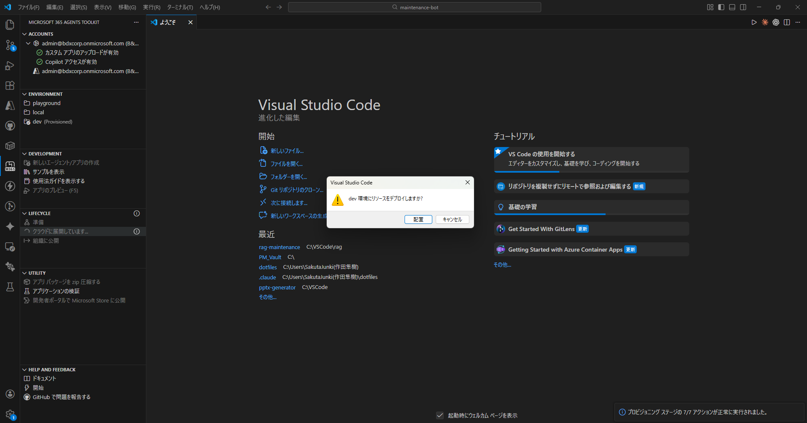

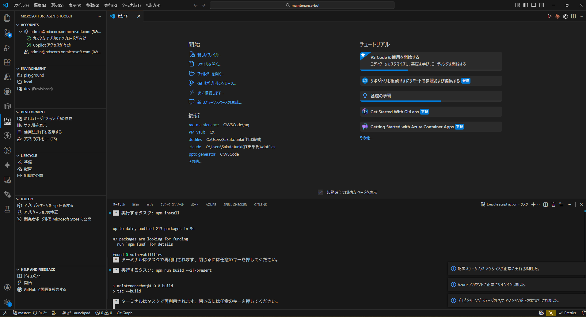

**Azure CLI でのデプロイ（代替方法）:**

```bash
cd maintenance-bot
npm install && npm run build
zip -r deploy.zip . -x "node_modules/*" ".git/*" "env/*" "*.ts"
az webapp deploy \
  --resource-group rg-maintenance-poc \
  --name app-maintenance-bot-poc \
  --src-path deploy.zip \
  --type zip
```

### 確認事項

- [ ] 追加パッケージがインストールされた
- [ ] Web App のアプリケーション設定に全環境変数を登録した（Bot認証用の `clientId`/`clientSecret` と、Managed Identity で利用する接続先設定を含む）
- [ ] 最小構成のBotコードが用意された
- [ ] `m365agents.yml`のdeployセクションが設定済み
- [ ] `.webappignore` の除外設定が現行構成と一致している
- [ ] Toolkit Deployが正常に完了した
- [ ] Web Appのログストリームでエラーが出ていない
- [ ] `https://app-maintenance-bot-poc.azurewebsites.net/api/messages`エンドポイントが応答している

**注記:** 本ステップは環境構築（デプロイ先の準備と初回デプロイ）を対象とする。検索ロジック、Adaptive Card生成、Cosmos DB書き込み、エラーハンドリング等の実装詳細は別途作成する実装ガイドで扱う。

---

## Step 13: マニフェスト修正 + Teamsアプリ登録（Publish）+ 管理センター承認

### アプリマニフェストの修正

Step 7「プロジェクト作成」で生成された`appPackage/manifest.json`を編集する [12]。Toolkitはプレースホルダー構文（`${{変数名}}`）を使用しており、Provision/Deploy時に自動で実際の値に置換される。

> **⚠️ 重要:** Toolkit テンプレートが生成するマニフェストには `copilotAgents` セクションが含まれる。これを**削除しないと Teams でメッセージ送信ができない**。

**修正箇所:**

| 項目 | 修正前 | 修正後 | 理由 |
|------|--------|--------|------|
| `copilotAgents` | セクション存在 | **削除** | Teams でメッセージ送信不可になる |
| `bots[0].scopes` | `["copilot","personal","team"]` | `["personal"]` | copilot/team スコープ不要 |
| `commandLists[0].scopes` | `["copilot","personal"]` | `["personal"]` | 同上 |
| `version` | `"1.0.0"` | 再 Publish 時にインクリメント | 更新時に必須 |

```json
{
  "$schema": "https://developer.microsoft.com/en-us/json-schemas/teams/v1.25/MicrosoftTeams.schema.json",
  "manifestVersion": "1.25",
  "version": "1.0.0",
  "id": "${{TEAMS_APP_ID}}",
  "developer": {
    "name": "デジタル戦略部",
    "websiteUrl": "https://<組織ドメイン>",
    "privacyUrl": "https://<組織ドメイン>/privacy",
    "termsOfUseUrl": "https://<組織ドメイン>/terms"
  },
  "name": {
    "short": "影響候補検出Bot",
    "full": "事務改定 影響候補検出システム"
  },
  "description": {
    "short": "事務改定時の影響候補をAI検索で検出します",
    "full": "改定内容をテキスト入力すると、影響を受ける可能性のあるシナリオとFAQを検出し、一覧表示します。"
  },
  "icons": {
    "outline": "outline.png",
    "color": "color.png"
  },
  "accentColor": "#2B5292",
  "bots": [
    {
      "botId": "${{BOT_ID}}",
      "scopes": ["personal"],
      "supportsFiles": false,
      "isNotificationOnly": false,
      "commandLists": [
        {
          "scopes": ["personal"],
          "commands": [
            {
              "title": "help",
              "description": "使い方を表示します"
            }
          ]
        }
      ]
    }
  ],
  "permissions": ["identity", "messageTeamMembers"],
  "validDomains": [
    "app-maintenance-bot-poc.azurewebsites.net"
  ]
}
```

**注記:**
- `${{TEAMS_APP_ID}}`と`${{BOT_ID}}`はProvision時に自動生成された値で置換される
- アイコンファイル（`color.png`, `outline.png`）はToolkitが生成するデフォルトアイコンを使用するか、カスタムアイコンに差し替える

### アプリパッケージの自動生成

Provision時に`m365agents.yml`の`teamsApp/zipAppPackage`アクションにより、以下が自動実行される:

1. マニフェストのバリデーション
2. プレースホルダーの値置換
3. ZIPパッケージの生成（`appPackage/build/appPackage.dev.zip`）
4. Teams Developer Portalへの登録

手動でパッケージを作成する必要はない。

### Toolkit Publish（組織カタログへの公開）

1. VS Code コマンドパレット（Ctrl+Shift+P）→「**Microsoft 365 Agents: Publish**」を選択
2. 環境: `dev` を選択
3. Toolkit がマニフェストをパッケージ化し、組織の Teams アプリカタログに公開する
4. 完了メッセージを確認

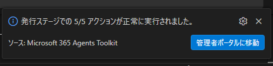

### Teams 管理センターでのアプリ承認

Publish 直後はアプリが「**ブロック済み**」状態になる。Teams 管理者が承認しないとユーザーに表示されない。

1. Teams 管理センター（[https://admin.teams.microsoft.com](https://admin.teams.microsoft.com)）にアクセス
2. 左メニュー →「Teams のアプリ」→「アプリを管理」
3. アプリ名で検索 → 状態が「**ブロック済み**」であることを確認

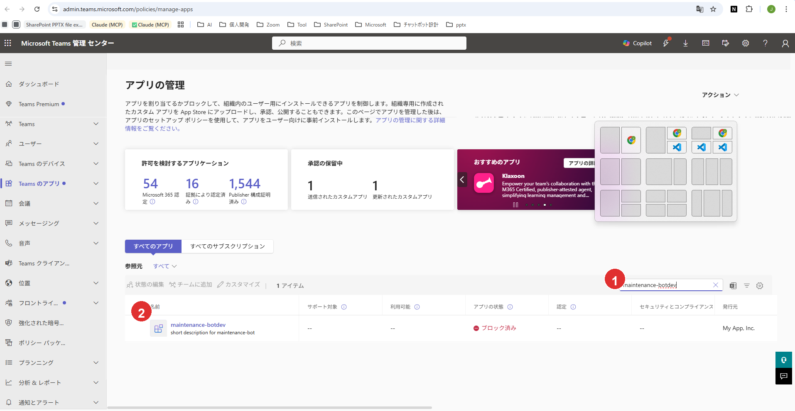

> **図の説明:** (1) アプリ一覧の検索エリア (2) 対象アプリ「maintenance-botdev」

4. アプリをクリック → 詳細画面で「**公開**」ボタンをクリック

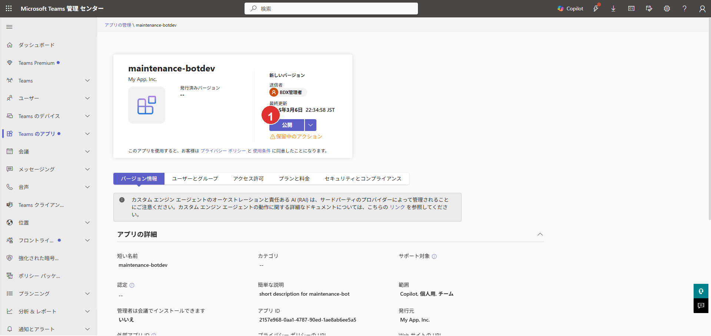

> **図の説明:** (1)「公開」ボタン — クリックしてアプリを公開する

5. 確認ダイアログで「**公開**」を選択

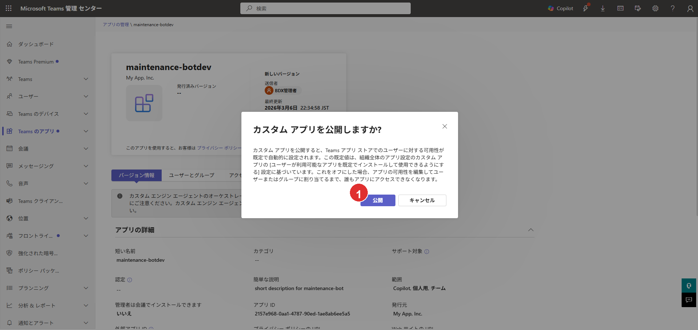

> **図の説明:** (1) 確認ダイアログの「公開」ボタン — クリックして公開を確定する

6. 状態が「**許可済み**」に変わったことを確認

**参考:** [Teams カスタムアプリの承認](https://learn.microsoft.com/en-us/microsoftteams/submit-approve-custom-apps) [11]

### 確認事項

- [ ] `appPackage/manifest.json` から `copilotAgents` セクションを削除した
- [ ] `bots[0].scopes` から `"copilot"` を削除した
- [ ] Toolkit Publish が正常に完了した
- [ ] Teams 管理センターでアプリが「許可済み」になった
- [ ] Teams アプリストアの「組織向けに開発」に表示される

> **⚠️ Deploy と Publish の違い（運用時の注意）**
>
> | 操作 | コマンド | 更新対象 | いつ必要か |
> |------|---------|---------|-----------|
> | **Deploy** | Microsoft 365 Agents: Deploy | Azure Web App 上の Bot コード（TypeScript） | ソースコード（`.ts` ファイル）を変更したとき |
> | **Publish** | Microsoft 365 Agents: Publish | Teams アプリカタログ（マニフェスト、アイコン） | `manifest.json` やアイコン画像を変更したとき |
>
> **コード変更後はまず Deploy → 必要に応じて Publish** の順で実行すること。Publish だけではコード変更は Azure に反映されない。マニフェストのみの変更（アイコン差替え、`version` インクリメント等）の場合は Publish のみでよい。

---

## Step 14: 動作確認（F5ローカルデバッグ + 本番テスト）

### 前提準備（テストデータ投入・権限付与・Indexer実行）

動作確認には、Cosmos DBにテストデータを投入し、AI Searchインデックスに同期する必要がある。

#### 開発者向けロール付与（AI Search + Cosmos DB）

F5ローカルデバッグでは`DefaultAzureCredential`が開発者のAzure CLIログインアカウントを使用する。Step 10で付与したManaged Identityのロールとは別に、開発者個人のアカウントにもロール付与が必要。

**AI Search データプレーン（検索実行に必要）:**

```bash
# 開発者のオブジェクトIDを取得
DEVELOPER_OID=$(az ad signed-in-user show --query id -o tsv)

# Search Index Data Reader ロールを付与
MSYS_NO_PATHCONV=1 az role assignment create \
  --assignee "$DEVELOPER_OID" \
  --role "Search Index Data Reader" \
  --scope "/subscriptions/<サブスクリプションID>/resourceGroups/rg-maintenance-poc/providers/Microsoft.Search/searchServices/srch-maintenance-poc"
```

**注記:** ロール反映に数分かかる場合がある。付与直後に403エラーが出る場合は数分待ってリトライする。

**Cosmos DB データプレーン（テストデータ投入に必要）:**

ローカルからスクリプトでCosmos DBに書き込むには、開発者のAzure ADアカウントにデータプレーンのロール付与が必要。

```bash
# Cosmos DB Built-in Data Contributor ロールを付与（上記で取得した$DEVELOPER_OIDを使用）
MSYS_NO_PATHCONV=1 az cosmosdb sql role assignment create \
  --account-name cosmos-maintenance-poc \
  --resource-group rg-maintenance-poc \
  --role-definition-id "00000000-0000-0000-0000-000000000002" \
  --principal-id "$DEVELOPER_OID" \
  --scope "/"
```

**注記:** このロールはデータプレーン専用であり、Azure Portalの「アクセス制御(IAM)」タブには表示されない。`az cosmosdb sql role assignment list`コマンドで確認する。Web AppのManaged Identity（Step 10で付与済み）とは別に、開発者個人のアカウントにも付与が必要。

#### テストデータ準備（Excel→JSON変換）

rag-local プロジェクトの実データ（Excel）を Cosmos DB 投入用 JSON に変換する。

**前提:** Python 3.10 以上 + openpyxl がインストール済みであること（2.3節 前提条件参照）。

```bash
# openpyxl をインストール（初回のみ）
pip install openpyxl

# Excel→JSON 変換を実行
python scripts/convert-excel-to-json.py
```

**入力ファイル（rag-local プロジェクト内）:**

| ファイル | 種別 | categoryId |
|---------|------|------------|
| rev03_smile_シナリオデータ_20260203.xlsx | シナリオ | smile |
| rev03_souzoku_シナリオデータ_20260203.xlsx | シナリオ | souzoku |
| rev03_naibujimu_シナリオデータ_20260203.xlsx | シナリオ | naibujimu |
| rev03_torikaku_シナリオデータ_20260203.xlsx | シナリオ | torikaku |
| スマイル_履歴データ_20250205.xlsx | FAQ | smile |
| 総則_履歴データ_20250829.xlsx | FAQ | sousoku |
| 預金_履歴データ_20250830.xlsx | FAQ | yokin |

**出力ファイル:**

| ファイル | 件数 | サイズ |
|---------|------|--------|
| `scripts/data/scenarios.json` | 約2,300件 | 約4MB |
| `scripts/data/faqs.json` | 約18,700件 | 約24MB |

**注記:** 変換スクリプトはバリデーション付き。空行やテストデータ行は自動スキップされる。入力ファイルのパスは `scripts/convert-excel-to-json.py` 内の `RAG_LOCAL_BASE` で設定されている。異なる環境で実行する場合はパスを修正すること。

#### Cosmos DB テストデータ投入

変換で生成された JSON を Cosmos DB に投入する。

```bash
# maintenance-bot のライブラリを参照して実行（cd不要）
NODE_PATH=maintenance-bot/node_modules node scripts/seed-cosmos.js --clean

# 再投入（upsert で差分更新）
NODE_PATH=maintenance-bot/node_modules node scripts/seed-cosmos.js
```

投入されるデータ:

| コンテナ | 件数 | 内容 |
|---------|------|------|
| `scenarios` | 約2,300件 | スマイル(555件)、相続(269件)、内部事務(1,384件)、取引時確認(105件) |
| `faqs` | 約18,700件 | スマイル(8,679件)、総則(4,000件)、預金(6,055件) |

**注記:** スクリプトは `upsert` を使用するため、複数回実行しても安全（既存データを上書き）。`--clean` オプションは既存データを全削除してからクリーンな状態で投入する。初回投入時やスキーマ変更時に使用する。投入は100件ずつバッチ処理され、進捗が表示される。

#### AI Search インデックス・Indexer 更新

テストデータにフィールドが追加されたため、AI Search のインデックス定義と Indexer の fieldMappings を更新する。

```bash
# AI Search管理キーを取得
ADMIN_KEY=$(az search admin-key show \
  --service-name srch-maintenance-poc \
  --resource-group rg-maintenance-poc \
  --query primaryKey -o tsv)

# インデックス定義を更新（フィールド追加は非破壊操作）
MSYS_NO_PATHCONV=1 curl -X PUT \
  "https://srch-maintenance-poc.search.windows.net/indexes/maintenance-search-index?api-version=2025-09-01" \
  -H "Content-Type: application/json" \
  -H "api-key: $ADMIN_KEY" \
  -d @scripts/index-definition.json

# scenarios Indexer を更新
MSYS_NO_PATHCONV=1 curl -X PUT \
  "https://srch-maintenance-poc.search.windows.net/indexers/maintenance-scenarios-indexer?api-version=2025-09-01" \
  -H "Content-Type: application/json" \
  -H "api-key: $ADMIN_KEY" \
  -d @scripts/indexer-scenarios.json

# faqs Indexer を更新
MSYS_NO_PATHCONV=1 curl -X PUT \
  "https://srch-maintenance-poc.search.windows.net/indexers/maintenance-faqs-indexer?api-version=2025-09-01" \
  -H "Content-Type: application/json" \
  -H "api-key: $ADMIN_KEY" \
  -d @scripts/indexer-faqs.json
```

**追加フィールド（index-definition.json）:**

| フィールド名 | 型 | 用途 |
|------------|-----|------|
| `path` | Edm.String | シナリオの階層パス |
| `order` | Edm.Int32 | Excel行番号 |
| `isFinalAnswer` | Edm.Boolean | 末端ノード判定 |
| `tags` | Edm.String | FAQのタグ文字列 |

**注記:** インデックスへのフィールド追加は非破壊操作（既存データに影響なし）。ただし、新フィールドに値を入れるには Indexer のリセット＆再実行が必要。

#### Indexer リセット＆手動実行

データ投入後、Indexer をリセットして全件再インデックス（再ベクトル化含む）を実行する。`--clean` で既存データを差し替えた場合や、combinedContent のフォーマットが変更された場合はリセットが必須。

```bash
# AI Search管理キーを取得（上記「AI Search インデックス・Indexer 更新」で取得済みの場合はスキップ可）
ADMIN_KEY=$(az search admin-key show \
  --service-name srch-maintenance-poc \
  --resource-group rg-maintenance-poc \
  --query primaryKey -o tsv)

# scenarios Indexer をリセット（全件再処理対象にする）
curl -X POST \
  "https://srch-maintenance-poc.search.windows.net/indexers/maintenance-scenarios-indexer/reset?api-version=2025-09-01" \
  -H "api-key: $ADMIN_KEY" \
  -H "Content-Length: 0"

# scenarios Indexer を実行
curl -X POST \
  "https://srch-maintenance-poc.search.windows.net/indexers/maintenance-scenarios-indexer/run?api-version=2025-09-01" \
  -H "api-key: $ADMIN_KEY" \
  -H "Content-Length: 0"

# faqs Indexer をリセット
curl -X POST \
  "https://srch-maintenance-poc.search.windows.net/indexers/maintenance-faqs-indexer/reset?api-version=2025-09-01" \
  -H "api-key: $ADMIN_KEY" \
  -H "Content-Length: 0"

# faqs Indexer を実行
curl -X POST \
  "https://srch-maintenance-poc.search.windows.net/indexers/maintenance-faqs-indexer/run?api-version=2025-09-01" \
  -H "api-key: $ADMIN_KEY" \
  -H "Content-Length: 0"
```

HTTP 202が返れば実行開始。約21,000件のインデックス作成にはベクトル化を含むため、完了まで数分〜十数分かかる場合がある。

**確認方法:**

```bash
# scenarios Indexer状態を確認
curl -s "https://srch-maintenance-poc.search.windows.net/indexers/maintenance-scenarios-indexer/status?api-version=2025-09-01" \
  -H "api-key: $ADMIN_KEY" | python -c "
import sys,json
d=json.load(sys.stdin)
r=d.get('lastResult',{})
print(f'Status: {r.get(\"status\")}, Items: {r.get(\"itemsProcessed\")}')"

# faqs Indexer状態を確認
curl -s "https://srch-maintenance-poc.search.windows.net/indexers/maintenance-faqs-indexer/status?api-version=2025-09-01" \
  -H "api-key: $ADMIN_KEY" | python -c "
import sys,json
d=json.load(sys.stdin)
r=d.get('lastResult',{})
print(f'Status: {r.get(\"status\")}, Items: {r.get(\"itemsProcessed\")}')"
```

**期待結果:** 両 Indexer で `Status: success` が返り、`Items` が scenarios 約2,300件 / faqs 約18,700件となること。

### F5ローカルデバッグ（開発時推奨）

M365 Agents Toolkitの F5 デバッグ機能を使用すると、Botをローカル実行しながらTeamsで動作確認できる。

**手順:**

1. VS Codeで`maintenance-bot`プロジェクトを開く
2. **F5キー**を押す（または「実行とデバッグ」→「Debug in Teams」）
3. Toolkitが以下を自動実行:
   - Dev Tunnel（ngrok代替）の起動 → ローカルサーバーをインターネットに公開
   - `m365agents.local.yml`に基づくローカルProvision
   - Botアプリのローカル起動
   - ブラウザでTeams Web版を自動オープン → Botアプリを自動サイドロード
4. Teamsの1:1チャットでBotに話しかけて動作確認
5. VS Codeのデバッガーでブレークポイント設定・変数検査が可能


**ローカルデバッグの利点:**
- コード変更 → 即時反映（ホットリロード）
- ブレークポイントでステップ実行
- console.logがVS Codeのデバッグコンソールに表示
- Azureへのデプロイ不要で高速な開発サイクル

**注意事項:**
- Dev Tunnelの利用にはMicrosoftアカウントでの認証が必要
- 初回実行時にDev Tunnel拡張機能のインストールを求められる場合がある
- ローカルデバッグ中は`m365agents.local.yml`のProvisionが使用される（`m365agents.yml`とは別）
- `m365agents.local.yml`のdeployセクションに`AZURE_OPENAI_*`系の環境変数が含まれている場合は**削除すること**。本システムではBotからAzure OpenAIを直接呼び出さないため不要であり、Toolkitが未定義変数の入力ダイアログを表示してdeployが失敗する原因となる

**`.localConfigs`の確認（F5デバッグが起動しない場合）:**

F5デバッグは`maintenance-bot/.localConfigs`から環境変数を読み込む。Toolkit Provisionでこのファイルは自動生成されるが、`clientId`や`clientSecret`が空になっている場合は手動で設定する。

```ini
# .localConfigs の必須項目
clientId=<Bot Service アプリID（BOT_ID）>
clientSecret=<Entra IDアプリのクライアントシークレット>
tenantId=<テナントID>
AI_SEARCH_ENDPOINT=https://srch-maintenance-poc.search.windows.net
AI_SEARCH_INDEX_NAME=maintenance-search-index
COSMOS_DB_ENDPOINT=https://cosmos-maintenance-poc.documents.azure.com:443/
COSMOS_DB_DATABASE=maintenance-db
SPO_DRIVE_ID=<SPOドライブID（Step 10「SPOドライブIDの取得」で取得）>
SPO_UPLOAD_FOLDER=影響候補シナリオ
# 任意: 運用メモとして保持する場合のみ
# SPO_SITE_ID=<SPOサイトID>
```

`clientId`はStep 7のProvision時に生成されたBOT_ID（`env/.env.dev`に記録）。`clientSecret`が不明な場合は以下で再生成できる:

```bash
az ad app credential reset \
  --id "<BOT_ID>" \
  --display-name "local-debug" \
  --years 1 \
  --query password -o tsv
```

**注意:** シークレットを再生成すると、既存のシークレットは無効化される。Azure Web Appの環境変数`MicrosoftAppPassword`も同じ値に更新すること。

**ローカル（.localConfigs）と Azure（Web App 環境変数）の対応表:**

| 機能 | ローカル（.localConfigs） | Azure（Web App 環境変数） | 備考 |
|------|--------------------------|--------------------------|------|
| Bot 認証 | `clientId` / `clientSecret` / `tenantId` | 同左 + `MicrosoftAppId` / `MicrosoftAppPassword` / `MicrosoftAppTenantId` | Azure は両方必須（Step 12 参照） |
| Bot タイプ | （自動設定） | `MicrosoftAppType=SingleTenant` | クラウドのみ要設定 |
| AI Search | `AI_SEARCH_ENDPOINT` / `AI_SEARCH_INDEX_NAME` | 同じキー名 | 値も同一 |
| Cosmos DB | `COSMOS_DB_ENDPOINT` / `COSMOS_DB_DATABASE` | 同じキー名 | 値も同一 |
| SharePoint | `SPO_DRIVE_ID` / `SPO_UPLOAD_FOLDER` | 同じキー名 | `SPO_SITE_ID` は任意。現行コードは `SPO_DRIVE_ID` を参照 |
| App Insights | （不要） | `APPLICATIONINSIGHTS_CONNECTION_STRING` | クラウドのみ |
| 認証方式 | `DefaultAzureCredential` → Azure CLI ログイン | `DefaultAzureCredential` → Managed Identity | コードは同一 |

### 基本通信確認

| # | 確認項目 | 手順 | 期待結果 |
|---|---------|------|---------|
| 1 | Bot応答 | Teamsで1:1チャットを開き「hello」と入力 | Botが応答メッセージを返す |
| 2 | エラーログ確認 | Application InsightsまたはWeb Appのログストリームを確認 | エラーが出ていない |

### 検索機能確認

| # | 確認項目 | 手順 | 期待結果 |
|---|---------|------|---------|
| 3 | テキスト検索 | 改定内容を入力（例:「口座開設の本人確認書類が変更」） | Adaptive Cardで候補一覧が表示される |
| 4 | タブ切り替え | シナリオタブ/FAQタブのボタンを押す | ToggleVisibilityで表示が切り替わる |
| 5 | スクロール表示 | 候補数が多い検索結果を確認 | スクロールバーが表示され、全件を確認できる |

### 書き込み機能確認

| # | 確認項目 | 手順 | 期待結果 |
|---|---------|------|---------|
| 6 | FAQ削除 | FAQタブでチェック →「選択したFAQを削除」→ 確認 →「削除実行」 | 完了カードが表示され、Cosmos DBの`isDeleted`が`true`に更新 |
| 7 | 要修正フラグ | シナリオタブでチェック →「要修正を保存」 | 完了カードが表示され、Cosmos DBに`impactAssessments`レコードが作成 |
| 8 | Indexer反映 | FAQ削除後、Indexerを手動実行し再検索 | 削除したFAQが検索結果から除外 |

### 本番環境テスト（Deploy 後）

Step 12 で Deploy、Step 13 で Publish + 管理センター承認が完了した後、実際の Teams 環境で動作確認する。

**手順:**

1. Teams Web（[https://teams.microsoft.com](https://teams.microsoft.com)）またはデスクトップアプリを開く


2. 左サイドバーの「アプリ」→「アプリストア」を開く

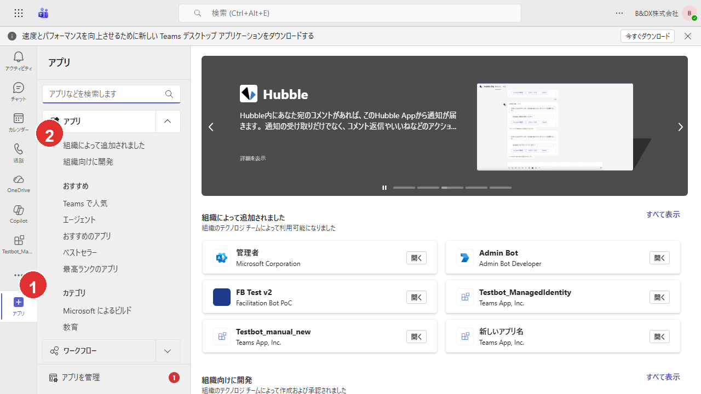

> **図の説明:** (1) 左サイドバーの「アプリ」アイコン (2)「組織向けに開発」カテゴリ

3. 「**組織向けに開発**」セクションでアプリを確認

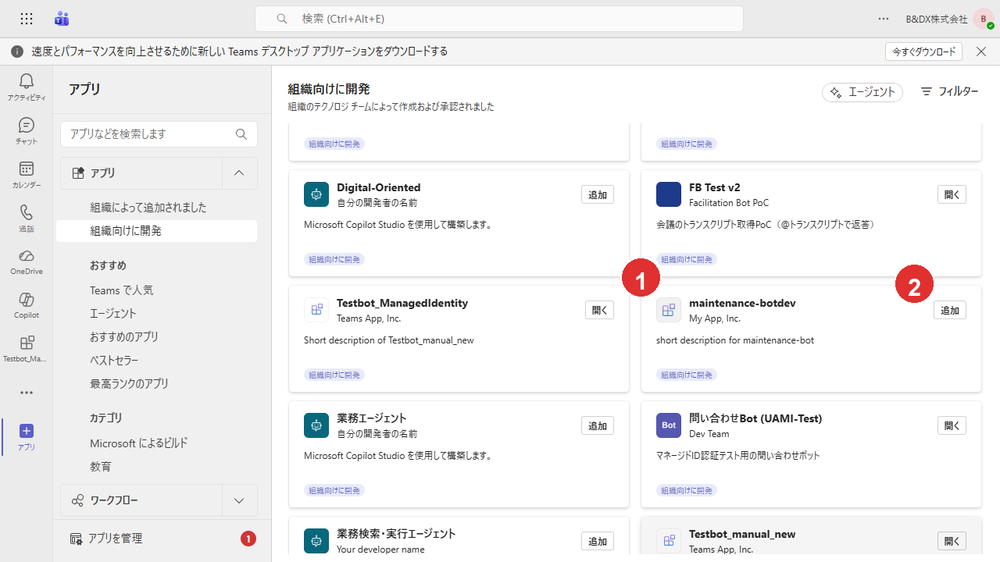

> **図の説明:** (1) 対象アプリ「maintenance-botdev」 (2)「追加」ボタン

4. アプリをクリック →「**追加**」ボタンを押す

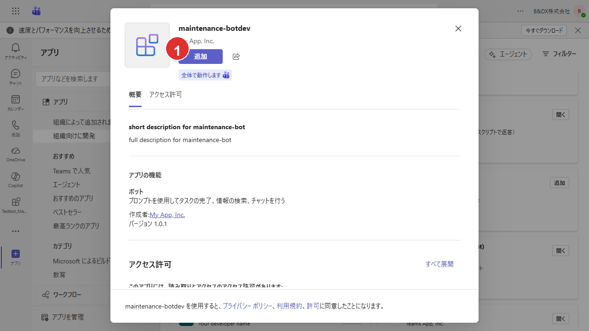

> **図の説明:** (1)「追加」ボタン — クリックしてアプリをインストールする

5. 追加完了 → Bot との 1:1 チャットが開く


6. メッセージを送信 → Adaptive Card で検索カードが応答されることを確認

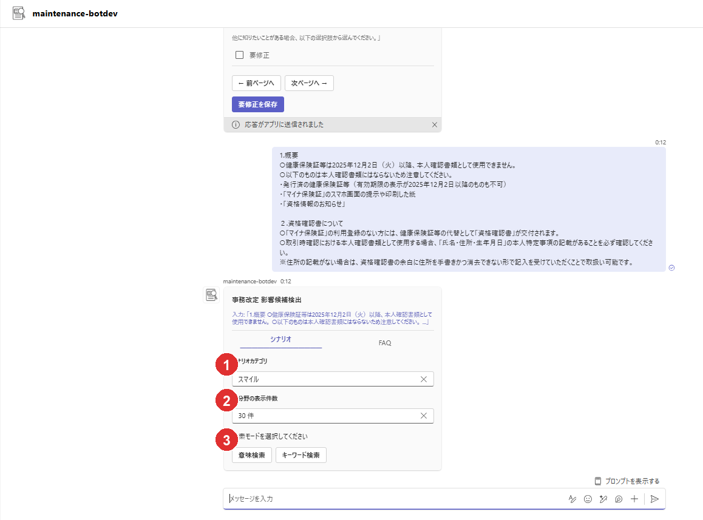

> **図の説明:** (1) カテゴリ単一選択プルダウン (2) 各分野の表示件数プルダウン (3) 検索モードボタン（意味検索/キーワード検索）

カテゴリ選択肢と表示件数の詳細は、プルダウン展開状態のキャプチャで確認する。

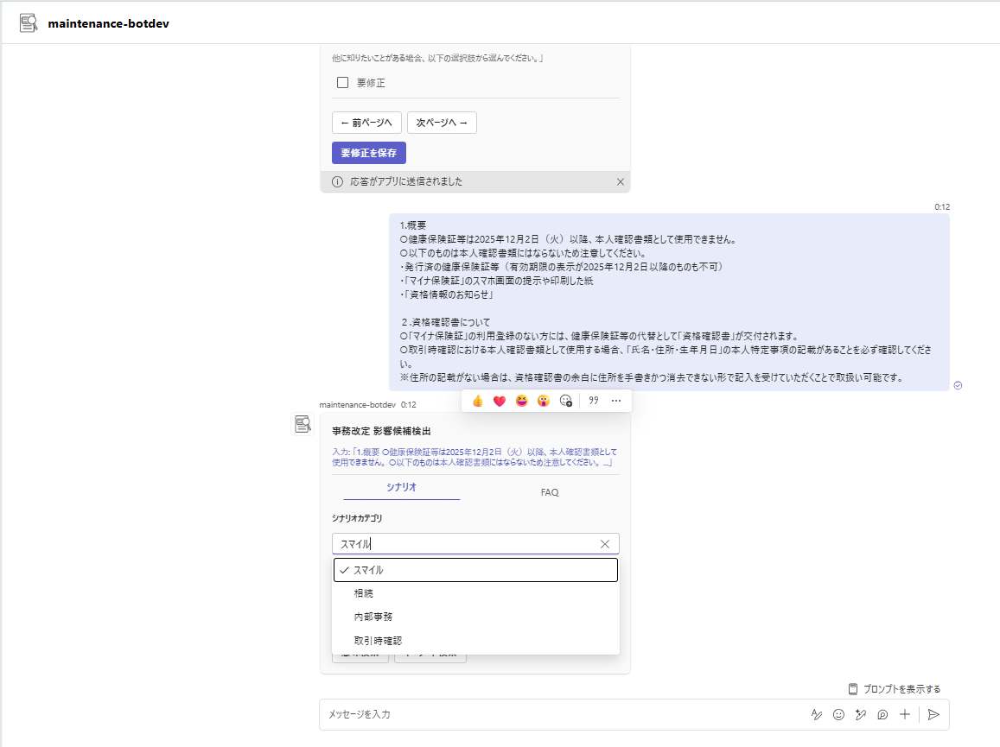

> **図の説明:** シナリオカテゴリの単一選択プルダウンを展開した状態。選択肢はスマイル/相続/内部事務/取引時確認。

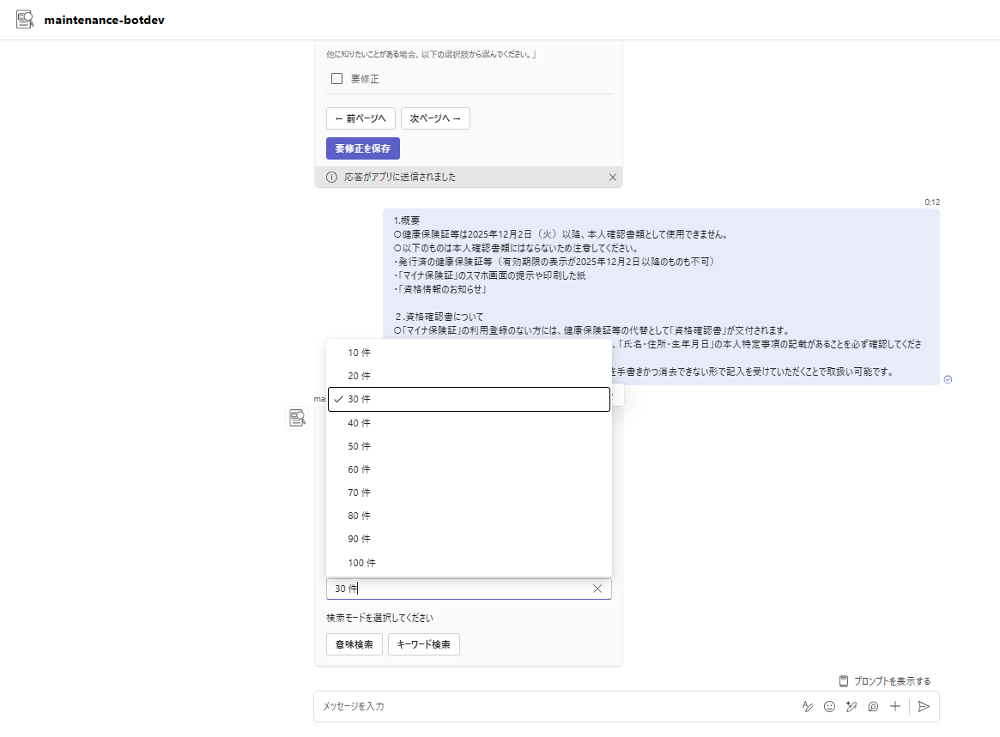

> **図の説明:** 各分野の表示件数プルダウンを展開した状態。選択肢は10件刻み、最大100件。

シナリオタブで要修正フラグを保存すると、完了カードが表示される。

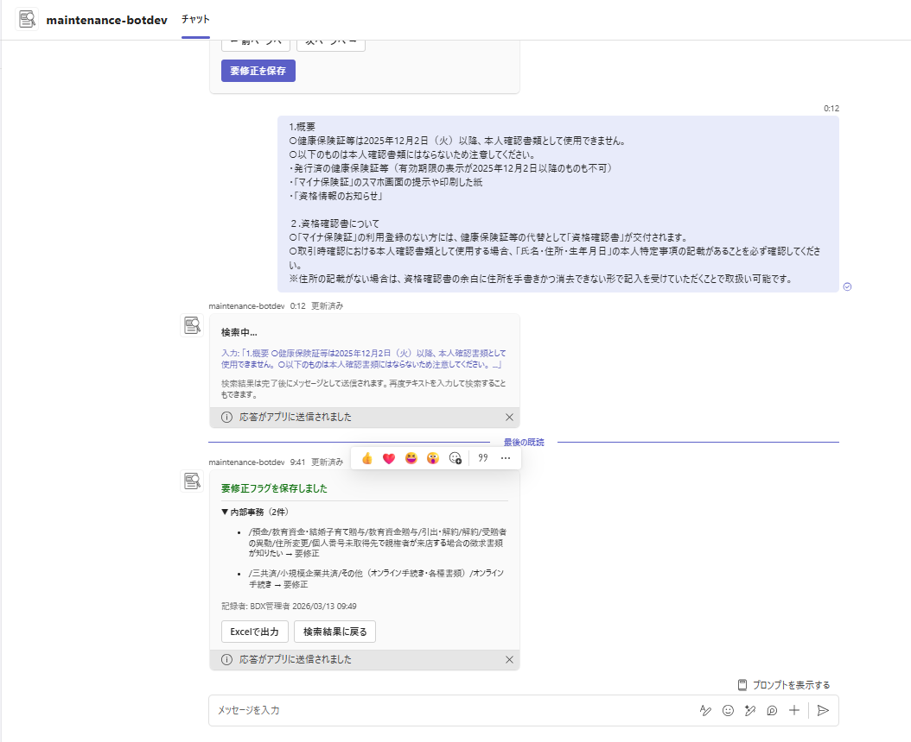

> **図の説明:** 要修正保存完了カード。保存対象のカテゴリと件数が表示され、「Excelで出力」と「検索結果に戻る」ボタンが表示される。

完了カードの「Excelで出力」を押すと、カテゴリ別の Excel ファイルを SharePoint Online にアップロードし、出力完了カードが表示される。

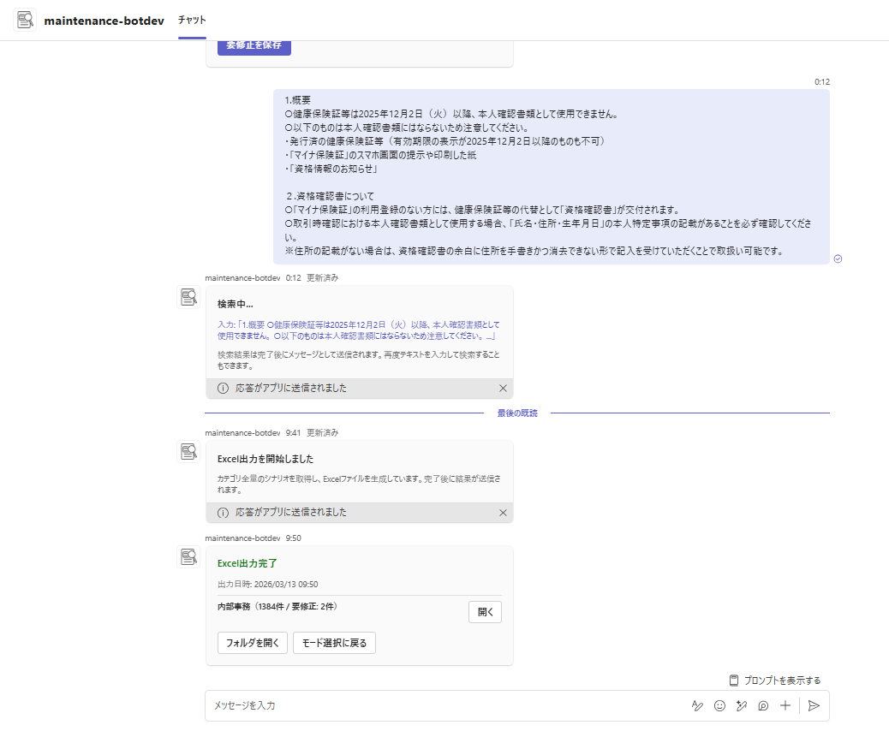

> **図の説明:** Excel 出力完了カード。カテゴリ別ファイルリンクと「フォルダを開く」「モード選択に戻る」ボタンが表示される。

**確認事項:**
- [ ] Teams アプリストアの「組織向けに開発」にアプリが表示される
- [ ] アプリを追加して Bot と 1:1 チャットを開ける
- [ ] メッセージ送信で Adaptive Card（検索カード）が返る
- [ ] 検索を実行して結果が表示される
- [ ] カテゴリ選択がチェックボックスではなく単一選択プルダウンで表示される
- [ ] 表示件数プルダウンから件数を選択できる
- [ ] 要修正保存完了カードに「Excelで出力」と「検索結果に戻る」ボタンが表示される
- [ ] Excel 出力完了カードにカテゴリ別ファイルリンクと「フォルダを開く」「モード選択に戻る」ボタンが表示される

### トラブルシューティング

| 症状 | 原因の可能性 | 対処法 |
|------|------------|--------|
| `Invalid URL`でサーバーが起動しない | Azure SDKクライアントがモジュールトップレベルで初期化されている [3] | `SearchClient`/`CosmosClient`を遅延初期化パターンに変更（Step 12の注記参照） |
| `Invalid URL`でサーバーが起動しない | `.localConfigs`の`AI_SEARCH_ENDPOINT`等が空 | `.localConfigs`の必須項目を確認・設定（Step 14「F5ローカルデバッグ」参照） |
| F5デバッグで認証エラー | `.localConfigs`の`clientId`/`clientSecret`が空 | `env/.env.dev`からBOT_IDを転記、シークレットは`az ad app credential reset`で再生成（Step 14「F5ローカルデバッグ」参照） |
| Botが応答しない | メッセージングエンドポイントの設定誤り | Bot Service「構成」のURLを確認 |
| 403 Forbidden（F5ローカル） | AI SearchのAPIアクセス制御が「APIキーのみ」になっている | AI Searchリソース→「設定」→「キー」→「APIアクセス制御」を「両方」に変更（Step 3「APIアクセス制御の設定」参照） |
| 403 Forbidden（F5ローカル） | 開発者アカウントにAI Searchのロールが未付与 | Step 14「開発者向けロール付与」のAI Search データプレーンロール付与を実施（反映に数分かかる） |
| 403 Forbidden（Azure Web App） | Web AppのManaged Identityのロール付与不足 | Step 10のロール付与を再確認 |
| Indexer失敗 | Azure OpenAI TPM超過 | Embeddingモデルのレート制限を引き上げ |
| Indexer失敗（Cosmos DB） | データソースのManaged Identity設定不備 | AI SearchのMI→Cosmos DB Data Readerを確認 |
| 検索結果が0件 | Indexerが未実行/データ未投入 | Indexerを手動実行、Cosmos DBのデータを確認 |
| Adaptive Cardが表示されない | カードサイズ約28KB超過（Teams の Adaptive Card サイズ上限） | 候補件数を確認し、ページネーションフォールバックを検討 |
| Graph APIアップロード失敗（403） | Web AppのMIに`Files.ReadWrite.All`が未付与 | Step 10「Microsoft Graph API 権限付与」を実施 |
| Graph APIアップロード失敗（404） | `SPO_DRIVE_ID`が誤った値、または対象フォルダが存在しない | Step 10「SPOドライブIDの取得（サイトIDは取得時のみ使用）」でドライブIDを再取得し、対象フォルダ名も確認 |
| 「SharePointへのアップロードに失敗しました」 | Web Appに`SPO_DRIVE_ID`/`SPO_UPLOAD_FOLDER`が未設定（`.localConfigs`にのみ設定しWeb Appへの反映が漏れている） | `az webapp config appsettings list`で確認し、Step 10「SPO環境変数の設定」のWeb App反映コマンドを実行 |
| Application Insightsにログが表示されない | `@azure/monitor-opentelemetry`が未インストール、または`useAzureMonitor()`が未呼出 | Step 12「追加パッケージのインストール」と「Application Insights の有効化」を確認し、再デプロイ |
| `convert-excel-to-json.py` でファイルが見つからない | Excelファイルのパスが異なる | スクリプト内の `RAG_LOCAL_BASE` を実際のパスに修正 |
| `seed-cosmos.js` で JSON が見つからない | Excel→JSON 変換が未実行 | `python scripts/convert-excel-to-json.py` を先に実行 |
| Cosmos DB 投入がスロットリングされる | Serverless RU 消費が多い | バッチサイズ（BATCH_SIZE）を50に下げて再実行 |
| Indexer で一部ドキュメントが失敗 | Embedding API のレート制限 | Indexer のリトライに任せる、または indexer JSON の `batchSize` を50に下げて再デプロイ |
| Bot が 401 Unauthorized を返す | サービスプリンシパル（SP）が未作成 | `az ad sp create --id <BOT_ID>`（Step 9 参照） |
| Teams でメッセージ送信不可（「送信できませんでした」） | マニフェストに `copilotAgents` セクションが残っている | `appPackage/manifest.json` から `copilotAgents` を削除 → 再 Publish（Step 13 参照） |
| Publish 後もアプリが Teams に表示されない | Teams 管理センターでアプリが未承認（ブロック済み） | 管理センターでアプリを「公開」に変更（Step 13 参照） |
| Azure Bot リソースが見つからない | Toolkit Provision は Developer Portal 登録のみ（Azure リソースは作成しない） | `az bot create` で手動作成（Step 8 参照） |
| `clientId` 設定済みだが認証失敗 | `MicrosoftAppId` のみ設定し `clientId` が未設定（またはその逆） [3] | M365 Agents SDK は `clientId`/`clientSecret`/`tenantId` を読む。`MicrosoftApp*` と**両方設定**が必要（Step 12 参照） |

---

## 付録A: リソースID・エンドポイント記録シート

環境構築完了後、以下の情報を記録して管理すること。

| 項目 | 値 |
|------|-----|
| リソースグループ名 | |
| Azure OpenAI エンドポイント | |
| Azure OpenAI デプロイ名 | |
| AI Search エンドポイント | |
| AI Search 管理キー | |
| AI Search インデックス名 | |
| Cosmos DB エンドポイント | |
| Cosmos DB データベース名 | |
| Application Insights 接続文字列 | |
| Web App URL | |
| Web App Managed Identity オブジェクトID | |
| Bot Service アプリID（MicrosoftAppId） | |
| Bot Service テナントID | |
| Bot Service クライアントシークレット | |

---

## 付録B: 月額コスト概算

| リソース | 月額概算 | 備考 |
|---------|---------|------|
| Azure AI Search (Basic) | ~¥10,000 | Semantic Ranker は Basic 料金に含まれる（追加料金なし） |
| Azure OpenAI (S0) | ~¥2,000 | Embedding利用のみ（初期構築時は Indexer による生成でコスト増加） |
| Azure Web App (B1) | ~¥2,000 | Linux, 1コア, 1.75GB |
| Cosmos DB (Serverless) | ~¥1,000 | RU消費量依存 |
| Application Insights | ~¥500 | |
| Azure Bot Service (F0) | ¥0 | Free |
| **合計** | **~¥15,500/月** | |

---

## 付録C: 本番移行時の主要考慮事項

本 PoC 環境から本番環境へ移行する際は、以下の項目を検討すること。

| 項目 | PoC 設定 | 本番推奨 |
|------|---------|----------|
| ネットワーク | 全サービスがパブリックアクセス | VNet 統合 + Private Endpoint で全サービスを閉域化 |
| 認証キー | API キー認証有効（RBAC と併用） | `--disable-local-auth true` で API キー無効化。Managed Identity 認証に完全移行 |
| Bot 認証 | Entra ID アプリ + `clientSecret` を App Service 設定に保存 | Key Vault 参照または証明書利用を検討し、シークレットの平文配置を避ける |
| Azure リソース認証 | Web App / AI Search の Managed Identity を使用 | Managed Identity 維持。不要な接続文字列・キーを追加しない |
| Indexer エラー許容 | `maxFailedItems: -1`（無制限） | 上限値を設定（例: `10`）してデータ欠落を検知 |
| スケーリング | 各サービス最小プラン | 利用規模に応じてスケールアップ（AI Search: Standard 以上推奨） |
| 状態管理 | `MemoryStorage` とインメモリキャッシュを使用 | スケールアウト時は外部ストアへの移行を検討し、再起動で状態が失われる前提を解消する |

### Key Vault の必要性について

本 PoC では Azure AI Search、Cosmos DB、Microsoft Graph へのアクセスに **Managed Identity** を使用しており、これらの Azure リソース間通信には追加シークレットを必要としない。
一方で、Teams / Bot Framework から Bot への認証には Entra ID アプリの `clientSecret` を使用しているため、Bot 認証だけは別途シークレット管理が必要である。
Managed Identity は Azure サービスに自動管理される ID を付与し、Microsoft Entra ID 経由でトークンベースの認証を行う。これにより、Azure リソースアクセス用の接続文字列やパスワードをコードや設定に保持する必要がなくなる [13]。

参考: [Managed identities for Azure resources](https://learn.microsoft.com/en-us/entra/identity/managed-identities-azure-resources/overview)

**Key Vault が必要になるケース:**
- Microsoft Entra 認証をサポートしない外部サービスへの接続（API キー等）
- SSL/TLS 証明書の集中管理
- Bot の `clientSecret` を環境変数から Key Vault 参照（`@Microsoft.KeyVault(SecretUri=...)`）に移行する場合 [10]
- 複数環境でシークレットのローテーションを一元管理したい場合

---

## 参考文献

1. [M365 Agents Toolkit 概要](https://learn.microsoft.com/en-us/microsoftteams/platform/toolkit/agents-toolkit-fundamentals)
2. [M365 Agents SDK npm](https://www.npmjs.com/package/@microsoft/agents-hosting)
3. [M365 Agents SDK ドキュメント](https://learn.microsoft.com/en-us/microsoft-365/agents-sdk/)
4. [Azure Bot 作成（CLI）](https://learn.microsoft.com/en-us/azure/bot-service/abs-quickstart?view=azure-bot-service-4.0)
5. [Teams チャネル接続](https://learn.microsoft.com/en-us/azure/bot-service/channel-connect-teams?view=azure-bot-service-4.0)
6. [Entra ID サービスプリンシパル](https://learn.microsoft.com/en-us/entra/identity-platform/howto-create-service-principal-portal)
7. [AI Search RBAC](https://learn.microsoft.com/en-us/azure/search/search-security-rbac)
8. [Cosmos DB データプレーン RBAC](https://learn.microsoft.com/en-us/azure/cosmos-db/how-to-connect-role-based-access-control)
9. [App Service ZIP デプロイ](https://learn.microsoft.com/en-us/azure/app-service/deploy-zip)
10. [App Service アプリケーション設定](https://learn.microsoft.com/en-us/azure/app-service/configure-common)
11. [Teams カスタムアプリ承認](https://learn.microsoft.com/en-us/microsoftteams/submit-approve-custom-apps)
12. [Teams マニフェスト v1.25](https://learn.microsoft.com/en-us/microsoft-365/extensibility/schema/?view=m365-app-1.25)
13. [Key Vault RBAC](https://learn.microsoft.com/en-us/azure/key-vault/general/rbac-guide)
14. [m365agents.yml リファレンス](https://learn.microsoft.com/en-us/microsoftteams/platform/toolkit/provision)
15. [AI Search Integrated Vectorization](https://learn.microsoft.com/en-us/azure/search/vector-search-integrated-vectorization)
16. [AI Search Cosmos DB Indexer](https://learn.microsoft.com/en-us/azure/search/search-how-to-index-cosmosdb-sql)
17. [Semantic Ranker 有効化](https://learn.microsoft.com/en-us/azure/search/semantic-how-to-enable-disable)
