# Phase2 PoC Azure環境 導入手順書

**文書ID**: SETUP-FAQ-IMPACT-001

**版数**: 2.1

**作成日**: 2026/2/10

**作成者**: デジタル戦略部

**関連文書**: REQ-FAQ-IMPACT-002（Phase2 PoC 要件定義書 v3.4）

---

## 改訂履歴

| 版数 | 日付 | 変更内容 | 担当 |
|------|------|---------|------|
| 1.0 | 2026/2/10 | 初版作成 | デジタル戦略部 |
| 1.1 | 2026/2/10 | セルフレビューによる10件修正: ロール付与先修正（Azure OpenAI→AI Search MI）、データソース/Indexer設計を2系統に変更、SDK選定を要件定義書と整合、Key Vaultロール付与追加、Cosmos DB管理プレーンロール追加、不要な環境変数削除、Week 3注記追加 | デジタル戦略部 |
| 1.2 | 2026/2/10 | リソース命名規則変更（impact→maintenance）、要件定義書参照をv3.2に更新 | デジタル戦略部 |
| 1.3 | 2026/2/10 | Step 8・11・12をM365 Agents Toolkit ベースに書き換え、Step 13にF5ローカルデバッグ追加 | デジタル戦略部 |
| 1.4 | 2026/2/10 | Toolkit v6系対応: `teamsapp.yml`→`m365agents.yml`リネーム、テンプレート選択フロー（Custom Engine Agent → Basic Custom Engine Agent）に修正、プロジェクト構造を実態に合わせ更新、サインイン手順に具体アカウント名を明記 | デジタル戦略部 |
| 1.5 | 2026/2/16 | FR-015 SPO連携: Step 9にGraph API権限付与（`Files.ReadWrite.All`）・SPOサイトID/ドライブID取得手順を追加、`.localConfigs`にSPO環境変数3項目を追加 | デジタル戦略部 |
| 1.6 | 2026/2/20 | Indexerスケジュールを`PT1H`→`PT10M`に変更、差分ベクトル化のコスト特性（ポーリング頻度ではなく変更ドキュメント数に依存）を追記 | デジタル戦略部 |
| 1.7 | 2026/2/20 | 引き継ぎ前整合性修正: HNSWパラメータ（m=10, efSearch=1000）を実装に合わせ更新、Step 13.3に検索チューニングパラメータ表を追加、Step 15.1にローカル/Azure環境変数対応表を追加 | デジタル戦略部 |
| 2.0 | 2026/3/7 | 全面改訂: Step 9（Azure Bot作成）・Step 10（SP作成）新規追加、全15ステップ構成に再編、App Settings をStep 13に統合、マニフェスト修正・管理センター承認手順追加（Step 14）、本番テスト手順追加（Step 15）、スクリーンショット26枚埋め込み、トラブルシューティング5件追加 | デジタル戦略部 |
| 2.1 | 2026/3/7 | クロスドキュメント整合性修正: deployセクションの`APP_SERVICE_NAME`矛盾解消、インデックス定義を`scripts/`と同期（keywordsのfilterable/analyzer修正、path/order/isFinalAnswer/tags追加）、Indexer fieldMappings同期、Adaptive Cardサイズ上限25KBに修正、関連文書版数v3.4更新、サブセクション番号修正（11.5→13.5）、Search Service Contributor削除、SPO環境変数をStep 13一覧表に追記、APIバージョン統一、Key Vault注記追加 | デジタル戦略部 |

---

## 1. 概要

### 1.1 目的

本手順書は、Phase2 PoC「事務改定 影響候補検出システム」のAzure環境を構築するための手順を記載する。要件定義書（REQ-FAQ-IMPACT-002 v3.4）に基づき、Week 1〜2で必要なリソースの作成・設定を行う。

### 1.2 構築対象リソース

| # | リソース | SKU/プラン | 用途 |
|---|---------|-----------|------|
| 1 | リソースグループ | — | 全リソースの論理グループ |
| 2 | Azure OpenAI | Standard S0 | text-embedding-3-large（3,072次元） |
| 3 | Azure AI Search | Basic | ハイブリッド検索、Semantic Ranker、Indexer |
| 4 | Cosmos DB | Serverless（NoSQL API） | シナリオ・FAQ・影響判定マスタデータ |
| 5 | Key Vault | Standard | シークレット管理 |
| 6 | Application Insights | — | 監視・ログ |
| 7 | App Service（Web App） | Basic B1 | Botバックエンド |
| 8 | Azure Bot Service | F0（Free） | Teamsチャネル登録（Single-Tenant）— CLIで手動作成（Step 9） |

### 1.3 全体構築フロー

```
Step 1: リソースグループ作成
  ↓
Step 2: Azure OpenAI 作成 + Embeddingモデルデプロイ
  ↓
Step 3: Azure AI Search 作成 + Semantic Ranker有効化
  ↓
Step 4: Cosmos DB 作成 + コンテナ作成
  ↓
Step 5: Key Vault 作成
  ↓
Step 6: Application Insights 作成
  ↓
Step 7: App Service (Web App) 作成 + Managed Identity有効化
  ↓
Step 8: M365 Agents Toolkit セットアップ + Provision
        （Entra IDアプリ登録 + Developer Portal登録のみ。Azureリソースは作成されない）
  ↓
Step 9: Azure Bot リソース作成 + Teamsチャネル追加
  ↓
Step 10: サービスプリンシパル作成
  ↓
Step 11: Managed Identityロール付与 + Graph API権限付与（SPO連携用）
  ↓
Step 12: AI Search インデックス・データソース・Skillset・Indexer設定
  ↓
Step 13: Botアプリケーション実装 + App Settings設定 + Toolkit Deploy
  ↓
Step 14: マニフェスト修正 + Teamsアプリ登録（Publish）+ 管理センター承認
  ↓
Step 15: 動作確認（F5ローカルデバッグ + 本番テスト）
```

---

## 2. 前提条件

### 2.1 Azureサブスクリプション

| 項目 | 要件 |
|------|------|
| サブスクリプション | 有効なAzureサブスクリプション |
| 権限 | サブスクリプションの「所有者」または「共同作成者」ロール |
| リージョン | Japan East（東日本）を推奨。Semantic RankerとAzure OpenAIが利用可能であること |
| Azure OpenAI利用申請 | 事前にAzure OpenAIの利用申請が承認済みであること |

### 2.2 Microsoft 365 / Teams

| 項目 | 要件 |
|------|------|
| Microsoft 365ライセンス | Teams利用可能なライセンス |
| Teams管理者権限 | カスタムアプリのサイドロードが許可されていること |
| Teams管理センター権限 | カスタムアプリの承認・公開権限（Teams管理者ロール） |
| Entra ID | アプリ登録の権限（アプリケーション管理者以上） |

### 2.3 開発環境

| ツール | バージョン | 用途 |
|--------|----------|------|
| Azure CLI | 2.60以上 | リソース作成・ロール付与 |
| Node.js | 20 LTS以上 | Botアプリケーション開発 |
| Visual Studio Code | 最新版 | 開発エディタ |
| M365 Agents Toolkit拡張機能 | 最新版 | VS Code拡張（旧Teams Toolkit） |

### 2.4 命名規則

本手順書では以下の命名規則を使用する。`<env>`はPoC環境を示す識別子（例: `poc`）に置き換えること。

| リソース | 命名例 |
|---------|--------|
| リソースグループ | `rg-maintenance-<env>` |
| Azure OpenAI | `aoai-maintenance-<env>` |
| Azure AI Search | `srch-maintenance-<env>` |
| Cosmos DB | `cosmos-maintenance-<env>` |
| Key Vault | `kv-maintenance-<env>` |
| Application Insights | `appi-maintenance-<env>` |
| App Service Plan | `asp-maintenance-<env>` |
| Web App | `app-maintenance-bot-<env>` |
| Azure Bot Service | `bot-maintenance-<env>` |

---

## 3. Step 1: リソースグループ作成

**Azureポータル手順:**

1. Azure Portal（https://portal.azure.com）にサインイン
2. 「リソースグループ」→「作成」を選択
3. 以下を入力:

| 項目 | 値 |
|------|-----|
| サブスクリプション | 対象サブスクリプション |
| リソースグループ名 | `rg-maintenance-poc` |
| リージョン | Japan East |

4. 「確認および作成」→「作成」を選択

**Azure CLI:**

```bash
az group create \
  --name rg-maintenance-poc \
  --location japaneast
```

---

## 4. Step 2: Azure OpenAI リソース作成

### 4.1 リソース作成

1. Azure Portal →「リソースの作成」→「Azure OpenAI」を検索
2. 以下を入力:

| 項目 | 値 |
|------|-----|
| サブスクリプション | 対象サブスクリプション |
| リソースグループ | `rg-maintenance-poc` |
| リージョン | Japan East |
| 名前 | `aoai-maintenance-poc` |
| 価格レベル | Standard S0 |

3. ネットワーク: 「すべてのネットワーク」（PoCのため。本番ではプライベートエンドポイント推奨）
4. 「確認して作成」→「作成」

**Azure CLI:**

```bash
az cognitiveservices account create \
  --name aoai-maintenance-poc \
  --resource-group rg-maintenance-poc \
  --kind OpenAI \
  --sku S0 \
  --location japaneast
```

### 4.2 Embeddingモデルのデプロイ

1. 作成したAzure OpenAIリソースに移動
2. 「モデルデプロイ」→「デプロイの管理」→ Azure AI Foundry（旧Azure OpenAI Studio）が開く
3. 「デプロイ」→「モデルのデプロイ」→「基本モデルをデプロイする」を選択
4. 以下を設定:

| 項目 | 値 |
|------|-----|
| モデル | text-embedding-3-large |
| デプロイ名 | `text-embedding-3-large` |
| デプロイの種類 | Standard |
| TPMレート制限 | 120K（推奨。Indexer実行中にスロットリングを避けるため） |

5. 「デプロイ」を選択

**注意:** デプロイ名はAI SearchのSkillset/Vectorizer設定で使用するため、正確に記録すること。

### 4.3 確認事項

- [ ] リソースが正常に作成された
- [ ] エンドポイントURLを記録した（例: `https://aoai-maintenance-poc.openai.azure.com/`）
- [ ] Embeddingモデルがデプロイ済み
- [ ] デプロイ名を記録した

---

## 5. Step 3: Azure AI Search 作成

### 5.1 リソース作成

1. Azure Portal →「リソースの作成」→「Azure AI Search」を検索
2. 以下を入力:

| 項目 | 値 |
|------|-----|
| サブスクリプション | 対象サブスクリプション |
| リソースグループ | `rg-maintenance-poc` |
| サービス名 | `srch-maintenance-poc` |
| 場所 | Japan East |
| 価格レベル | **Basic** |

3. 「確認して作成」→「作成」

**Azure CLI:**

```bash
az search service create \
  --name srch-maintenance-poc \
  --resource-group rg-maintenance-poc \
  --sku basic \
  --location japaneast
```

**価格レベルにBasic以上を選択する理由:**
Semantic RankerはBasic以上で利用可能。Free tierでは使用不可。

### 5.2 APIアクセス制御の設定（RBAC有効化）

BotアプリがManaged IdentityでAI Searchにアクセスするため、ロールベースのアクセス制御（RBAC）を有効化する。デフォルトはAPIキーのみ許可のため、この設定を行わないとRBAC認証で403エラーになる。

**Azure Portal:**

1. AI Searchリソース →「設定」→「キー」を選択
2. 「APIアクセス制御」セクションで「**両方**」を選択（APIキーとロールベースの両方を許可）
3. 「はい」を押下して確認

**Azure CLI:**

```bash
az search service update \
  --name srch-maintenance-poc \
  --resource-group rg-maintenance-poc \
  --auth-options aadOrApiKey \
  --aad-auth-failure-mode http401WithBearerChallenge
```

**注記:** `aadOrApiKey` はRBAC認証（Azure AD/Entra ID）とAPIキー認証の両方を許可する設定。本番環境でAPIキーを完全に無効化する場合は `--disable-local-auth true` を使用する（`--auth-options` とは排他）。

### 5.3 Semantic Rankerの有効化

1. 作成したAI Searchリソースに移動
2. 左メニュー →「設定」→「Semantic ranker」を選択
3. **Free**プランを選択（PoCでは月1,000クエリ以内のため十分）
4. 「プランの選択」を押下

**注記:** Free プランは月1,000クエリまで。超過した場合はStandardプラン（従量課金）に切り替え可能。PoCの検証規模ではFreeプランで十分。

### 5.4 Managed Identity（システム割り当て）の有効化

AI SearchのIndexerがCosmos DBに接続する際にManaged Identityを使用するため、有効化する。

1. AI Searchリソース →「設定」→「ID」を選択
2. 「システム割り当て」タブ →「状態」を**オン**に切り替え
3. 「保存」を選択

### 5.5 確認事項

- [ ] AI Searchリソースが正常に作成された（Basic SKU）
- [ ] APIアクセス制御が「両方」に設定された（RBAC + APIキー）
- [ ] Semantic Rankerが有効化された（Freeプラン）
- [ ] システム割り当てManaged Identityが有効
- [ ] サービスURLを記録した（例: `https://srch-maintenance-poc.search.windows.net`）
- [ ] 管理キーを記録した（Key Vault格納用）

---

## 6. Step 4: Cosmos DB 作成

### 6.1 リソース作成

1. Azure Portal →「リソースの作成」→「Azure Cosmos DB」を検索
2. 「Azure Cosmos DB for NoSQL」を選択 →「作成」
3. 以下を入力:

| 項目 | 値 |
|------|-----|
| サブスクリプション | 対象サブスクリプション |
| リソースグループ | `rg-maintenance-poc` |
| アカウント名 | `cosmos-maintenance-poc` |
| 場所 | Japan East |
| 容量モード | **サーバーレス** |

4. 「確認して作成」→「作成」

**Azure CLI:**

```bash
az cosmosdb create \
  --name cosmos-maintenance-poc \
  --resource-group rg-maintenance-poc \
  --locations regionName=japaneast \
  --capabilities EnableServerless
```

### 6.2 データベースとコンテナの作成

Cosmos DBリソース作成後、データエクスプローラーで以下を作成する。

**データベース作成:**

1. 「データ エクスプローラー」→「New Database」
2. Database id: `maintenance-db`

**コンテナ作成（3つ）:**

| コンテナ名 | パーティションキー | 用途 |
|-----------|-----------------|------|
| `scenarios` | `/categoryId` | シナリオマスタデータ |
| `faqs` | `/categoryId` | FAQマスタデータ |
| `impactAssessments` | `/searchId` | 要修正フラグの判定記録 |

各コンテナの作成手順:

1. `maintenance-db`を右クリック →「New Container」
2. Container id と Partition key を上表の通り入力
3. 「OK」を選択

**Azure CLI:**

```bash
# データベース作成
az cosmosdb sql database create \
  --account-name cosmos-maintenance-poc \
  --resource-group rg-maintenance-poc \
  --name maintenance-db

# scenariosコンテナ
az cosmosdb sql container create \
  --account-name cosmos-maintenance-poc \
  --resource-group rg-maintenance-poc \
  --database-name maintenance-db \
  --name scenarios \
  --partition-key-path /categoryId

# faqsコンテナ
az cosmosdb sql container create \
  --account-name cosmos-maintenance-poc \
  --resource-group rg-maintenance-poc \
  --database-name maintenance-db \
  --name faqs \
  --partition-key-path /categoryId

# impactAssessmentsコンテナ
az cosmosdb sql container create \
  --account-name cosmos-maintenance-poc \
  --resource-group rg-maintenance-poc \
  --database-name maintenance-db \
  --name impactAssessments \
  --partition-key-path /searchId
```

### 6.3 Soft Delete検知用プロパティの確認

`scenarios`と`faqs`コンテナのドキュメントには`isDeleted`フィールドを含める。AI Search Indexerはこのフィールドを参照してSoft Delete検知を行う。データ投入時にデフォルト値`false`を設定すること。

### 6.4 確認事項

- [ ] Cosmos DBアカウントが正常に作成された（Serverless）
- [ ] `maintenance-db`データベースが作成された
- [ ] 3つのコンテナが作成された（`scenarios`, `faqs`, `impactAssessments`）
- [ ] エンドポイントURLを記録した（例: `https://cosmos-maintenance-poc.documents.azure.com:443/`）

---

## 7. Step 5: Key Vault 作成

1. Azure Portal →「リソースの作成」→「Key Vault」を検索
2. 以下を入力:

| 項目 | 値 |
|------|-----|
| サブスクリプション | 対象サブスクリプション |
| リソースグループ | `rg-maintenance-poc` |
| Key Vault名 | `kv-maintenance-poc` |
| リージョン | Japan East |
| 価格レベル | Standard |
| アクセス許可モデル | Azure ロールベースのアクセス制御（RBAC） |

3. 「確認して作成」→「作成」

**シークレット登録（必要に応じて）:**

API キーをManaged Identityではなくキーで認証する場合、以下をシークレットとして登録する。

| シークレット名 | 値 |
|--------------|-----|
| `AiSearchAdminKey` | AI Searchの管理キー |
| `CosmosDbKey` | Cosmos DBの主キー（Managed Identity使用時は不要） |

**注記:** 本手順書ではManaged Identityによる認証を基本方針とするため、Key Vaultのシークレットは最小限とする。

---

## 8. Step 6: Application Insights 作成

1. Azure Portal →「リソースの作成」→「Application Insights」を検索
2. 以下を入力:

| 項目 | 値 |
|------|-----|
| サブスクリプション | 対象サブスクリプション |
| リソースグループ | `rg-maintenance-poc` |
| 名前 | `appi-maintenance-poc` |
| リージョン | Japan East |
| ワークスペース | 既存のLog Analyticsワークスペース、またはデフォルト |

3. 「確認して作成」→「作成」
4. 作成後、「接続文字列」を記録（Botアプリケーション設定で使用）

---

## 9. Step 7: App Service (Web App) 作成

### 9.1 App Serviceプランの作成

1. Azure Portal →「リソースの作成」→「App Service」を検索
2. 以下を入力:

| 項目 | 値 |
|------|-----|
| サブスクリプション | 対象サブスクリプション |
| リソースグループ | `rg-maintenance-poc` |
| 名前 | `app-maintenance-bot-poc` |
| 公開 | コード |
| ランタイムスタック | Node 20 LTS |
| オペレーティングシステム | Linux |
| 地域 | Japan East |
| App Serviceプラン | 新規作成: `asp-maintenance-poc`、SKU: **Basic B1** |

3. 「確認して作成」→「作成」

### 9.2 システム割り当てManaged Identityの有効化

1. 作成したWeb Appに移動
2. 左メニュー →「設定」→「ID」
3. 「システム割り当て」タブ → 状態を**オン**
4. 「保存」→ 確認ダイアログで「はい」
5. 表示される**オブジェクトID（プリンシパルID）** を記録（ロール付与で使用）

### 9.3 アプリケーション設定

> **注記:** アプリケーション設定（環境変数）は **Step 13** で Bot 実装・Deploy と合わせて設定する。この時点では BOT_ID が未確定のため、設定は不要。

### 9.4 確認事項

- [ ] Web Appが正常に作成された（Node 20 LTS, Linux, B1）
- [ ] Managed Identityが有効化され、オブジェクトIDを記録した
- [ ] メッセージングエンドポイントURL: `https://app-maintenance-bot-poc.azurewebsites.net/api/messages`

---

## 10. Step 8: M365 Agents Toolkit セットアップ + Provision

本ステップでは、VS CodeのM365 Agents Toolkit拡張機能を使用して、以下を自動化する:

- Entra IDアプリ登録（Single-Tenant）+ クライアントシークレット生成
- Bot Framework Developer Portal への登録
- Teamsアプリ登録・パッケージ化

> **重要:** Toolkit の Provision は **Azure Bot リソース（`Microsoft.BotService/botServices`）を作成しない**。Developer Portal への登録のみ行う。Azure Bot リソースの作成は **Step 9** で別途行う。

**注記:** Multi-Tenant構成は2025年7月31日以降、新規作成が非推奨となった。本手順ではSingle-Tenant + クライアントシークレット構成を使用する。本番環境では User-Assigned Managed Identity への移行を推奨する。

### 10.1 VS Code拡張機能のインストール

1. VS Codeの拡張機能マーケットプレイス（Ctrl+Shift+X）を開く
2. 「Microsoft 365 Agents Toolkit」を検索
3. インストール後、VS Codeを再読み込み
4. 左サイドバーに**M365 Agents Toolkit アイコン**（ドキュメント+稲妻マーク、下部に「M365」表記）が表示されることを確認

**参考:** https://marketplace.visualstudio.com/items?itemName=TeamsDevApp.ms-teams-vscode-extension

### 10.2 Azureアカウントのサインイン

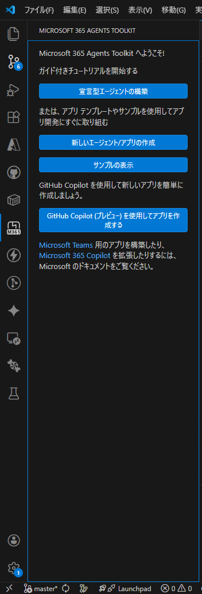

1. 左サイドバーの **M365 Agents Toolkit アイコン**（ドキュメント+稲妻マーク、下部に「M365」表記）をクリック
2. 「ACCOUNTS」セクションで **Azure にサインイン**（`admin@bdxcorp.onmicrosoft.com`、サブスクリプションの所有者/共同作成者権限）
3. サインイン完了後、サブスクリプション名「**Azure subscription 1**」が表示されることを確認

> **注意:** Microsoft 365 へのサインインはこの時点では不要。Provision実行時（Step 10.6）に求められるため、そのタイミングで行う。

### 10.3 プロジェクト作成

プロジェクトタイプ → テンプレート → 言語 → フォルダ → アプリ名の順に選択する。

1. M365 Agents Toolkit サイドバーで「**新しいエージェント/アプリの作成**」（Create a New Agent/App）をクリック
2. プロジェクトタイプ選択: **Custom Engine Agent**（AI Agentグループ内）
3. テンプレート選択: **Basic Custom Engine Agent**（M365 Agents SDKテンプレート）
4. LLMサービス選択: **Azure OpenAI** を選択し、以下を入力（※後で`m365agents.yml`カスタマイズ時に変更するため仮値で可）:
   - Azure OpenAI Key: 任意の仮値
   - Azure OpenAI Endpoint: `https://aoai-maintenance-poc.openai.azure.com/`
   - Model Name: `text-embedding-3-large`
5. プログラミング言語: **TypeScript**
6. Default folder: `C:\VSCode\rag\rag-maintenance\`
7. Application Name: `maintenance-bot`

> **補足:** テンプレート選択時の全体構造は以下の通り。本手順ではBotアプリからAzure OpenAIを直接呼び出さない方針（要件定義書8.4参照）だが、M365 Agents SDKベースのプロジェクト構造を得るためCustom Engine Agentを選択する。LLM接続部分はStep 10.4で削除・変更する。
>
> - **AI Agent** → Declarative Agent（No plugin / With API Plugin）
> - **AI Agent** → **Custom Engine Agent**（**Basic Custom Engine Agent** / Weather Agent）← 本手順で選択
> - **AI Agent** → Copilot Connector（Graph Connector）
> - **Apps for Microsoft 365** → Teams Agents and Apps（General Teams Agent / Simple Bot 等）
> - **Apps for Microsoft 365** → Office Add-in（Excel / Word / Outlook）

**生成されるプロジェクト構造（Toolkit v6系）:**

```
maintenance-bot/
├── .vscode/
│   ├── extensions.json
│   ├── launch.json            # デバッグプロファイル
│   ├── settings.json
│   └── tasks.json             # ビルド/デバッグタスク
├── appPackage/
│   ├── manifest.json          # Teamsアプリマニフェスト（${{変数名}}プレースホルダー）
│   ├── color.png              # カラーアイコン（192x192）
│   └── outline.png            # アウトラインアイコン（32x32）
├── infra/
│   ├── azure.bicep            # Azureリソース定義
│   ├── azure.parameters.json  # パラメータファイル
│   └── botRegistration/
│       └── azurebot.bicep     # Bot Service定義
├── env/
│   ├── .env.local             # ローカル環境変数
│   ├── .env.local.user        # ローカル機密情報（gitignore済み）
│   ├── .env.dev               # リモート環境変数
│   ├── .env.dev.user          # リモート機密情報（gitignore済み）
│   ├── .env.playground        # Playground環境
│   ├── .env.playground.user
│   ├── .env.sandbox           # Sandbox環境
│   └── .env.sandbox.user
├── src/
│   ├── index.ts               # エントリポイント（Express server）
│   ├── agent.ts               # エージェントロジック（LLM呼出し）
│   └── config.ts              # 設定読み込み
├── m365agents.yml             # メインライフサイクル定義（provision/deploy/publish）
├── m365agents.local.yml       # ローカルデバッグ用オーバーライド
├── m365agents.playground.yml  # Playground用
├── m365agents.sandbox.yml     # Sandbox用
├── .webappignore              # デプロイ除外設定
├── web.config                 # IIS設定（Azure App Service用）
├── package.json
└── tsconfig.json
```

> **注意:** Toolkit v6系（M365 Agents Toolkit）ではライフサイクル定義ファイルが旧`teamsapp.yml`から**`m365agents.yml`**に改名されている。

### 10.3.1 依存パッケージのインストール

プロジェクト作成直後に依存パッケージをインストールする:

```bash
cd maintenance-bot
npm install
```

正常に完了すると約226パッケージがインストールされる。`found 0 vulnerabilities` と表示されればOK。

### 10.4 m365agents.yml のカスタマイズ（既存リソース参照）

生成されたデフォルトの`m365agents.yml`を編集し、Step 1〜7で作成済みのリソースを使用するようカスタマイズする。

> **注意:** Toolkit v6系では旧`teamsapp.yml`が`m365agents.yml`に改名されている。

**m365agents.yml の provision セクション:**

```yaml
provision:
  # 1. Entra IDアプリ登録（Single-Tenant）+ クライアントシークレット自動生成
  - uses: botAadApp/create
    with:
      name: app-maintenance-bot-poc
    writeToEnvironmentFile:
      botId: BOT_ID
      botPassword: SECRET_BOT_PASSWORD

  # 2. Bot Framework登録 + Teamsチャネル有効化
  - uses: botFramework/create
    with:
      botId: ${{BOT_ID}}
      name: bot-maintenance-poc
      messagingEndpoint: https://app-maintenance-bot-poc.azurewebsites.net/api/messages
      description: "事務改定 影響候補検出Bot"
      channels:
        - name: msteams

  # 3. Teamsアプリ登録
  - uses: teamsApp/create
    with:
      name: maintenance-bot${{APP_NAME_SUFFIX}}
    writeToEnvironmentFile:
      teamsAppId: TEAMS_APP_ID

  # NOTE: arm/deploy は削除。Web App・App Service Plan等はStep 1〜7で作成済み。

  # 4. マニフェストバリデーション + パッケージ化
  - uses: teamsApp/validateManifest
    with:
      manifestPath: ./appPackage/manifest.json
  - uses: teamsApp/zipAppPackage
    with:
      manifestPath: ./appPackage/manifest.json
      outputZipPath: ./appPackage/build/appPackage.${{TEAMSFX_ENV}}.zip
      outputFolder: ./appPackage/build
  - uses: teamsApp/validateAppPackage
    with:
      appPackagePath: ./appPackage/build/appPackage.${{TEAMSFX_ENV}}.zip
  - uses: teamsApp/update
    with:
      appPackagePath: ./appPackage/build/appPackage.${{TEAMSFX_ENV}}.zip
```

**デフォルトからの変更点:**

- `arm/deploy`アクション（Bicepによるリソース作成）を**削除**。Web App・App Service Plan等はStep 1〜7で作成済みのため
- `teamsApp/extendToM365`アクションを**削除**。M365 Copilot統合はPoC範囲外
- `botAadApp/create`を**追加**。Entra IDアプリ登録 + クライアントシークレット自動生成を実行する（`generateClientSecret`プロパティは不要、自動で生成される）
- `botFramework/create`を**追加**。Azure Bot Service登録 + Teamsチャネル有効化を実行する
- 生成された`BOT_ID`と`SECRET_BOT_PASSWORD`は`env/.env.dev`と`env/.env.dev.user`に自動書き込みされる
- LLM接続用の環境変数（`AZURE_OPENAI_API_KEY`等）が`src/config.ts`で参照されている場合、BotからAzure OpenAIを直接呼び出さない方針のため不要。削除するか空値にする

### 10.5 環境変数ファイルの設定

**env/.env.dev:**（手動記入が必要な項目に `←手動` と記載）

```env
# Built-in environment variables
TEAMSFX_ENV=dev
APP_NAME_SUFFIX=dev

# 既存リソース情報 ←手動記入
AZURE_SUBSCRIPTION_ID=5a471c83-2f59-4509-806a-3c1fc77bb89a
AZURE_RESOURCE_GROUP_NAME=rg-maintenance-poc

# Provision実行後に自動書き込みされる
# BOT_ID=<自動生成>
# TEAMS_APP_ID=<自動生成>

# 既存リソースのエンドポイント ←手動記入（Bot実装時に使用）
AI_SEARCH_ENDPOINT=https://srch-maintenance-poc.search.windows.net
AI_SEARCH_INDEX_NAME=maintenance-search-index
COSMOS_DB_ENDPOINT=https://cosmos-maintenance-poc.documents.azure.com:443/
COSMOS_DB_DATABASE=maintenance-db
```

**env/.env.dev.user:**（Provision後に自動書き込み、手動編集不要）

```env
# Provision実行後に自動書き込みされる
# SECRET_BOT_PASSWORD=<自動生成>
```

> **注意:** `m365agents.yml` の deploy セクションで Web App のリソースIDを直接指定しているため、`APP_SERVICE_NAME` 環境変数は不要。

### 10.6 Provision実行

> **前提:** VS Codeで `maintenance-bot` フォルダを開いていること（`m365agents.yml` がワークスペースルートにある必要がある）。親フォルダ（`rag-maintenance`）で開いている場合、Provisionコマンドが表示されない場合がある。

**方法A: サイドバーから実行（推奨）**

1. 左サイドバーの **M365 Agents Toolkit アイコン**（ドキュメント+稲妻マーク、下部に「M365」表記）をクリック
2. **LIFECYCLE** セクションの「**Provision**」をクリック
3. 環境: `dev` を選択
4. **Microsoft 365 へのサインイン**が求められる → `admin@bdxcorp.onmicrosoft.com`（Teams管理者権限）でサインイン
5. サブスクリプション: `Azure subscription 1` を選択

**方法B: コマンドパレットから実行**

1. Ctrl+Shift+P →「**Microsoft 365 Agents: Provision**」を検索・選択
2. 以降は方法Aの手順3〜5と同じ

> **注意:** コマンドパレットのカテゴリは「Microsoft 365 Agents」（「M365 Agents Toolkit」ではない）。`m365agents.yml`が存在するプロジェクトを開いていないとコマンドが表示されない。

**Toolkitが以下を自動実行:**

- Entra IDアプリ登録（Single-Tenant）+ クライアントシークレット生成
- Bot Framework Developer Portal への登録（**Azure Botリソースは作成されない**）
- Teamsアプリ登録・パッケージ化

**完了後:** `env/.env.dev`に`BOT_ID`が、`env/.env.dev.user`に`SECRET_BOT_PASSWORD`が書き込まれる

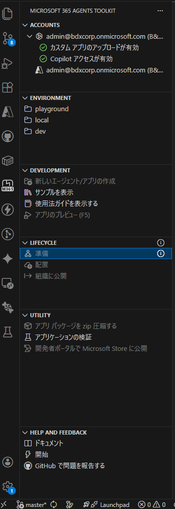

### 10.7 確認事項

- [ ] M365 Agents Toolkit拡張機能がインストール済み
- [ ] Azure / M365 アカウントにサインイン済み
- [ ] プロジェクトが作成された（`maintenance-bot/`）
- [ ] `m365agents.yml`がカスタマイズ済み（既存リソース参照）
- [ ] Provisionが正常に完了した
- [ ] `BOT_ID`（MicrosoftAppId）が `env/.env.dev` に記録された
- [ ] `SECRET_BOT_PASSWORD`（MicrosoftAppPassword）が `env/.env.dev.user` に記録された

> **注記:** Web Appのアプリケーション設定（環境変数）は **Step 13** で Bot 実装・Deploy と合わせて設定する。

---

## 11. Step 9: Azure Bot リソース作成 + Teams チャネル追加

Toolkit の Provision（Step 8）は Developer Portal への登録のみ行い、Azure Bot リソース（`Microsoft.BotService/botServices`）は作成しない。本ステップで Azure Bot リソースを CLI で作成し、Teams チャネルを追加する。

### 11.1 Azure Bot リソース作成

```bash
az bot create \
  --resource-group rg-maintenance-poc \
  --name bot-maintenance-poc \
  --app-type SingleTenant \
  --appid <BOT_ID> \
  --tenant-id <テナントID> \
  --endpoint https://app-maintenance-bot-poc.azurewebsites.net/api/messages \
  --sku F0
```

| パラメータ | 値 | 備考 |
|-----------|-----|------|
| `--name` | `bot-maintenance-poc` | 命名規則に従う |
| `--app-type` | `SingleTenant` | Multi-Tenant は非推奨 |
| `--appid` | Step 8 Provision で取得した `BOT_ID` | `env/.env.dev` に記録済み |
| `--tenant-id` | Entra ID テナントID | `env/.env.dev` の `TEAMS_APP_TENANT_ID` |
| `--endpoint` | `https://app-maintenance-bot-poc.azurewebsites.net/api/messages` | Web App の URL + `/api/messages` |
| `--sku` | `F0` | Free プラン（PoC） |

**参考:** [Azure Bot リソースの作成](https://learn.microsoft.com/en-us/azure/bot-service/abs-quickstart?view=azure-bot-service-4.0)

### 11.2 Teams チャネル追加

```bash
az bot msteams create \
  --resource-group rg-maintenance-poc \
  --name bot-maintenance-poc
```

**参考:** [Teams チャネルへの接続](https://learn.microsoft.com/en-us/azure/bot-service/channel-connect-teams?view=azure-bot-service-4.0)

### 11.3 確認事項

- [ ] Azure Portal → Bot Services で `bot-maintenance-poc` が表示される
- [ ] チャネル一覧に「Microsoft Teams」が「実行中」で表示される
- [ ] メッセージングエンドポイントが正しい URL を指している

---

## 12. Step 10: サービスプリンシパル作成

Step 8 の Provision で作成された Entra ID アプリ登録に対して、サービスプリンシパル（SP）を作成する。SP が存在しないと Bot が **401 Unauthorized** エラーを返す。

### 12.1 サービスプリンシパルの存在確認

```bash
az ad sp show --id <BOT_ID> --query "{appId:appId, displayName:displayName}" -o table
```

- 結果が返る → SP は既に存在する（Step 12.2 はスキップ）
- `Resource ... does not exist` → SP が未作成（Step 12.2 へ進む）

### 12.2 サービスプリンシパルの作成

```bash
az ad sp create --id <BOT_ID>
```

### 12.3 確認事項

- [ ] `az ad sp show --id <BOT_ID>` で SP の情報が返る
- [ ] `appId` が Step 8 で取得した `BOT_ID` と一致する

**参考:** [サービスプリンシパルの作成](https://learn.microsoft.com/en-us/entra/identity-platform/howto-create-service-principal-portal)

---

## 13. Step 11: Managed Identity ロール付与

各リソースのManaged Identityに対して、必要なアクセス権限を付与する。

### 13.1 ロール付与一覧

**AI SearchのManaged Identity向け:**

| 対象リソース | ロール名 | 付与先 | 用途 |
|-------------|---------|--------|------|
| Azure OpenAI | `Cognitive Services OpenAI User` | **AI Search**のManaged Identity | Skillset（インデクシング時）・Vectorizer（クエリ時）からのEmbedding呼び出し |
| Cosmos DB | `Cosmos DB Account Reader` | **AI Search**のManaged Identity | Indexerのデータソース接続メタデータ読み取り（管理プレーン） |
| Cosmos DB | `Cosmos DB Built-in Data Reader` | **AI Search**のManaged Identity | IndexerによるCosmos DBドキュメント読み取り（データプレーン） |

**Web AppのManaged Identity向け:**

| 対象リソース | ロール名 | 付与先 | 用途 |
|-------------|---------|--------|------|
| Azure AI Search | `Search Index Data Reader` | Web AppのManaged Identity | 検索クエリ実行 |
| Cosmos DB | `Cosmos DB Built-in Data Contributor` | Web AppのManaged Identity | FAQ削除・判定記録の書き込み（データプレーン） |
| Key Vault | `Key Vault Secrets User` | Web AppのManaged Identity | シークレット読み取り |

**Microsoft Graph（アプリケーション権限）:**

| 権限名 | 付与先 | 用途 |
|--------|--------|------|
| `Files.ReadWrite.All` | Web AppのManaged Identity | FR-015 Excel出力ファイルのSharePointアップロード |

**注記:** BotアプリケーションからAzure OpenAIを直接呼び出すことはない（要件定義書8.4参照）。Embeddingの呼び出しはすべてAI Search経由（ビルトインSkill/Vectorizer）で行うため、`Cognitive Services OpenAI User`はAI SearchのMIに付与する。

### 13.2 Azure OpenAI ロール付与（Azureポータル）

**AI SearchのMIに付与する**（BotアプリからAzure OpenAIは直接呼び出さないため）。

1. Azure OpenAIリソースに移動
2. 「アクセス制御（IAM）」→「ロールの割り当ての追加」
3. ロール: `Cognitive Services OpenAI User`
4. メンバー: 「マネージドID」→ 対象のAI Search（`srch-maintenance-poc`）を選択
5. 「確認と割り当て」

**Azure CLI:**

```bash
# AI SearchのプリンシパルIDを取得
SEARCH_PRINCIPAL_ID=$(az search service show \
  --name srch-maintenance-poc \
  --resource-group rg-maintenance-poc \
  --query identity.principalId -o tsv)

# Azure OpenAIのリソースIDを取得
AOAI_RESOURCE_ID=$(az cognitiveservices account show \
  --name aoai-maintenance-poc \
  --resource-group rg-maintenance-poc \
  --query id -o tsv)

# AI SearchのMIにCognitive Services OpenAI Userを付与
az role assignment create \
  --assignee-object-id $SEARCH_PRINCIPAL_ID \
  --assignee-principal-type ServicePrincipal \
  --role "Cognitive Services OpenAI User" \
  --scope $AOAI_RESOURCE_ID
```

### 13.3 Azure AI Search ロール付与（Azureポータル）

1. AI Searchリソースに移動
2. 「アクセス制御（IAM）」→「ロールの割り当ての追加」
3. ロール: `Search Index Data Reader`
4. メンバー: Web AppのManaged Identityを選択
5. 「確認と割り当て」

**Azure CLI:**

```bash
# Web AppのプリンシパルIDを取得
WEB_APP_PRINCIPAL_ID=$(az webapp identity show \
  --name app-maintenance-bot-poc \
  --resource-group rg-maintenance-poc \
  --query principalId -o tsv)

SEARCH_RESOURCE_ID=$(az search service show \
  --name srch-maintenance-poc \
  --resource-group rg-maintenance-poc \
  --query id -o tsv)

az role assignment create \
  --assignee-object-id $WEB_APP_PRINCIPAL_ID \
  --assignee-principal-type ServicePrincipal \
  --role "Search Index Data Reader" \
  --scope $SEARCH_RESOURCE_ID
```

### 13.4 Key Vault ロール付与（Azureポータル）

1. Key Vaultリソースに移動
2. 「アクセス制御（IAM）」→「ロールの割り当ての追加」
3. ロール: `Key Vault Secrets User`
4. メンバー: Web AppのManaged Identityを選択
5. 「確認と割り当て」

**Azure CLI:**

```bash
KV_RESOURCE_ID=$(az keyvault show \
  --name kv-maintenance-poc \
  --resource-group rg-maintenance-poc \
  --query id -o tsv)

az role assignment create \
  --assignee-object-id $WEB_APP_PRINCIPAL_ID \
  --assignee-principal-type ServicePrincipal \
  --role "Key Vault Secrets User" \
  --scope $KV_RESOURCE_ID
```

### 13.5 Cosmos DB ロール付与（Azure CLI必須）

Cosmos DBには**管理プレーン**と**データプレーン**の2種類のロールがある。

**管理プレーンロール:**
AzureポータルのIAMから付与可能。AI SearchのIndexerがデータソース接続を確立する際に必要。

**データプレーンロール:**
AzureポータルのIAMには表示されない。Azure CLIまたはPowerShellで付与する必要がある。

**Built-in Data ContributorのロールID:** `00000000-0000-0000-0000-000000000002`

**Built-in Data ReaderのロールID:** `00000000-0000-0000-0000-000000000001`

#### 13.5.1 AI Search → Cosmos DB（管理プレーン: Account Reader）

AI SearchのIndexerがCosmos DBアカウントのメタデータを読み取るために必要。

1. Cosmos DBリソースに移動
2. 「アクセス制御（IAM）」→「ロールの割り当ての追加」
3. ロール: `Cosmos DB Account Reader Role`
4. メンバー: AI SearchのManaged Identity（`srch-maintenance-poc`）を選択
5. 「確認と割り当て」

**Azure CLI:**

```bash
COSMOS_RESOURCE_ID=$(az cosmosdb show \
  --name cosmos-maintenance-poc \
  --resource-group rg-maintenance-poc \
  --query id -o tsv)

az role assignment create \
  --assignee-object-id $SEARCH_PRINCIPAL_ID \
  --assignee-principal-type ServicePrincipal \
  --role "Cosmos DB Account Reader Role" \
  --scope $COSMOS_RESOURCE_ID
```

#### 13.5.2 AI Search → Cosmos DB（データプレーン: Data Reader）

```bash
az cosmosdb sql role assignment create \
  --account-name cosmos-maintenance-poc \
  --resource-group rg-maintenance-poc \
  --scope "/" \
  --principal-id $SEARCH_PRINCIPAL_ID \
  --role-definition-id 00000000-0000-0000-0000-000000000001
```

#### 13.5.3 Web App → Cosmos DB（データプレーン: Data Contributor）

```bash
az cosmosdb sql role assignment create \
  --account-name cosmos-maintenance-poc \
  --resource-group rg-maintenance-poc \
  --scope "/" \
  --principal-id $WEB_APP_PRINCIPAL_ID \
  --role-definition-id 00000000-0000-0000-0000-000000000002
```

**注意事項:**
- Cosmos DBのデータプレーンロールはAzureポータルのIAMには表示されない（管理プレーンのロールとは別系統のため）
- ロール付与が反映されるまで数分かかる場合がある
- データプレーンロール付与の確認: `az cosmosdb sql role assignment list --account-name cosmos-maintenance-poc --resource-group rg-maintenance-poc`
- 管理プレーンロール付与の確認: `az role assignment list --scope $COSMOS_RESOURCE_ID`

### 13.6 Microsoft Graph API 権限付与（FR-015 SPO連携用）

FR-015のExcel出力機能では、生成したExcelファイルをSharePoint Online（SPO）にアップロードする。Web AppのManaged IdentityにMicrosoft Graph APIのアプリケーション権限`Files.ReadWrite.All`を付与する。

> **注意:** この権限はAzureポータルのIAM（RBACロール）ではなく、Microsoft Graph APIのアプリケーション権限として付与する。AzureポータルのIAM画面からは付与できない。

#### 13.6.1 SPOサイトID・ドライブIDの取得

アップロード先のSPOサイトのサイトIDとドライブID（ドキュメントライブラリ）を取得する。

```bash
# SPOサイトのサイトIDを取得（{hostname}と{path}は環境に合わせて変更）
az rest --method GET \
  --url "https://graph.microsoft.com/v1.0/sites/{hostname}:/sites/{site-path}" \
  --query "id" -o tsv

# 例: bdxcorp.sharepoint.com の msteams_5107f4 サイトの場合
az rest --method GET \
  --url "https://graph.microsoft.com/v1.0/sites/bdxcorp.sharepoint.com:/sites/msteams_5107f4" \
  --query "id" -o tsv
```

取得したサイトIDを使ってドライブ（ドキュメントライブラリ）一覧を取得:

```bash
# ドライブ一覧を取得（サイトIDは上記で取得した値に置換）
az rest --method GET \
  --url "https://graph.microsoft.com/v1.0/sites/{siteId}/drives" \
  --query "value[].{id:id, name:name}" -o table
```

通常は`Documents`（Shared Documents）ライブラリのIDを使用する。

#### 13.6.2 Graph API アプリケーション権限の付与

```bash
# Web AppのMIプリンシパルIDを取得
WEB_APP_PRINCIPAL_ID=$(az webapp identity show \
  --name app-maintenance-bot-poc \
  --resource-group rg-maintenance-poc \
  --query principalId -o tsv)

# Microsoft GraphサービスプリンシパルのIDを取得
GRAPH_SP_ID=$(az ad sp list \
  --filter "appId eq '00000003-0000-0000-c000-000000000000'" \
  --query "[0].id" -o tsv)

# Files.ReadWrite.All の App Role IDを取得
FILES_RW_ROLE_ID=$(az ad sp list \
  --filter "appId eq '00000003-0000-0000-c000-000000000000'" \
  --query "[0].appRoles[?value=='Files.ReadWrite.All'].id | [0]" -o tsv)

# App Role を付与
az rest --method POST \
  --url "https://graph.microsoft.com/v1.0/servicePrincipals/$WEB_APP_PRINCIPAL_ID/appRoleAssignments" \
  --headers "Content-Type=application/json" \
  --body "{
    \"principalId\": \"$WEB_APP_PRINCIPAL_ID\",
    \"resourceId\": \"$GRAPH_SP_ID\",
    \"appRoleId\": \"$FILES_RW_ROLE_ID\"
  }"
```

**付与の確認:**

```bash
az rest --method GET \
  --url "https://graph.microsoft.com/v1.0/servicePrincipals/$WEB_APP_PRINCIPAL_ID/appRoleAssignments" \
  --query "value[?appRoleId=='$FILES_RW_ROLE_ID'].{principalDisplayName:principalDisplayName, resourceDisplayName:resourceDisplayName}" -o table
```

`app-maintenance-bot-poc` → `Microsoft Graph` の割り当てが表示されればOK。

#### 13.6.3 SPO環境変数の設定

取得したサイトID・ドライブIDを`.localConfigs`と Web Appの環境変数に追加する:

```ini
SPO_SITE_ID=<取得したサイトID>
SPO_DRIVE_ID=<取得したドライブID>
SPO_UPLOAD_FOLDER=影響候補シナリオ
```

Web Appへの反映:

```bash
az webapp config appsettings set \
  --name app-maintenance-bot-poc \
  --resource-group rg-maintenance-poc \
  --settings \
    SPO_SITE_ID="<取得したサイトID>" \
    SPO_DRIVE_ID="<取得したドライブID>" \
    SPO_UPLOAD_FOLDER="影響候補シナリオ"
```

### 13.7 確認事項

- [ ] Azure OpenAI: **AI Search**に`Cognitive Services OpenAI User`を付与した
- [ ] AI Search: Web Appに`Search Index Data Reader`を付与した
- [ ] Key Vault: Web Appに`Key Vault Secrets User`を付与した
- [ ] Cosmos DB（管理プレーン）: AI Searchに`Cosmos DB Account Reader Role`を付与した
- [ ] Cosmos DB（データプレーン）: AI Searchに`Built-in Data Reader`を付与した（CLI）
- [ ] Cosmos DB（データプレーン）: Web Appに`Built-in Data Contributor`を付与した（CLI）
- [ ] Microsoft Graph: Web Appに`Files.ReadWrite.All`を付与した（Graph API）
- [ ] SPOサイトID・ドライブIDを取得し、`.localConfigs`に設定した
- [ ] 各ロール付与をCLIで確認した

---

## 14. Step 12: AI Search インデックス・データソース・Skillset・Indexer設定

AI Search REST APIを使用してインデクシングパイプラインを構築する。以下の順序で作成する。

### 14.1 概要

```
(1) インデックス定義 → (2) データソース → (3) Skillset → (4) Indexer
```

以下のREST API呼び出しでは、AI Searchの管理キー（または Managed Identity + Entra ID認証）を使用する。

**共通ヘッダー:**

```
Content-Type: application/json
api-key: <AI Searchの管理キー>
```

### 14.2 インデックス作成

```
PUT https://srch-maintenance-poc.search.windows.net/indexes/maintenance-search-index?api-version=2025-03-01-preview
```

```json
{
  "name": "maintenance-search-index",
  "fields": [
    { "name": "id", "type": "Edm.String", "key": true, "filterable": true },
    { "name": "dataType", "type": "Edm.String", "filterable": true },
    { "name": "categoryId", "type": "Edm.String", "filterable": true },
    { "name": "categoryName", "type": "Edm.String", "searchable": true, "filterable": true, "analyzer": "ja.microsoft" },
    { "name": "title", "type": "Edm.String", "searchable": true, "analyzer": "ja.microsoft" },
    { "name": "content", "type": "Edm.String", "searchable": true, "analyzer": "ja.microsoft" },
    { "name": "combinedContent", "type": "Edm.String", "searchable": true, "analyzer": "ja.microsoft" },
    {
      "name": "contentVector",
      "type": "Collection(Edm.Single)",
      "searchable": true,
      "dimensions": 3072,
      "vectorSearchProfile": "vector-profile"
    },
    { "name": "keywords", "type": "Collection(Edm.String)", "searchable": true, "filterable": false, "analyzer": "ja.microsoft" },
    { "name": "updatedAt", "type": "Edm.DateTimeOffset", "filterable": true, "sortable": true },
    { "name": "isDeleted", "type": "Edm.Boolean", "filterable": true },
    { "name": "path", "type": "Edm.String", "searchable": true, "filterable": true, "analyzer": "ja.microsoft" },
    { "name": "order", "type": "Edm.Int32", "filterable": true, "sortable": true },
    { "name": "isFinalAnswer", "type": "Edm.Boolean", "filterable": true },
    { "name": "tags", "type": "Edm.String", "searchable": true, "filterable": true, "analyzer": "ja.microsoft" }
  ],
  "vectorSearch": {
    "algorithms": [
      {
        "name": "hnsw-algorithm",
        "kind": "hnsw",
        "hnswParameters": {
          "m": 10,
          "efConstruction": 400,
          "efSearch": 1000,
          "metric": "cosine"
        }
      }
    ],
    "vectorizers": [
      {
        "name": "openai-vectorizer",
        "kind": "azureOpenAI",
        "azureOpenAIParameters": {
          "resourceUri": "https://aoai-maintenance-poc.openai.azure.com",
          "deploymentId": "text-embedding-3-large",
          "modelName": "text-embedding-3-large"
        }
      }
    ],
    "profiles": [
      {
        "name": "vector-profile",
        "algorithm": "hnsw-algorithm",
        "vectorizer": "openai-vectorizer"
      }
    ]
  },
  "semantic": {
    "configurations": [
      {
        "name": "semantic-config",
        "prioritizedFields": {
          "titleField": { "fieldName": "title" },
          "prioritizedContentFields": [
            { "fieldName": "content" },
            { "fieldName": "combinedContent" }
          ],
          "prioritizedKeywordsFields": [
            { "fieldName": "keywords" }
          ]
        }
      }
    ]
  }
}
```

### 14.3 データソース作成

要件定義書の設計に基づき、`scenarios`と`faqs`は別コンテナであるため、データソースを2つ作成する。

**データソース1: scenarios**

```
POST https://srch-maintenance-poc.search.windows.net/datasources?api-version=2025-03-01-preview
```

```json
{
  "name": "cosmos-scenarios-ds",
  "type": "cosmosdb",
  "credentials": {
    "connectionString": "ResourceId=/subscriptions/<subscription-id>/resourceGroups/rg-maintenance-poc/providers/Microsoft.DocumentDB/databaseAccounts/cosmos-maintenance-poc;Database=maintenance-db;"
  },
  "container": {
    "name": "scenarios",
    "query": null
  },
  "dataChangeDetectionPolicy": {
    "@odata.type": "#Microsoft.Azure.Search.HighWaterMarkChangeDetectionPolicy",
    "highWaterMarkColumnName": "_ts"
  },
  "dataDeletionDetectionPolicy": {
    "@odata.type": "#Microsoft.Azure.Search.SoftDeleteColumnDeletionDetectionPolicy",
    "softDeleteColumnName": "isDeleted",
    "softDeleteMarkerValue": "true"
  }
}
```

**データソース2: faqs**

```
POST https://srch-maintenance-poc.search.windows.net/datasources?api-version=2025-03-01-preview
```

```json
{
  "name": "cosmos-faqs-ds",
  "type": "cosmosdb",
  "credentials": {
    "connectionString": "ResourceId=/subscriptions/<subscription-id>/resourceGroups/rg-maintenance-poc/providers/Microsoft.DocumentDB/databaseAccounts/cosmos-maintenance-poc;Database=maintenance-db;"
  },
  "container": {
    "name": "faqs",
    "query": null
  },
  "dataChangeDetectionPolicy": {
    "@odata.type": "#Microsoft.Azure.Search.HighWaterMarkChangeDetectionPolicy",
    "highWaterMarkColumnName": "_ts"
  },
  "dataDeletionDetectionPolicy": {
    "@odata.type": "#Microsoft.Azure.Search.SoftDeleteColumnDeletionDetectionPolicy",
    "softDeleteColumnName": "isDeleted",
    "softDeleteMarkerValue": "true"
  }
}
```

**注記:**
- `connectionString`に`ResourceId`形式を使用することで、AI SearchのSystem Assigned Managed Identityで認証する（13.5節で`Cosmos DB Account Reader Role`+`Built-in Data Reader`を付与済み）
- `apiKey`や`identity`フィールドの指定は不要（System Assigned MI使用時は自動で適用される）
- `impactAssessments`コンテナはインデックス対象外のため、データソースを作成しない

### 14.4 Skillset作成

AzureOpenAIEmbeddingSkillを使用して、Indexer実行時に自動でベクトル化する。

```
PUT https://srch-maintenance-poc.search.windows.net/skillsets/maintenance-skillset?api-version=2025-03-01-preview
```

```json
{
  "name": "maintenance-skillset",
  "skills": [
    {
      "@odata.type": "#Microsoft.Skills.Text.AzureOpenAIEmbeddingSkill",
      "name": "embedding-skill",
      "context": "/document",
      "resourceUri": "https://aoai-maintenance-poc.openai.azure.com",
      "deploymentId": "text-embedding-3-large",
      "modelName": "text-embedding-3-large",
      "dimensions": 3072,
      "inputs": [
        {
          "name": "text",
          "source": "/document/combinedContent"
        }
      ],
      "outputs": [
        {
          "name": "embedding",
          "targetName": "contentVector"
        }
      ]
    }
  ]
}
```

**注記:**
- `combinedContent`フィールド（title + content の結合テキスト）をベクトル化の入力とする。Cosmos DB側でドキュメント格納時に`combinedContent`を事前に生成しておく。
- 上記インデックス定義はWeek 1〜2のテキスト検索用。Week 3で画像検索を追加する際は、`imageVector`フィールド（`Collection(Edm.Single)`, 1,024次元, Azure Vision multimodal embedding用）と対応するvectorSearchプロファイルをインデックスに追加する。

### 14.5 Indexer作成

2つのデータソースに対応するIndexerをそれぞれ作成する。両方とも同一インデックス（`maintenance-search-index`）と同一Skillset（`maintenance-skillset`）を使用する。

**Indexer 1: scenarios**

```
PUT https://srch-maintenance-poc.search.windows.net/indexers/maintenance-scenarios-indexer?api-version=2025-03-01-preview
```

```json
{
  "name": "maintenance-scenarios-indexer",
  "dataSourceName": "cosmos-scenarios-ds",
  "targetIndexName": "maintenance-search-index",
  "skillsetName": "maintenance-skillset",
  "schedule": {
    "interval": "PT10M"
  },
  "parameters": {
    "batchSize": 100,
    "maxFailedItems": -1,
    "maxFailedItemsPerBatch": -1
  },
  "fieldMappings": [
    { "sourceFieldName": "id", "targetFieldName": "id" },
    { "sourceFieldName": "dataType", "targetFieldName": "dataType" },
    { "sourceFieldName": "categoryId", "targetFieldName": "categoryId" },
    { "sourceFieldName": "categoryName", "targetFieldName": "categoryName" },
    { "sourceFieldName": "title", "targetFieldName": "title" },
    { "sourceFieldName": "content", "targetFieldName": "content" },
    { "sourceFieldName": "combinedContent", "targetFieldName": "combinedContent" },
    { "sourceFieldName": "keywords", "targetFieldName": "keywords" },
    { "sourceFieldName": "updatedAt", "targetFieldName": "updatedAt" },
    { "sourceFieldName": "isDeleted", "targetFieldName": "isDeleted" },
    { "sourceFieldName": "path", "targetFieldName": "path" },
    { "sourceFieldName": "order", "targetFieldName": "order" },
    { "sourceFieldName": "isFinalAnswer", "targetFieldName": "isFinalAnswer" }
  ],
  "outputFieldMappings": [
    {
      "sourceFieldName": "/document/contentVector",
      "targetFieldName": "contentVector"
    }
  ]
}
```

**Indexer 2: faqs**

```
PUT https://srch-maintenance-poc.search.windows.net/indexers/maintenance-faqs-indexer?api-version=2025-03-01-preview
```

```json
{
  "name": "maintenance-faqs-indexer",
  "dataSourceName": "cosmos-faqs-ds",
  "targetIndexName": "maintenance-search-index",
  "skillsetName": "maintenance-skillset",
  "schedule": {
    "interval": "PT10M"
  },
  "parameters": {
    "batchSize": 100,
    "maxFailedItems": -1,
    "maxFailedItemsPerBatch": -1
  },
  "fieldMappings": [
    { "sourceFieldName": "id", "targetFieldName": "id" },
    { "sourceFieldName": "dataType", "targetFieldName": "dataType" },
    { "sourceFieldName": "categoryId", "targetFieldName": "categoryId" },
    { "sourceFieldName": "categoryName", "targetFieldName": "categoryName" },
    { "sourceFieldName": "title", "targetFieldName": "title" },
    { "sourceFieldName": "content", "targetFieldName": "content" },
    { "sourceFieldName": "combinedContent", "targetFieldName": "combinedContent" },
    { "sourceFieldName": "keywords", "targetFieldName": "keywords" },
    { "sourceFieldName": "updatedAt", "targetFieldName": "updatedAt" },
    { "sourceFieldName": "isDeleted", "targetFieldName": "isDeleted" },
    { "sourceFieldName": "tags", "targetFieldName": "tags" }
  ],
  "outputFieldMappings": [
    {
      "sourceFieldName": "/document/contentVector",
      "targetFieldName": "contentVector"
    }
  ]
}
```

**`schedule.interval: "PT10M"`** で10分ごとにIndexerが実行される。初回はCosmos DBの全ドキュメントをインデクシングし、以降は`_ts`（Cosmos DB内部タイムスタンプ）の変更分のみ処理する（High Water Mark方式）。

**差分ベクトル化のコストについて:** Indexerの実行コストはポーリング頻度ではなく、**実際に変更されたドキュメント数**に依存する。変更がない場合の空振り実行では、Cosmos DBへの変更チェッククエリ（数RU）のみが発生し、Azure OpenAI Embeddingの呼び出しは行われない。そのため、10分間隔でも1時間間隔でもコスト差はほぼゼロである。5年間の運用でも空振りによる追加コストは数百円程度と見積もられる。

**注記:** 2つのIndexerが同一インデックスに書き込む構成はAI Searchで正式にサポートされている。各Indexerは独立したスケジュールで動作し、同一ドキュメント（同一`id`）を更新する場合は後勝ち（last-write-wins）となる。

### 14.6 Indexer手動実行と確認

両方のIndexerを手動実行する:

```
POST https://srch-maintenance-poc.search.windows.net/indexers/maintenance-scenarios-indexer/run?api-version=2025-03-01-preview
POST https://srch-maintenance-poc.search.windows.net/indexers/maintenance-faqs-indexer/run?api-version=2025-03-01-preview
```

実行状態の確認:

```
GET https://srch-maintenance-poc.search.windows.net/indexers/maintenance-scenarios-indexer/status?api-version=2025-03-01-preview
GET https://srch-maintenance-poc.search.windows.net/indexers/maintenance-faqs-indexer/status?api-version=2025-03-01-preview
```

`lastResult.status`が`success`であれば正常。`transientFailure`の場合はAzure OpenAIのTPM超過による一時的なエラーの可能性があり、再実行で解消する。

### 14.7 確認事項

- [ ] インデックス `maintenance-search-index` が作成された
- [ ] データソースが2つ作成された（`cosmos-scenarios-ds`, `cosmos-faqs-ds`）
- [ ] Skillsetが作成された
- [ ] Indexerが2つ作成され、初回実行が成功した
- [ ] 検索エクスプローラーでデータが検索できる

---

## 15. Step 13: Botアプリケーション実装 + App Settings設定 + Toolkit Deploy

### 15.1 SDK選定

| SDK | 状態 | npmパッケージ | 備考 |
|-----|------|-------------|------|
| M365 Agents SDK | **GA**（JS, C#, Python） | `@microsoft/agents-hosting`, `@microsoft/agents-hosting-express` | 要件定義書の基本方針。Teams以外のチャネルにも対応可能 |
| Teams SDK（旧Teams AI Library v2） | GA（JS, C#） | `@microsoft/teams-ai` | Teams特化のBot開発SDK。M365 Agents SDKと併用可能 |
| Bot Framework SDK | **サポート終了**（2025/12/31） | `botbuilder` | 新規開発には使用しない |

要件定義書に基づき、本PoCでは**M365 Agents SDK**（TypeScript）を基本方針とする。Step 10.3で作成したToolkitプロジェクトには、SDK依存関係が既に含まれている。

### 15.2 追加パッケージのインストール

Toolkitテンプレートに含まれないパッケージを追加する:

```bash
cd maintenance-bot
npm install @azure/cosmos @azure/identity @azure/search-documents
```

### 15.3 最小構成の動作確認コード

Step 10.3で生成された`src/index.ts`を編集し、まず最小限のエコーBotで動作確認する:

```typescript
import { AgentApplication, MemoryStorage } from '@microsoft/agents-hosting'
import { startServer } from '@microsoft/agents-hosting-express'

const app = new AgentApplication({
  storage: new MemoryStorage()
})

app.activity('message', async (context) => {
  // 動作確認用: エコー応答
  await context.sendActivity(`受信: ${context.activity.text}`)
})

startServer(app)
```

**注記:** 上記は動作確認用の最小構成。検索ロジック、Adaptive Card生成、Cosmos DB書き込み等の実装詳細は別途実装ガイドで扱う。

> **主要チューニングパラメータ（`src/config.ts` 参照）**
>
> | パラメータ | 現在値 | 説明 |
> |-----------|--------|------|
> | `VECTOR_WEIGHT` | `4.5` | AI Search RRF ベクトル重み（BM25 は暗黙 1.0）。Semantic Ranker 有効時はやや低め推奨 |
> | HNSW `m` | `10` | グラフ接続数（上限10）。高いほど精度向上・インデックスサイズ増大 |
> | HNSW `efSearch` | `1000` | 探索候補数。高いほど精度向上・レイテンシ増大 |
> | `CACHE_TTL_MS` | `30分` | 検索結果インメモリキャッシュの有効期間 |
>
> ※ HNSW `m` を変更した場合はインデックスの**再作成**（DELETE → PUT → Indexer リセット + 実行）が必要。

> **重要: Azure SDKクライアントの遅延初期化**
>
> `SearchClient`（`@azure/search-documents`）や`CosmosClient`（`@azure/cosmos`）をモジュールのトップレベルで初期化しないこと。`env-cmd`による環境変数の読み込みは、モジュール評価よりも後に行われるケースがあり、エンドポイントが空文字のまま`Invalid URL`エラーとなる。
>
> ```typescript
> // NG: モジュール読み込み時に即座に初期化される
> const client = new SearchClient(config.endpoint, config.index, credential);
>
> // OK: 初回呼び出し時に初期化（遅延初期化パターン）
> let _client: SearchClient | null = null;
> function getSearchClient(): SearchClient {
>   if (!_client) {
>     _client = new SearchClient(config.endpoint, config.index, credential);
>   }
>   return _client;
> }
> ```
>
> `CosmosClient`も同様に遅延初期化すること。

### 15.4 Web App アプリケーション設定（環境変数）

Bot の認証情報とバックエンドリソースの接続先を Web App に設定する。

**値の確認:**

| 変数 | 取得元 |
|------|--------|
| `BOT_ID` | `env/.env.dev` の `BOT_ID=` 行（Step 8 Provision で生成） |
| `SECRET_BOT_PASSWORD` | `env/.env.dev.user` の `SECRET_BOT_PASSWORD=` 行 |
| テナントID | `env/.env.dev` の `TEAMS_APP_TENANT_ID=` 行 |
| App Insights 接続文字列 | Step 6 で取得済み |

**Azure CLI:**

```bash
az webapp config appsettings set \
  --resource-group rg-maintenance-poc \
  --name app-maintenance-bot-poc \
  --settings \
    clientId=<BOT_ID> \
    clientSecret=<SECRET_BOT_PASSWORD> \
    tenantId=<テナントID> \
    MicrosoftAppId=<BOT_ID> \
    MicrosoftAppPassword=<SECRET_BOT_PASSWORD> \
    MicrosoftAppTenantId=<テナントID> \
    MicrosoftAppType=SingleTenant \
    AI_SEARCH_ENDPOINT=https://srch-maintenance-poc.search.windows.net \
    AI_SEARCH_INDEX_NAME=maintenance-search-index \
    COSMOS_DB_ENDPOINT=https://cosmos-maintenance-poc.documents.azure.com:443/ \
    COSMOS_DB_DATABASE=maintenance-db \
    SPO_SITE_ID=<Step 11 13.6.1で取得したサイトID> \
    SPO_DRIVE_ID=<Step 11 13.6.1で取得したドライブID> \
    SPO_UPLOAD_FOLDER=ExcelOutput \
    APPLICATIONINSIGHTS_CONNECTION_STRING="<Step 6で取得した接続文字列>"
```

> **注意（Git Bash環境）:** Cosmos DB エンドポイント等のパスが自動変換される場合、コマンド先頭に `MSYS_NO_PATHCONV=1` を付ける。

> **⚠️ M365 Agents SDK 環境変数の注意:** M365 Agents SDK v1.x は `process.env.clientId` / `clientSecret` / `tenantId`（小文字キャメル）を読む。`MicrosoftAppId` のみでは認証に失敗する。互換性のため**両方設定する**こと。

**設定一覧:**

| 変数名 | 値 | 備考 |
|--------|-----|------|
| `clientId` | `<BOT_ID>` | M365 Agents SDK が読む |
| `clientSecret` | `<SECRET_BOT_PASSWORD>` | M365 Agents SDK が読む |
| `tenantId` | `<テナントID>` | M365 Agents SDK が読む |
| `MicrosoftAppId` | `<BOT_ID>` | レガシー互換 |
| `MicrosoftAppPassword` | `<SECRET_BOT_PASSWORD>` | レガシー互換 |
| `MicrosoftAppTenantId` | `<テナントID>` | レガシー互換 |
| `MicrosoftAppType` | `SingleTenant` | |
| `AI_SEARCH_ENDPOINT` | AI Search の URL | |
| `AI_SEARCH_INDEX_NAME` | `maintenance-search-index` | |
| `COSMOS_DB_ENDPOINT` | Cosmos DB の URL | |
| `COSMOS_DB_DATABASE` | `maintenance-db` | |
| `SPO_SITE_ID` | SharePoint サイトID | Step 11 13.6.1で取得 |
| `SPO_DRIVE_ID` | SharePoint ドライブID | Step 11 13.6.1で取得 |
| `SPO_UPLOAD_FOLDER` | `ExcelOutput` | Excel出力先フォルダ名 |
| `APPLICATIONINSIGHTS_CONNECTION_STRING` | App Insights 接続文字列 | |

**注記:** Azure OpenAI 関連の環境変数は不要（Embedding は AI Search 経由で実行。要件定義書 8.4 参照）。

> **本番環境への移行時:** `clientSecret`（`SECRET_BOT_PASSWORD`）は現在 App Service 環境変数にプレーンテキストで保存されている。本番環境では Key Vault にシークレットを保存し、App Service の環境変数から Key Vault 参照（`@Microsoft.KeyVault(SecretUri=...)`）で読み込む構成に変更すること。

### 15.5 m365agents.yml の deploy セクション設定

`m365agents.yml`のdeployセクションで既存のWeb Appへデプロイするよう設定する:

```yaml
deploy:
  # 1. npm install
  - uses: cli/runNpmCommand
    with:
      args: install

  # 2. TypeScript ビルド
  - uses: cli/runNpmCommand
    with:
      args: run build

  # 3. 既存Web Appへの ZIPデプロイ
  - uses: azureAppService/zipDeploy
    with:
      artifactFolder: .
      ignoreFile: .deployignore
      resourceId: /subscriptions/${{AZURE_SUBSCRIPTION_ID}}/resourceGroups/${{AZURE_RESOURCE_GROUP_NAME}}/providers/Microsoft.Web/sites/app-maintenance-bot-poc
```

**`.deployignore`ファイルの作成:**

```
.git
.vscode
env/
appPackage/
infra/
node_modules/
*.ts
!dist/
m365agents.yml
m365agents.local.yml
m365agents.playground.yml
m365agents.sandbox.yml
.deployignore
```

### 15.6 Toolkit Deployの実行

1. VS Code コマンドパレット（Ctrl+Shift+P）→「M365 Agents Toolkit: Deploy」
2. 環境: `dev` を選択
3. Toolkitが以下を自動実行:
   - `npm install`
   - TypeScriptビルド
   - 既存Web App（`app-maintenance-bot-poc`）へZIPデプロイ
4. デプロイ完了のメッセージを確認


**Azure CLI でのデプロイ（代替方法）:**

```bash
cd maintenance-bot
npm install && npm run build
zip -r deploy.zip . -x "node_modules/*" ".git/*" "env/*" "*.ts"
az webapp deploy \
  --resource-group rg-maintenance-poc \
  --name app-maintenance-bot-poc \
  --src-path deploy.zip \
  --type zip
```

### 15.7 確認事項

- [ ] 追加パッケージがインストールされた
- [ ] Web App のアプリケーション設定に全環境変数を登録した（`clientId`/`MicrosoftAppId` 両方）
- [ ] 最小構成のBotコードが用意された
- [ ] `m365agents.yml`のdeployセクションが設定済み
- [ ] Toolkit Deployが正常に完了した
- [ ] Web Appのログストリームでエラーが出ていない
- [ ] `https://app-maintenance-bot-poc.azurewebsites.net/api/messages`エンドポイントが応答している

**注記:** 本ステップは環境構築（デプロイ先の準備と初回デプロイ）を対象とする。検索ロジック、Adaptive Card生成、Cosmos DB書き込み、エラーハンドリング等の実装詳細は別途作成する実装ガイドで扱う。

---

## 16. Step 14: マニフェスト修正 + Teamsアプリ登録（Publish）+ 管理センター承認

### 16.1 アプリマニフェストの修正

Step 10.3で生成された`appPackage/manifest.json`を編集する。Toolkitはプレースホルダー構文（`${{変数名}}`）を使用しており、Provision/Deploy時に自動で実際の値に置換される。

> **⚠️ 重要:** Toolkit テンプレートが生成するマニフェストには `copilotAgents` セクションが含まれる。これを**削除しないと Teams でメッセージ送信ができない**。

**修正箇所:**

| 項目 | 修正前 | 修正後 | 理由 |
|------|--------|--------|------|
| `copilotAgents` | セクション存在 | **削除** | Teams でメッセージ送信不可になる |
| `bots[0].scopes` | `["copilot","personal","team"]` | `["personal"]` | copilot/team スコープ不要 |
| `commandLists[0].scopes` | `["copilot","personal"]` | `["personal"]` | 同上 |
| `version` | `"1.0.0"` | 再 Publish 時にインクリメント | 更新時に必須 |

```json
{
  "$schema": "https://developer.microsoft.com/en-us/json-schemas/teams/v1.24/MicrosoftTeams.schema.json",
  "manifestVersion": "1.24",
  "version": "1.0.0",
  "id": "${{TEAMS_APP_ID}}",
  "developer": {
    "name": "デジタル戦略部",
    "websiteUrl": "https://chibabank.co.jp",
    "privacyUrl": "https://chibabank.co.jp/privacy",
    "termsOfUseUrl": "https://chibabank.co.jp/terms"
  },
  "name": {
    "short": "影響候補検出Bot",
    "full": "事務改定 影響候補検出システム (Phase2 PoC)"
  },
  "description": {
    "short": "事務改定時の影響候補をAI検索で検出します",
    "full": "改定内容をテキスト入力すると、影響を受ける可能性のあるシナリオとFAQを検出し、一覧表示します。"
  },
  "icons": {
    "outline": "outline.png",
    "color": "color.png"
  },
  "accentColor": "#2B5292",
  "bots": [
    {
      "botId": "${{BOT_ID}}",
      "scopes": ["personal"],
      "supportsFiles": false,
      "isNotificationOnly": false,
      "commandLists": [
        {
          "scopes": ["personal"],
          "commands": [
            {
              "title": "help",
              "description": "使い方を表示します"
            }
          ]
        }
      ]
    }
  ],
  "permissions": ["identity", "messageTeamMembers"],
  "validDomains": [
    "app-maintenance-bot-poc.azurewebsites.net"
  ]
}
```

**注記:**
- `${{TEAMS_APP_ID}}`と`${{BOT_ID}}`はProvision時に自動生成された値で置換される
- アイコンファイル（`color.png`, `outline.png`）はToolkitが生成するデフォルトアイコンを使用するか、カスタムアイコンに差し替える

### 16.2 アプリパッケージの自動生成

Provision時に`m365agents.yml`の`teamsApp/zipAppPackage`アクションにより、以下が自動実行される:

1. マニフェストのバリデーション
2. プレースホルダーの値置換
3. ZIPパッケージの生成（`appPackage/build/appPackage.dev.zip`）
4. Teams Developer Portalへの登録

手動でパッケージを作成する必要はない。

### 16.3 Toolkit Publish（組織カタログへの公開）

1. VS Code コマンドパレット（Ctrl+Shift+P）→「**M365 Agents Toolkit: Publish**」を選択
2. 環境: `dev` を選択
3. Toolkit がマニフェストをパッケージ化し、組織の Teams アプリカタログに公開する
4. 完了メッセージを確認


### 16.4 Teams 管理センターでのアプリ承認

Publish 直後はアプリが「**ブロック済み**」状態になる。Teams 管理者が承認しないとユーザーに表示されない。

1. Teams 管理センター（https://admin.teams.microsoft.com）にアクセス
2. 左メニュー →「Teams のアプリ」→「アプリを管理」
3. アプリ名で検索 → 状態が「**ブロック済み**」であることを確認

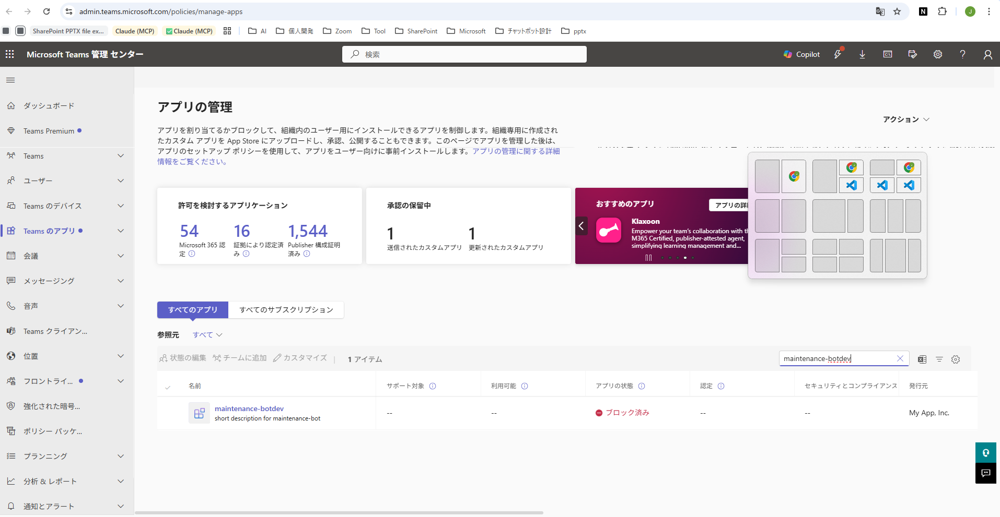

4. アプリをクリック → 詳細画面で「**公開**」ボタンをクリック

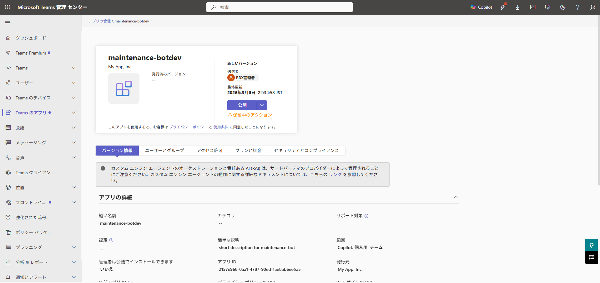

5. 確認ダイアログで「**公開**」を選択

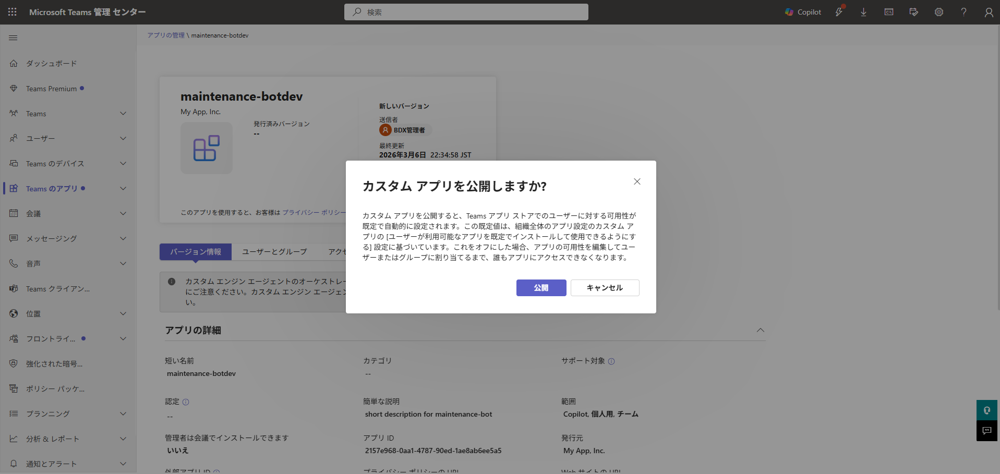

6. 状態が「**許可済み**」に変わったことを確認

**参考:** [Teams カスタムアプリの承認](https://learn.microsoft.com/en-us/microsoftteams/submit-approve-custom-apps)

### 16.5 確認事項

- [ ] `appPackage/manifest.json` から `copilotAgents` セクションを削除した
- [ ] `bots[0].scopes` から `"copilot"` を削除した
- [ ] Toolkit Publish が正常に完了した
- [ ] Teams 管理センターでアプリが「許可済み」になった
- [ ] Teams アプリストアの「組織向けに開発」に表示される

---

## 17. Step 15: 動作確認（F5ローカルデバッグ + 本番テスト）

### 17.0 前提準備（テストデータ投入・権限付与・Indexer実行）

動作確認には、Cosmos DBにテストデータを投入し、AI Searchインデックスに同期する必要がある。

#### 17.0.1 開発者向けロール付与（AI Search + Cosmos DB）

F5ローカルデバッグでは`DefaultAzureCredential`が開発者のAzure CLIログインアカウントを使用する。Step 11で付与したManaged Identityのロールとは別に、開発者個人のアカウントにもロール付与が必要。

**AI Search データプレーン（検索実行に必要）:**

```bash
# 開発者のオブジェクトIDを取得
DEVELOPER_OID=$(az ad signed-in-user show --query id -o tsv)

# Search Index Data Reader ロールを付与
MSYS_NO_PATHCONV=1 az role assignment create \
  --assignee "$DEVELOPER_OID" \
  --role "Search Index Data Reader" \
  --scope "/subscriptions/<サブスクリプションID>/resourceGroups/rg-maintenance-poc/providers/Microsoft.Search/searchServices/srch-maintenance-poc"
```

**注記:** ロール反映に数分かかる場合がある。付与直後に403エラーが出る場合は数分待ってリトライする。

**Cosmos DB データプレーン（テストデータ投入に必要）:**

ローカルからスクリプトでCosmos DBに書き込むには、開発者のAzure ADアカウントにデータプレーンのロール付与が必要。

```bash
# Cosmos DB Built-in Data Contributor ロールを付与（$DEVELOPER_OIDは17.0.1で取得済み）
MSYS_NO_PATHCONV=1 az cosmosdb sql role assignment create \
  --account-name cosmos-maintenance-poc \
  --resource-group rg-maintenance-poc \
  --role-definition-id "00000000-0000-0000-0000-000000000002" \
  --principal-id "$DEVELOPER_OID" \
  --scope "/"
```

**注記:** このロールはデータプレーン専用であり、Azure Portalの「アクセス制御(IAM)」タブには表示されない。`az cosmosdb sql role assignment list`コマンドで確認する。Web AppのManaged Identity（Step 11で付与済み）とは別に、開発者個人のアカウントにも付与が必要。

#### 17.0.2 テストデータ準備（Excel→JSON変換）

rag-local プロジェクトの実データ（Excel）を Cosmos DB 投入用 JSON に変換する。

**前提:** Python 3.x + openpyxl がインストール済みであること。

```bash
# openpyxl をインストール（初回のみ）
pip install openpyxl

# Excel→JSON 変換を実行
python scripts/convert-excel-to-json.py
```

**入力ファイル（rag-local プロジェクト内）:**

| ファイル | 種別 | categoryId |
|---------|------|------------|
| rev03smile_シナリオデータ_20260203.xlsx | シナリオ | smile |
| rev03souzoku_シナリオデータ_20260203.xlsx | シナリオ | souzoku |
| rev03naibujimu_シナリオデータ_20260203.xlsx | シナリオ | naibujimu |
| rev03torikaku_シナリオデータ_20260203.xlsx | シナリオ | torikaku |
| スマイル_履歴データ_20250205.xlsx | FAQ | smile |
| 総則_履歴データ_20250829.xlsx | FAQ | sousoku |
| 預金_履歴データ_20250830.xlsx | FAQ | yokin |

**出力ファイル:**

| ファイル | 件数 | サイズ |
|---------|------|--------|
| `scripts/data/scenarios.json` | 約2,300件 | 約4MB |
| `scripts/data/faqs.json` | 約18,700件 | 約24MB |

**注記:** 変換スクリプトはバリデーション付き。空行やテストデータ行は自動スキップされる。入力ファイルのパスは `scripts/convert-excel-to-json.py` 内の `RAG_GEMINI_BASE` で設定されている。異なる環境で実行する場合はパスを修正すること。

#### 17.0.3 Cosmos DB テストデータ投入

変換で生成された JSON を Cosmos DB に投入する。

```bash
# maintenance-bot ディレクトリに移動してから実行
cd maintenance-bot

# 初回投入（既存ダミーデータを全削除してから投入）
node ../scripts/seed-cosmos.js --clean

# 再投入（upsert で差分更新）
node ../scripts/seed-cosmos.js
```

投入されるデータ:

| コンテナ | 件数 | 内容 |
|---------|------|------|
| `scenarios` | 約2,300件 | スマイル(555件)、相続(269件)、内部事務(1,384件)、取引時確認(105件) |
| `faqs` | 約18,700件 | スマイル(8,679件)、総則(4,000件)、預金(6,055件) |

**注記:** スクリプトは `upsert` を使用するため、複数回実行しても安全（既存データを上書き）。`--clean` オプションは既存データを全削除してからクリーンな状態で投入する。初回投入時やスキーマ変更時に使用する。投入は100件ずつバッチ処理され、進捗が表示される。

#### 17.0.4 AI Search インデックス・Indexer 更新

テストデータにフィールドが追加されたため、AI Search のインデックス定義と Indexer の fieldMappings を更新する。

```bash
# AI Search管理キーを取得
ADMIN_KEY=$(az search admin-key show \
  --service-name srch-maintenance-poc \
  --resource-group rg-maintenance-poc \
  --query primaryKey -o tsv)

# インデックス定義を更新（フィールド追加は非破壊操作）
MSYS_NO_PATHCONV=1 curl -X PUT \
  "https://srch-maintenance-poc.search.windows.net/indexes/maintenance-search-index?api-version=2025-03-01-preview" \
  -H "Content-Type: application/json" \
  -H "api-key: $ADMIN_KEY" \
  -d @scripts/index-definition.json

# scenarios Indexer を更新
MSYS_NO_PATHCONV=1 curl -X PUT \
  "https://srch-maintenance-poc.search.windows.net/indexers/maintenance-scenarios-indexer?api-version=2025-03-01-preview" \
  -H "Content-Type: application/json" \
  -H "api-key: $ADMIN_KEY" \
  -d @scripts/indexer-scenarios.json

# faqs Indexer を更新
MSYS_NO_PATHCONV=1 curl -X PUT \
  "https://srch-maintenance-poc.search.windows.net/indexers/maintenance-faqs-indexer?api-version=2025-03-01-preview" \
  -H "Content-Type: application/json" \
  -H "api-key: $ADMIN_KEY" \
  -d @scripts/indexer-faqs.json
```

**追加フィールド（index-definition.json）:**

| フィールド名 | 型 | 用途 |
|------------|-----|------|
| `path` | Edm.String | シナリオの階層パス |
| `order` | Edm.Int32 | Excel行番号 |
| `isFinalAnswer` | Edm.Boolean | 末端ノード判定 |
| `tags` | Edm.String | FAQのタグ文字列 |

**注記:** インデックスへのフィールド追加は非破壊操作（既存データに影響なし）。ただし、新フィールドに値を入れるには Indexer のリセット＆再実行が必要。

#### 17.0.5 Indexer リセット＆手動実行

データ投入後、Indexer をリセットして全件再インデックス（再ベクトル化含む）を実行する。`--clean` で既存データを差し替えた場合や、combinedContent のフォーマットが変更された場合はリセットが必須。

```bash
# AI Search管理キーを取得（17.0.4で取得済みの場合はスキップ可）
ADMIN_KEY=$(az search admin-key show \
  --service-name srch-maintenance-poc \
  --resource-group rg-maintenance-poc \
  --query primaryKey -o tsv)

# scenarios Indexer をリセット（全件再処理対象にする）
curl -X POST \
  "https://srch-maintenance-poc.search.windows.net/indexers/maintenance-scenarios-indexer/reset?api-version=2025-03-01-preview" \
  -H "api-key: $ADMIN_KEY" \
  -H "Content-Length: 0"

# scenarios Indexer を実行
curl -X POST \
  "https://srch-maintenance-poc.search.windows.net/indexers/maintenance-scenarios-indexer/run?api-version=2025-03-01-preview" \
  -H "api-key: $ADMIN_KEY" \
  -H "Content-Length: 0"

# faqs Indexer をリセット
curl -X POST \
  "https://srch-maintenance-poc.search.windows.net/indexers/maintenance-faqs-indexer/reset?api-version=2025-03-01-preview" \
  -H "api-key: $ADMIN_KEY" \
  -H "Content-Length: 0"

# faqs Indexer を実行
curl -X POST \
  "https://srch-maintenance-poc.search.windows.net/indexers/maintenance-faqs-indexer/run?api-version=2025-03-01-preview" \
  -H "api-key: $ADMIN_KEY" \
  -H "Content-Length: 0"
```

HTTP 202が返れば実行開始。約21,000件のインデックス作成にはベクトル化を含むため、完了まで数分〜十数分かかる場合がある。

**確認方法:**

```bash
# scenarios Indexer状態を確認
curl -s "https://srch-maintenance-poc.search.windows.net/indexers/maintenance-scenarios-indexer/status?api-version=2025-03-01-preview" \
  -H "api-key: $ADMIN_KEY" | python -c "
import sys,json
d=json.load(sys.stdin)
r=d.get('lastResult',{})
print(f'Status: {r.get(\"status\")}, Items: {r.get(\"itemsProcessed\")}')"

# faqs Indexer状態を確認
curl -s "https://srch-maintenance-poc.search.windows.net/indexers/maintenance-faqs-indexer/status?api-version=2025-03-01-preview" \
  -H "api-key: $ADMIN_KEY" | python -c "
import sys,json
d=json.load(sys.stdin)
r=d.get('lastResult',{})
print(f'Status: {r.get(\"status\")}, Items: {r.get(\"itemsProcessed\")}')"
```

**期待結果:** 両 Indexer で `Status: success` が返り、`Items` が scenarios 約2,300件 / faqs 約18,700件となること。

### 17.1 F5ローカルデバッグ（開発時推奨）

M365 Agents Toolkitの F5 デバッグ機能を使用すると、Botをローカル実行しながらTeamsで動作確認できる。

**手順:**

1. VS Codeで`maintenance-bot`プロジェクトを開く
2. **F5キー**を押す（または「実行とデバッグ」→「Debug in Teams」）
3. Toolkitが以下を自動実行:
   - Dev Tunnel（ngrok代替）の起動 → ローカルサーバーをインターネットに公開
   - `m365agents.local.yml`に基づくローカルProvision
   - Botアプリのローカル起動
   - ブラウザでTeams Web版を自動オープン → Botアプリを自動サイドロード
4. Teamsの1:1チャットでBotに話しかけて動作確認
5. VS Codeのデバッガーでブレークポイント設定・変数検査が可能

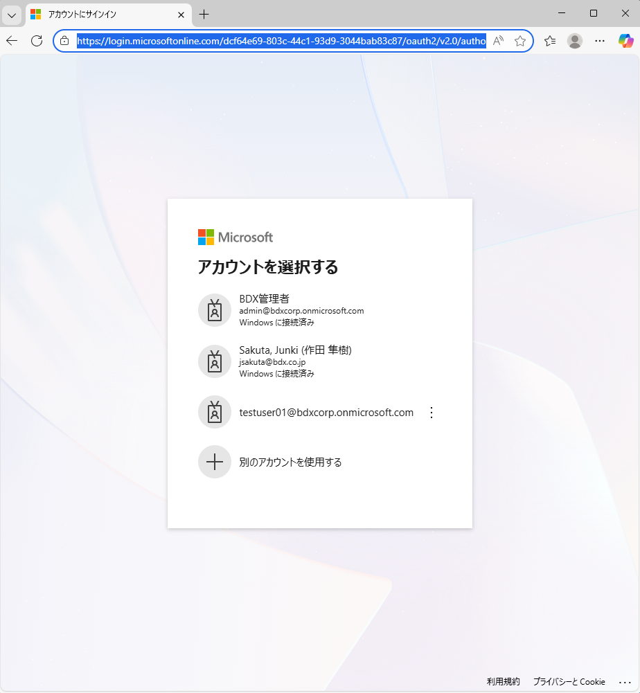

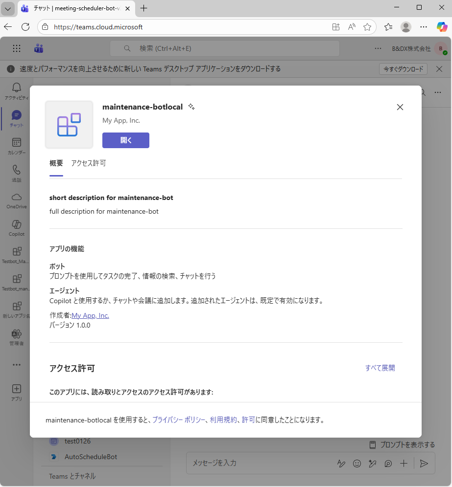

**ローカルデバッグの利点:**
- コード変更 → 即時反映（ホットリロード）
- ブレークポイントでステップ実行
- console.logがVS Codeのデバッグコンソールに表示
- Azureへのデプロイ不要で高速な開発サイクル

**注意事項:**
- Dev Tunnelの利用にはMicrosoftアカウントでの認証が必要
- 初回実行時にDev Tunnel拡張機能のインストールを求められる場合がある
- ローカルデバッグ中は`m365agents.local.yml`のProvisionが使用される（`m365agents.yml`とは別）
- `m365agents.local.yml`のdeployセクションに`AZURE_OPENAI_*`系の環境変数が含まれている場合は**削除すること**。本PoCではBotからAzure OpenAIを直接呼び出さないため不要であり、Toolkitが未定義変数の入力ダイアログを表示してdeployが失敗する原因となる

**`.localConfigs`の確認（F5デバッグが起動しない場合）:**

F5デバッグは`maintenance-bot/.localConfigs`から環境変数を読み込む。Toolkit Provisionでこのファイルは自動生成されるが、`clientId`や`clientSecret`が空になっている場合は手動で設定する。

```ini
# .localConfigs の必須項目
clientId=<Bot Service アプリID（BOT_ID）>
clientSecret=<Entra IDアプリのクライアントシークレット>
tenantId=<テナントID>
AI_SEARCH_ENDPOINT=https://srch-maintenance-poc.search.windows.net
AI_SEARCH_INDEX_NAME=maintenance-search-index
COSMOS_DB_ENDPOINT=https://cosmos-maintenance-poc.documents.azure.com:443/
COSMOS_DB_DATABASE=maintenance-db
SPO_SITE_ID=<SPOサイトID（Step 11 13.6.1で取得）>
SPO_DRIVE_ID=<SPOドライブID（Step 11 13.6.1で取得）>
SPO_UPLOAD_FOLDER=影響候補シナリオ
```

`clientId`はStep 8のProvision時に生成されたBOT_ID（`env/.env.dev`に記録）。`clientSecret`が不明な場合は以下で再生成できる:

```bash
az ad app credential reset \
  --id "<BOT_ID>" \
  --display-name "local-debug" \
  --years 1 \
  --query password -o tsv
```

**注意:** シークレットを再生成すると、既存のシークレットは無効化される。Azure Web Appの環境変数`MicrosoftAppPassword`も同じ値に更新すること。

**ローカル（.localConfigs）と Azure（Web App 環境変数）の対応表:**

| 機能 | ローカル（.localConfigs） | Azure（Web App 環境変数） | 備考 |
|------|--------------------------|--------------------------|------|
| Bot 認証 | `clientId` + `clientSecret` + `tenantId` | `MicrosoftAppId` + `MicrosoftAppPassword` + `MicrosoftAppTenantId` | キー名が異なる |
| Bot タイプ | （自動設定） | `MicrosoftAppType=SingleTenant` | クラウドのみ要設定 |
| AI Search | `AI_SEARCH_ENDPOINT` / `AI_SEARCH_INDEX_NAME` | 同じキー名 | 値も同一 |
| Cosmos DB | `COSMOS_DB_ENDPOINT` / `COSMOS_DB_DATABASE` | 同じキー名 | 値も同一 |
| SharePoint | `SPO_SITE_ID` / `SPO_DRIVE_ID` / `SPO_UPLOAD_FOLDER` | 同じキー名 | 値も同一 |
| App Insights | （不要） | `APPLICATIONINSIGHTS_CONNECTION_STRING` | クラウドのみ |
| 認証方式 | `DefaultAzureCredential` → Azure CLI ログイン | `DefaultAzureCredential` → Managed Identity | コードは同一 |

### 17.2 基本通信確認

| # | 確認項目 | 手順 | 期待結果 |
|---|---------|------|---------|
| 1 | Bot応答 | Teamsで1:1チャットを開き「hello」と入力 | Botが応答メッセージを返す |
| 2 | エラーログ確認 | Application InsightsまたはWeb Appのログストリームを確認 | エラーが出ていない |

### 17.3 検索機能確認

| # | 確認項目 | 手順 | 期待結果 |
|---|---------|------|---------|
| 3 | テキスト検索 | 改定内容を入力（例:「口座開設の本人確認書類が変更」） | Adaptive Cardで候補一覧が表示される |
| 4 | タブ切り替え | シナリオタブ/FAQタブのボタンを押す | ToggleVisibilityで表示が切り替わる |
| 5 | スクロール表示 | 候補数が多い検索結果を確認 | スクロールバーが表示され、全件を確認できる |

### 17.4 書き込み機能確認

| # | 確認項目 | 手順 | 期待結果 |
|---|---------|------|---------|
| 6 | FAQ削除 | FAQタブでチェック →「選択したFAQを削除」→ 確認 →「削除実行」 | 完了カードが表示され、Cosmos DBの`isDeleted`が`true`に更新 |
| 7 | 要修正フラグ | シナリオタブでチェック →「要修正を保存」 | 完了カードが表示され、Cosmos DBに`impactAssessments`レコードが作成 |
| 8 | Indexer反映 | FAQ削除後、Indexerを手動実行し再検索 | 削除したFAQが検索結果から除外 |

### 17.5 本番環境テスト（Deploy 後）

Step 13 で Deploy、Step 14 で Publish + 管理センター承認が完了した後、実際の Teams 環境で動作確認する。

**手順:**

1. Teams Web（https://teams.microsoft.com）またはデスクトップアプリを開く

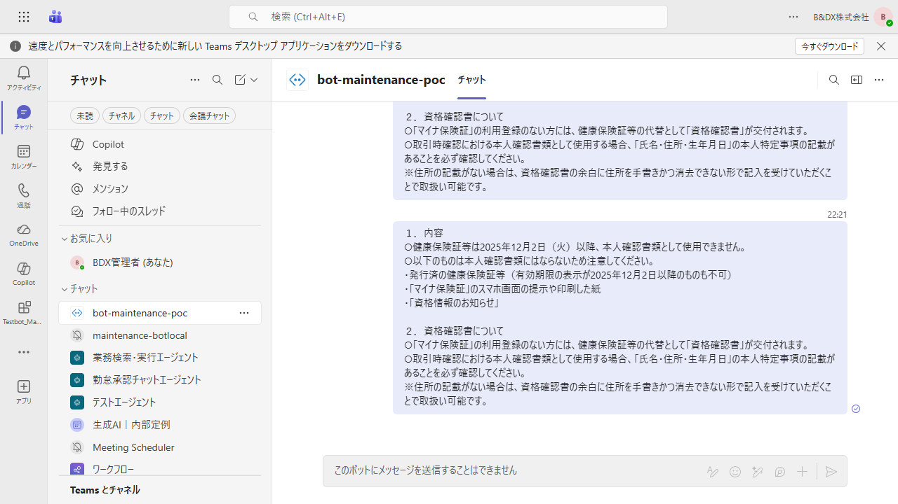

2. 左サイドバーの「アプリ」→「アプリストア」を開く

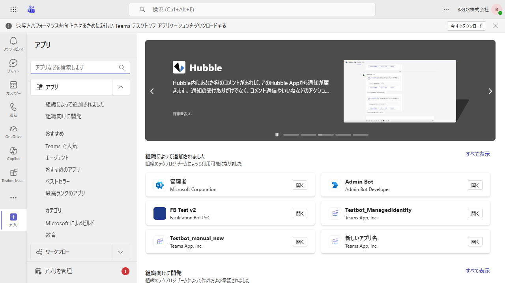

3. 「**組織向けに開発**」セクションでアプリを確認

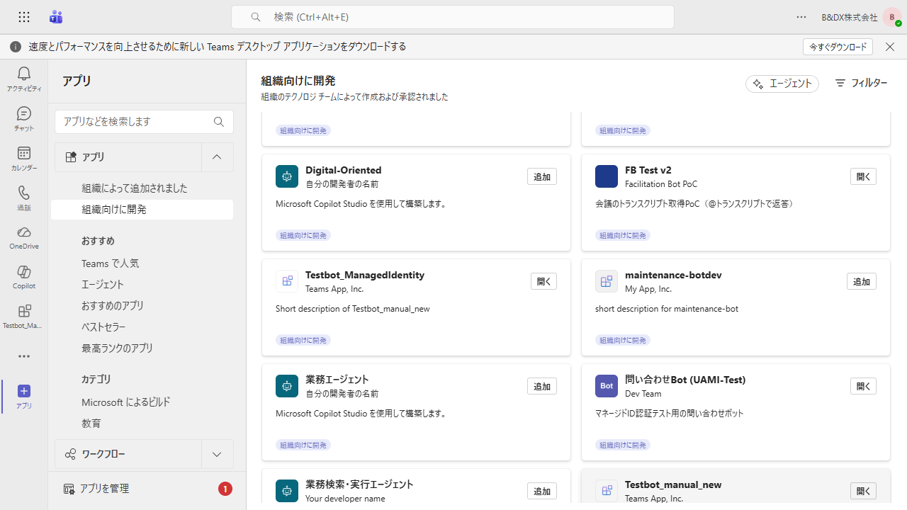

4. アプリをクリック →「**追加**」ボタンを押す

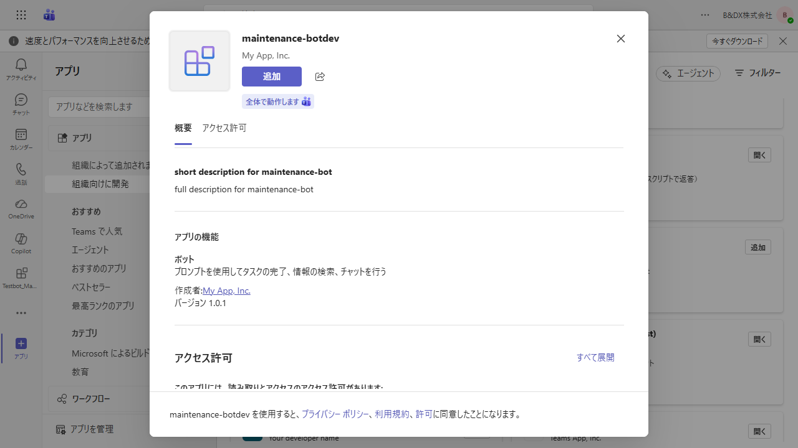

5. 追加完了 → Bot との 1:1 チャットが開く

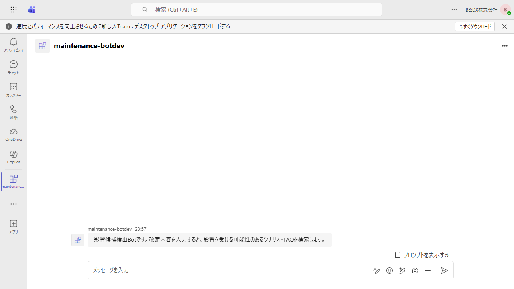

6. メッセージを送信 → Adaptive Card で検索カードが応答されることを確認

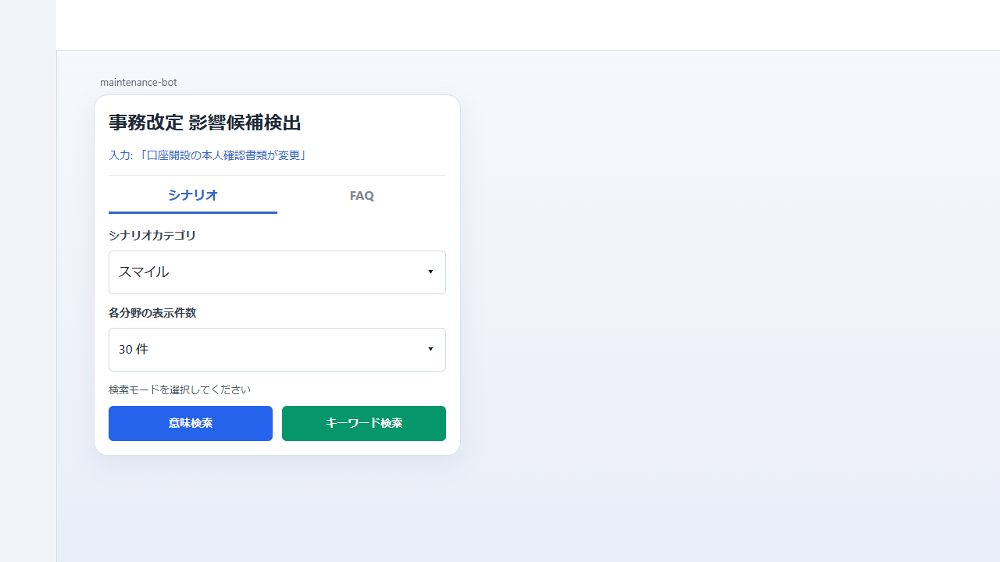

**確認事項:**
- [ ] Teams アプリストアの「組織向けに開発」にアプリが表示される
- [ ] アプリを追加して Bot と 1:1 チャットを開ける
- [ ] メッセージ送信で Adaptive Card（検索カード）が返る
- [ ] 検索を実行して結果が表示される

### 17.6 トラブルシューティング

| 症状 | 原因の可能性 | 対処法 |
|------|------------|--------|
| `Invalid URL`でサーバーが起動しない | Azure SDKクライアントがモジュールトップレベルで初期化されている | `SearchClient`/`CosmosClient`を遅延初期化パターンに変更（Step 13の注記参照） |
| `Invalid URL`でサーバーが起動しない | `.localConfigs`の`AI_SEARCH_ENDPOINT`等が空 | `.localConfigs`の必須項目を確認・設定（17.1参照） |
| F5デバッグで認証エラー | `.localConfigs`の`clientId`/`clientSecret`が空 | `env/.env.dev`からBOT_IDを転記、シークレットは`az ad app credential reset`で再生成（17.1参照） |
| Botが応答しない | メッセージングエンドポイントの設定誤り | Bot Service「構成」のURLを確認 |
| 403 Forbidden（F5ローカル） | AI SearchのAPIアクセス制御が「APIキーのみ」になっている | AI Searchリソース→「設定」→「キー」→「APIアクセス制御」を「両方」に変更（Step 3の5.2参照） |
| 403 Forbidden（F5ローカル） | 開発者アカウントにAI Searchのロールが未付与 | 17.0.1の「AI Search データプレーン」ロール付与を実施（反映に数分かかる） |
| 403 Forbidden（Azure Web App） | Web AppのManaged Identityのロール付与不足 | Step 11のロール付与を再確認 |
| Indexer失敗 | Azure OpenAI TPM超過 | Embeddingモデルのレート制限を引き上げ |
| Indexer失敗（Cosmos DB） | データソースのManaged Identity設定不備 | AI SearchのMI→Cosmos DB Data Readerを確認 |
| 検索結果が0件 | Indexerが未実行/データ未投入 | Indexerを手動実行、Cosmos DBのデータを確認 |
| Adaptive Cardが表示されない | カードサイズ25KB超過 | 候補件数を確認し、ページネーションフォールバックを検討 |
| Graph APIアップロード失敗（403） | Web AppのMIに`Files.ReadWrite.All`が未付与 | Step 11 13.6のGraph API権限付与を実施 |
| Graph APIアップロード失敗（404） | `SPO_SITE_ID`または`SPO_DRIVE_ID`が誤った値 | Step 11 13.6.1でサイトID・ドライブIDを再取得 |
| `convert-excel-to-json.py` でファイルが見つからない | Excelファイルのパスが異なる | スクリプト内の `RAG_GEMINI_BASE` を実際のパスに修正 |
| `seed-cosmos.js` で JSON が見つからない | Excel→JSON 変換が未実行 | `python scripts/convert-excel-to-json.py` を先に実行 |
| Cosmos DB 投入がスロットリングされる | Serverless RU 消費が多い | バッチサイズ（BATCH_SIZE）を50に下げて再実行 |
| Indexer で一部ドキュメントが失敗 | Embedding API のレート制限 | Indexer のリトライに任せる、または indexer JSON の `batchSize` を50に下げて再デプロイ |
| Bot が 401 Unauthorized を返す | サービスプリンシパル（SP）が未作成 | `az ad sp create --id <BOT_ID>`（Step 10 参照） |
| Teams でメッセージ送信不可（「送信できませんでした」） | マニフェストに `copilotAgents` セクションが残っている | `appPackage/manifest.json` から `copilotAgents` を削除 → 再 Publish（Step 14 参照） |
| Publish 後もアプリが Teams に表示されない | Teams 管理センターでアプリが未承認（ブロック済み） | 管理センターでアプリを「公開」に変更（Step 14 参照） |
| Azure Bot リソースが見つからない | Toolkit Provision は Developer Portal 登録のみ（Azure リソースは作成しない） | `az bot create` で手動作成（Step 9 参照） |
| `clientId` 設定済みだが認証失敗 | `MicrosoftAppId` のみ設定し `clientId` が未設定（またはその逆） | M365 Agents SDK は `clientId`/`clientSecret`/`tenantId` を読む。`MicrosoftApp*` と**両方設定**が必要（Step 13 参照） |

---

## 付録A: リソースID・エンドポイント記録シート

環境構築完了後、以下の情報を記録して管理すること。

| 項目 | 値 |
|------|-----|
| リソースグループ名 | |
| Azure OpenAI エンドポイント | |
| Azure OpenAI デプロイ名 | |
| AI Search エンドポイント | |
| AI Search 管理キー | |
| AI Search インデックス名 | |
| Cosmos DB エンドポイント | |
| Cosmos DB データベース名 | |
| Key Vault名 | |
| Application Insights 接続文字列 | |
| Web App URL | |
| Web App Managed Identity オブジェクトID | |
| Bot Service アプリID（MicrosoftAppId） | |
| Bot Service テナントID | |
| Bot Service クライアントシークレット | |

---

## 付録B: 月額コスト概算

| リソース | 月額概算 | 備考 |
|---------|---------|------|
| Azure AI Search (Basic) | ~¥10,000 | Semantic Ranker含む |
| Azure OpenAI (S0) | ~¥2,000 | Embedding利用のみ |
| Azure Web App (B1) | ~¥2,000 | Linux, 1コア, 1.75GB |
| Cosmos DB (Serverless) | ~¥1,000 | RU消費量依存 |
| Key Vault (Standard) | ~¥500 | |
| Application Insights | ~¥500 | |
| Azure Bot Service (F0) | ¥0 | Free |
| **合計** | **~¥16,000/月** | |

---

## 付録C: 参考リンク

| # | リソース | URL |
|---|---------|-----|
| 1 | M365 Agents Toolkit 概要 | https://learn.microsoft.com/en-us/microsoftteams/platform/toolkit/agents-toolkit-fundamentals |
| 2 | M365 Agents SDK npm | https://www.npmjs.com/package/@microsoft/agents-hosting |
| 3 | M365 Agents SDK ドキュメント | https://learn.microsoft.com/en-us/microsoft-365/agents-sdk/ |
| 4 | Azure Bot 作成（CLI） | https://learn.microsoft.com/en-us/azure/bot-service/abs-quickstart?view=azure-bot-service-4.0 |
| 5 | Teams チャネル接続 | https://learn.microsoft.com/en-us/azure/bot-service/channel-connect-teams?view=azure-bot-service-4.0 |
| 6 | Entra ID サービスプリンシパル | https://learn.microsoft.com/en-us/entra/identity-platform/howto-create-service-principal-portal |
| 7 | AI Search RBAC | https://learn.microsoft.com/en-us/azure/search/search-security-rbac |
| 8 | Cosmos DB データプレーン RBAC | https://learn.microsoft.com/en-us/azure/cosmos-db/how-to-connect-role-based-access-control |
| 9 | App Service ZIP デプロイ | https://learn.microsoft.com/en-us/azure/app-service/deploy-zip |
| 10 | App Service アプリケーション設定 | https://learn.microsoft.com/en-us/azure/app-service/configure-common |
| 11 | Teams カスタムアプリ承認 | https://learn.microsoft.com/en-us/microsoftteams/submit-approve-custom-apps |
| 12 | Teams マニフェスト v1.24 | https://learn.microsoft.com/en-us/microsoft-365/extensibility/schema/?view=m365-app-1.24 |
| 13 | Key Vault RBAC | https://learn.microsoft.com/en-us/azure/key-vault/general/rbac-guide |
| 14 | m365agents.yml リファレンス | https://learn.microsoft.com/en-us/microsoftteams/platform/toolkit/provision |
| 15 | AI Search Integrated Vectorization | https://learn.microsoft.com/en-us/azure/search/vector-search-integrated-vectorization |
| 16 | AI Search Cosmos DB Indexer | https://learn.microsoft.com/en-us/azure/search/search-how-to-index-cosmosdb-sql |
| 17 | Semantic Ranker 有効化 | https://learn.microsoft.com/en-us/azure/search/semantic-how-to-enable-disable |
| 18 | Adaptive Card スクロールコンテナ | https://learn.microsoft.com/en-us/microsoftteams/platform/task-modules-and-cards/cards/cards-format |