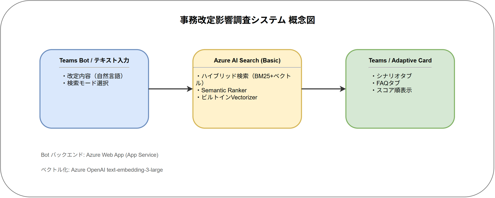
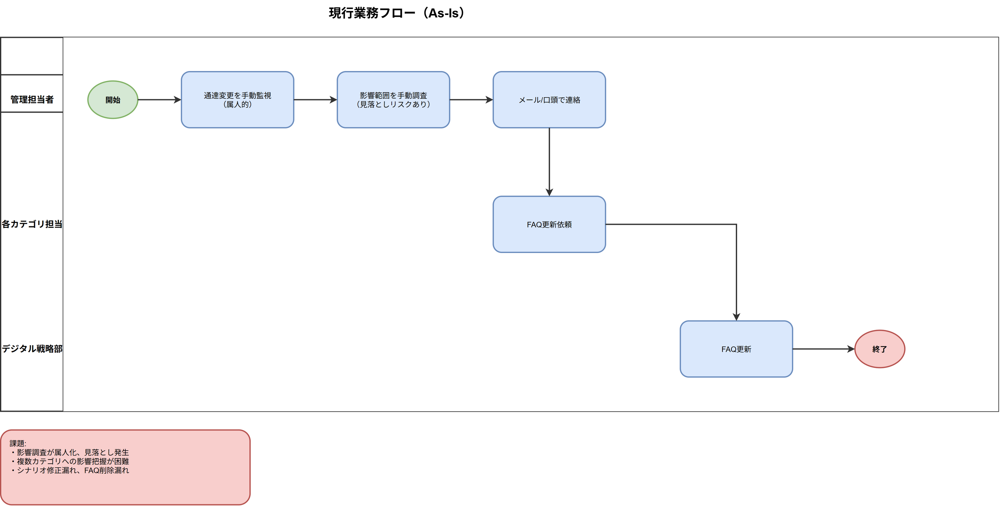
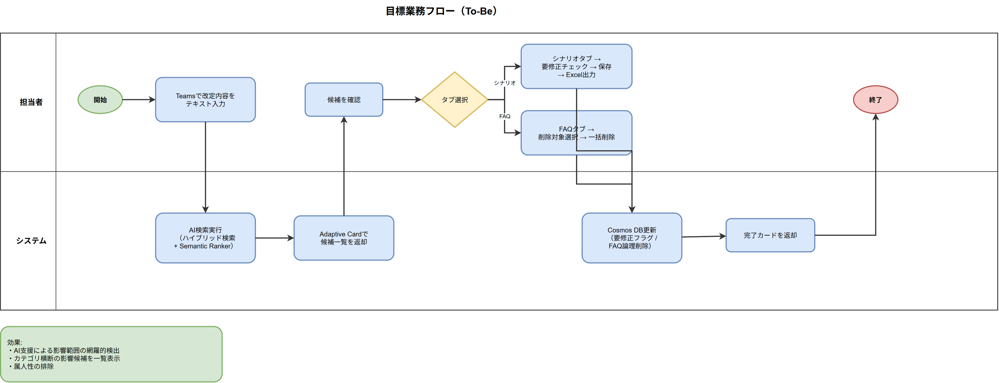
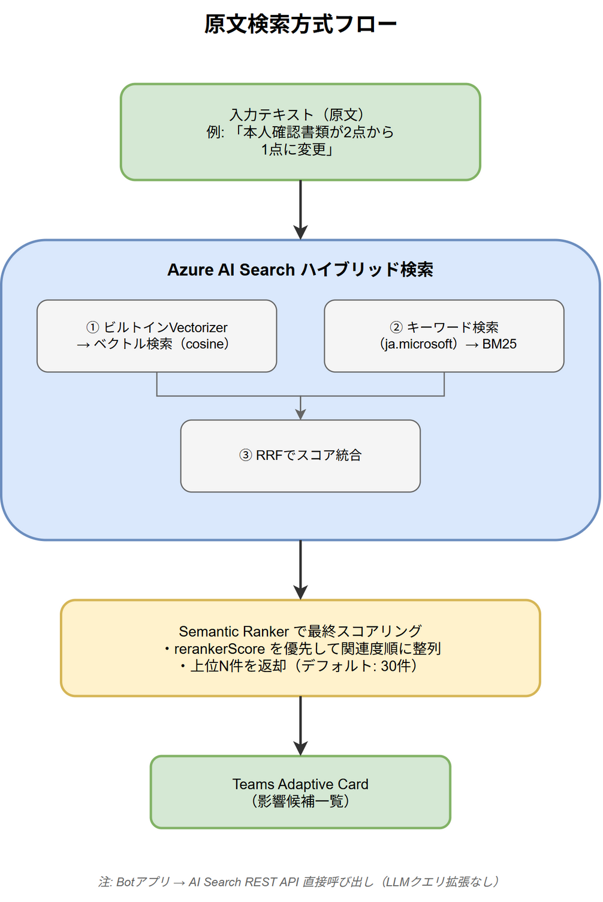
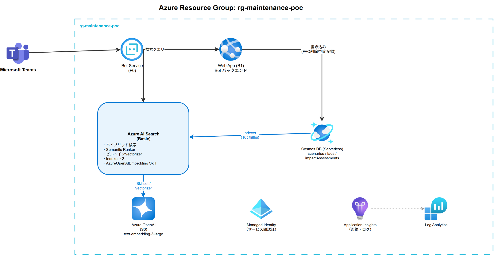

# 運用保守効率化AI 要件定義書

**版数**: 1.0
**作成日**: 2026年3月3日
**作成者**: B&DX 作田

---

## 目次

1. はじめに
2. システム概要
3. 業務要件
4. 機能要件
5. 非機能要件
6. システム構成要件
7. データ要件
8. 外部インターフェース要件
9. 運用保守要件
10. セキュリティ要件
11. 制約条件・前提条件
12. 用語定義
13. 付録

---

## 1. はじめに

### 1.1 本書の目的

本書は、事務改定影響調査システム（以下「本システム」）の要件を定義する。ローカル検証で確立した検索戦略をAzureクラウド環境に実装し、実運用に耐えるアーキテクチャの検証、および差分ベクトル化（変更分のみの自動再ベクトル化）機能の実現可能性検証を目的とする。

### 1.2 本書の位置づけ

本書は、ローカル版精度検証の結果を踏まえ、本システムの実装範囲・技術選定・検証計画を定義する。本格実装フェーズの設計・開発に先立つ要件定義書として位置づける。

### 1.3 対象読者

- デジタル戦略部 AIソリューション推進室
- エッジテクノロジー

---

## 2. システム概要

### 2.1 背景

当行では、チャットボットシステムをLakeel MessengerからMicrosoft Teams（M365）へ移行するプロジェクトを推進している。現行システムでは、事務改定（通達・規程等の変更）が発生した際、シナリオ・FAQの更新漏れが課題となっている。

**現状の課題**

- 事務改定の影響範囲を管理担当者が手動で監視し、事後的に各チームへ連絡する属人的な運用
- 約70カテゴリ・18,734件のFAQに対し、複数カテゴリにまたがる影響の把握が困難
- シナリオの修正漏れにより、チャットボットが誤った情報を返すリスク
- FAQ削除の漏れにより、回答支援AIが古い問い合わせ履歴データを参照し続け、誤回答のリスクや修正工数の増大を招く

### 2.2 目的

Azure AI Searchのハイブリッド検索（ベクトル検索＋キーワード検索＋Semantic Ranker）を活用し、事務改定の内容から影響を受けるシナリオ・FAQを自動検出する仕組みを構築する。本システムでは、Azureクラウド環境上でこの検索基盤が正しく動作すること、および差分ベクトル化（High Water Mark方式による変更分の自動再ベクトル化）が実現可能であることを検証する。

### 2.3 対象範囲

本システムは、担当者がTeams Bot上で事務改定の内容をテキスト入力し、AI検索で影響候補を検出・判断するシステムである。

**対象範囲**

| 項目 | 内容 |
|------|------|
| トリガー | 担当者がTeams Bot上で事務改定の内容をテキスト入力 |
| 検索対象 | シナリオ＋FAQ（検証環境実測: 21,047件） |
| 検索方式 | ハイブリッド検索（ベクトル＋キーワード）＋ Semantic Ranker |
| 出力 | 影響候補一覧（Adaptive Cardでタブ切り替え表示） |
| ユーザー操作 | 候補確認 → シナリオは修正判断（要修正Excel出力可）、FAQは削除判断 |
| 残課題 | 画像内テキスト変更は今回スコープ外。別途課題として管理 |

### 2.4 システム概念図



### 2.5 ローカル検証からの設計判断

ローカル版の検証で以下の知見を得ており、本システムの設計に反映する。

| 検証結果 | 設計判断 |
|---------|---------|
| 原文検索とLLMクエリ拡張検索で検索精度に有意な差がなかった | **原文検索に統一**。LLMによるクエリ拡張（Multi-Query Search）は採用しない |
| キーワード検索（ケース⑤⑥）で100%検知を達成 | キーワード検索モードを独立した検索モードとして実装 |
| AIが人間の見落とし2件を発見 | 意味検索の有効性を確認。Semantic Rankerとの組み合わせで精度向上を期待 |
| 1件未検知（画像内テキスト変更） | 今回スコープ外として切り分け、別途課題管理とする |

---

## 3. 業務要件

### 3.1 現行業務フロー（As-Is）



### 3.2 目標業務フロー（To-Be）



### 3.3 データに対するアクション方針

以下の方針で運用する。

| データ種別 | 件数 | 改定時のアクション | 理由 |
|-----------|------|------------------|------|
| シナリオ | 初期想定: 数百件 / 検証環境実測: 2,313件 | 該当箇所を**修正** | 情報資産として構造を保持する必要がある |
| FAQ（問い合わせ履歴） | 初期想定: 約3,000件 / 検証環境実測: 18,734件 | 該当データを**削除** | 回答支援AIが古い情報を参照し続けることによる誤回答・修正工数増大を防止する |

---

## 4. 機能要件

### 4.1 機能一覧

| 機能ID | 機能名 | 概要 |
|--------|--------|------|
| FR-001 | 改定内容テキスト入力 | Teams Bot経由で改定内容をテキスト入力 |
| FR-002 | 検索モード選択 | 意味検索またはキーワード検索を選択 |
| FR-003 | 影響候補検索（意味検索） | 原文テキストによるハイブリッド検索 + Semantic Ranker |
| FR-004 | 影響候補検索（キーワード検索） | 指定キーワードによる語句ベース検索 |
| FR-005 | 候補一覧表示 | Adaptive Cardでタブ切り替え表示（シナリオ/FAQ） |
| FR-006 | データマスタ同期 | Cosmos DB → AI Searchの自動同期（Indexer） |
| FR-007 | FAQ一括削除 | 影響候補FAQの複数選択→一括論理削除（Cosmos DB連動） |
| FR-008 | シナリオ要修正フラグ記録 | 影響候補シナリオへの「要修正」フラグ記録（Cosmos DB連動） |
| FR-009 | シナリオ要修正Excel出力 | 要修正フラグ保存後、検索結果シナリオ一覧をExcel出力（要修正行を黄色ハイライト） |

### 4.2 機能詳細

#### FR-001: 改定内容テキスト入力

| 項目 | 内容 |
|------|------|
| 概要 | 担当者がTeams Bot上で事務改定の内容を自然言語テキストとして入力する |
| トリガー | ユーザーがTeams Botにメッセージを送信 |
| 入力 | 自然言語テキスト（改定内容の説明）。最大2,000文字 |
| 出力 | 検索モード選択UIの表示（Adaptive Card） |
| 処理詳細 | 1. Bot（Azure Web App上で稼働）がテキストを受信<br>2. テキスト長の検証（2,000文字以内）<br>3. 検索モード選択Cardを返却 |
| 例外処理 | テキスト長超過時はエラーメッセージを返却 |

**入力例**

```
口座開設時の本人確認書類が変更になりました。
マイナンバーカードを提示した場合、他の本人確認書類は不要となります。
従来は2点必要でしたが、1点で可となります。
```

#### FR-002: 検索モード選択

| 項目 | 内容 |
|------|------|
| 概要 | 担当者が検索モードを選択する |
| 入力 | Adaptive Cardのボタン選択 |
| 出力 | 選択されたモードで検索実行 |

**選択肢**

| モード | 用途 | 説明 |
|-------|------|------|
| 意味検索 | 内容変更型の改定 | 入力テキストと意味的に関連するシナリオ・FAQを検索 |
| キーワード検索 | 名称変更型の改定 | 指定キーワードを含む候補を語単位で広く抽出 |

#### FR-003: 影響候補検索（意味検索モード）

| 項目 | 内容 |
|------|------|
| 概要 | 入力テキスト（原文）でハイブリッド検索を実行し、影響候補を検索する |
| 入力 | 改定内容テキスト（原文をそのまま使用） |
| 出力 | 影響候補リスト（意味検索時は`rerankerScore`を優先した関連度順） |

**検索方式（原文検索）**

ローカル版の検証で、原文検索とLLMクエリ拡張検索で精度に有意な差がないことを確認済み。構成の簡素化のため、原文テキストをそのまま検索クエリとして使用する。



**構成上のポイント**

- Botアプリ（Azure Web App）から Azure AI Search REST API を直接呼び出す
- LLMによるクエリ拡張を行わないため、Azure FunctionsやGPT-4o-miniは不要
- クエリ時のベクトル化はAI Searchのビルトインvectorizer（text-embedding-3-large）が自動処理

#### FR-004: 影響候補検索（キーワード検索モード）

| 項目 | 内容 |
|------|------|
| 概要 | ユーザーが指定したキーワードに関連する候補を語句ベースで抽出する |
| 入力 | 検索キーワード（1つ以上） |
| 出力 | キーワード関連候補リスト（BM25スコア順、上位N件。Nはユーザー選択の表示件数：10〜100件） |
| 処理詳細 | Azure AI Searchの `queryType: "full"` を使用し、`title` / `content` / `keywords` フィールドで語句ベースのフルテキスト検索を実行する |
| 用途 | 名称変更型の改定（用語の置換）。例: 「AMLフィルター」→「ジープレックス」、「スーパーカード(DC)」→「(MDC)」 |

ローカル版のケース⑤⑥で100%検知を確認済み。

#### FR-005: 候補一覧表示

| 項目 | 内容 |
|------|------|
| 概要 | 検索結果をAdaptive Cardで表示し、FAQ削除・シナリオ要修正フラグの操作UIを提供する |
| 入力 | 検索結果リスト |
| 出力 | Adaptive Card（Teams上に表示） |

**UIの2段階構成**

検索UIは「検索カード」と「結果カード」の2段階で構成される。

1. **検索カード**（FR-001/FR-002で生成）: シナリオ/FAQをタブ切替で分離し、各タブ内でカテゴリ単一選択・表示件数設定・検索ボタンを配置
2. **結果カード**（FR-005で生成）: 選択したタブ・カテゴリの検索結果を関連度順にページネーション表示

**検索カード表示仕様**

- シナリオタブとFAQタブを`Action.ToggleVisibility`で排他切替（初期表示はシナリオタブ）
- 各タブ内にカテゴリ単一選択（`Input.ChoiceSet`、ID: `scenarioCategory` / `faqCategory`）を配置
- 各タブ内に表示件数選択（`Input.ChoiceSet`、10〜100件/10件刻み、デフォルト30件）を配置
- 各タブ内に検索ボタン2つ（「意味検索」「キーワード検索」）を`ActionSet`で配置
- 検索ボタンの`Action.Execute`に`targetType: "scenario" | "faq"`を含め、タブ別の検索を実現

**結果カード表示仕様**

- 結果カードは選択したタブ（シナリオまたはFAQ）のみを表示対象とする
- 各候補は番号絵文字（❶❷...）+ カテゴリ名 + 関連度のヘッダー、タイトル、本文抜粋で構成
- **シナリオ**: 各候補に「要修正」チェック（`Input.Toggle`）を配置
- **FAQ**: 各候補に「削除対象」チェック（`Input.Toggle`）を配置
- アクションボタンは検索結果の内容に応じて動的表示（シナリオがある場合のみ「要修正を保存」、FAQがある場合のみ「選択したFAQを削除」）
- **ページネーション方式**: ユーザーが選択した表示件数（10〜100件）を初期値とし、カードサイズ上限（25KB）を超過する場合はBotが1ページあたりの表示件数を自動調整する。そのため、実際の表示件数はユーザー選択値以下になる場合がある。「← 前ページへ」「次ページへ →」ボタンで遷移

**Adaptive Card レイアウト（検索カード）**

```
┌─────────────────────────────────────────────────────────────────┐
│  事務改定 影響候補検出                                             │
│  入力: 「本人確認書類が2点から1点に変更...」                       │
├─────────────────────────────────────────────────────────────────┤
│  ┌────────────────┐┌────────────────┐                          │
│  │▼ シナリオ      ││   FAQ          │  ← ToggleVisibilityタブ  │
│  │  ━━━━━━━━━━━━ ││                │                          │
│  └────────────────┘└────────────────┘                          │
│                                                                 │
│  シナリオカテゴリ: [スマイル         ▼]  ← 単一選択ドロップダウン │
│                                                                 │
│  表示件数: [30 件 ▼]                                             │
│                                                                 │
│  [意味検索]  [キーワード検索]                                      │
│                                                                 │
└─────────────────────────────────────────────────────────────────┘
```

**Adaptive Card レイアウト（結果カード）**

```
┌─────────────────────────────────────────────────────────────────┐
│  事務改定 影響候補検出結果                                         │
│  入力: 「本人確認書類が2点から1点に変更...」                       │
│  検索モード: 意味検索 | 1-5件 / 全8件                              │
├─────────────────────────────────────────────────────────────────┤
│                                                                 │
│  ❶ スマイル │ 関連度: 3.4200                                    │
│     口座開設手続きフロー                                         │
│     「...本人確認書類を2点ご用意ください...」                    │
│     ☐ 要修正                                                   │
│                                                                 │
│  ❷ 相続 │ 関連度: 2.8700                                       │
│     相続手続きフロー                                             │
│     「...本人確認書類を提示...」                                 │
│     ☐ 要修正                                                   │
│                                                                 │
│  [💾 要修正を保存]                                               │
│  [← 前ページへ]  [次ページへ →]                                 │
│                                                                 │
└─────────────────────────────────────────────────────────────────┘
```

**技術補足**

- **ページネーション**: Bot側でカードサイズ（25KB上限）を計算し、超過時は二分探索で表示件数を動的調整する（O(log n)）。ページ遷移は`Action.Execute`で実現する
- **検索カードのタブ切替**: `Action.ToggleVisibility`で`sectionScenario`/`sectionFaq`と対応するタブアクティブ/非アクティブ要素の表示を排他制御する
- `Action.Submit`と`Action.ToggleVisibility`は1アクションに同居できないため、データ送信は`Action.Execute`（Universal Actions）を使用する
- `Action.Execute`のレスポンスで新しいAdaptive Cardを返却することで、確認→完了の**Sequential Workflow**を実現する
- **操作完了後のUX**: FR-008の完了カードには「検索結果に戻る」ボタンを表示する。これは `searchSessionId` を用いた POC の一時セッション復元であり、キャッシュ有効中のみ動作する。セッション失効時や再起動後は元の検索結果には戻れないため、モード選択カードに戻って再検索する。FR-009の完了/失敗カードでは「モード選択に戻る」ボタンを表示する

#### FR-006: データマスタ同期

| 項目 | 内容 |
|------|------|
| 概要 | Cosmos DBのシナリオ・FAQデータをAzure AI Searchインデックスに自動同期する |
| トリガー | スケジュール実行（10分ごと） |
| 対象コンテナ | `scenarios`コンテナ および `faqs`コンテナ のみ。`impactAssessments`コンテナは検索インデックスの対象外 |
| 処理詳細 | 1. Indexerが変更検知（`_ts`列のHigh Water Mark方式）<br>2. 変更分のみSkillset実行<br>3. AzureOpenAIEmbeddingSkillで自動ベクトル化（text-embedding-3-large）<br>4. インデックス更新 |
| 差分検知 | High Water Mark方式（`_ts`列）。変更分のみ再ベクトル化し、全件再処理を回避 |
| 削除検知 | Soft Delete方式（`isDeleted`フラグ） |
| リトライ | Azure AI Search内蔵のリトライ機能（Azure OpenAI TPMスロットリング時に自動リトライ） |

**注記:** Cosmos DBのデータソース定義はコンテナ単位で作成する。`scenarios`と`faqs`は**別々のIndexer**（Indexer A: scenarios用、Indexer B: faqs用）で処理する。各Indexerは専用のデータソースから読み取り、同一インデックス`maintenance-search-index`に書き込む。`impactAssessments`コンテナはIndexerの対象に含めない。

**差分ベクトル化（Incremental Vectorization）の仕組み**

Cosmos DBのデータ変更は、IndexerのHigh Water Mark方式により自動的に差分検知される。全件再処理を行わず、変更されたドキュメントのみを再ベクトル化する。

```text
[初回実行]
Cosmos DB (全件) → Indexer → Skillset (全件ベクトル化) → インデックス更新
                    ↓ High Water Mark (_ts = T1) を記録

[2回目以降（差分更新）]
Cosmos DB (変更分: _ts > T1) → Indexer → Skillset (変更分のみベクトル化) → インデックス更新
                                 ↓ High Water Mark (_ts = T2) を更新

※ 未変更ドキュメントはスキップ（Azure OpenAI API呼び出しなし、RU消費なし）
```

**データ投入パスとIndexer連携**

| パス | データ種別 | 投入方式 | Cosmos DB更新 | Indexer検知タイミング |
|------|----------|---------|--------------|-----------------|
| A | シナリオ | Excel → JSON変換スクリプト → Cosmos DB upsert | `_ts` 自動更新 | 次回Indexer実行時（最大10分後） |
| B | FAQ | リアルタイム蓄積 → Cosmos DB | `_ts` 自動更新 | 次回Indexer実行時（最大10分後） |
| C | FAQ論理削除 | Bot → `isDeleted: true` に更新 | `_ts` 自動更新 | Soft Delete検知 → インデックスから除外 |

**運用上の注記**

- Indexer実行間隔は10分（`PT10M`、Azure AI Searchの最短間隔は5分）
- 10分間隔の差分ベクトル化で運用上十分であり、リアルタイム同期は不要
- 大量データの一括投入時も、Indexerはバッチ処理（100件/バッチ）で段階的に処理する

#### FR-007: FAQ一括削除

| 項目 | 内容 |
|------|------|
| 概要 | 影響候補として検出されたFAQを複数選択し、一括で論理削除する |
| トリガー | FAQタブの「選択したFAQを削除」ボタン押下 |
| 入力 | 選択されたFAQ IDのリスト |
| 出力 | 削除確認カード → 削除完了カード（Sequential Workflow） |

**処理フロー**

```
① ユーザーがFAQタブで対象FAQにチェック
② 「選択したFAQを削除」ボタン押下
   → Action.Execute {verb: "confirmDeleteFaqs", faqIds: ["0012","0847"]}
③ Bot が確認カードを返却
   ┌──────────────────────────────────────┐
   │ ⚠️ 以下の2件のFAQを削除しますか？    │
   │ ・FAQ-0012: 預金/口座開設FAQ          │
   │ ・FAQ-0847: 為替/海外送金FAQ          │
   │ [✅ 削除実行]  [↩️ キャンセル]        │
   └──────────────────────────────────────┘
④ 「削除実行」押下
   → Action.Execute {verb: "executeDeleteFaqs", faqIds: ["0012","0847"]}
⑤ Bot が Cosmos DB を更新（isDeleted = true）
⑥ Bot が完了カードを返却
   ┌──────────────────────────────────────┐
   │ ✅ 2件のFAQを削除しました             │
   │ ・FAQ-0012: 預金/口座開設FAQ → 削除済 │
   │ ・FAQ-0847: 為替/海外送金FAQ → 削除済 │
   │ 削除者: （実行ユーザー名）  （実行日時）      │
   └──────────────────────────────────────┘
```

**DB連動**

| 操作 | 対象 | 内容 |
|------|------|------|
| 論理削除 | Cosmos DB FAQドキュメント | `isDeleted: true` に更新 |
| インデックス除外 | AI Search | 次回Indexer実行時（最短10分）に自動除外（Soft Delete方式） |
| 即時除外（任意） | AI Search | `Documents - Index` APIで即座に該当ドキュメントを削除し、Indexer実行前でも検索結果から除外可能 |

#### FR-008: シナリオ要修正フラグ記録

| 項目 | 内容 |
|------|------|
| 概要 | 影響候補として検出されたシナリオに「要修正」フラグを記録する |
| トリガー | シナリオタブの「要修正を保存」ボタン押下 |
| 入力 | 「要修正」にチェックされたシナリオIDのリスト |
| 出力 | 保存完了カード |

**処理フロー**

```
① ユーザーがシナリオタブで要修正の候補にチェック
② 「要修正を保存」ボタン押下
   → Action.Execute {verb: "saveNeedsUpdate", scenarioIds: ["0042","0105"]}
③ Bot が Cosmos DB に影響判定レコードを作成
④ Bot が完了カードを返却
   ┌──────────────────────────────────────┐
   │ ✅ 要修正フラグを保存しました         │
   │ ・預金/口座開設手続きフロー → 要修正  │
   │ ・為替/海外送金手続きフロー → 要修正  │
   │ 記録者: （実行ユーザー名）  （実行日時）      │
   │ [📊 Excelで出力]  ← FR-009           │
   └──────────────────────────────────────┘
```

**注記:** 完了カードの「Excelで出力」ボタンはFR-009を起動する。詳細はFR-009を参照。

**画面イメージ（想定）**

```text
┌─────────────────────────────────────────┐
│  ✅ 要修正フラグを保存しました           │
│                                         │
│  保存対象カテゴリ:                       │
│   ・預金（2件）                          │
│   ・為替（1件）                          │
│                                         │
│  記録者: ユーザー名  2026/xx/xx xx:xx   │
│                                         │
│  [📊 Excelで出力]  [🔙 検索結果に戻る]  │
└─────────────────────────────────────────┘
```

> 要修正保存完了カードの想定レイアウト。保存対象のカテゴリ一覧を表示し、「Excelで出力」と「検索結果に戻る」ボタンを配置する。

**DB連動**

| 操作 | 対象 | 内容 |
|------|------|------|
| 判定記録 | Cosmos DB `impactAssessments`コンテナ | 判定保存単位ID（`searchId`）・シナリオID・検索クエリ・`rerankerScore`・判定者・日時を記録 |

**impactAssessmentsドキュメント構造**

```json
{
  "id": "assess-<searchId>-<scenarioId>",
  "searchId": "search-20260209143500-a1b2c3d4",
  "scenarioId": "scenario-0042",
  "searchQuery": "口座開設の本人確認書類が2点から1点に変更...",
  "rerankerScore": 3.42,
  "impactStatus": "needsUpdate",
  "assessedBy": "（ログインユーザーのUPN）",
  "assessedAt": "2026-02-09T14:35:00+09:00"
}
```

**設計上の判断**

- 本システムでは「要修正」フラグの記録のみを行う。シナリオの実際の修正は既存の管理フローで実施する
- 「影響なし」「未判定」等の細かい判定区分は現段階では設けず、**チェックした候補 = 要修正**とする

#### FR-009: シナリオ要修正Excel出力

| 項目 | 内容 |
|------|------|
| 概要 | FR-008の完了カード上の「Excelで出力」ボタン押下で、検索結果のシナリオ一覧をExcelファイルとして生成し、要修正行を黄色ハイライトして送信する |
| トリガー | FR-008完了カードの「Excelで出力」ボタン押下 |
| 入力 | 検索結果のシナリオリスト（全件）+ 要修正フラグ情報 |
| 出力 | Excelファイル（SPOアップロード + リンク送付） |

**処理フロー**

```
① FR-008完了カードの「Excelで出力」ボタン押下
   → Action.Execute {verb: "exportExcel", searchSessionId: "..."}
② Bot がカテゴリごとにメモリ上でExcelファイルを生成（ExcelJS）
   - カテゴリ別にファイル分割（1カテゴリ = 1ファイル）
   - 各ファイルに該当カテゴリのシナリオを行として列挙
   - 要修正フラグが付いた行を黄色背景ハイライト
③ Bot が生成したExcelをSharePoint Onlineにアップロードし、リンクをAdaptive Cardで送付
④ Bot が出力完了カードを返却
   ┌──────────────────────────────────────┐
   │ 📊 Excel出力完了                      │
   │ カテゴリ別ファイル:                   │
   │ ・scenario_yokin_預金_...xlsx         │
   │ ・scenario_kawase_為替_...xlsx        │
   │ 📁 フォルダを開く                     │
   │ [🔙 モード選択に戻る]                 │
   └──────────────────────────────────────┘
```

**注記:** `searchSessionId` は検索結果カード・ページネーション・Excel出力で使う**POCの一時セッションキー**であり、アプリ内メモリキャッシュを参照する。`impactAssessments` に保存する `searchId` とは別物で、TTL は30分、再起動やスケールアウト時には失効し得る。FR-008完了カードの「検索結果に戻る」はキャッシュ有効中のみ動作し、失効時はモード選択カードに戻って再検索する。FR-009の完了/失敗カードは `showSearchCard` によりモード選択カードへ戻る。

**画面イメージ（想定）**

```text
┌─────────────────────────────────────────┐
│  Excel出力完了                           │
│                                         │
│  カテゴリ別ファイル:                      │
│   📄 scenario_yokin_預金_...xlsx         │
│   📄 scenario_kawase_為替_...xlsx        │
│                                         │
│  [📁 フォルダを開く]                     │
│  [🔙 モード選択に戻る]                   │
└─────────────────────────────────────────┘
```

> Excel出力完了カードの想定レイアウト。カテゴリ別ファイルリンクと「フォルダを開く」「モード選択に戻る」ボタンを配置する。

**Excel列定義**

カテゴリ別にファイルを分割し、各ファイルはシナリオの元構造（階層形式）を保持する。

| 列 | フィールド | 備考 |
|----|----------|------|
| Lv1 | 階層レベル1のテキスト | シナリオの元データ構造に準拠 |
| 文字数 | Lv1の文字数 | — |
| Lv2 | 階層レベル2のテキスト | — |
| 文字数 | Lv2の文字数 | — |
| ... | ... | 階層の深さに応じて列が増減 |
| LvN | 階層レベルNのテキスト | — |
| 文字数 | LvNの文字数 | — |

**注記:** 回答テキスト（content）は最終階層レベル（LvN）のカラムに統合される。独立した「回答」列は設けない。

要修正行は行全体を黄色ハイライト。ファイル名: `scenario_{categoryId}_{categoryName}_{YYYYMMDD_HHMMSS}.xlsx`

**技術仕様**

| 項目 | 内容 |
|------|------|
| ライブラリ | ExcelJS（npm `exceljs`） |
| 生成方式 | インメモリ生成（ファイルシステム書き込みなし） |
| 送信方式 | SPOアップロード + Adaptive Cardリンク |
| ファイル名 | `scenario_{categoryId}_{categoryName}_{YYYYMMDD_HHMMSS}.xlsx` |
| アップロード先 | SharePoint Online（Graph APIシンプルアップロード） |
| 完了カード | 個別ファイルリンク + フォルダリンク + 「モード選択に戻る」ボタン |

**設計上の判断**

- 現段階ではFAQのExcel出力は対象外とする（FAQは削除操作のため出力の必要性が低い）
- データ量が小さい（数百行）ためインメモリ生成で十分であり、ファイルシステムへの中間保存は行わない
- 黄色ハイライトの対象は「要修正」にチェックされた行のみ。未チェックの行はデフォルト背景（白）
- カテゴリ別にファイルを分割し、シナリオの元データ構造（階層形式）を保持する

## 5. 非機能要件

### 5.1 性能要件

| ID | 項目 | 要件 | 備考 |
|----|------|------|------|
| NFR-001 | 影響検索応答時間 | 10秒以内 | Teams Action.Executeのタイムアウトは10〜15秒（チャネル依存）。超過時は「処理中」カードを即時返却し、バックグラウンド処理後にproactiveActivityで結果通知する構成を採用 |
| NFR-002 | インデックス更新反映 | データ変更後10分以内 | Indexerスケジュール実行 |
| NFR-003 | インデクサー実行時間 | 差分30件で5分以内 | 通常運用時（差分更新） |
| NFR-004 | Excel出力応答時間 | 5秒以内 | インメモリ生成 + SPOアップロード。SPOアップロード遅延時もAction.Executeタイムアウト前に処理中カードを返却し、非同期でアップロード完了後に結果通知 |

### 5.2 可用性要件

| 項目 | 要件 | 備考 |
|------|------|------|
| 稼働時間 | 平日 9:00〜18:00 | 検証期間中 |
| 障害時対応 | 翌営業日対応 | 検証段階のため即時復旧は不要 |

### 5.3 拡張性要件

| 項目 | 現状 | 将来想定 | 備考 |
|------|------|---------|------|
| シナリオ件数 | 2,313件（検証環境実測） | 5,000件 | — |
| FAQ件数 | 18,734件（検証環境実測） | 30,000件 | Azure AI Search Basic SKUで対応可能 |
| カテゴリ数 | 約70 | 100 | — |

### 5.4 監視要件

| 監視項目 | 閾値 | 通知先 |
|---------|------|-------|
| Indexer実行失敗 | 失敗検知時 | Application Insights → メール |
| 検索レイテンシ | 10秒超 | Application Insights |
| Azure OpenAI TPM使用率 | 80%超 | Azure Monitor |
| Web App ヘルスチェック | 応答なし | Application Insights |

---

## 6. システム構成要件

### 6.1 アーキテクチャ概要



### 6.2 Azure Bot Service と Azure Web App の役割分担

Teams Botは2つのAzureリソースで構成される。

| リソース | 役割 | 説明 |
|---------|------|------|
| Azure Bot Service | チャネル管理 | TeamsチャネルとBot間のメッセージルーティング、認証、メッセージ変換を行うAzureマネージドサービス。Bot自体のコードは保持しない |
| Azure Web App (App Service) | Botバックエンド | Botのアプリケーションコード（TypeScript）をホストするWebサーバー。メッセージングエンドポイント（`https://<app-name>.azurewebsites.net/api/messages`）を公開し、Azure Bot Serviceからの受信メッセージを処理する |

Azure Bot Serviceはメッセージの中継と認証を担当し、実際のBot処理ロジック（テキスト入力受付、AI Search API呼び出し、Adaptive Card生成、Cosmos DB書き込み）はAzure Web App上で稼働する。

**SDK選定に関する注記**

Bot Framework SDKは2025年12月でサポートが終了しており、Microsoft 365 Agents SDK（後継）への移行が推奨されている。本システムではM365 Agents SDKでの実装を基本方針とし、技術的な制約がある場合はBot Framework SDK（TypeScript）を使用する。

### 6.3 リソース構成

| リソース | SKU/プラン | 用途 |
|---------|-----------|------|
| Azure AI Search | Basic | ハイブリッド検索、Semantic Ranker、Indexer |
| Azure OpenAI | Standard S0 | text-embedding-3-large（3,072次元） |
| App Service Plan | Basic B1 | Azure Web Appのホスティングプラン |
| Azure Web App | App Service B1（Basic） | Botバックエンド |
| Azure Bot Service | F0（Free） | Teamsチャネル登録 |
| Cosmos DB | Serverless | シナリオ＋FAQマスタデータ |
| Application Insights | — | 監視・ログ |
| Log Analytics Workspace | — | Application Insightsのバックエンド |

**注記:** `maintenance-bot/infra/azure.bicep` には Managed Identity、App Service Plan、Azure Web App の定義が含まれるが、導入手順書では Azure CLI で個別にリソースを作成する手順を採用している（Bicep の `arm/deploy` アクションは使用しない）。Azure AI Search、Azure OpenAI、Cosmos DB、Application Insights、Azure Bot Service も導入手順書の手順に従い構築する。Key Vault はPoC段階では未使用。本番移行時に導入を検討する。

### 6.4 月額コスト概算

※ 為替レート 1 USD = 155 円、Japan East リージョン前提。Azure Retail Prices API（2026年3月時点）に基づく概算。

| リソース | 月額概算 | USD/月 | 備考 |
|---------|---------|--------|------|
| Azure AI Search (Basic) | ~¥15,000 | $97 | Semantic Ranker: 無料枠1,000リクエスト/月。超過時は従量課金 |
| Azure OpenAI (S0) | ~¥2,000 | — | Embedding（text-embedding-3-large）のみ。$0.13/1M tokens。初期構築時は全件ベクトル化でコスト増加 |
| Azure Web App (B1) | ~¥2,200 | $14 | App Service Basic B1 Linux（1コア, 1.75GB RAM） |
| Cosmos DB (Serverless) | ~¥1,000 | — | RU消費量に依存 |
| Application Insights | ~¥500 | — | — |
| Azure Bot Service (F0) | ¥0 | $0 | Free tier |
| **合計** | **~¥20,700/月** | — | — |

**Embeddingコスト詳細**

text-embedding-3-large: $0.13/1M tokens。検証環境実測: FAQ 18,734件＋シナリオ2,313件 × 平均500トークン ≈ 10.5Mトークン → 初回ベクトル化コスト約$1.37（約¥210）。月次差分更新は数十円レベル。

### 6.5 技術選定根拠

#### Embeddingモデル: Azure OpenAI text-embedding-3-large

| 選定観点 | 内容 |
|---------|------|
| ローカル版実績 | 6ケースの精度検証で十分な検索精度を確認済み |
| Azure統合 | Azure AI SearchのビルトインSkill（AzureOpenAIEmbeddingSkill）で**ノーコード統合**。Indexerパイプライン、クエリ時Vectorizerともに**JSON定義のみ**で構成可能 |
| 運用保守 | リトライ・スロットリング処理がAI Searchに内蔵。外部API依存なし。Managed Identity認証で一元管理 |
| 次元数 | 3,072次元（デフォルト） |
| 入力上限 | 8,191トークン。シナリオ・FAQのテキスト長に対して十分 |
| コスト | $0.13/1M tokens。本システムの利用規模では微小 |

#### 検索方式: 原文検索（LLMクエリ拡張なし）

| 選定観点 | 内容 |
|---------|------|
| ローカル版検証結果 | 原文検索とLLM拡張検索で精度に有意な差がなかった |
| 構成簡素化 | LLM不要 → Azure Functions不要 → リソース数削減、障害点削減 |
| コスト削減 | GPT-4o-mini不要 → LLM利用料なし |
| 保守性 | Bot → AI Searchの単純なAPI呼び出しのみ。中間レイヤーなし |

---

## 7. データ要件

### 7.1 データ構成

| データ種別 | 格納先 | 件数 | 説明 |
|-----------|--------|------|------|
| シナリオデータ | Cosmos DB `scenarios`コンテナ | 初期想定: 数百件 / 検証環境実測: 2,313件 | チャットボットの会話シナリオ |
| FAQデータ | Cosmos DB `faqs`コンテナ | 初期想定: 約3,000件 / 検証環境実測: 18,734件 | 問い合わせ履歴ベースのQ&A |
| 影響判定記録 | Cosmos DB `impactAssessments`コンテナ | 検索操作ごとに蓄積 | シナリオの要修正フラグ記録（FR-008）。Indexer対象外 |
| 検索インデックス | Azure AI Search `maintenance-search-index` | 検証環境実測: 21,047件 | シナリオ＋FAQの統合インデックス |

**Cosmos DBコンテナ設計**

| コンテナ名 | パーティションキー | 用途 | Indexer対象 |
|-----------|-----------------|------|-----------|
| `scenarios` | `/categoryId` | シナリオマスタデータ | ✓（Indexer A: scenarios用） |
| `faqs` | `/categoryId` | FAQマスタデータ | ✓（Indexer B: faqs用） |
| `impactAssessments` | `/searchId` | 要修正フラグの判定記録 | ✗（検索インデックス不要） |

**カテゴリIDマッピング**

| データ種別 | categoryId | categoryName | 備考 |
|-----------|------------|--------------|------|
| シナリオ | `smile` | スマイル | — |
| シナリオ | `souzoku` | 相続 | 相続業務 |
| シナリオ | `naibujimu` | 内部事務 | — |
| シナリオ | `torikaku` | 取引時確認 | — |
| FAQ | `smile` | スマイル | — |
| FAQ | `sousoku` | 総則 | 総則規定一般（読み: そうそく）。相続業務の `souzoku`（そうぞく）とは異なるカテゴリ |
| FAQ | `yokin` | 預金 | — |

### 7.2 インデックス設計

シナリオとFAQを同一インデックスに格納し、`dataType`フィールドで区別する。ベクトルフィールドは `contentVector` のみを使用する。

**maintenance-search-index フィールド定義**

| フィールド名 | 型 | 検索可能 | フィルタ可能 | ソート可能 | 説明 |
|-------------|-----|---------|-------------|----------|------|
| id | Edm.String | — | ✓ | — | 主キー |
| dataType | Edm.String | — | ✓ | — | `scenario` / `faq` |
| categoryId | Edm.String | — | ✓ | — | カテゴリID |
| categoryName | Edm.String | ✓（ja.microsoft） | ✓ | — | カテゴリ名 |
| title | Edm.String | ✓（ja.microsoft） | — | — | シナリオ名 / FAQ質問文 |
| content | Edm.String | ✓（ja.microsoft） | — | — | シナリオ本文 / FAQ回答文 |
| combinedContent | Edm.String | ✓（ja.microsoft） | — | — | title + content（結合テキスト）。Skillsetのベクトル化入力ソース（このフィールドからcontentVectorを生成）。BM25テキスト検索の`searchFields`には含めない（ベクトル化入力およびSemantic Rankerのコンテキスト用途） |
| contentVector | Collection(Edm.Single) | ✓（vector） | — | — | 3,072次元（text-embedding-3-large） |
| keywords | Collection(Edm.String) | ✓（ja.microsoft） | — | — | キーワード |
| updatedAt | Edm.DateTimeOffset | — | ✓ | ✓ | 更新日時 |
| isDeleted | Edm.Boolean | — | ✓ | — | 論理削除フラグ（Soft Delete） |
| path | Edm.String | ✓（ja.microsoft） | ✓ | — | シナリオの階層パス |
| order | Edm.Int32 | — | ✓ | ✓ | Excel行番号（表示順序） |
| isFinalAnswer | Edm.Boolean | — | ✓ | — | 末端ノード判定 |
| tags | Edm.String | ✓（ja.microsoft） | ✓ | — | FAQのタグ文字列 |

**注記:** すべての検索対象（シナリオ/FAQ）は `contentVector` にベクトルを持つ。今回スコープでは画像データを検索対象に含めない。

### 7.3 データフロー

**インデクシング（自動・定期）**

```
[Indexer A: scenarios用 / Indexer B: faqs用]
Cosmos DB (scenarios / faqs) → 各Indexer (10分ごと)
  → AzureOpenAIEmbeddingSkill（text-embedding-3-large でベクトル生成）
  → 同一インデックス maintenance-search-index の contentVector フィールドに格納
```

**検索（ユーザー操作時）**

```
担当者 → Teams Bot → Azure Web App (Bot バックエンド)
  → [意味検索モードの場合]
      → AI Search REST API: ハイブリッド検索（原文テキスト）
      → ビルトインVectorizerが原文を自動ベクトル化
      → ベクトル検索 + キーワード検索 → RRF統合
      → Semantic Ranker でリランキング
      → rerankerScore を優先した関連度順で表示
      → dataTypeでシナリオ/FAQに分類 → タブ切り替え表示
  → [キーワード検索モードの場合]
      → AI Search REST API: `queryType: "full"` によるキーワード検索
      → dataTypeでシナリオ/FAQに分類 → タブ切り替え表示
  → Adaptive Card で候補を表示
```

**操作（ユーザーアクション時）**

```
[FAQ削除]
担当者 → Adaptive Card（FAQタブでチェック → 削除ボタン）
  → Action.Execute → Azure Web App (Bot バックエンド)
  → Cosmos DB: faqs コンテナの該当ドキュメントを isDeleted = true に更新
  → 次回Indexer実行時にAI Searchインデックスから自動除外

[シナリオ要修正フラグ記録]
担当者 → Adaptive Card（シナリオタブでチェック → 保存ボタン）
  → Action.Execute → Azure Web App (Bot バックエンド)
  → Cosmos DB: impactAssessments コンテナに判定レコードを作成

[シナリオExcel出力]
担当者 → Adaptive Card（FR-008完了カードの「Excelで出力」ボタン）
  → Action.Execute → Azure Web App (Bot バックエンド)
  → ExcelJSでカテゴリ別インメモリExcel生成（要修正行を黄色ハイライト）
  → SharePoint OnlineにGraph APIでアップロード → Adaptive Cardでリンク送付
```

### 7.4 データ保持期間

| データ種別 | 保持期間 | 備考 |
|-----------|---------|------|
| シナリオマスタ | 無期限 | マスタデータ |
| FAQマスタ | 無期限 | マスタデータ（削除はSoft Delete） |
| 影響判定記録（impactAssessments） | 無期限 | 要修正フラグの記録。FR-008で使用 |
| 検索インデックス | マスタと同期 | Indexerで自動管理 |
| 検索ログ | 90日 | Application Insights |

---

## 8. 外部インターフェース要件

### 8.1 Teams Bot連携

| 項目 | 内容 |
|------|------|
| 連携方式 | Microsoft 365 Agents SDK（TypeScript）。技術的制約がある場合はBot Framework SDK（TypeScript） |
| ホスト先 | Azure Web App (App Service B1) |
| メッセージングエンドポイント | `https://<app-name>.azurewebsites.net/api/messages` |
| チャネル登録 | Azure Bot Service（F0）でTeamsチャネルを有効化 |
| 認証 | Microsoft Entra ID アプリ登録（Single-Tenant推奨） |
| メッセージ形式 | テキスト入力（ユーザー → Bot）、Adaptive Card（Bot → ユーザー） |
| 対話形式 | 1:1チャット（パーソナルスコープ） |

**注記:** Azure Bot Serviceの新規作成においてMulti-Tenant構成は2025年7月31日以降非推奨となった。Single-Tenant またはUser-Assigned Managed Identity構成を使用する。

### 8.2 Azure AI Search連携

| 項目 | 内容 |
|------|------|
| 連携方式 | REST API（Azure Web AppからHTTPSで直接呼び出し） |
| 認証 | Managed Identity（PoC段階）。本番移行時はAPIキー（Key Vault経由）も検討 |
| 呼び出し元 | Azure Web App（Botバックエンド） |
| 検索API | `POST /indexes/maintenance-search-index/docs/search` |
| ドキュメント操作API（任意） | `POST /indexes/maintenance-search-index/docs/index`（FAQ削除の即時反映用） |

**Bot返却フィールド:** 検索APIレスポンスには`$select`パラメータで`id, dataType, categoryId, categoryName, title, content, order`の7フィールドを指定する。`path`, `isFinalAnswer`, `tags`はインデックスに存在するが、Bot側ではSELECTせず将来の機能拡張用とする。

**注記:** ドキュメント操作APIは、FAQ論理削除後にIndexer実行（最短10分）を待たず即座にインデックスから除外したい場合に使用する。現段階では任意実装とし、Indexerによる自動反映を基本とする。

### 8.3 Cosmos DB連携

| 項目 | 内容 |
|------|------|
| 連携方式（読み取り） | Azure AI Search Indexer（データソース） |
| 連携方式（書き込み） | Azure Web App（Botバックエンド）から Cosmos DB SDK で直接書き込み |
| 認証 | Managed Identity |
| 同期頻度 | 10分ごと（スケジュール実行） |
| 変更検知 | High Water Mark（`_ts`列） |
| 削除検知 | Soft Delete（`isDeleted`フラグ） |

**Bot → Cosmos DB 書き込み操作**

| 操作 | 対象コンテナ | 内容 | 対応FR |
|------|------------|------|--------|
| FAQ論理削除 | `faqs` | `isDeleted: true` に更新 | FR-007 |
| 要修正フラグ記録 | impactAssessments | 判定レコードの新規作成 | FR-008 |

### 8.4 Azure OpenAI連携

| 項目 | 内容 |
|------|------|
| Embeddingモデル | text-embedding-3-large（3,072次元） |
| 認証 | Managed Identity（Cognitive Services OpenAI User ロール） |
| 呼び出し元 | Azure AI Search Skillset（インデクシング時）、Azure AI Search Vectorizer（クエリ時） |

**注記:** BotアプリからAzure OpenAIを直接呼び出すことはない。Embeddingモデルの呼び出しはすべてAI Search経由（ビルトインSkill/Vectorizer）で行う。

### 8.5 Excelファイル出力（SPOアップロード）

| 項目 | 内容 |
|------|------|
| 出力形式 | xlsx（Excel Open XML） |
| 生成ライブラリ | ExcelJS（npm `exceljs`） |
| 送信方式 | SharePoint OnlineにGraph APIシンプルアップロード → Adaptive Cardでファイルリンク送付 |
| ファイルサイズ上限 | 現行POC実装では4MB（`SPO_SIMPLE_UPLOAD_LIMIT` の安全側制限）。Graph APIシンプルアップロード自体の公式上限は250MB |
| 外部ストレージ依存 | SharePoint Online（Graph API経由でアップロード） |
| ファイル名規則 | `scenario_{categoryId}_{categoryName}_{YYYYMMDD_HHMMSS}.xlsx` |

**注記:** カテゴリ別にファイルを分割してSPOにアップロードする。データ量が小さい（数百行）ためインメモリ生成で十分。Excel列マッピングの詳細は本書 4.2節 FR-009を参照。

**参考:** Microsoft Graph の `driveItem-put-content` は simple upload の上限を 250 MB としている。https://learn.microsoft.com/en-us/graph/api/driveitem-put-content?view=graph-rest-1.0

---

## 9. 運用保守要件

### 9.1 定期メンテナンス（検証期間中）

| 作業 | 頻度 | 内容 |
|------|------|------|
| Indexer実行状況確認 | 日次 | Azure Portalでステータス確認、失敗時は手動再実行 |
| Web Appヘルスチェック | 日次 | Botエンドポイントの応答確認 |
| コスト確認 | 週次 | Azure Cost Managementで消費量確認 |

### 9.2 障害対応

| 障害パターン | 影響 | 対応 |
|-------------|------|------|
| Indexer失敗 | インデックス更新が停止 | 手動再実行。原因調査（TPM超過、データ不整合等） |
| Azure OpenAI TPM超過 | インデクシング遅延 | AI Search内蔵リトライで自動回復。頻発時はTPM上限引き上げ申請 |
| Web App障害 | Bot応答停止 | Application Insights確認、App Service再起動 |
| Azure Bot Service障害 | Teams連携停止 | Azureサービス正常性ダッシュボードで確認。マネージドサービスのため自動回復を待つ |

---

## 10. セキュリティ要件

### 10.1 認証・認可

| 項目 | 要件 |
|------|------|
| ユーザー認証 | Microsoft Entra ID シングルサインオン（Teams経由） |
| Bot認証 | Microsoft Entra ID アプリ登録（Single-Tenant） |
| サービス間認証 | Managed Identity（Azure内リソース間） |
| APIキー管理 | PoC段階ではManaged Identity認証を使用しKey Vaultは未使用。本番移行時にKey Vault導入を検討 |

**Managed Identityロール付与一覧**

AI SearchのManaged Identity向け:

| 対象リソース | ロール名 | 用途 |
|-------------|---------|------|
| Azure OpenAI | `Cognitive Services OpenAI User` | Skillset（インデクシング時）・Vectorizer（クエリ時）からのEmbedding呼び出し |
| Cosmos DB | `Cosmos DB Account Reader Role`（管理プレーン） | Indexerのデータソース接続メタデータ読み取り |
| Cosmos DB | `Cosmos DB Built-in Data Reader`（データプレーン） | IndexerによるCosmos DBドキュメント読み取り |

Web AppのManaged Identity向け:

| 対象リソース | ロール名 | 用途 |
|-------------|---------|------|
| Azure AI Search | `Search Index Data Reader` | 検索クエリ実行 |
| Cosmos DB | `Cosmos DB Built-in Data Contributor`（データプレーン） | FAQ削除・判定記録の書き込み（FR-007・FR-008で使用） |

Microsoft Graph（アプリケーション権限）:

| 権限名 | 付与先 | 用途 |
|--------|--------|------|
| `Files.ReadWrite.All` | Web AppのManaged Identity | FR-009 Excel出力ファイルのSharePointアップロード |

**注記:** BotアプリケーションからAzure OpenAIを直接呼び出すことはない。Embeddingの呼び出しはすべてAI Search経由（ビルトインSkill/Vectorizer）で行うため、`Cognitive Services OpenAI User`はAI SearchのMIに付与する。

### 10.2 データ保護

| 項目 | 要件 |
|------|------|
| 通信暗号化 | TLS 1.2以上 |
| 保存データ暗号化 | Azure標準暗号化（AES-256） |
| ベクトルデータ | Azure AI Searchの暗号化ストレージで保護 |

### 10.3 ネットワーク

| 項目 | 現段階 | 本番（将来） |
|------|-----|------------|
| エンドポイント | パブリックエンドポイント | プライベートエンドポイント推奨 |
| IPフィルタ | 必要に応じてIP制限 | VNet統合 |

---

## 11. 制約条件・前提条件

### 11.1 技術的制約

| 制約 | 内容 |
|------|------|
| Embeddingモデル | Azure OpenAI text-embedding-3-large（3,072次元） |
| 検索エンジン | Azure AI Search（Basic以上、Semantic Ranker有効） |
| Botホスト | Azure Web App (App Service B1以上) |
| 開発言語 | TypeScript |
| SDK | Microsoft 365 Agents SDK（推奨）またはBot Framework SDK |
| Azure内完結 | 外部クラウド（Google Cloud等）への依存なし。LLM呼び出しなし |

### 11.2 運用的制約

| 制約 | 内容 |
|------|------|
| Indexer実行間隔 | 最短5分（全SKU共通の制約）。現在の設定: 10分（`PT10M`） |
| Azure OpenAI TPM | 標準クォータ。超過時はAI Search側で自動リトライ |
| テキスト入力上限 | 2,000文字（1回の検索入力） |
| Adaptive Cardサイズ上限 | Teamsの上限は約28KB。安全マージンとして25KBを運用上限とし、超過時はBotが二分探索で表示件数を動的調整 |
| Adaptive Card バージョン | v1.5（Teamsデスクトップ）。デスクトップ前提 |
| Excel出力ファイルサイズ | 現行POC実装では4MB（`SPO_SIMPLE_UPLOAD_LIMIT`）。Graph APIシンプルアップロード自体の公式上限は250MB |
| 検索結果キャッシュ | `searchSessionId` はアプリ内メモリキャッシュを参照する一時キー。TTL は30分、再起動・スケールアウト時に失効し得る |

**参考:** Azure AI Search indexer の最短スケジュール間隔は 5 分。https://learn.microsoft.com/en-us/azure/search/search-howto-schedule-indexers

### 11.3 前提条件

| 前提条件 |
|---------|
| チャットボットM365統合移行プロジェクトのCosmos DB（シナリオ＋FAQデータ）が利用可能であること |
| Azure サブスクリプションが利用可能であること |
| Azure OpenAI Serviceの利用申請が承認済みであること |
| 担当者がTeamsにアクセス可能であること |
| 現行POCは検索結果キャッシュを単一プロセスのメモリに保持する前提であり、`searchSessionId` の永続化は行わないこと |
| Azure AI Search、Azure OpenAI、Cosmos DB、Application Insights、Azure Bot Service は導入手順書の手順に従い構築済みであること |

---

## 12. 用語定義

| 用語 | 定義 |
|------|------|
| 事務改定 | 銀行業務に関する通達・規程・マニュアル等の変更 |
| シナリオ | チャットボットの会話シナリオ。階層構造を持つ情報資産 |
| FAQ | よくある質問（Frequently Asked Questions）。問い合わせ履歴ベースのQ&Aデータ |
| 影響候補 | 事務改定により更新（修正/削除）が必要となる可能性のあるシナリオ・FAQ |
| ハイブリッド検索 | ベクトル検索とキーワード検索を組み合わせた検索方式 |
| RRF | Reciprocal Rank Fusion。ベクトル検索とキーワード検索のスコアを統合するアルゴリズム |
| Semantic Ranker | Azure AI Searchの意味理解に基づく再ランキング機能。MicrosoftのBing検索技術を活用 |
| rerankerScore | Semantic Rankerが付与する関連度スコア（0.0〜4.0の範囲） |
| searchSessionId | 検索結果カード・ページネーション・Excel出力で使う一時セッションキー。アプリ内メモリキャッシュを参照し、DBには保存しない |
| ビルトインVectorizer | Azure AI Searchに組み込まれたクエリ時自動ベクトル化機能。テキスト入力を自動的にベクトルに変換する |
| AzureOpenAIEmbeddingSkill | Azure AI Searchのインデクシングパイプラインで使用するビルトインSkill。Azure OpenAIのEmbeddingモデルをコード不要で呼び出す |
| High Water Mark | データベースの変更を検知するためのタイムスタンプ方式 |
| Soft Delete | 物理削除ではなくフラグによる論理削除 |
| Adaptive Card | Teams上で構造化された情報を表示するためのカード形式UI |
| Action.Execute | Adaptive Cardのアクション。Botにinvokeリクエストを送信し、応答として新しいカードを返却可能（Sequential Workflow） |
| Sequential Workflow | Action.Executeのレスポンスでカードを更新することで、確認→実行→完了のフローを実現するパターン |
| impactAssessments | シナリオの要修正フラグを記録するCosmos DBコンテナ。判定保存単位ID（`searchId`）・シナリオID・検索クエリ・`rerankerScore`・判定者・日時を保持 |
| Azure Web App | Azure App Service上で稼働するWebアプリケーション。BotバックエンドのホストにはApp Service B1プランを使用 |
| Azure Bot Service | TeamsなどのチャネルとBot間のメッセージルーティング・認証を行うAzureマネージドサービス |
| Microsoft 365 Agents SDK | Bot Framework SDKの後継。Teams、Copilot、Outlook等のマルチチャネルに対応するエージェント開発SDK |
| ExcelJS | Node.js用のExcelファイル読み書きライブラリ。xlsx形式のファイルをメモリ上で生成可能 |
| SPOアップロード | SharePoint OnlineにGraph APIでファイルをアップロードし、Adaptive Cardでリンクを送付する方式 |
| 差分ベクトル化 | Indexerが前回実行時以降に変更されたドキュメントのみを再ベクトル化する仕組み。High Water Mark方式（`_ts`列）で変更を検知する |
| Cosmos DBコンテナ | Azure Cosmos DB for NoSQLのデータベース内の論理的分割単位。本書では「コンテナ」に統一 |
| Skillset | Azure AI Searchのインデクシングパイプライン。複数のSkillを組み合わせてデータ変換フローを定義 |
| Single-Tenant | Botアプリ登録の構成。特定のMicrosoft Entra IDテナント内でのみ使用可能。Multi-Tenant構成は2025年7月31日以降非推奨 |
| sousoku（総則） | FAQのカテゴリID。総則規定に基づく一般的なQ&Aを格納。相続業務の `souzoku` とは異なる |

---

## 13. 付録

### 付録A: Phase1精度検証結果サマリ

> **検証構成:** ローカル版（ChromaDB + Azure OpenAI text-embedding-3-large）。Azure AI Searchのハイブリッド検索+Semantic Rankerとは別構成。クラウド版の精度については、本番環境での継続的な検索テストで検証する。

| ケース | 改定タイプ | 検索方式 | 正解数 | 検知数 | 検知率 | 備考 |
|--------|----------|---------|--------|--------|--------|------|
| ① | 意味的関連（内容変更型） | ベクトル検索 | 3 | 3 | 100% | — |
| ② | 意味的関連（内容変更型） | ベクトル検索 | 6 | 6 | 100% | — |
| ③ | 意味的関連（内容変更型） | ベクトル検索 | 16 | 15 | 93.8% | 4エリア横断（naibujimu/smile/souzoku/torikaku）。1件未検知（souzoku-bot_146：ベクトル検索の上位範囲外。VertexAI Embeddingでは100%検知） |
| ④ | 意味的関連（内容変更型） | ベクトル検索 | 1 | 1 | 100% | 別途、画像内テキスト変更1件は今回スコープ外（対象外のため計測対象に含まない） |
| ⑤ | キーワード変更型 | キーワード検索 | 4 | 4 | **100%** | AMLフィルター→ジープレックス |
| ⑥ | キーワード変更型 | キーワード検索 | 32 | 32 | **100%** | スーパーカード(DC)→(MDC) |

**合計: 62件中61件検知（検知率 98.4%）。** 画像内テキスト変更（④備考）は今回スコープ外のため計測対象外。

**主要な知見**

- **全体検知率 98.4%**（62件中61件）。ケース①②④⑤⑥は100%検知
- ケース③の1件未検知（souzoku-bot_146）はAzure OpenAI Embeddingの上位範囲外。VertexAI Embeddingでは100%検知しており、Embeddingモデルの特性差による
- ケース⑤⑥（名称変更型）はベクトル検索では検知不可。キーワード検索との併用で100%検知を達成
- AIが人間の見落とし2件（小規模企業共済関連）を発見
- 原文検索とLLMクエリ拡張検索で精度に有意な差なし → 原文検索に統一する判断根拠
- 画像内テキスト変更（ケース④備考）は今回スコープ外。別途課題として管理

---
